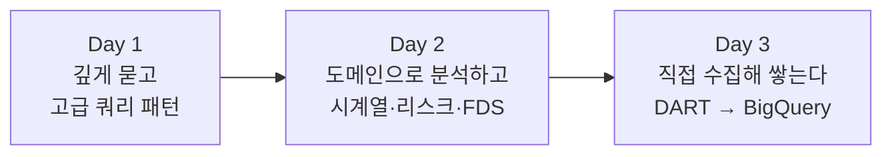

# FinDA 금융 데이터 분석 부트캠프 — 7·8주차

> 부트캠프 심화반 2기 FinDA의 7주차와 8주차 강의자료입니다.
> 수업 흐름 순서대로 왼쪽 목차를 따라가면 됩니다.

## 두 주 동안의 흐름

7주차에 BigQuery를 세팅해 실제 카드 거래 데이터(약 2,400만 건)를 올리고 분석의 기반이 되는 데이터 마트를 만듭니다. 8주차에는 그 기반 위에서 고급 SQL로 어려운 질문에 답하고, 금융 도메인 분석(시계열·리스크·사기탐지)을 거쳐, 마지막에는 필요한 데이터를 직접 수집해 쌓는 파이프라인까지 만듭니다.

## 7주차 — BigQuery와 데이터 마트

| 일차 | 주제 | 자료 |
|---|---|---|
| Day 1 (금) | BigQuery 소개, 데이터 적재 가이드, 데이터 확인과 기초 집계 쿼리 | [강의안](week7/day1-lecture.md) |
| Day 2 (토) | 금융 데이터 분석이 하는 일, 실습 데이터(IBM TabFormer) 자세히 알기, 집계 실습 | [강의안](week7/day2-lecture.md) |
| Day 3 (일) | 데이터 모델링과 데이터 마트 개념, BigQuery로 마트 구축, 실습 | [강의안](week7/day3-lecture.md) |

참고 자료: [쿼리 작성 순서와 실행 순서](week7/query-execution-order.md) · [BigQuery 주요 문법 정리](week7/bigquery-syntax.md) · [쿼리 가독성을 높이는 팁](week7/query-style-tips.md)

## 8주차 — 고급 SQL과 금융 데이터 분석

| 일차 | 주제 | 자료 |
|---|---|---|
| Day 1 (금) | 서브쿼리와 CTE, 윈도우 함수 심화, 재귀 CTE, RFM 고객 등급화 | [강의안](week8/day1-lecture.md) · [사전 워크시트](week8/day1-worksheet.md) |
| Day 2 (토) | 시계열 분석(볼린저 밴드), 리스크 분석(FICO·DTI·집중도), 사기 탐지(FDS) | [강의안](week8/day2-lecture.md) |
| Day 3 (일) | OpenDART 수집 → BigQuery 배치 적재 → SQL 재무분석 | [강의안](week8/day3-lecture.md) · [사전 준비 가이드](week8/day3-prep-guide.md) |

### 8주차 시작 전 준비물

- **Day 1 전까지**: [윈도우 프레임 손풀기 워크시트](week8/day1-worksheet.md)를 풀어 오세요 (30분, 과금 0원).
- **Day 3 전까지**: [OpenDART API 키 발급과 GCP 프로젝트 점검](week8/day3-prep-guide.md)을 마쳐 오세요 (10분). 이걸 안 하면 Day 3 실습을 구경만 하게 됩니다.

## 수업 진행 방식

- 금요일, 토요일, 일요일 각 3시간씩. 한 세션 50분 수업 + 10분 쉬는 시간으로 하루 세 세션을 진행합니다.
- 실습은 "이 SQL을 짜라"처럼 함수나 스킬을 묻지 않고 **비즈니스 질문에 답하라** 형태로 제시됩니다. 질문을 중심으로 쿼리를 설계하게 됩니다.
- 실습 환경은 Google BigQuery이며, 7주차 Day 1에서 계정 세팅부터 데이터 적재까지 함께 진행합니다.
- 학생 비용이 발생하지 않도록 설계되어 있습니다. 실행 전 "처리 바이트 미리보기"를 확인하는 습관을 두 주 내내 반복합니다.
