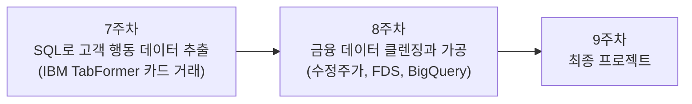

# FinDA 금융 데이터 분석 부트캠프 — 7주차와 8주차

> 부트캠프 심화반 2기 FinDA의 7주차와 8주차 강의자료 모음입니다.
> 수업 흐름 순서대로 왼쪽 목차를 따라가면 됩니다.

## 이 자료의 구성

두 주에 걸쳐 "정제된 데이터에서 인사이트 추출"에서 "원천 데이터를 직접 가공하는 파이프라인"으로 나아갑니다.

## 7주차. SQL을 활용한 고객 행동 데이터 추출

카드 거래 데이터(IBM TabFormer, 거래 약 2,400만 건)를 BigQuery에 적재하고, 고객 세그먼트별 소비 패턴을 SQL로 추출합니다.

| 일차 | 주제 | 자료 |
|---|---|---|
| 1일차 (금) | 데이터셋 이해, 스키마 분석, 데이터 프로파일링 | [강의안](week7/day1-lecture.md) 그리고 [적재 가이드](week7/day1-bigquery-load.md) |
| 2일차 (토) | 다중 테이블 JOIN, 월별 업종별 집계, 고객 그룹 분석 | [강의안](week7/day2-join-aggregation.md) 그리고 [사전 워크시트](week7/day2-join-worksheet.md) |
| 3일차 (일) | 윈도우 함수, 시계열 행동 패턴, 미니 프로젝트 | [강의안](week7/day3-window-functions.md) |

## 8주차. 금융 데이터 클렌징과 가공

주가 원천 데이터의 수정주가 계산, PaySim 기반 FDS 룰 구현, BigQuery 파티셔닝과 비용 최적화를 다룹니다.

| 일차 | 주제 | 자료 |
|---|---|---|
| 1일차 (금) | 주식 데이터 수집, 수정계수 SQL 계산 | [강의안](week8/day1-adjusted-price.md) 그리고 [사전 워크시트](week8/day1-worksheet.md) |
| 2일차 (토) | FDS 도메인, 의심 거래 탐지 룰 4종 | [강의안](week8/day2-fds-sql.md) |
| 3일차 (일) | BigQuery 파티셔닝, 클러스터링, 비용 관리 | [강의안](week8/day3-bigquery.md) |

## 수업 진행 방식

- 금요일, 토요일, 일요일 각 3시간씩 세션 단위로 진행합니다
- 모든 실습은 "이 SQL을 짜라"가 아니라 **비즈니스 질문에 답하라** 형태로 제시됩니다
- 실습 환경은 Google BigQuery로 통일되어 있으며, 사전 준비는 [BigQuery 데이터 적재 가이드](week7/day1-bigquery-load.md)를 따릅니다
