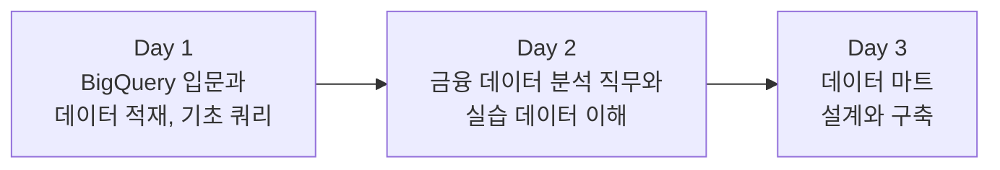

# FinDA 금융 데이터 분석 부트캠프 — 7주차

> 부트캠프 심화반 2기 FinDA의 7주차 강의자료입니다.
> 수업 흐름 순서대로 왼쪽 목차를 따라가면 됩니다.

## 이번 주에 배우는 것

BigQuery를 처음부터 세팅해서 실제 카드 거래 데이터(약 2,400만 건)를 올리고, 금융 데이터 분석 실무가 어떤 일인지 이해한 뒤, 분석의 기반이 되는 데이터 마트를 직접 설계하고 만들어 봅니다.

## 일정과 자료

| 일차 | 주제 | 자료 |
|---|---|---|
| Day 1 (금) | BigQuery 소개, 데이터 적재 가이드, 데이터 확인과 기초 집계 쿼리 | [강의안](week7/day1-lecture.md) |
| Day 2 (토) | 금융 데이터 분석이 하는 일, 실습 데이터(IBM TabFormer) 자세히 알기, 집계 실습 | [강의안](week7/day2-lecture.md) |
| Day 3 (일) | 데이터 모델링과 데이터 마트 개념, BigQuery로 마트 구축, 실습 | [강의안](week7/day3-lecture.md) |

## 수업 진행 방식

- 금요일, 토요일, 일요일 각 3시간씩 세션 단위로 진행합니다
- 모든 실습은 "이 SQL을 짜라"가 아니라 **비즈니스 질문에 답하라** 형태로 제시됩니다
- 실습 환경은 Google BigQuery이며, Day 1에서 계정 세팅부터 데이터 적재까지 함께 진행합니다
