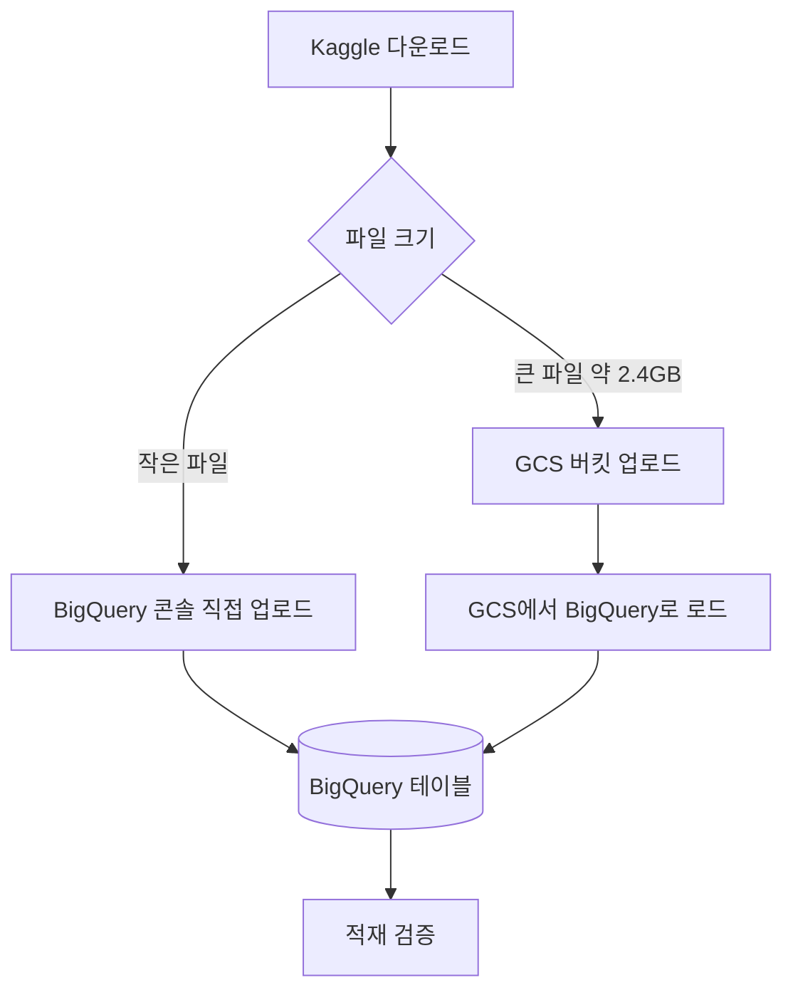

# 실습 가이드: 데이터를 BigQuery에 적재하기

> 7주차 사전 준비 또는 Day 1 실습용. 
> 수강생이 직접 따라 하며 데이터를 BigQuery에 올린다.

---

### 사전 준비물

- (1) Google 계정 (GCP 콘솔 로그인용)
- (2) Kaggle 계정 (구글 계정으로 가입)


## 0. 이 실습의 큰 그림





나누는 이유: 거래 파일(`card_transaction.v1.csv`)이 약 2.4GB인데, BigQuery 콘솔에서 로컬 파일을 직접 올리는 방식은 작은 파일용입니다 (직접 업로드 한도가 약 10MB 수준). 
그래서 거래 파일은 이 경로로는 불가능하고, Google Cloud Storage(GCS)라는 클라우드 저장소에 먼저 올린 뒤 거기서 BigQuery로 로드합니다.


---

## STEP 1. Kaggle에서 데이터 받기

데이터셋: [Credit Card Transactions (ealtman2019)](https://www.kaggle.com/datasets/ealtman2019/credit-card-transactions)

두 가지 방법 중 편한 쪽을 고르면 됩니다.

### 방법 1-A. 웹에서 직접 받기 (가장 간단)

- (1) 위 링크 접속 후 Kaggle 로그인
- (2) 페이지의 Download 버튼 클릭 → 전체 파일이 하나의 zip으로 다운로드
- (3) zip 압축 해제


### 방법 1-B. Kaggle API로 받기 (권장: 엔지니어링 연습과 재현성)

- (1) 터미널 또는 Cloud Shell에서 설치
  ```bash
  pip install kaggle
  ```
- (2) Kaggle API 토큰 발급: Kaggle 우측 상단 프로필 → Settings → API → "Create New Token" → `kaggle.json` 파일이 다운로드됨
- (3) 토큰 배치
  ```bash
  mkdir -p ~/.kaggle
  mv kaggle.json ~/.kaggle/
  chmod 600 ~/.kaggle/kaggle.json
  ```
- (4) 데이터 다운로드와 압축 해제
  ```bash
  kaggle datasets download -d ealtman2019/credit-card-transactions
  unzip credit-card-transactions.zip -d tabformer
  ```

### 받은 파일 확인

압축을 풀면 대략 다음 파일들이 보입니다.

| 파일 | 내용 | 대략 크기 |
| --- | --- | --- |
| `sd254_users.csv` | 사용자 약 2,000명 | 작음 (수백 KB) |
| `sd254_cards.csv` | 카드 정보 | 작음 (수백 KB) |
| `card_transaction.v1.csv` | 거래 약 2,400만 건 | 큼 (약 2.4GB) |
| `mcc_codes.json` | MCC 업종 코드 매핑 | 작음 |

> 파일 구성은 데이터셋 버전에 따라 다를 수 있으니, 압축 해제 후 실제 목록을 확인하세요. `mcc_codes.json`이 있으면 2-2 세션의 업종 매핑 룩업으로 활용합니다. 다만 이 파일은 일반 JSON 객체 형태라 BigQuery에 테이블로 바로 적재하기는 어렵습니다 (BigQuery는 줄 단위 JSON을 요구). 작은 매핑이라 2-2 세션에서 별도 룩업 테이블로 다루는 게 편합니다.

---

## STEP 2. GCP 프로젝트와 BigQuery 준비

### 2-1. 프로젝트 만들기

- (1) [console.cloud.google.com](https://console.cloud.google.com) 접속 (Google 계정 로그인)
- (2) 상단 프로젝트 선택 → "새 프로젝트" → 이름 입력 (예: `finda-week7`) → 만들기
- (3) 처음이라면 신규 사용자 대상 무료 크레딧($300) 안내가 뜹니다


### 2-2. BigQuery 들어가기

- (1) 콘솔 좌측 메뉴 또는 검색창에서 "BigQuery" 검색 → BigQuery Studio 진입
- (2) 좌측 Explorer 패널에 본인 프로젝트가 보이는지 확인

### 2-3. 비용 모델 이해 (중요) 

BigQuery는 "쿼리가 스캔한 데이터 양(처리 바이트)"으로 과금됩니다. 다만 학습용으로는 무료 한도가 넉넉합니다.

- 매월 쿼리 1TB 무료, 저장 10GB 무료 수준
- 우리 데이터(거래 약 2.4GB)는 무료 한도 안에 충분히 들어옵니다
- 그래도 습관을 들이려면, 8주차에서 배울 "쿼리 실행 전 처리 바이트 미리보기"를 늘 확인하세요

> 무료 한도와 요금 정책은 바뀔 수 있으니 [BigQuery 요금 문서](https://cloud.google.com/bigquery/pricing)에서 최신 내용을 확인하세요.

### 2-4. 데이터셋(dataset) 만들기

BigQuery에서 "데이터셋"은 테이블을 담는 폴더 같은 개념입니다.

- (1) Explorer에서 프로젝트 옆 점 세 개 → "데이터셋 만들기"
- (2) 데이터셋 ID: 예) `tabformer`
- (3) 위치(Location): 예) `US` 또는 `asia-northeast3`(서울)

> ⚠️ **위치 주의**: 데이터셋 위치와 STEP 4에서 만들 GCS 버킷 위치를 똑같이 맞추세요. 다르면 GCS에서 BigQuery로 로드가 안 됩니다.

---

## STEP 3. 작은 파일 적재 (users, cards) — 콘솔 직접 업로드

작은 파일은 GCS 없이 콘솔에서 바로 올립니다.

- (1) Explorer에서 `tabformer` 데이터셋 클릭 → "테이블 만들기"
- (2) "테이블을 만들 소스" → **업로드(Upload)** 선택
- (3) 파일 찾아보기 → `sd254_users.csv` 선택, 파일 형식 CSV
- (4) 대상 테이블 이름: `users`
- (5) 스키마: **자동 감지(auto-detect)** 체크
- (6) 테이블 만들기

`sd254_cards.csv`도 같은 방식으로 테이블 이름 `cards`로 반복합니다.

> **헤더 처리 규칙 (헷갈리기 쉬움)**
> 자동 감지를 쓰면 BigQuery가 헤더 행을 알아서 인식해 컬럼명을 만듭니다. 이때는 "헤더 건너뛰기"를 따로 설정하지 마세요 (헤더를 건너뛰면 컬럼명을 잃어버려 `string_field_0` 같은 이름이 됩니다). 반대로 STEP 4처럼 수동 스키마를 쓸 때는 헤더 1행을 건너뛰도록 지정해야 합니다.

> **자동 감지 컬럼명 주의**: 원본 헤더에 공백이나 특수문자(`?`)가 있으면 BigQuery가 자동으로 밑줄 등으로 바꿉니다 (예: `Yearly Income - Person`이 `Yearly_Income___Person`이 됨). 적재 후 Schema 탭에서 실제 컬럼명을 꼭 확인하세요. 마음에 들지 않으면 수동 스키마로 다시 받으면 됩니다.

---

## STEP 4. 큰 거래 파일 적재 — GCS 경유

오늘의 메인 이벤트입니다. 약 2.4GB 거래 파일을 GCS에 올린 뒤 BigQuery로 로드합니다.

### 4-1. GCS 버킷 만들기

- (1) 콘솔 검색창 → "Cloud Storage" → 버킷 → "만들기"
- (2) 버킷 이름: 전 세계에서 유일해야 함 (예: `finda-week7-본인이니셜-2026`)
- (3) 위치: STEP 2-4의 데이터셋 위치와 동일하게 (예: `US` 또는 `asia-northeast3`)
- (4) 나머지는 기본값으로 만들기

### 4-2. 거래 파일을 GCS에 올리기

브라우저로 2.4GB를 올리면 느리고 끊기기 쉬워서, **Cloud Shell**에서 명령으로 올리는 걸 권장합니다.

- (1) 콘솔 우측 상단 터미널 아이콘 클릭 → Cloud Shell 열기 (`gcloud`, `bq`가 이미 설치되어 있음)
- (2) 거래 파일이 로컬에 있다면 Cloud Shell 상단 점 세 개 → "업로드"로 `card_transaction.v1.csv`를 올린 뒤 실행
  ```bash
  gcloud storage cp card_transaction.v1.csv gs://YOUR_BUCKET/tabformer/
  ```

> 더 매끄러운 방법: STEP 1-B의 Kaggle API를 Cloud Shell 안에서 바로 실행하면, 로컬을 거치지 않고 Cloud Shell에서 GCS로 바로 올릴 수 있습니다 (부록 참고).

### 4-3. GCS에서 BigQuery로 로드

거래 파일은 컬럼명을 깔끔하게 고정하기 위해 **수동 스키마**로 로드하길 권장합니다. Cloud Shell에서 실행합니다.

```bash
bq load \
  --source_format=CSV \
  --skip_leading_rows=1 \
  tabformer.transactions \
  gs://YOUR_BUCKET/tabformer/card_transaction.v1.csv \
  user_id:INTEGER,card_id:INTEGER,year:INTEGER,month:INTEGER,day:INTEGER,time:STRING,amount:STRING,use_chip:STRING,merchant_name:STRING,merchant_city:STRING,merchant_state:STRING,zip:STRING,mcc:INTEGER,errors:STRING,is_fraud:STRING
```

스키마 선택 이유 (수업에서 강조할 포인트):

- `amount`를 STRING으로 받습니다. 원본이 `$54.30`처럼 `$`가 붙은 문자열이라 숫자로 바로 못 받습니다. 정제는 쿼리에서 합니다 (7주차 핵심 실습).
- `time`도 STRING(`HH:MM` 형태)이고, 날짜는 year, month, day로 쪼개져 있어 정수로 받습니다. **DATE 합성은 쿼리에서** 합니다.
- `zip`은 빈 값과 소수점 표기가 섞여 있어 STRING이 안전합니다.

콘솔 UI로 하고 싶다면: 테이블 만들기 → 소스 "Google Cloud Storage" → GCS URI 입력 → 형식 CSV → 위 스키마를 직접 입력 → 헤더 1행 건너뛰기.

---

## STEP 5. 적재 검증

BigQuery 콘솔의 쿼리 편집기에서 실행합니다. (`YOUR_PROJECT`는 본인 프로젝트 ID로 교체)

```sql
-- 행 수 확인
SELECT COUNT(*) AS n_tx    FROM `YOUR_PROJECT.tabformer.transactions`;  -- 약 2,400만
SELECT COUNT(*) AS n_users FROM `YOUR_PROJECT.tabformer.users`;         -- 약 2,000
SELECT COUNT(*) AS n_cards FROM `YOUR_PROJECT.tabformer.cards`;

-- 미리보기
SELECT * FROM `YOUR_PROJECT.tabformer.transactions` LIMIT 10;
```

체크포인트:

- (1) 거래 행 수가 약 2,400만이면 정상
- (2) `amount` 값에 `$`가 그대로 보이면 정상 (의도된 것, 쿼리에서 정제 예정)
- (3) 쿼리 실행 시 화면에 뜨는 "이 쿼리를 실행하면 N 처리됨" 표시를 확인 → 8주차 비용 학습의 출발점

---

## STEP 6. 비용과 정리 메모

- 무료 한도 안이지만 `SELECT *` 남발은 처리 바이트를 키웁니다. 필요한 컬럼만 SELECT하는 습관을 들이세요.
- 실습이 끝나고 한동안 안 쓸 거면, GCS에 올린 거래 파일은 지워도 됩니다 (BigQuery 테이블만 남기면 됨). 저장 비용 절약.

---

## 부록. Cloud Shell에서 한 번에 (로컬 다운로드 없이)

로컬에 2.4GB를 받기 부담되면, Cloud Shell 안에서 전 과정을 끝낼 수 있습니다.

```bash
# 1) Kaggle 설치와 토큰 (kaggle.json을 Cloud Shell에 업로드해 둔 상태)
pip install kaggle
mkdir -p ~/.kaggle && mv kaggle.json ~/.kaggle/ && chmod 600 ~/.kaggle/kaggle.json

# 2) 데이터 다운로드와 압축 해제
kaggle datasets download -d ealtman2019/credit-card-transactions
unzip credit-card-transactions.zip -d tabformer
cd tabformer

# 3) 큰 파일을 GCS로
gcloud storage cp card_transaction.v1.csv gs://YOUR_BUCKET/tabformer/

# 4) 큰 파일을 BigQuery로 로드 (STEP 4-3 스키마 그대로 사용)
bq load --source_format=CSV --skip_leading_rows=1 \
  tabformer.transactions \
  gs://YOUR_BUCKET/tabformer/card_transaction.v1.csv \
  user_id:INTEGER,card_id:INTEGER,year:INTEGER,month:INTEGER,day:INTEGER,time:STRING,amount:STRING,use_chip:STRING,merchant_name:STRING,merchant_city:STRING,merchant_state:STRING,zip:STRING,mcc:INTEGER,errors:STRING,is_fraud:STRING

# 5) 작은 파일은 GCS 없이 자동 감지로 바로 로드 (헤더 건너뛰기 없이)
bq load --autodetect --source_format=CSV tabformer.users sd254_users.csv
bq load --autodetect --source_format=CSV tabformer.cards sd254_cards.csv
```

> Cloud Shell 홈 디렉터리는 약 5GB라, 압축본(zip)과 압축 해제본이 동시에 있으면 빠듯할 수 있습니다. GCS 업로드 후 로컬 파일을 지우면서 진행하세요.

---

오늘의 핵심 교훈 한 줄: **"작은 파일은 그냥 올리면 되지만, 큰 파일은 창고(GCS)를 거쳐야 한다."**
