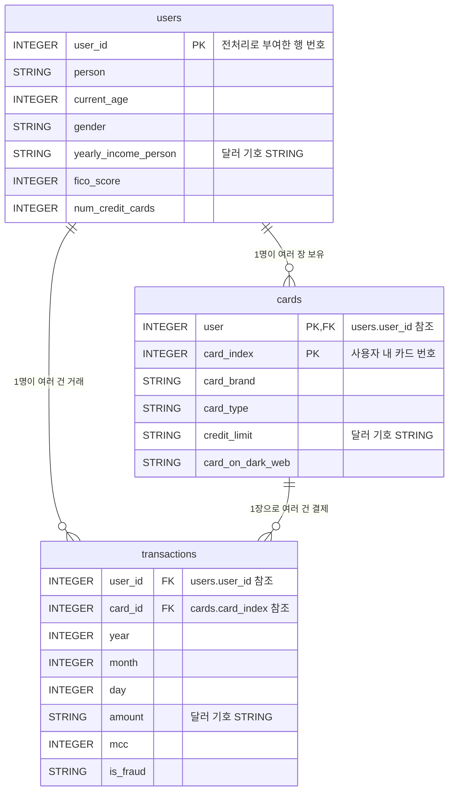

# 7주차 Day 1 강의안: 데이터셋 이해와 스키마 분석

> 7주차 Day 1 (금 3시간) 수업용 강의안. 세션 1-1부터 1-3까지 총 170분 + 쉬는 시간 10분. 환경 세팅과 데이터 적재 절차는 별도 문서 [BigQuery 데이터 적재 가이드](day1-bigquery-load.md)을 따릅니다.

---

## Day 1 전체 구성

| 세션 | 시간 | 주제 | 핵심 산출물 |
| --- | --- | --- | --- |
| 1-1 | 50분 | 도입: 왜 고객 행동 데이터를 보는가 | 7주차 결과물의 그림이 머리에 잡힘 |
| 1-2 | 60분 | 스키마 분석과 환경 세팅 | 세 테이블 ERD + user_id 전처리 완료 |
| 1-3 | 60분 | 데이터 프로파일링 | EDA 쿼리 세트 실행 + 품질 이슈 목록 |

오늘은 일부러 느리게 갑니다. 쿼리를 한 줄이라도 빨리 짜고 싶은 마음은 알지만, 데이터가 무엇을 의미하는지 모른 채 짠 쿼리는 "정확하게 틀린 답"을 뽑아냅니다. Day 1의 목표는 속도가 아니라, 이번 주 내내 다룰 데이터를 손바닥 보듯 아는 상태를 만드는 것입니다.


---

## Session 1-1. 도입: 왜 고객 행동 데이터를 보는가 (50분)

### 학습 목표

- (1) 카드사와 금융권 BI 조직이 거래 데이터로 어떤 의사결정을 하는지 4가지 사례(CLV, 이탈 예측, 마케팅 타겟팅, FDS)로 설명할 수 있다
- (2) 7주차 최종 결과물인 "고객 세그먼트별 소비 리포트"가 어떤 모습인지 안다
- (3) IBM TabFormer 데이터셋의 출처와 시뮬레이션 데이터로서의 한계를 안다

### 강의 흐름 (1) 카드 거래 데이터는 행동 로그다 — 15분

카드사가 가진 데이터부터 생각해 봅시다. 여러분이 카드를 한 번 긁을 때마다 카드사에는 한 줄의 기록이 남습니다. 누가(사용자), 무엇으로(카드), 언제(일시), 어디서(가맹점, 지역), 얼마를(금액), 어떤 업종에서(MCC 코드) 썼는지가 전부 담깁니다. 하루에도 수백만 건씩 쌓이는 이 기록은 사실상 고객의 생활 패턴이 찍힌 행동 로그입니다.

웹 서비스 회사가 클릭 로그로 사용자를 이해하듯, 카드사는 거래 로그로 고객을 이해합니다. 차이가 있다면 카드 거래는 실제 돈이 움직인 기록이라는 점입니다. "장바구니에 담았다"가 아니라 "실제로 샀다"이기 때문에, 행동 데이터 중에서도 신뢰도가 가장 높은 축에 속합니다.

금융권 BI(Business Intelligence) 조직이 이 로그로 하는 대표적인 일 4가지를 봅니다.

**첫째, CLV(Customer Lifetime Value, 고객 생애 가치) 추정입니다.** 카드사의 수익원은 크게 가맹점 수수료, 할부와 리볼빙 이자, 연회비입니다. 셋 다 "고객이 카드를 얼마나 자주, 얼마나 크게, 얼마나 오래 쓰는가"에 비례합니다. 그래서 거래 데이터로 고객별 사용 강도(월 거래 건수와 금액)와 지속성(거래가 끊기지 않고 이어지는가)을 계산하면, 이 고객이 앞으로 가져다줄 수익의 크기를 추정할 수 있습니다. CLV가 높은 고객에게는 리텐션 비용(연회비 면제, 프리미엄 혜택)을 더 써도 남는 장사가 됩니다.

**둘째, 이탈 예측입니다.** 카드에는 "회원 탈퇴" 버튼이 없다는 점이 재미있습니다. 고객은 해지하지 않은 채 조용히 떠납니다. 지갑 속 첫 번째 카드였다가 두 번째, 세 번째 카드로 밀려나는 것이 카드사의 이탈입니다. 그래서 이탈의 신호는 해지 신청이 아니라 거래 데이터 안에 있습니다. 거래 간격이 점점 벌어진다, 쓰던 업종의 가짓수가 줄어든다, 정기 결제만 남고 일상 소비가 사라진다 — 전부 SQL로 추출할 수 있는 패턴이고, 실제로 Day 3에서 "휴면 위험 사용자 추출"을 실습합니다.

**셋째, 마케팅 타겟팅입니다.** "전 고객에게 주유 할인 쿠폰"은 돈 낭비입니다. 차가 없는 고객에게 주유 할인은 의미가 없기 때문입니다. 거래 데이터에서 주유 업종(MCC) 결제가 잦은 고객만 골라내면 같은 예산으로 몇 배의 반응률을 얻습니다. 연령, 성별, 소득 같은 인구통계 정보와 소비 카테고리를 교차하면 "30대, 자녀 있음 추정(유아용품 결제), 주말 대형마트 집중형" 같은 세그먼트가 나오고, 이것이 카드 상품 설계와 제휴 마케팅의 출발점이 됩니다.

**넷째, FDS(Fraud Detection System, 이상거래 탐지)의 전 단계입니다.** 이상(abnormal)을 정의하려면 먼저 정상(normal)을 알아야 합니다. "이 고객은 평소 서울에서 한 달에 40건, 건당 평균 $50을 쓴다"는 프로파일이 있어야 "방금 새벽 3시에 해외에서 $3,000 결제"가 이상하다는 판단이 가능합니다. 이번 주에 배우는 프로파일링과 세그먼트 분석이 바로 그 "정상 프로파일"을 만드는 작업이고, 8주차 FDS 실습이 그 위에 올라갑니다.

### 강의 흐름 (2) 7주차 결과물 미리보기 — 15분

이번 주 일요일(Day 3)에 여러분이 만들 최종 산출물은 "고객 세그먼트별 소비 리포트"입니다. 완성본이 어떤 모습인지 먼저 보고 시작합니다. 아래는 형태 이해를 위한 가상 수치 예시입니다 (실제 값은 여러분이 직접 뽑습니다).

| 세그먼트 | 사용자 수 | 월평균 거래 건수 | 월평균 거래액 | Top 업종 1 | Top 업종 2 | 한 줄 해석 |
| --- | --- | --- | --- | --- | --- | --- |
| 20대 여성 | 141 | 36건 | $1,820 | 외식 | 온라인 쇼핑 | 소액 고빈도, 외식 집중 |
| 30대 남성 | 158 | 42건 | $2,650 | 주유 | 식료품 | 출퇴근형 소비 패턴 |
| 40대 여성 | 176 | 45건 | $3,100 | 식료품 | 의료 | 가계 지출 관리형 |
| 60대 이상 남성 | 120 | 21건 | $1,430 | 의료 | 식료품 | 저빈도, 필수 소비 위주 |

이 표 한 장을 만들기 위해 필요한 재료를 역산해 보면 이번 주 커리큘럼이 그대로 나옵니다.

- (1) 세그먼트(연령대, 성별)는 users 테이블에 있고, 소비(금액, 업종)는 transactions 테이블에 있다 → 테이블을 합쳐야 한다 → **Day 2의 JOIN**
- (2) "월평균", "Top 업종" → 그룹별 집계와 그룹 내 순위 → **Day 2의 GROUP BY, Day 3의 윈도우 함수**
- (3) 그 전에, 각 컬럼이 무슨 의미이고 값이 믿을 만한지 알아야 한다 → **오늘 Day 1**

### 강의 흐름 (3) IBM TabFormer 데이터셋 소개 — 15분

이번 주 데이터셋은 IBM TabFormer Credit Card Transactions입니다.

**출처**: IBM 연구팀이 표 형태 데이터용 트랜스포머 모델("Tabular Transformers", 줄여서 TabFormer) 연구를 위해 만들어 공개한 합성(synthetic) 신용카드 거래 데이터입니다. Kaggle에서 [Credit Card Transactions (ealtman2019)](https://www.kaggle.com/datasets/ealtman2019/credit-card-transactions)로 배포됩니다. 사용자 약 2,000명이 수십 년에 걸쳐 만든 약 2,400만 건의 거래가 담겨 있습니다. 정확한 기간은 오늘 3교시에 여러분이 직접 쿼리로 확인합니다.

**왜 이 데이터셋인가**: 사용자(users), 카드(cards), 거래(transactions)의 정규화된 3-테이블 구조라 JOIN 실습이 자연스럽고, 인구통계 + 카드 정보 + 거래 정보가 모두 있어 세그먼트 분석 시나리오를 풍부하게 짤 수 있습니다. 그리고 2,400만 행이라는 규모는 노트북 엑셀로는 못 여는 크기입니다. SQL과 BigQuery가 왜 필요한지 몸으로 느끼기에 적당합니다.

**시뮬레이션 데이터의 한계 (반드시 알고 시작할 것)**:

- (1) 이 데이터는 실제 거래가 아니라 시뮬레이터가 생성한 가상 거래입니다. 개인정보 이슈가 없어 마음껏 실습할 수 있다는 것이 장점이지만, 분포가 실제보다 매끈하고 규칙적입니다.
- (2) 사기(is_fraud) 레이블도 시뮬레이션 규칙으로 생성된 것이라, 실제 사기범의 창의적인 수법과는 거리가 있습니다.
- (3) 실제 카드사 데이터에 있는 많은 것이 없습니다. 승인/취소/정정 같은 거래 상태 코드, 가맹점 사업자 ID 체계, 고객 등급, 결제 채널 상세, 한도와 연체 이력 등입니다. 실무 데이터는 이보다 훨씬 지저분하고 컬럼도 수백 개입니다.
- (4) 따라서 이번 주에 배울 것은 "이 데이터셋의 정답"이 아니라, 어떤 카드 거래 데이터를 만나도 통하는 접근법(스키마 파악 → 프로파일링 → 질문 정의 → 추출)입니다.

### 토론 포인트 (5분)

- (1) 여러분이 카드사 BI 분석가라면, 위 4가지 사례(CLV, 이탈, 타겟팅, FDS) 중 무엇부터 하겠습니까? 그 이유는 무엇입니까?
- (2) 카드 거래 데이터만으로는 알 수 없는 고객 정보에는 무엇이 있을까요? (힌트: 현금 결제, 타사 카드 사용분, 결제의 "이유")

---

## Session 1-2. 스키마 분석과 환경 세팅 (60분)

### 학습 목표

- (1) 세 테이블의 컬럼별 의미를 설명할 수 있다
- (2) PK/FK 관계를 식별하고 ERD로 그릴 수 있다
- (3) users 테이블의 "행 순서가 곧 user_id" 함정을 이해하고 pandas 전처리로 해결할 수 있다

### 환경 세팅 안내 (5분)

데이터 적재 절차(Kaggle 다운로드, GCP 프로젝트 생성, GCS 경유 적재)는 별도 배포한 [BigQuery 데이터 적재 가이드](day1-bigquery-load.md)을 따릅니다. 사전 준비로 이미 마친 수강생은 바로 스키마 분석으로 들어가면 되고, 아직인 수강생은 오늘 세션 중 강사 화면을 따라가되 적재가 오래 걸리는 거래 테이블은 쉬는 시간과 3교시 중에 백그라운드로 돌려 두세요.

이 세션에서 새로 다루는 환경 작업은 딱 하나, 아래 "함정" 파트의 **users 테이블 재적재**입니다.

### 강의 흐름 (1) 세 테이블 톺아보기 — 20분

**transactions 테이블 (약 2,400만 행)** — 적재 가이드의 수동 스키마 기준입니다.

| 컬럼 | 타입 | 의미 | 주의점 |
| --- | --- | --- | --- |
| user_id | INTEGER | 거래한 사용자 번호 | users 테이블과의 연결 고리 |
| card_id | INTEGER | 그 사용자의 몇 번째 카드인지 | 전체에서 유일하지 않음. user_id와 함께 봐야 함 |
| year, month, day | INTEGER | 거래 날짜가 세 컬럼으로 분리 | DATE 합성 필요: `DATE(year, month, day)` |
| time | STRING | 거래 시각 `HH:MM` | `PARSE_TIME("%H:%M", time)`으로 변환 |
| amount | STRING | 거래 금액. `$54.30`처럼 달러 기호 포함 | **문자열이라 그대로는 계산 불가** (3교시 실습) |
| use_chip | STRING | 결제 방식 (칩, 스와이프, 온라인 등) | 3교시에서 실제 값 분포 확인 |
| merchant_name | STRING | 가맹점 이름 (숫자 해시 형태) | 실명이 아니라 익명화된 코드 |
| merchant_city | STRING | 가맹점 도시 | 온라인 거래는 별도 표기 |
| merchant_state | STRING | 가맹점 주(state) | 온라인 거래에서 비어 있음 |
| zip | STRING | 가맹점 우편번호 | 결측 많음. STRING인 이유는 적재 가이드 참고 |
| mcc | INTEGER | 업종 코드 (Merchant Category Code) | 숫자만으론 의미 불명 → Day 2에서 매핑 테이블 제작 |
| errors | STRING | 거래 오류 내역 | 대부분 NULL. 값이 있으면 실패성 거래 (3교시) |
| is_fraud | STRING | 사기 여부 `Yes`/`No` | 문자열임에 주의. 8주차 FDS 복선 |

MCC를 잠깐 짚고 갑니다. MCC(Merchant Category Code)는 카드 업계가 가맹점 업종을 분류하는 4자리 국제 표준 코드입니다. 예를 들어 5411은 식료품점, 5812는 레스토랑 계열입니다. 숫자 코드만으로는 리포트를 읽을 수 없으므로, Day 2에서 주요 코드 20-30개를 담은 `mcc_map` 룩업 테이블을 직접 만들어 조인합니다. 오늘은 "업종을 알려주는 숫자 코드"라는 것만 기억하면 됩니다.

**users 테이블 (약 2,000명)** — 아래는 전처리 후 권장 컬럼 기준입니다 (전처리는 잠시 뒤에).

| 컬럼 | 의미 | 주의점 |
| --- | --- | --- |
| user_id | 사용자 번호 (우리가 부여) | **원본 CSV에는 없는 컬럼** (아래 함정 참고) |
| person | 이름 (가상 인물) | |
| current_age | 현재 나이 | 세그먼트 분석의 핵심 축 |
| retirement_age | 은퇴 (예정) 나이 | |
| birth_year, birth_month | 출생 연도와 월 | |
| gender | 성별 | 세그먼트 분석의 핵심 축 |
| address, city, state, zipcode | 주소 정보 | |
| latitude, longitude | 위도와 경도 | |
| per_capita_income_zipcode | 거주 지역 1인당 소득 | **달러 기호 포함 STRING** → 정제 대상 |
| yearly_income_person | 개인 연 소득 | **달러 기호 포함 STRING** → 정제 대상 |
| total_debt | 총 부채 | **달러 기호 포함 STRING** → 정제 대상 |
| fico_score | 신용점수 (FICO) | 미국 신용점수 체계, 대략 300-850 |
| num_credit_cards | 보유 카드 수 | 과제 질문 1번과 연결 |

**cards 테이블** — 카드 한 장이 한 행입니다.

| 컬럼 | 의미 | 주의점 |
| --- | --- | --- |
| user | 카드 소유자 (users.user_id에 대응) | 컬럼명이 user_id가 아니라 `user` |
| card_index | 그 사용자의 몇 번째 카드인지 | transactions.card_id에 대응 |
| card_brand | 브랜드 (Visa, Mastercard 등) | |
| card_type | 종류 (Credit, Debit 등) | |
| card_number, expires, cvv | 카드번호, 유효기간, CVV | 가상 데이터니까 존재. 실무라면 절대 평문 보관 금지 |
| has_chip | IC칩 탑재 여부 | |
| cards_issued | 발급 매수 | |
| credit_limit | 신용 한도 | **달러 기호 포함 STRING** → 정제 대상 |
| acct_open_date | 계좌 개설일 | |
| year_pin_last_changed | PIN 마지막 변경 연도 | |
| card_on_dark_web | 다크웹 유출 여부 | 8주차 FDS에서 재미있는 재료 |

> ⚠️ **스키마 캐비앗**: 위 컬럼 구성은 데이터셋 버전에 따라 다를 수 있습니다. 자동 감지로 적재한 테이블은 컬럼명이 원본 헤더에 따라 달라지므로, 반드시 BigQuery 콘솔에서 각 테이블의 **Schema 탭을 열어 실제 컬럼명을 확인**하고, 이 문서의 쿼리 속 컬럼명을 본인 테이블에 맞게 조정하세요.

> 📷 스크린샷 추가 예정: BigQuery 콘솔에서 users 테이블의 Schema 탭을 연 화면 (실제 컬럼명 확인 방법 안내용)

### 강의 흐름 (2) 이 데이터셋의 유명한 함정: users에는 조인 키가 없다 — 15분

여기서 이 데이터셋의 가장 유명한 함정을 만납니다. transactions에는 user_id가 있는데, **원본 `sd254_users.csv`에는 user_id 컬럼이 없습니다.** 그럼 거래의 user_id = 7이 users의 누구인지 어떻게 알까요?

답은 "행 순서"입니다. users CSV의 **0부터 시작하는 행 번호가 곧 user_id**입니다. 첫 번째 행이 user_id = 0인 사용자, 두 번째 행이 user_id = 1인 사용자입니다. 조인 키가 데이터 값이 아니라 파일의 물리적 순서에 숨어 있는 것입니다.

문제는 BigQuery가 **적재 후 행 순서를 보장하지 않는다**는 점입니다. 적재된 테이블에 `ROW_NUMBER()`를 붙여서 해결하려는 시도는 틀린 답입니다 — 그 순서가 원본 CSV의 순서라는 보장이 없기 때문입니다. 따라서 **적재 전에, 파일 단계에서** user_id를 부여해야 합니다. pandas로 합니다.

로컬 파이썬 또는 Google Colab에서 실행합니다 (`sd254_users.csv`가 있는 위치 기준).

```python
import pandas as pd

# (1) 원본 CSV 읽기 -- 행 순서가 곧 user_id이므로 절대 정렬(sort)하지 않습니다
users = pd.read_csv("sd254_users.csv")

# (2) 0부터 시작하는 행 번호를 user_id 컬럼으로 맨 앞에 부여
users.insert(0, "user_id", range(len(users)))

# (3) 컬럼명을 SQL 친화적으로 정리 (소문자, 공백과 특수문자는 밑줄로)
#     예: "Per Capita Income - Zipcode" -> "per_capita_income_zipcode"
users.columns = (
    users.columns.str.strip()
    .str.lower()
    .str.replace(r"[^0-9a-z]+", "_", regex=True)
    .str.strip("_")
)

# (4) 결과 확인 -- user_id가 0, 1, 2, ...로 붙었는지, 컬럼명이 깔끔한지
print(users.shape)
print(users.columns.tolist())
print(users.head(3))

# (5) 전처리본 저장 (인덱스 컬럼이 중복 저장되지 않게 index=False)
users.to_csv("sd254_users_clean.csv", index=False)
```

소득과 부채 컬럼(yearly_income_person 등)도 `$` 붙은 문자열이지만, 여기서는 일부러 그대로 둡니다. transactions.amount와 똑같은 방식으로 SQL에서 정제하는 연습을 하기 위해서입니다 (3교시와 Day 2에서 사용).

이제 `sd254_users_clean.csv`로 users 테이블을 **교체 적재**합니다. 적재 가이드 STEP 3대로 이미 users를 올렸다면 덮어씁니다.

- (1) 콘솔 방법: 테이블 만들기 → 업로드로 `sd254_users_clean.csv` 선택 → 테이블 이름 `users` → 스키마 자동 감지 → "쓰기 환경설정(Write preference)"을 **테이블 덮어쓰기(Overwrite)**로 → 만들기
- (2) 명령어 방법 (Cloud Shell):

```bash
bq load --replace --autodetect --source_format=CSV \
    tabformer.users sd254_users_clean.csv
```

적재 후 검증 쿼리입니다. (`YOUR_PROJECT`는 본인 프로젝트 ID로 교체하세요. 이하 모든 쿼리 동일)

```sql
-- user_id가 0부터 순서대로 부여되었는지 확인
SELECT
    u.user_id,
    u.person,
    u.current_age,
    u.gender
FROM `YOUR_PROJECT.tabformer.users` AS u
ORDER BY u.user_id
LIMIT 5;

-- 교차 검증: 모든 거래의 user_id가 users에 실제로 존재하는가
-- (n_orphan_tx가 0이면 정상. LEFT JOIN은 Day 2에 정식으로 배우니 오늘은 결과만 확인)
SELECT
    COUNT(*) AS n_tx,
    COUNTIF(u.user_id IS NULL) AS n_orphan_tx
FROM `YOUR_PROJECT.tabformer.transactions` AS t
LEFT JOIN `YOUR_PROJECT.tabformer.users` AS u
    ON t.user_id = u.user_id;
```

cards 테이블은 이런 함정이 없습니다. `user`와 `card_index` 컬럼이 값으로 존재하기 때문에 그대로 조인할 수 있습니다. 다만 Schema 탭에서 두 컬럼이 실제로 있는지 확인하고 넘어가세요.

### 강의 흐름 (3) PK/FK 식별과 ERD 미니 실습 — 20분

이제 세 테이블이 서로 어떻게 연결되는지 정리합니다. 먼저 개념을 짧게 복습합니다.

- (1) **PK(Primary Key, 기본 키)**: 테이블에서 한 행을 유일하게 식별하는 컬럼 (또는 컬럼 조합)
- (2) **FK(Foreign Key, 외래 키)**: 다른 테이블의 PK를 가리키는 컬럼. 두 테이블을 잇는 다리

**미니 실습 (10분)**: 지금까지 본 컬럼 표를 근거로, 각자 종이 또는 화이트보드 툴에 세 테이블의 ERD를 그려 보세요. 다음 세 질문에 답이 담겨야 합니다.

- (1) 각 테이블의 PK는 무엇인가? 특히 cards는 컬럼 하나로 부족하지 않은가?
- (2) transactions에서 cards로 가는 다리는 컬럼 몇 개가 필요한가?
- (3) 관계의 방향은? (한 명의 사용자는 여러 장의 카드를 가질 수 있는가? 그 반대는?)

5분 그리기, 3분 옆 사람과 비교, 2분 정답 공개 순서로 진행합니다.

**정답 ERD**:



핵심 포인트를 짚습니다.

- (1) **cards의 PK는 (user, card_index) 복합 키**입니다. card_index는 "그 사용자의 몇 번째 카드"라서 0, 1, 2가 사용자마다 반복됩니다. card_index 단독으로는 카드 한 장을 특정할 수 없습니다.
- (2) 따라서 **transactions와 cards의 조인도 두 컬럼**이 필요합니다: `t.user_id = c.user AND t.card_id = c.card_index`. 조인 키를 하나만 걸면 남의 카드와 잘못 붙습니다. Day 2에서 이 실수를 직접 재현해 보고 결과가 어떻게 부풀어 오르는지 확인할 예정입니다.
- (3) transactions에는 PK가 마땅히 없습니다. 거래 고유 ID 컬럼이 없기 때문입니다. 로그성 테이블에서는 드물지 않은 일이며, 필요하면 나중에 대리 키를 만들 수 있습니다.

### 체크포인트

- (1) users 테이블에 user_id 0-1,999 (약 2,000명)가 부여되어 있다
- (2) 교차 검증 쿼리에서 n_orphan_tx = 0이 나왔다
- (3) "transactions ↔ cards 조인에는 왜 컬럼이 두 개 필요한가?"에 한 문장으로 답할 수 있다

---

## Session 1-3. 데이터 프로파일링 (60분)

### 학습 목표

- (1) 새 데이터를 만났을 때 던지는 기본 프로파일링 질문(규모, 범위, 결측, 분포)을 SQL로 답할 수 있다
- (2) 이 데이터의 품질 이슈 4가지(달러 기호, 음수, 0값, errors)를 스스로 발견하고 처리 방향을 정할 수 있다
- (3) 대용량 테이블에서 파티셔닝이 왜 필요한지 감을 잡는다 (8주차 복선)

### 강의 흐름 (1) 기본 EDA 쿼리 세트 — 20분

프로파일링은 "데이터에게 신상 조사를 하는 것"입니다. 규모는 얼마나 되는지, 기간은 언제부터 언제까지인지, 빠진 값은 없는지. 어떤 데이터를 만나도 이 순서로 시작하면 됩니다. 쿼리를 하나씩 실행하면서 결과를 노트에 기록하세요. 이 기록이 Day 2와 Day 3의 분석 설계 근거가 됩니다.

```sql
-- (1) 규모: 행 수, 고유 사용자 수, 고유 (사용자, 카드) 조합 수
SELECT
    COUNT(*) AS n_rows,
    COUNT(DISTINCT t.user_id) AS n_users,
    COUNT(DISTINCT CONCAT(CAST(t.user_id AS STRING), "-", CAST(t.card_id AS STRING))) AS n_user_cards
FROM `YOUR_PROJECT.tabformer.transactions` AS t;
```

n_users가 users 테이블 행 수(약 2,000)와 비슷한지 비교해 보세요. 훨씬 적다면 "거래가 한 건도 없는 사용자"가 존재한다는 뜻이고, 이는 Day 2의 LEFT JOIN 실습 주제가 됩니다.

```sql
-- (2) 기간: 이 데이터는 언제부터 언제까지의 기록인가
--     year, month, day 세 정수 컬럼을 DATE로 합성해서 확인
SELECT
    MIN(DATE(t.year, t.month, t.day)) AS first_date,
    MAX(DATE(t.year, t.month, t.day)) AS last_date,
    DATE_DIFF(
        MAX(DATE(t.year, t.month, t.day)),
        MIN(DATE(t.year, t.month, t.day)),
        YEAR
    ) AS n_years
FROM `YOUR_PROJECT.tabformer.transactions` AS t;
```

1교시에 예고한 "정확한 기간 확인"이 이 쿼리입니다. 결과를 보면 생각보다 긴 기간이 나올 것입니다. 시뮬레이션 데이터라 가능한 길이입니다. "월별 추이" 같은 분석을 할 때 전체 기간을 다 쓸지, 최근 몇 년만 쓸지는 이 결과를 보고 정하게 됩니다.

```sql
-- (3) 결측: 주요 컬럼의 NULL 비율(%)
SELECT
    COUNT(*) AS n_rows,
    ROUND(COUNTIF(t.merchant_state IS NULL) / COUNT(*) * 100, 2) AS pct_null_state,
    ROUND(COUNTIF(t.zip IS NULL) / COUNT(*) * 100, 2) AS pct_null_zip,
    ROUND(COUNTIF(t.errors IS NULL) / COUNT(*) * 100, 2) AS pct_null_errors
FROM `YOUR_PROJECT.tabformer.transactions` AS t;
```

여기서 중요한 해석 습관 하나. **NULL이 많다고 전부 불량 데이터가 아닙니다.** merchant_state와 zip의 NULL은 상당수가 온라인 거래일 가능성이 높습니다 (온라인 가맹점에는 주와 우편번호가 없으니까요). 반대로 errors는 NULL이 정상이고 값이 있는 쪽이 특이 케이스입니다. NULL의 의미는 컬럼마다 다르며, "왜 비어 있는가"를 물어야 합니다. 아래 쿼리로 가설을 확인해 보세요.

```sql
-- (3-1) 가설 확인: merchant_state가 NULL인 거래는 어떤 거래인가
SELECT
    t.use_chip,
    t.merchant_city,
    COUNT(*) AS n_tx
FROM `YOUR_PROJECT.tabformer.transactions` AS t
WHERE t.merchant_state IS NULL
GROUP BY t.use_chip, t.merchant_city
ORDER BY n_tx DESC
LIMIT 10;
```

```sql
-- (4) 범주 분포: use_chip과 is_fraud의 값 종류와 비중
SELECT
    t.use_chip,
    COUNT(*) AS n_tx,
    ROUND(COUNT(*) / SUM(COUNT(*)) OVER () * 100, 2) AS pct
FROM `YOUR_PROJECT.tabformer.transactions` AS t
GROUP BY t.use_chip
ORDER BY n_tx DESC;

SELECT
    t.is_fraud,
    COUNT(*) AS n_tx,
    ROUND(COUNT(*) / SUM(COUNT(*)) OVER () * 100, 2) AS pct
FROM `YOUR_PROJECT.tabformer.transactions` AS t
GROUP BY t.is_fraud
ORDER BY n_tx DESC;
```

is_fraud 분포에서 사기 거래 비중이 얼마나 작은지 눈에 담아 두세요. 이 극단적인 불균형이 8주차 FDS에서 "룰이 잡은 100건 중 진짜 사기는 몇 건 안 되는" 현상의 원인이 됩니다.

> 📷 스크린샷 추가 예정: 쿼리 (2)의 결과 화면 (first_date, last_date가 보이는 결과 그리드와 상단의 처리 바이트 표시를 함께 캡처)

### 강의 흐름 (2) 데이터 품질 이슈 발견 실습 — 25분

이제 이 데이터의 품질 이슈 4가지를 찾아냅니다. 진행 방식은 매번 같습니다: 비즈니스 질문을 먼저 던지고 → 여러분이 쿼리를 시도하고 → 무언가 이상함을 발견하고 → 함께 해결합니다. 정답 쿼리를 먼저 보지 말고 반드시 직접 부딪혀 보세요. 이 "이상함을 발견하는 경험" 자체가 오늘의 학습 내용입니다.

**이슈 (1) — 금액이 계산되지 않는다**

> **비즈니스 질문**: 이 카드사의 전체 기간 총 거래액은 얼마인가?

단순해 보입니다. `SUM(amount)`를 시도해 보세요.

힌트: 에러 메시지를 잘 읽어 보세요. amount의 타입이 무엇이었는지 1-2교시 내용을 떠올려 보세요.

```sql
-- 시도: 이 쿼리는 에러가 납니다 (amount가 STRING이라 SUM 불가)
SELECT
    SUM(t.amount) AS total_amount
FROM `YOUR_PROJECT.tabformer.transactions` AS t;
```

amount는 `$54.30` 형태의 문자열입니다. 달러 기호를 떼고 숫자로 바꿔야 합니다.

```sql
-- 해결: 달러 기호 제거 후 NUMERIC으로 변환
SELECT
    SUM(SAFE_CAST(REPLACE(t.amount, "$", "") AS NUMERIC)) AS total_amount
FROM `YOUR_PROJECT.tabformer.transactions` AS t;
```

`CAST` 대신 `SAFE_CAST`를 쓰는 이유: CAST는 변환 불가능한 값을 만나면 쿼리 전체가 실패하지만, SAFE_CAST는 그 값만 NULL로 바꾸고 계속 진행합니다. 2,400만 행 중 단 한 행의 오염 때문에 전체 쿼리가 죽는 것을 막는 방어 습관입니다. 이 정제 패턴 `SAFE_CAST(REPLACE(amount, "$", "") AS NUMERIC)`은 이번 주 내내, 그리고 users의 소득 컬럼과 cards의 한도 컬럼에도 똑같이 쓰입니다. 외워질 때까지 반복하게 될 것입니다.

**이슈 (2) — 음수 금액의 정체**

> **비즈니스 질문**: 금액이 가장 작은 거래와 가장 큰 거래는 각각 얼마인가?

힌트: MIN 결과가 예상과 다를 것입니다. 카드 거래에서 금액이 음수가 되는 상황은 무엇일까요?

```sql
-- 해결: 정제된 금액의 분포 요약 (서브쿼리로 정제를 한 번만 작성)
SELECT
    MIN(x.amt) AS min_amt,
    MAX(x.amt) AS max_amt,
    COUNTIF(x.amt < 0) AS n_negative,
    COUNTIF(x.amt = 0) AS n_zero,
    ROUND(AVG(x.amt), 2) AS avg_amt
FROM (
    SELECT
        SAFE_CAST(REPLACE(t.amount, "$", "") AS NUMERIC) AS amt
    FROM `YOUR_PROJECT.tabformer.transactions` AS t
) AS x;
```

음수 거래는 환불 또는 취소로 해석하는 것이 자연스럽습니다. 그렇다면 곧바로 의사결정 질문이 생깁니다. "월별 매출 집계에 음수 거래를 포함해야 하는가?" 정답은 하나가 아닙니다 — 순매출을 보려면 포함하고, 소비 행동의 규모를 보려면 절댓값이나 별도 집계가 맞을 수 있습니다. 중요한 것은 **분석 목적에 따라 처리 방침을 정하고, 리포트에 그 방침을 명시하는 것**입니다. 이번 주 과제 리포트에서도 이 방침 명시를 요구합니다.

**이슈 (3) — 0원 거래는 무엇인가**

> **비즈니스 질문**: 금액이 정확히 0인 거래가 존재한다. 이것은 무엇이며, 지워야 하는가?

힌트: 여러분이 온라인 서비스에 카드를 등록할 때 "확인용 결제"를 본 적이 있을 것입니다.

```sql
-- 0원 거래의 프로파일: 어떤 방식과 업종에서 발생하는가
SELECT
    t.use_chip,
    t.mcc,
    COUNT(*) AS n_tx
FROM `YOUR_PROJECT.tabformer.transactions` AS t
WHERE SAFE_CAST(REPLACE(t.amount, "$", "") AS NUMERIC) = 0
GROUP BY t.use_chip, t.mcc
ORDER BY n_tx DESC
LIMIT 10;
```

0원 거래는 카드 유효성 확인(authorization check)일 가능성이 있습니다. 소비 분석에는 잡음이지만 "카드를 새로 등록했다"는 행동 신호로는 가치가 있을 수도 있습니다. 역시 지울지 말지는 질문에 따라 다릅니다.

**이슈 (4) — 실패한 거래가 섞여 있다**

> **비즈니스 질문**: errors 컬럼에 값이 있는 거래를 매출로 집계해도 되는가? 어떤 오류들이 얼마나 있는가?

힌트: 먼저 errors에 어떤 값들이 있는지 목록부터 뽑아 보세요.

```sql
-- errors 값 분포 (NULL 제외)
SELECT
    t.errors,
    COUNT(*) AS n_tx
FROM `YOUR_PROJECT.tabformer.transactions` AS t
WHERE t.errors IS NOT NULL
GROUP BY t.errors
ORDER BY n_tx DESC;
```

Bad PIN, Insufficient Balance, Technical Glitch 같은 값들이 보일 것입니다. 두 가지를 주의하세요.

- (1) 한 거래에 오류가 여러 개면 `Bad PIN,Insufficient Balance`처럼 쉼표로 묶여 한 문자열에 들어 있을 수 있습니다. 오류 종류별로 정확히 세려면 문자열 분리가 필요합니다 (심화 주제, 관심 있으면 `SPLIT`과 `UNNEST`를 찾아보세요).
- (2) 매출 집계라면 오류 거래 제외가 보통 맞지만, FDS 관점에서는 오히려 이 거래들이 금광입니다. "잔액 부족이 반복되는 카드", "PIN 오류 직후 성공한 거래" 같은 패턴은 8주차의 재료입니다.

**정리 — 오늘 발견한 품질 이슈와 처리 방침 표** (미니 실습: 각자 아래 표를 채워 노트에 남기세요. 과제 리포트의 재료가 됩니다)

| 이슈 | 발견 방법 | 규모 | 나의 처리 방침 |
| --- | --- | --- | --- |
| amount 달러 기호 | SUM 에러 | 전체 행 | 예: SAFE_CAST + REPLACE로 쿼리 내 정제 |
| 음수 금액 (환불) | MIN 확인 | ?건 | 예: 순매출 집계엔 포함, 소비 규모 분석엔 제외 |
| 0원 거래 | COUNTIF | ?건 | ? |
| errors 값 있는 거래 | 값 분포 | ?건 | ? |

### 강의 흐름 (3) 토론: 이 테이블, 어떻게 하면 빨리 읽을 수 있을까 — 10분

마지막으로 성능 이야기를 합니다. 오늘 쿼리들을 실행하면서 결과 창 상단의 "처리된 바이트" 표시를 본 사람이 있을 것입니다. 2,400만 행 테이블이라 쿼리마다 수백 MB에서 수 GB를 읽습니다. BigQuery는 처리 바이트로 과금되므로, 읽는 양이 곧 돈입니다.

전통적인 DB(SQL Server, PostgreSQL 등)라면 여기서 인덱스를 이야기합니다. 자주 검색하는 컬럼에 색인을 만들어 두고 필요한 행만 빠르게 찾아가는 방식입니다. 그런데 BigQuery에는 그런 인덱스가 없습니다. 대신 두 가지 장치가 있습니다.

- (1) **컬럼 스토리지**: 데이터를 행이 아니라 컬럼 단위로 저장합니다. 그래서 `SELECT *` 대신 필요한 컬럼만 고르면 읽는 양이 그만큼 줄어듭니다. 오늘부터 습관 들이세요.
- (2) **파티셔닝**: 테이블을 특정 컬럼(주로 날짜) 기준으로 물리적으로 쪼개 두고, WHERE 조건에 그 컬럼이 있으면 해당 조각만 읽는 방식입니다.

토론 질문을 던집니다. 3-4명씩 5분 토론 후 공유합니다.

- (1) 이번 주 우리가 할 분석(월별 집계, 세그먼트 분석, 사용자별 거래 이력)을 생각하면, transactions 테이블을 어떤 컬럼으로 파티셔닝하는 것이 좋을까요?
- (2) 날짜가 유력한 후보라면, 지금 스키마에서 곧바로 파티션 키로 쓸 수 있나요? (힌트: 날짜가 year, month, day 세 컬럼으로 쪼개져 있습니다)
- (3) 파티션을 날짜로 잡았다면, 그 다음으로 자주 거는 필터(예: user_id)는 어떻게 도울 수 있을까요?

예상 결론: 날짜 파티셔닝이 유력하지만 지금은 DATE 컬럼이 없어서 합성 컬럼을 가진 정제 테이블을 만들어야 하고, user_id 같은 두 번째 축은 클러스터링이라는 장치가 담당합니다. **이 토론이 8주차 Day 3 "파티셔닝과 클러스터링" 세션의 복선입니다.** 8주차에는 수백 GB짜리 공개 데이터셋에서 파티션 조건 유무로 처리 바이트가 몇십 배 차이 나는 것을 직접 측정합니다. 오늘은 "테이블을 미리 썰어 두면 싸고 빠르다"는 감각만 가져가면 충분합니다.

### 체크포인트

- (1) 기본 EDA 쿼리 4종(규모, 기간, 결측, 분포)의 결과를 노트에 기록했다
- (2) 품질 이슈 4가지를 각각 어떤 쿼리로 발견했는지 설명할 수 있다
- (3) `SAFE_CAST(REPLACE(amount, "$", "") AS NUMERIC)` 패턴을 보지 않고 쓸 수 있다
- (4) "BigQuery에는 인덱스 대신 무엇이 있는가"에 답할 수 있다

---

## Day 1 마무리와 다음 시간 예고

오늘 우리는 쿼리 실력을 자랑하는 대신 데이터와 인사를 나눴습니다. 세 테이블의 구조와 연결 고리(ERD), users의 행 순서 함정과 해결, 그리고 프로파일링으로 찾아낸 품질 이슈 4가지까지 — 내일부터 짤 모든 쿼리의 토대입니다.

**내일(Day 2) 예고**: users, cards, transactions를 실제로 이어 붙이는 JOIN을 집중적으로 다룹니다. "한 번도 거래하지 않은 카드를 가진 사용자는 몇 명인가?" 같은 질문에 답하고, MCC 업종 매핑 테이블을 만들어 "월별 업종별 매출 매트릭스"를 완성합니다.

**사전 과제 (Day 2 준비, 30분 이내)**: Day 2는 이번 주에서 코드량이 가장 많은 날입니다. 배포된 JOIN 복습 워크시트 [JOIN 복습 워크시트](day2-join-worksheet.md)(INNER/LEFT/RIGHT JOIN의 차이)를 미리 풀고, 오늘의 교차 검증 쿼리에 쓰인 LEFT JOIN이 무엇을 하는 것이었는지 스스로 설명해 보세요.

---

오늘의 핵심 교훈 한 줄: **"쿼리는 데이터를 아는 만큼만 정직하다 — 프로파일링 없이 짠 쿼리는 정확하게 틀린 답을 준다."**
