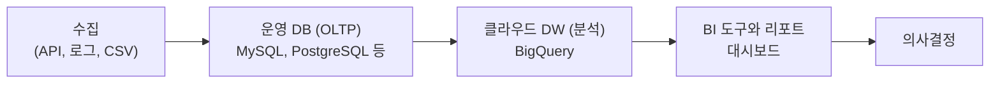
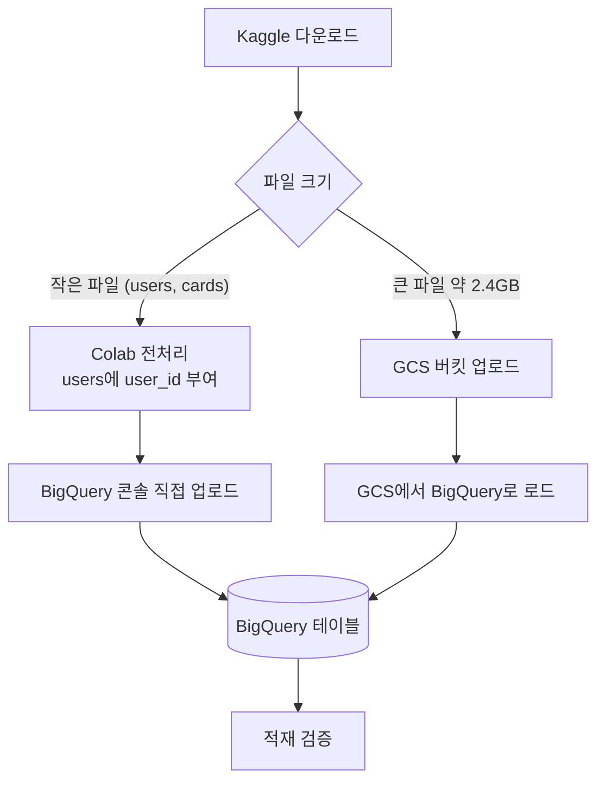
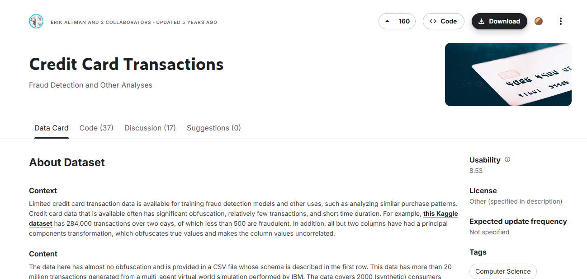
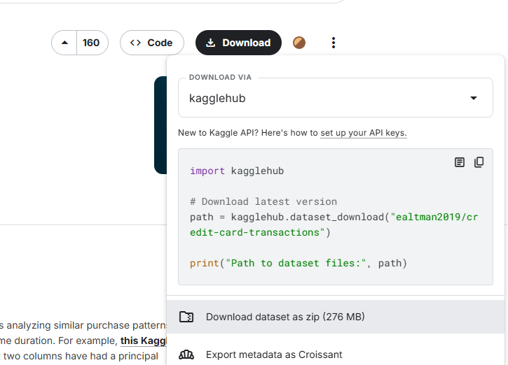
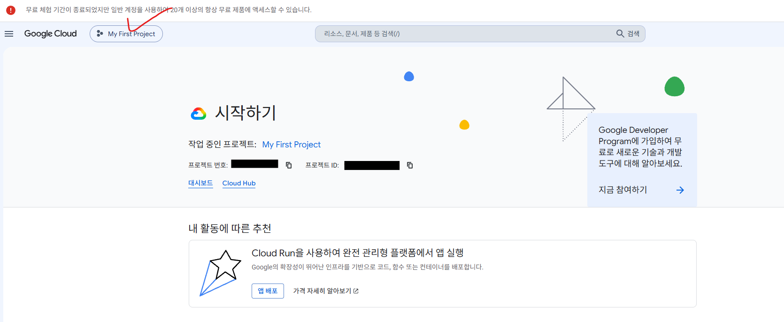

# FinDA 7주차 1일차 — BigQuery 입문, 데이터 적재, 기초 쿼리

> 7주차 Day 1 (금, 3시간) 강의안. BigQuery를 처음 만나는 수강생이 클라우드 DW의 개념을 이해하고, TabFormer 카드 거래 데이터를 본인 프로젝트에 직접 적재한 뒤, 기초 집계 쿼리까지 실행하는 것이 목표입니다.

---

## 오늘의 구성

| 순서 | 세션 | 시간 |
| --- | --- | --- |
| (1) | Session 1-1. BigQuery 소개 — 왜 실무는 클라우드 DW를 쓰는가 | 50 |
| (2) | 쉬는 시간 | 10분 |
| (3) | Session 1-2. 데이터 적재 — TabFormer를 내 BigQuery에 올리기 | 50분 |
| (4) | 쉬는 시간 | 10분 |
| (5) | Session 1-3. 데이터 확인과 기초 집계 | 60분 |

오늘의 학습 목표:

- (1) 로컬 DB와 클라우드 DW의 차이를 설명할 수 있다 (서버리스, 컬럼 지향 저장, 처리 바이트 과금)
- (2) Kaggle의 TabFormer 데이터를 본인 GCP 프로젝트의 BigQuery에 적재할 수 있다
- (3) 적재된 테이블을 확인하고, 기초 집계 쿼리로 비즈니스 질문에 답할 수 있다

---

## Session 1-1. BigQuery 소개 (50분)

### 도입: 우리는 지금 어디에 있나 (10분)

사전 설문 결과를 공유드리면,

- SQL 자체는 과반이 SQLD 자격증 또는 전공 수업 수준으로 이미 알고 있습니다. 사전 설문 응답자 9명 기준으로 기본 SELECT는 8명, GROUP BY 집계는 7명이 직접 작성할 수 있다고 답했습니다.
- 반면 BigQuery는 실질 사용 경험자가 사실상 없고, GCP 콘솔을 써 본 사람은 0명입니다.

그래서 이번 주의 약속은 이렇습니다. **SQL 문법을 처음부터 다시 가르치지 않습니다.** 대신 여러분이 이미 아는 SQL을 "실무가 실제로 쓰는 환경(클라우드 데이터 웨어하우스)"에서 다시 굴려 보고, 그 환경에서만 생기는 감각(비용, 규모, 협업)을 익힙니다.

이번 주 결과물 미리보기:

- (1) 오늘 (1일차): 약 2,400만 행 카드 거래 데이터를 본인 BigQuery 프로젝트에 적재하고 기초 집계까지 실행
- (2) 2일차: 금융 데이터 분석 직무의 실제 모습과 실습 데이터 3개 테이블 심층 이해 → [Day 2 강의안](day2-lecture.md)
- (3) 3일차: 분석하기 좋은 형태로 데이터를 재조립하는 "데이터 마트" 설계와 구축 → [Day 3 강의안](day3-lecture.md)

### 왜 실무는 클라우드 DW를 쓰는가 (10분)

질문으로 시작합니다. "오늘 받을 거래 데이터는 CSV로 약 2.4GB, 약 2,400만 행입니다. 엑셀로 열면 어떻게 될까요?"

- 엑셀은 시트당 약 104만 행이 한계입니다. 열리지도 않습니다.
- "그럼 노트북에 MySQL을 깔고 넣으면 되지 않나요?" — 됩니다. 하지만 실무에서는 다음 세 가지 벽에 부딪힙니다.

로컬 DB의 세 가지 한계:

- (1) **데이터 크기**: 오늘 데이터는 2.4GB지만, 실제 카드사의 거래 로그는 수십억 행 그리고 수 TB 단위입니다. 노트북의 디스크와 메모리로는 감당이 안 됩니다.
- (2) **협업**: 우리 기수 40명이 같은 데이터를 분석한다고 각자 PC에 CSV를 복사하면, 누구 데이터가 최신인지 아무도 모르는 "버전 지옥"이 됩니다. 실무 팀도 마찬가지입니다.
- (3) **관리**: DB 서버는 설치, 백업, 장애 대응, 용량 증설을 누군가 계속 해야 합니다. 분석가가 그 일까지 하면 분석할 시간이 없습니다.

그래서 실무의 답은 "데이터를 한 곳(클라우드 DW)에 두고, 모두가 쿼리로 접근한다"입니다. 전체 데이터 흐름에서 BigQuery가 어디에 있는지 봅시다.



- 여러분이 지금까지 배운 SQL 환경(MySQL 등)은 주로 B의 세계, 즉 서비스를 "돌리기 위한" 데이터베이스입니다.
- 이번 주 우리가 들어가는 곳은 C, 즉 데이터를 "분석하기 위한" 창고입니다. 같은 SQL을 쓰지만 목적과 설계가 다릅니다. 이 차이가 오늘 배울 세 가지 핵심 개념으로 이어집니다.

### 핵심 개념 세 가지 (15분)

#### (1) 서버리스 — 발전기 대신 콘센트

전기가 필요하다고 발전기를 사서 직접 돌리는 집은 없습니다. 콘센트에 꽂고, 쓴 만큼 요금을 냅니다.

- 발전기 방식 = 직접 DB 서버 구축: 서버 사양 선정, 설치, 백업, 장애 대응, 확장을 모두 우리가 담당
- 콘센트 방식 = BigQuery(서버리스): 그 모든 것을 구글이 담당하고, 우리는 쿼리만 작성

"서버리스(serverless)"는 서버가 없다는 뜻이 아니라, **서버 관리를 우리가 신경 쓸 필요가 없다**는 뜻입니다. 쿼리를 던지면 구글의 수많은 서버가 알아서 나눠 처리하고 결과만 돌려줍니다.

#### (2) 컬럼 지향 저장 — 데이터를 세로로 자른다

전통적인 운영 DB는 데이터를 "행 단위"로 저장합니다. 분석용 DW는 "컬럼 단위"로 저장합니다.

| 저장 방식 | 저장 형태 (개념) | 잘하는 일 |
| --- | --- | --- |
| 행 지향 (MySQL 등) | (1, 김OO, 170cm), (2, 이OO, 165cm), ... 한 사람의 정보가 한 덩어리 | "3번 회원 정보 조회 또는 수정" 같은 건별 처리 |
| 컬럼 지향 (BigQuery) | (1, 2, 3, ...), (김OO, 이OO, ...), (170, 165, ...) 같은 컬럼끼리 한 덩어리 | "전교생 평균 키" 같은 대량 집계 |

비유: 전교생 명부에서 "평균 키"를 구한다고 합시다. 학생별 카드를 한 장씩 넘기며 키를 찾는 것(행 지향)보다, "키만 모아 둔 목록" 한 장을 쭉 읽는 것(컬럼 지향)이 압도적으로 빠릅니다. 분석 쿼리는 대부분 "소수의 컬럼을 전체 행에 대해 집계"하는 형태라, 컬럼 지향이 유리합니다.

그리고 이 저장 방식이 곧 비용 모델과 직결됩니다. **BigQuery는 쿼리가 읽은(스캔한) 컬럼의 데이터만 처리합니다.**

#### (3) 처리 바이트 과금 — 담은 만큼 계산하는 샐러드바

BigQuery의 쿼리 요금은 "쿼리가 스캔한 데이터 양(처리 바이트)"으로 매겨집니다. 무게 단위로 계산하는 샐러드바와 같습니다.

- `SELECT *` = 접시에 모든 메뉴를 다 담는 것. 필요 없는 컬럼까지 전부 스캔되어 처리 바이트가 커집니다.
- 필요한 컬럼만 `SELECT` = 먹을 만큼만 담는 것. 스캔량과 비용이 줄어듭니다.
- **`LIMIT 10`을 붙여도 스캔량은 줄지 않습니다.** 결과 화면에 10행만 보여줄 뿐, 스캔은 이미 끝난 뒤입니다.

### GCP 콘솔과 BigQuery Studio 화면 구성 (10분)

강사 화면을 함께 보며 구조를 익힙니다. 직접 조작은 Session 1-2에서 합니다.

- (1) **GCP 콘솔** (console.cloud.google.com): 구글 클라우드의 관문. 모든 리소스는 "프로젝트"라는 지붕 아래에 속합니다. 상단 바에서 현재 프로젝트를 항상 확인하세요.
- (2) **BigQuery Studio**: 콘솔 검색창에 "BigQuery"를 치면 진입합니다. 화면 구성은 세 부분입니다.
    - 좌측 **Explorer**: 프로젝트 > 데이터셋 > 테이블의 트리 구조
    - 중앙 **쿼리 편집기**: SQL을 작성하고 실행하는 곳
    - 우측 상단 **처리 바이트 미리보기**: 쿼리를 실행하기 전에 "이 쿼리는 실행 시 N MB를 처리합니다"라고 알려주는 표시. **오늘부터 모든 쿼리에서 실행 전에 이 숫자를 읽는 습관**을 들입니다.

> 📷 스크린샷 추가 예정: (BigQuery Studio 첫 화면 — Explorer, 쿼리 편집기, 우측 상단 처리 바이트 미리보기 위치에 빨간 박스 표시)

> 📷 스크린샷 추가 예정: (쿼리 실행 전 "이 쿼리를 실행하면 N MB가 처리됩니다" 미리보기 문구 확대 캡처)

### 무료 한도와 비용 안전장치 (5분)

"클라우드 = 요금 폭탄"이라는 걱정부터 내려놓읍시다. 학습용으로는 무료 한도가 넉넉합니다.

- (1) **무료 한도**: 매월 쿼리 처리 1TB 그리고 저장 10GB 수준이 무료입니다. 오늘 데이터(약 2.4GB)는 전체를 스캔해도 무료 한도의 0.25% 수준입니다.
- (2) **샌드박스와 무료 크레딧**: 신용카드 등록 없이 BigQuery 샌드박스로 시작할 수 있습니다 (테이블 60일 만료 등 일부 제한). 신규 가입 시 $300 무료 크레딧 안내가 뜨기도 합니다.
- (3) **처리 바이트 미리보기 습관**: 실행 버튼을 누르기 전에 우측 상단 숫자를 읽습니다. 실무에서 잘못 짠 쿼리 하나가 수백 달러를 태우는 사고는 이 습관 하나로 대부분 예방됩니다.
- (4) **최대 청구 바이트 설정**: 쿼리 설정의 고급 옵션에서 "Maximum bytes billed"를 걸어 두면, 그 이상 스캔하는 쿼리는 실행 자체가 거부됩니다. 안전벨트로 기억해 두세요.

> 무료 한도와 요금 정책은 바뀔 수 있으니 [BigQuery 요금 문서](https://cloud.google.com/bigquery/pricing)에서 최신 내용을 확인하세요.

---

## Session 1-2. 데이터 적재 — TabFormer를 내 BigQuery에 올리기 (60분)

### 사전 준비물

- (1) Google 계정 (GCP 콘솔 로그인용)
- (2) Kaggle 계정 (구글 계정으로 가입 가능)
- (3) Google Colab 접속 가능 여부 확인 (users 파일 전처리에 사용)

### STEP 0. 이 실습의 큰 그림 (5분)



경로를 나누는 이유: 거래 파일(`card_transaction.v1.csv`)이 약 2.4GB인데, BigQuery 콘솔에서 로컬 파일을 직접 올리는 방식은 작은 파일용입니다 (직접 업로드 한도가 약 10MB 수준). 그래서 거래 파일은 이 경로로는 불가능하고, Google Cloud Storage(GCS)라는 클라우드 저장소에 먼저 올린 뒤 거기서 BigQuery로 로드합니다.

그리고 작은 파일 중 `users`는 적재 전에 **반드시 전처리가 필요**합니다 (STEP 3에서 상세히).

### STEP 1. Kaggle에서 데이터 받기 (10분)

데이터셋: [Credit Card Transactions (ealtman2019)](https://www.kaggle.com/datasets/ealtman2019/credit-card-transactions)

두 가지 방법 중 편한 쪽을 고르면 됩니다.

#### 방법 1-A. 웹에서 직접 받기 (가장 간단)

- (1) 위 링크 접속 후 Kaggle 로그인
- (2) 페이지의 Download 버튼 클릭 → 전체 파일이 하나의 zip으로 다운로드
- (3) zip 압축 해제





#### 방법 1-B. Kaggle API로 받기 (권장: 엔지니어링 연습과 재현성)

- (1) 터미널 또는 Cloud Shell에서 설치
  ```bash
  pip install kaggle
  ```
- (2) Kaggle API 토큰 발급: Kaggle 우측 상단 프로필 → Settings → API → "Create New Token" → `kaggle.json` 파일이 다운로드됨
- (3) 토큰 배치
  ```bash
  mkdir -p ~/.kaggle
  mv kaggle.json ~/.kaggle/
  chmod 600 ~/.kaggle/kaggle.json
  ```
- (4) 데이터 다운로드와 압축 해제
  ```bash
  kaggle datasets download -d ealtman2019/credit-card-transactions
  unzip credit-card-transactions.zip -d tabformer
  ```

#### 받은 파일 확인

압축을 풀면 대략 다음 파일들이 보입니다.

| 파일 | 내용 | 대략 크기 |
| --- | --- | --- |
| `sd254_users.csv` | 사용자 약 2,000명 | 작음 (수백 KB) |
| `sd254_cards.csv` | 카드 정보 | 작음 (수백 KB) |
| `card_transaction.v1.csv` | 거래 약 2,400만 건 | 큼 (약 2.4GB) |
| `mcc_codes.json` | MCC 업종 코드 매핑 | 작음 |

> 파일 구성은 데이터셋 버전에 따라 다를 수 있으니, 압축 해제 후 실제 목록을 확인하세요. `mcc_codes.json`은 업종 코드 매핑인데 일반 JSON 객체 형태라 BigQuery에 바로 적재하기 어렵습니다 (BigQuery는 줄 단위 JSON을 요구). 이 파일은 2일차 데이터 상세 소개에서 별도 룩업 테이블로 다룹니다 → [Day 2 강의안](day2-lecture.md)

### STEP 2. GCP 프로젝트와 BigQuery 준비 (10분)

#### 2-1. 프로젝트 만들기

- (1) [console.cloud.google.com](https://console.cloud.google.com) 접속 (Google 계정 로그인)
- (2) 상단 프로젝트 선택 → "새 프로젝트" → 이름 입력 (예: `finda-week7`) → 만들기
- (3) 처음이라면 신규 사용자 대상 무료 크레딧($300) 안내가 뜹니다



#### 2-2. BigQuery 들어가기

- (1) 콘솔 좌측 메뉴 또는 검색창에서 "BigQuery" 검색 → BigQuery Studio 진입
- (2) 좌측 Explorer 패널에 본인 프로젝트가 보이는지 확인

비용이 걱정된다면 Session 1-1의 무료 한도 내용을 떠올리세요. 우리 데이터는 무료 한도 안에 충분히 들어옵니다.

#### 2-3. 데이터셋(dataset) 만들기

BigQuery에서 "데이터셋"은 테이블을 담는 폴더 같은 개념입니다.

- (1) Explorer에서 프로젝트 옆 점 세 개 → "데이터셋 만들기"
- (2) 데이터셋 ID: `tabformer`
- (3) 위치(Location): 예) `US` 또는 `asia-northeast3`(서울)

> ⚠️ **위치 주의**: 데이터셋 위치와 STEP 4에서 만들 GCS 버킷 위치를 똑같이 맞추세요. 다르면 GCS에서 BigQuery로 로드가 안 됩니다.

### STEP 3. 작은 파일 적재 (users, cards) — Colab 전처리 후 콘솔 업로드 (15분)

#### 3-1. users의 유명한 함정: 조인 키가 없다

> ⚠️ **적재 전에 반드시 읽으세요.** `sd254_users.csv`에는 조인 키 컬럼이 없습니다. transactions의 `user_id` 그리고 cards의 `user`는 users 파일의 **행 번호(0부터 시작)**를 가리킵니다. 그런데 BigQuery는 테이블의 행 순서를 보존한다는 보장이 없어서, 이대로 적재하면 나중에 어떤 행이 몇 번 사용자였는지 복원할 방법이 없습니다. 따라서 **적재 전에 pandas로 `user_id` 컬럼을 만들어 붙여야 합니다.** 이 함정은 이 데이터셋을 쓰는 실무자들 사이에서도 유명합니다.

#### 3-2. Colab에서 전처리하기

Google Colab 새 노트북을 열고, 좌측 파일 패널에 `sd254_users.csv`와 `sd254_cards.csv`를 업로드한 뒤 아래 셀을 실행합니다. 내친김에 컬럼명도 소문자와 밑줄로 표준화합니다 (원본 헤더에 공백과 특수문자가 섞여 있어, 그대로 두면 BigQuery가 임의로 바꿔 버립니다).

```python
# Google Colab에서 실행
import re
import pandas as pd

def clean(name):
    # 컬럼명 표준화 예: 'Yearly Income - Person' -> 'yearly_income_person'
    return re.sub(r'[^0-9a-z]+', '_', name.strip().lower()).strip('_')

# (1) users: 컬럼명 정리 + 행 순서(0부터)를 user_id로 부여
users = pd.read_csv('sd254_users.csv')
users.columns = [clean(c) for c in users.columns]
users.insert(0, 'user_id', range(len(users)))
users.to_csv('users_with_id.csv', index=False)

# (2) cards: 컬럼명만 정리 ('User' -> 'user', 'CARD INDEX' -> 'card_index')
cards = pd.read_csv('sd254_cards.csv')
cards.columns = [clean(c) for c in cards.columns]
cards.to_csv('cards_clean.csv', index=False)

print(users[['user_id']].head())
print(cards.columns.tolist())
```

실행 후 좌측 파일 패널에서 `users_with_id.csv`와 `cards_clean.csv`를 다운로드합니다.

- 참고: users의 소득과 부채 컬럼도 거래 금액처럼 `$` 기호가 붙은 문자열입니다. 오늘은 그대로 두고, 정제 방법은 오늘 Session 1-3에서 배웁니다.

#### 3-3. 콘솔에서 업로드

작은 파일은 GCS 없이 콘솔에서 바로 올립니다.

- (1) Explorer에서 `tabformer` 데이터셋 클릭 → "테이블 만들기"
- (2) "테이블을 만들 소스" → **업로드(Upload)** 선택
- (3) 파일 찾아보기 → `users_with_id.csv` 선택, 파일 형식 CSV
- (4) 대상 테이블 이름: `users`
- (5) 스키마: **자동 감지(auto-detect)** 체크
- (6) 테이블 만들기

`cards_clean.csv`도 같은 방식으로 테이블 이름 `cards`로 반복합니다.

> **헤더 처리 규칙 (헷갈리기 쉬움)**
> 자동 감지를 쓰면 BigQuery가 헤더 행을 알아서 인식해 컬럼명을 만듭니다. 이때는 "헤더 건너뛰기"를 따로 설정하지 마세요 (헤더를 건너뛰면 컬럼명을 잃어버려 `string_field_0` 같은 이름이 됩니다). 반대로 STEP 4처럼 수동 스키마를 쓸 때는 헤더 1행을 건너뛰도록 지정해야 합니다.

### STEP 4. 큰 거래 파일 적재 — GCS 경유 (15분)

오늘의 메인 이벤트입니다. 약 2.4GB 거래 파일을 GCS에 올린 뒤 BigQuery로 로드합니다.

#### 4-1. GCS 버킷 만들기

- (1) 콘솔 검색창 → "Cloud Storage" → 버킷 → "만들기"
- (2) 버킷 이름: 전 세계에서 유일해야 함 (예: `finda-week7-본인이니셜-2026`)
- (3) 위치: STEP 2-3의 데이터셋 위치와 동일하게 (예: `US` 또는 `asia-northeast3`)
- (4) 나머지는 기본값으로 만들기

#### 4-2. 거래 파일을 GCS에 올리기

브라우저로 2.4GB를 올리면 느리고 끊기기 쉬워서, **Cloud Shell**에서 명령으로 올리는 걸 권장합니다.

- (1) 콘솔 우측 상단 터미널 아이콘 클릭 → Cloud Shell 열기 (`gcloud`, `bq`가 이미 설치되어 있음)
- (2) 거래 파일이 로컬에 있다면 Cloud Shell 상단 점 세 개 → "업로드"로 `card_transaction.v1.csv`를 올린 뒤 실행
  ```bash
  gcloud storage cp card_transaction.v1.csv gs://YOUR_BUCKET/tabformer/
  ```

> 더 매끄러운 방법: STEP 1-B의 Kaggle API를 Cloud Shell 안에서 바로 실행하면, 로컬을 거치지 않고 Cloud Shell에서 GCS로 바로 올릴 수 있습니다 (부록 참고).

#### 4-3. GCS에서 BigQuery로 로드 (수동 스키마)

거래 파일은 컬럼명과 타입을 깔끔하게 고정하기 위해 **수동 스키마**로 로드하길 권장합니다. Cloud Shell에서 실행합니다. (`YOUR_BUCKET`은 본인 버킷 이름으로 교체)

```bash
bq load \
  --source_format=CSV \
  --skip_leading_rows=1 \
  tabformer.transactions \
  gs://YOUR_BUCKET/tabformer/card_transaction.v1.csv \
  user_id:INTEGER,card_id:INTEGER,year:INTEGER,month:INTEGER,day:INTEGER,time:STRING,amount:STRING,use_chip:STRING,merchant_name:STRING,merchant_city:STRING,merchant_state:STRING,zip:STRING,mcc:INTEGER,errors:STRING,is_fraud:STRING
```

스키마를 이렇게 잡은 이유 (수업에서 강조할 포인트):

- (1) `amount`를 STRING으로 받습니다. 원본이 `$54.30`처럼 `$`가 붙은 문자열이라 숫자로 바로 못 받습니다. 정제는 쿼리에서 합니다 (오늘 Session 1-3의 핵심 재료).
- (2) `time`도 STRING(`HH:MM` 형태)이고, 날짜는 year, month, day로 쪼개져 있어 정수로 받습니다. **DATE 합성은 쿼리에서** 합니다.
- (3) `zip`은 빈 값과 소수점 표기가 섞여 있어 STRING이 안전합니다.

콘솔 UI로 하고 싶다면: 테이블 만들기 → 소스 "Google Cloud Storage" → GCS URI 입력 → 형식 CSV → 위 스키마를 직접 입력 → 헤더 1행 건너뛰기.

### STEP 5. 적재 검증 (5분)

BigQuery 콘솔의 쿼리 편집기에서 실행합니다. (`YOUR_PROJECT`는 본인 프로젝트 ID로 교체)

```sql
-- 행 수 확인
SELECT COUNT(*) AS n_tx    FROM `YOUR_PROJECT.tabformer.transactions`;  -- 약 2,400만
SELECT COUNT(*) AS n_users FROM `YOUR_PROJECT.tabformer.users`;         -- 약 2,000
SELECT COUNT(*) AS n_cards FROM `YOUR_PROJECT.tabformer.cards`;

-- users의 user_id가 잘 부여되었는지 확인 (0부터 시작, 사람 수 - 1에서 끝)
SELECT
    MIN(u.user_id) AS min_id,
    MAX(u.user_id) AS max_id
FROM
    `YOUR_PROJECT.tabformer.users` AS u;

-- 미리보기
SELECT * FROM `YOUR_PROJECT.tabformer.transactions` LIMIT 10;
```

체크포인트:

- (1) 거래 행 수가 약 2,400만이면 정상
- (2) users의 `min_id`가 0이면 정상 (0이 아니면 STEP 3의 전처리를 건너뛴 것)
- (3) `amount` 값에 `$`가 그대로 보이면 정상 (의도된 것, Session 1-3에서 정제)
- (4) 쿼리 실행 전 화면 우측 상단의 "이 쿼리를 실행하면 N 처리됨" 표시를 확인 → Session 1-1에서 배운 비용 감각을 실전에 적용하는 첫 순간

### STEP 6. 비용과 정리 메모

- 무료 한도 안이지만 `SELECT *` 남발은 처리 바이트를 키웁니다. 필요한 컬럼만 SELECT하는 습관을 들이세요.
- 실습이 끝나고 한동안 안 쓸 거면, GCS에 올린 거래 파일은 지워도 됩니다 (BigQuery 테이블만 남기면 됨). 저장 비용 절약.

### 부록. Cloud Shell에서 한 번에 (로컬 다운로드 없이)

로컬에 2.4GB를 받기 부담되면, Cloud Shell 안에서 전 과정을 끝낼 수 있습니다.

```bash
# 1) Kaggle 설치와 토큰 (kaggle.json을 Cloud Shell에 업로드해 둔 상태)
pip install kaggle
mkdir -p ~/.kaggle && mv kaggle.json ~/.kaggle/ && chmod 600 ~/.kaggle/kaggle.json

# 2) 데이터 다운로드와 압축 해제
kaggle datasets download -d ealtman2019/credit-card-transactions
unzip credit-card-transactions.zip -d tabformer
cd tabformer

# 3) 큰 파일을 GCS로
gcloud storage cp card_transaction.v1.csv gs://YOUR_BUCKET/tabformer/

# 4) 큰 파일을 BigQuery로 로드 (STEP 4-3 스키마 그대로 사용)
bq load --source_format=CSV --skip_leading_rows=1 \
  tabformer.transactions \
  gs://YOUR_BUCKET/tabformer/card_transaction.v1.csv \
  user_id:INTEGER,card_id:INTEGER,year:INTEGER,month:INTEGER,day:INTEGER,time:STRING,amount:STRING,use_chip:STRING,merchant_name:STRING,merchant_city:STRING,merchant_state:STRING,zip:STRING,mcc:INTEGER,errors:STRING,is_fraud:STRING

# 5) 작은 파일 전처리 (users에 user_id 부여 + 컬럼명 표준화) — Cloud Shell에는 python3가 설치되어 있음
python3 - <<'EOF'
import re
import pandas as pd

def clean(name):
    return re.sub(r'[^0-9a-z]+', '_', name.strip().lower()).strip('_')

users = pd.read_csv('sd254_users.csv')
users.columns = [clean(c) for c in users.columns]
users.insert(0, 'user_id', range(len(users)))
users.to_csv('users_with_id.csv', index=False)

cards = pd.read_csv('sd254_cards.csv')
cards.columns = [clean(c) for c in cards.columns]
cards.to_csv('cards_clean.csv', index=False)
EOF

# 6) 작은 파일은 GCS 없이 자동 감지로 바로 로드 (헤더 건너뛰기 없이)
bq load --autodetect --source_format=CSV tabformer.users users_with_id.csv
bq load --autodetect --source_format=CSV tabformer.cards cards_clean.csv
```

> Cloud Shell 홈 디렉터리는 약 5GB라, 압축본(zip)과 압축 해제본이 동시에 있으면 빠듯할 수 있습니다. GCS 업로드 후 로컬 파일을 지우면서 진행하세요. pandas가 없다는 오류가 나면 `pip install pandas`를 먼저 실행하세요.

---

## Session 1-3. 데이터 확인과 기초 집계 (60분)

### 적재된 테이블 확인 3종 세트 (10분)

쿼리를 짜기 전에, Explorer에서 `transactions` 테이블을 클릭하면 나오는 세 개의 탭부터 익힙니다.

- (1) **미리보기(Preview) 탭**: 데이터를 눈으로 훑어봅니다. 중요한 점 — **미리보기는 처리 바이트를 쓰지 않습니다 (무료)**. "데이터가 어떻게 생겼나 보려고 `SELECT *`를 실행"하는 습관 대신, 미리보기 탭을 먼저 여세요.
- (2) **스키마(Schema) 탭**: 컬럼명과 타입을 확인합니다. `amount`가 STRING인 것, `is_fraud`가 STRING인 것을 여기서 눈으로 확인하세요.
- (3) **세부정보(Details) 탭**: 행 수, 테이블 크기(논리 바이트), 생성 시각, 위치를 확인합니다. "이 테이블 전체를 스캔하면 약 몇 GB겠구나"라는 감을 여기서 잡습니다.

> ⚠️ **이후 모든 쿼리 공통 캐비앗**: TabFormer는 배포 버전에 따라 컬럼 구성이 조금씩 다를 수 있습니다. 이 강의안의 쿼리를 실행하기 전에, 반드시 본인 테이블의 **Schema 탭에서 실제 컬럼명을 확인**하고 다르면 맞춰 바꾸세요.

> 📷 스크린샷 추가 예정: (transactions 테이블의 미리보기, 스키마, 세부정보 탭 위치 표시)

### 기초 SQL 리프레셔 — SQLD와 같은 점, BigQuery에서 달라지는 점 (25분)

여러분 대부분이 이미 아는 문법입니다. 그래서 각 문법마다 두 줄로 정리합니다: (a) SQLD에서 배운 것과 같은 점, (b) BigQuery에서 달라지는 점. 데모 쿼리는 강사와 함께 직접 실행합니다. (`YOUR_PROJECT`는 본인 프로젝트 ID로 교체)

#### (1) SELECT와 LIMIT

- 같은 점: 컬럼을 골라 조회하는 문법은 SQLD에서 배운 그대로입니다.
- 달라지는 점: 테이블 이름을 `` `프로젝트.데이터셋.테이블` `` 형태의 풀네임으로 쓰고 **백틱(`)**으로 감쌉니다 (작은따옴표 아님). 그리고 `LIMIT`은 결과 행 수만 줄일 뿐 **처리 바이트는 줄이지 않습니다** — 스캔량을 줄이는 것은 SELECT하는 컬럼 수입니다.

```sql
-- 데모 1: 세 컬럼만 조회 — 실행 전 우측 상단 처리 바이트를 먼저 읽으세요
SELECT
    t.user_id,
    t.merchant_name,
    t.amount
FROM
    `YOUR_PROJECT.tabformer.transactions` AS t
LIMIT 10;
```

실행 전후로 두 가지를 관찰합니다. (1) 처리 바이트 미리보기 숫자가 `SELECT *`일 때와 어떻게 다른지, (2) LIMIT을 100으로 바꿔도 처리 바이트가 그대로인지.

#### (2) WHERE

- 같은 점: `=`, `<`, `IN`, `LIKE`, `BETWEEN`으로 행을 거르는 문법은 동일합니다.
- 달라지는 점: 이 데이터의 `is_fraud`는 불리언이 아니라 STRING(`'Yes'` 또는 `'No'`)입니다. 조건을 걸기 전에 Schema 탭에서 타입부터 확인하는 습관이 필요합니다. 또한 파티셔닝이 없는 테이블에서는 WHERE로 걸러도 스캔 바이트가 줄지 않는 게 보통입니다 — 이 문제의 해법은 3일차에서 다룹니다 → [Day 3 강의안](day3-lecture.md)

```sql
-- 데모 2: 사기로 표시된 거래만 조회
SELECT
    t.user_id,
    t.merchant_city,
    t.amount
FROM
    `YOUR_PROJECT.tabformer.transactions` AS t
WHERE
    t.is_fraud = 'Yes'
LIMIT 10;
```

#### (3) ORDER BY

- 같은 점: `ORDER BY 컬럼 DESC` 정렬 문법은 동일합니다.
- 달라지는 점: 2,400만 행 전체 정렬은 무거운 작업이니 `ORDER BY`에는 `LIMIT`을 함께 쓰는 습관을 들입니다. 그리고 아래 데모에서 "타입이 틀리면 정렬도 거짓말을 한다"를 확인합니다.

```sql
-- 데모 3: 금액이 큰 거래 Top 5... 처럼 보이는 함정
SELECT
    t.amount
FROM
    `YOUR_PROJECT.tabformer.transactions` AS t
ORDER BY
    t.amount DESC
LIMIT 5;
```

결과를 보면 `$99.xx`대가 최상위에 옵니다. `amount`가 STRING이라 **사전순 정렬**이 되었기 때문입니다 (`'$99'`가 `'$100'`보다 뒤). 그래서 다음 단계, 타입 정제가 필요합니다.

#### (4) 타입 정제 — REPLACE, SAFE_CAST, DATE 합성 (SQLD에는 없던 실전 단계)

- 같은 점: `CAST`와 문자열 함수의 존재 자체는 SQLD에서 배웠습니다.
- 달라지는 점: 실무 데이터는 `$54.30`처럼 지저분하게 들어옵니다. BigQuery에는 `SAFE_CAST`가 있어서, 변환에 실패한 값을 에러 대신 **NULL로 처리**합니다. 2,400만 행 중 이상한 값 한 건 때문에 쿼리 전체가 죽는 것을 막아 줍니다.

이번 주 내내 쓸 두 가지 필수 스니펫입니다. 외우다시피 하게 될 겁니다.

```sql
-- 데모 4: 금액 정제와 날짜 합성 — 이번 주의 필수 스니펫 두 가지
SELECT
    t.amount                                             AS amount_raw,
    SAFE_CAST(REPLACE(t.amount, '$', '') AS NUMERIC)     AS amount_usd,   -- (1) 달러 기호 제거 후 숫자로
    DATE(t.year, t.month, t.day)                         AS tx_date,      -- (2) 흩어진 연, 월, 일을 날짜로
    t.time
FROM
    `YOUR_PROJECT.tabformer.transactions` AS t
LIMIT 5;
```

- (1) `REPLACE(t.amount, '$', '')`로 달러 기호를 떼고, `SAFE_CAST(... AS NUMERIC)`으로 숫자화합니다. 금액 계산에는 부동소수점 오차가 없는 NUMERIC 타입이 안전합니다.
- (2) `DATE(year, month, day)`는 흩어진 세 정수 컬럼을 진짜 DATE로 합성합니다. SQLD에서 배운 `TO_DATE`류의 BigQuery식 표현이라고 생각하면 됩니다.

#### (5) 집계 함수 — COUNT, SUM, AVG

- 같은 점: `COUNT(*)`, `SUM`, `AVG`의 의미와 문법은 동일합니다.
- 달라지는 점: STRING 컬럼에는 SUM을 걸 수 없으므로, **정제 스니펫을 집계 함수 안에 넣는 패턴**이 기본형이 됩니다. `ROUND(값, 2)`로 자릿수를 정리합니다.

```sql
-- 데모 5: 연도별 거래 건수 — GROUP BY 복습을 겸해서
SELECT
    t.year,
    COUNT(*) AS n_tx
FROM
    `YOUR_PROJECT.tabformer.transactions` AS t
GROUP BY
    t.year
ORDER BY
    t.year;
```

#### (6) GROUP BY와 HAVING

- 같은 점: "GROUP BY는 피벗테이블의 SQL 버전"이라는 감각 그대로입니다. **WHERE는 집계 전 행 필터, HAVING은 집계 후 그룹 필터**라는 구분도 동일합니다 (이번 주 내내 반복할 문장입니다).
- 달라지는 점: BigQuery는 `GROUP BY 1`처럼 SELECT 목록의 위치 번호를 쓸 수 있고, **HAVING에서 SELECT의 별칭을 그대로 쓸 수 있습니다** (표준 SQL에서는 안 되는 경우가 많아 SQLD 지식과 다른 지점).

```sql
-- 데모 6: 연간 거래가 100만 건을 넘는 해만 — HAVING에서 별칭 n_tx를 바로 사용
SELECT
    t.year,
    COUNT(*) AS n_tx
FROM
    `YOUR_PROJECT.tabformer.transactions` AS t
GROUP BY
    t.year
HAVING
    n_tx >= 1000000
ORDER BY
    t.year;
```

#### (7) DISTINCT

- 같은 점: 중복 제거와 `COUNT(DISTINCT 컬럼)` 문법은 동일합니다.
- 달라지는 점: 수억 행 이상에서는 정확한 `COUNT(DISTINCT)`가 무거워서, BigQuery에는 근사치를 빠르게 내는 `APPROX_COUNT_DISTINCT`가 따로 있습니다. 오늘은 이름만 기억해 두세요.

```sql
-- 데모 7: 거래가 발생한 주(state)는 몇 개인가
SELECT
    COUNT(DISTINCT t.merchant_state) AS n_states
FROM
    `YOUR_PROJECT.tabformer.transactions` AS t;
```

#### 리프레셔 마무리: 작성 순서와 실행 순서

쿼리가 안 돌아갈 때 늘 다시 보게 되는 표입니다.

| 순서 | 쿼리를 쓰는 순서 | 실제 실행되는 순서 |
| --- | --- | --- |
| 1 | SELECT | FROM |
| 2 | FROM | WHERE |
| 3 | WHERE | GROUP BY |
| 4 | GROUP BY | HAVING |
| 5 | HAVING | SELECT |
| 6 | ORDER BY | ORDER BY |
| 7 | LIMIT | LIMIT |

표준 실행 순서상 HAVING은 SELECT보다 먼저라 별칭을 모르는 게 원칙인데, BigQuery가 편의상 별칭 사용을 허용해 주는 것 — 이렇게 이해하면 데모 6이 표준 SQL 지식과 충돌하지 않습니다.

### 실습: 카드사 신입 분석가의 첫 데이터 훑어보기 (20분)

상황: 여러분은 카드사 데이터분석팀에 오늘 합류했습니다. 팀장의 첫 지시는 이렇습니다. "본격 분석 전에, 우리 거래 데이터의 규모와 기본 분포부터 감을 잡아서 공유해 주세요."

진행 방식: 각자 BigQuery 콘솔에서 직접 쿼리를 작성해 답을 구합니다. 문제마다 결과 숫자와 함께 **한 줄 해석**을 메모하세요 (분석가의 답은 숫자가 아니라 문장입니다). 모든 문제에서 실행 전 처리 바이트 확인을 잊지 마세요.

#### 문제 1 (워밍업). 우리 회사가 보유한 거래는 총 몇 건이고, 총 거래액과 평균 거래 금액은 얼마인가?

- 힌트 1: `COUNT(*)`, `SUM`, `AVG`를 한 쿼리에서 함께 쓸 수 있습니다.
- 힌트 2: `amount`는 STRING입니다. 데모 4의 정제 스니펫을 집계 함수 안에 넣으세요.
- 힌트 3: `ROUND(값, 2)`로 소수 둘째 자리까지 정리하면 보기 좋습니다.

#### 문제 2. 거래가 가장 많이 발생한 주(merchant_state) Top 5는 어디이고, 각각 몇 건인가?

- 힌트 1: `GROUP BY` + `COUNT(*)` + `ORDER BY ... DESC` + `LIMIT 5` 조합입니다.
- 힌트 2: 결과 상위권에 주 이름이 아닌 값(비어 있는 값)이 보인다면, 그 거래들은 어떤 거래일지 생각해 보세요. 온라인 거래는 가맹점 주(state)가 없습니다.

#### 문제 3. 결제 방식(use_chip)별로 거래 건수와 평균 거래 금액은 어떻게 다른가? 온라인 거래의 평균 금액은 대면 거래보다 큰가?

- 힌트 1: `GROUP BY t.use_chip`에 `COUNT(*)`와 정제된 `AVG`를 함께 붙입니다.
- 힌트 2: 결과를 보고 "어떤 채널의 객단가가 높은가"를 한 줄로 해석해 보세요.

#### 문제 4 (도전). 거래 건수가 10만 건 이상인 주 가운데, 평균 거래 금액이 가장 높은 주 Top 5는 어디인가?

비즈니스 배경: 거래가 몇 건 없는 주는 평균이 우연에 좌우됩니다. "시장 규모가 충분한 주 중에서 객단가가 높은 곳"을 찾는 것이 실무형 질문입니다.

- 힌트 1: 집계 후 그룹을 거르는 것이므로 WHERE가 아니라 `HAVING`입니다.
- 힌트 2: BigQuery는 HAVING에서 SELECT 별칭을 쓸 수 있습니다 (데모 6 참고).
- 힌트 3: 온라인 거래(주 없음)는 제외하고 싶다면 집계 전에 걸러야 합니다 — 이건 WHERE의 일입니다.

#### 보너스 (일찍 끝난 사람). 전체 거래 중 사기 거래(is_fraud = 'Yes')는 몇 건이고, 비율은 몇 %인가?

- 힌트: `COUNTIF(조건)` 함수를 쓰면 한 쿼리로 끝납니다. `CASE WHEN`과 SUM 조합으로도 됩니다.

### 오늘의 마무리 (5분)

- 오늘 한 일: 클라우드 DW 개념 → 2,400만 행 적재 → 기초 집계까지. 여러분은 이제 "실무 규모의 데이터를 실무 도구로" 만져 본 사람입니다.
- 내일 (2일차): 이 데이터를 다루는 사람들, 즉 금융 데이터 분석 직무의 실제 업무를 살펴보고, 세 테이블의 컬럼 하나하나를 뜯어봅니다 → [Day 2 강의안](day2-lecture.md)
- 오늘 적재가 끝까지 안 된 사람은 부록(Cloud Shell 한 번에)을 따라 내일 수업 전까지 완료해 오세요. 막히면 슬랙 채널에 에러 메시지 캡처와 함께 질문을 남기면 됩니다.

---

오늘의 핵심 교훈 한 줄: **"큰 데이터는 창고(GCS)를 거쳐 한 곳(BigQuery)에 모으고, 쿼리는 실행 버튼을 누르기 전에 처리 바이트부터 읽는다."**
