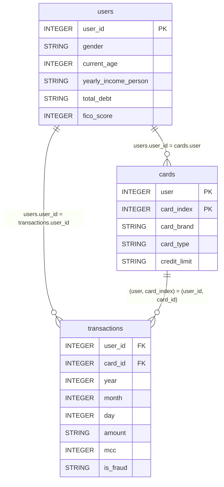
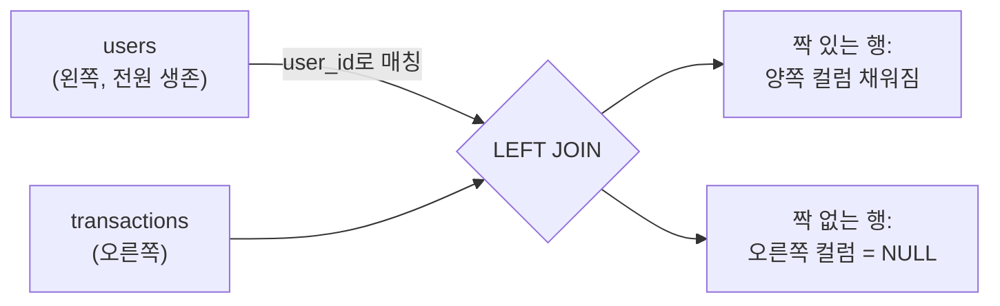

# 강의안: JOIN과 집계로 만드는 고객 소비 분석

> 7주차 Day 2 (토) 수업용 강의안. 세션 2-1부터 2-3까지 180분.

---

## 0. 수업 개요

### 오늘의 도착점

어제(Day 1) 우리는 데이터를 BigQuery에 올리고 프로파일링까지 했습니다. 오늘은 드디어 세 테이블을 **연결**해서 비즈니스 질문에 답하기 시작합니다. 오늘 수업이 끝나면 다음 세 가지를 할 수 있어야 합니다.

- (1) users, cards, transactions 세 테이블을 올바른 키로 JOIN할 수 있다
- (2) MCC 코드를 업종 카테고리로 매핑해 "월별 업종별 매출 매트릭스"를 만들 수 있다
- (3) 연령대와 성별 같은 파생 차원을 만들어 "세그먼트별 소비 패턴"을 추출할 수 있다

### 전제 조건 (수업 시작 전 확인)

- (1) Day 1 가이드대로 `tabformer` 데이터셋에 `transactions`(약 2,400만 행), `users`(약 2,000행), `cards` 세 테이블이 적재되어 있어야 합니다
- (2) `users`는 Day 1에서 pandas로 `user_id` 컬럼을 부여해 재적재한 버전이어야 합니다 (원본 CSV에는 조인 키가 없고 행 번호가 곧 user_id였던 것, 기억하시죠)
- (3) 사전 배포한 "JOIN 감각 되살리기 워크시트" [JOIN 복습 워크시트](day2-join-worksheet.md)를 풀고 왔다는 전제로 복습은 빠르게 진행합니다
- (4) 이 문서의 모든 쿼리에서 `YOUR_PROJECT`는 본인 GCP 프로젝트 ID로 교체하세요

> ⚠️ **컬럼명 캐비앗**: 컬럼 구성과 이름은 데이터셋 버전과 적재 방식(자동 감지 또는 수동 스키마)에 따라 다를 수 있습니다. 쿼리가 "컬럼을 찾을 수 없음" 에러를 내면, 먼저 BigQuery 콘솔에서 해당 테이블의 **Schema 탭을 열어 실제 컬럼명을 확인**하고 쿼리를 맞추세요. 이 문서는 Day 1 가이드의 수동 스키마(transactions)와 정제 후 권장 컬럼명(users)을 기준으로 작성했습니다.

### 오늘 사용하는 세 테이블과 관계



핵심만 요약하면 다음과 같습니다.

| 연결 | 조인 조건 | 관계 |
| --- | --- | --- |
| transactions ↔ users | `t.user_id = u.user_id` | N : 1 |
| transactions ↔ cards | `t.user_id = c.user AND t.card_id = c.card_index` | N : 1 (복합 키) |
| users ↔ cards | `u.user_id = c.user` | 1 : N |

cards의 키가 **두 컬럼짜리 복합 키**라는 점이 오늘 최대의 함정입니다. 한 사용자가 카드를 여러 장 가지므로, `card_index`는 "그 사용자의 몇 번째 카드인가"일 뿐 전체에서 유일하지 않습니다. 세션 2-1에서 이 함정을 직접 밟아 봅니다.

### 시간 배분 요약

| 세션 | 시간 | 주제 |
| --- | --- | --- |
| 2-1 | 60분 | 다중 테이블 JOIN 패턴 |
| 2-2 | 60분 | 월별 업종별 매출 집계 |
| 2-3 | 60분 | 고객 그룹별 소비 패턴 |

---

## Session 2-1. 다중 테이블 JOIN 패턴 (60분)

### 시간 배분

- (1) JOIN 복습: 결핍에서 출발하기 — 15분
- (2) 우리 데이터의 조인 키와 함정 — 10분
- (3) 3-way JOIN 라이브 코딩 — 15분
- (4) 실습: 잠자는 카드 찾기 — 15분
- (5) 체크포인트 — 5분

### 학습 목표

- INNER JOIN과 LEFT JOIN의 결과 차이를 행 수와 NULL 발생 위치로 예측할 수 있다
- 복합 키 조인에서 조건 하나를 빠뜨리면 행이 불어나는(fan-out) 현상을 설명할 수 있다
- LEFT JOIN과 IS NULL 조합으로 "없는 것"을 찾는 안티 조인 패턴을 쓸 수 있다

### 강의 흐름

#### (1) JOIN 복습: 결핍에서 출발하기 (15분)

JOIN을 문법이 아니라 **결핍 상황**에서 출발해 다시 이해합니다. 지금 여러분 앞에 이런 요청이 왔다고 합시다.

> "여성 고객의 거래만 뽑아 주세요."

transactions 테이블을 아무리 뒤져도 성별 컬럼이 없습니다. 성별은 users에 있고, 거래는 transactions에 있습니다. **원하는 데이터가 항상 한 테이블에 있지 않다** — 이것이 JOIN이 필요한 유일한 이유입니다. JOIN은 "같은 의미를 가지는 컬럼의 값"을 기준으로 두 테이블을 옆으로 붙이는 작업입니다.

세 가지 JOIN의 차이는 "짝이 없는 행을 어떻게 처리하는가"로 결정됩니다.

| JOIN 종류 | 남기는 행 | 짝이 없으면 |
| --- | --- | --- |
| INNER JOIN | 양쪽 모두에 짝이 있는 행만 | 결과에서 사라짐 |
| LEFT JOIN | 왼쪽 테이블의 모든 행 | 오른쪽 컬럼이 NULL로 채워짐 |
| RIGHT JOIN | 오른쪽 테이블의 모든 행 | 왼쪽 컬럼이 NULL로 채워짐 |

RIGHT JOIN은 테이블 순서를 바꾼 LEFT JOIN과 같으므로, 실무에서는 가독성을 위해 LEFT JOIN으로 통일하는 것이 관례입니다. 이 수업에서도 LEFT JOIN만 씁니다.

사전 워크시트의 장난감 테이블을 화면에 띄우고 두 가지만 빠르게 되짚습니다.

- 행 수 예측: INNER는 "짝 있는 행 수", LEFT는 "왼쪽 행 수 + 1:N으로 불어난 만큼"
- NULL 위치: LEFT JOIN에서 NULL은 항상 **오른쪽 테이블에서 온 컬럼**에 생긴다



#### (2) 우리 데이터의 조인 키와 함정 (10분)

이제 장난감이 아니라 실전 테이블입니다. 조인 키를 다시 확인합니다.

- (1) users와 transactions는 `user_id`로 연결됩니다. 단, 이 `user_id`는 원본 CSV에 없던 컬럼입니다. Day 1에서 "행 번호가 곧 user_id"라는 이 데이터셋의 유명한 함정을 배우고, pandas로 컬럼을 부여해 재적재했습니다. BigQuery는 적재 후 행 순서를 보장하지 않으므로 적재 전에 부여해야 했다는 것도 복습 포인트입니다.
- (2) cards의 키는 `(user, card_index)` 복합 키입니다. `card_index`만으로 조인하면 "0번째 카드"끼리 전부 매칭되어 엉뚱한 결과가 나옵니다.

복합 키 조건 하나를 빠뜨리면 무슨 일이 생기는지 칠판에 그립니다. 사용자 1이 카드 2장(index 0, 1)을 가졌을 때, 거래 1건을 `user_id`로만 cards에 조인하면 그 거래가 **2행으로 복제**됩니다. 거래 금액을 SUM하면 실제보다 부풀려집니다. 조인 후 합계가 이상하게 크면 가장 먼저 의심할 것이 바로 이 fan-out입니다.

#### (3) 3-way JOIN 라이브 코딩 (15분)

거래 한 건에 "누가(사용자 정보)"와 "무엇으로(카드 정보)"를 붙이는 3-way JOIN을 한 절씩 쌓아가며 작성합니다. 먼저 transactions 단독, 다음 users를 붙이고, 마지막에 cards를 붙입니다.

```sql
-- 3-way JOIN: 거래(t)에 사용자(u)와 카드(c) 정보를 붙인다
-- YOUR_PROJECT는 본인 프로젝트 ID로 교체
SELECT
    t.user_id,
    u.gender,
    u.current_age,
    c.card_brand,
    c.card_type,
    DATE(t.year, t.month, t.day) AS tx_date,                        -- 세 정수 컬럼을 DATE로 합성
    SAFE_CAST(REPLACE(t.amount, '$', '') AS NUMERIC) AS amount_usd, -- '$54.30' → 54.30
    t.mcc,
    t.merchant_city
FROM `YOUR_PROJECT.tabformer.transactions` AS t
INNER JOIN `YOUR_PROJECT.tabformer.users` AS u
    ON t.user_id = u.user_id
INNER JOIN `YOUR_PROJECT.tabformer.cards` AS c
    ON t.user_id = c.user
    AND t.card_id = c.card_index    -- 복합 키: 이 줄을 빼면 행이 불어난다
LIMIT 100;
```

라이브 코딩 중 강조할 세 가지입니다.

- (1) `DATE(t.year, t.month, t.day)`와 `SAFE_CAST(REPLACE(...))`는 오늘 하루 종일 반복해서 쓸 정제 패턴입니다. 여기서 손에 익혀 둡니다.
- (2) `AND t.card_id = c.card_index`를 일부러 지우고 실행해서, 행 수와 금액 합계가 어떻게 달라지는지 비교해 보여 주세요. 함정은 말로 듣는 것보다 한 번 밟아 보는 게 오래 남습니다.
- (3) `LIMIT 100`은 **화면에 보여 주는 행 수만 줄일 뿐, 처리 바이트(스캔량)는 줄이지 않습니다**. Day 1에서 본 "이 쿼리를 실행하면 N 처리됨" 표시를 여기서도 확인하는 습관을 들입니다.

> 📷 스크린샷 추가 예정: 3-way JOIN 실행 결과 상단 100행과 우측 상단의 처리 바이트 표시가 함께 보이는 콘솔 화면

#### (4) 실습: 잠자는 카드 찾기 (15분)

**비즈니스 질문**

> 카드 발급 부서에서 물어봅니다. "발급만 되고 **한 번도 거래하지 않은 카드**를 가진 사용자가 몇 명이나 되나요? 그런 카드는 몇 장인가요?" 휴면 카드 관리 정책을 만들기 위한 기초 숫자입니다.

**생각할 힌트**

- (1) "거래하지 않은"은 transactions에 **없는** 카드를 찾으라는 뜻입니다. 있는 것은 INNER JOIN으로 찾지만, 없는 것은 LEFT JOIN 후 짝이 없어 NULL이 된 행으로 찾습니다.
- (2) 어느 테이블이 왼쪽이어야 할까요? "모든 카드"가 기준이므로 cards가 왼쪽입니다.
- (3) 2,400만 행짜리 transactions를 그대로 조인하면 무겁습니다. 거래에 등장한 `(user_id, card_id)` 조합을 먼저 압축(DISTINCT)해 두고 조인하면 어떨까요?

**풀이 쿼리**

```sql
-- (1) 거래에 한 번이라도 등장한 (사용자, 카드) 조합을 먼저 압축한다
WITH used_cards AS (
    SELECT DISTINCT
        t.user_id,
        t.card_id
    FROM `YOUR_PROJECT.tabformer.transactions` AS t
)

-- (2) 전체 카드 목록에 LEFT JOIN → 짝이 없으면 한 번도 안 쓴 카드
SELECT
    COUNT(*) AS n_unused_cards,                        -- 잠자는 카드 수
    COUNT(DISTINCT c.user) AS n_users_with_unused_card -- 그런 카드를 가진 사용자 수
FROM `YOUR_PROJECT.tabformer.cards` AS c
LEFT JOIN used_cards AS uc
    ON c.user = uc.user_id
    AND c.card_index = uc.card_id
WHERE uc.user_id IS NULL;    -- 짝이 없었다는 증거 = 안티 조인
```

**풀이 후 짚어 줄 것**

- (1) `WHERE uc.user_id IS NULL`이 이 패턴의 심장입니다. LEFT JOIN에서 짝이 없으면 오른쪽 컬럼이 NULL이 된다는 성질을 거꾸로 이용해 "없는 것"을 찾습니다. 이것을 **안티 조인(anti join)** 패턴이라고 부릅니다.
- (2) CTE로 압축하지 않고 transactions를 직접 LEFT JOIN해도 답은 같습니다. 다만 카드 1장에 거래 수천 건이 매칭되는 중간 결과를 만들었다가 버리게 됩니다. **집계나 압축을 먼저 하고 조인은 나중에** — 오늘 이후에도 계속 쓸 성능 감각입니다.
- (3) 시간이 남는 학생에게는 변형 질문을 던집니다. "반대로, cards에 없는 `(user_id, card_id)` 조합으로 발생한 거래가 있는가?" (LEFT JOIN 방향을 뒤집으면 됩니다. 데이터 정합성 점검 질문입니다.)

### 체크포인트 (5분)

다음 질문에 답할 수 있으면 세션 통과입니다.

- (1) LEFT JOIN 결과에서 NULL은 왼쪽과 오른쪽 중 어느 테이블의 컬럼에 생기는가?
- (2) cards 조인에서 `card_index` 조건을 빠뜨리면 결과 금액 합계는 커지는가, 작아지는가? 그 이유는?
- (3) "한 번도 거래하지 않은 카드"를 INNER JOIN만으로 찾을 수 없는 이유는?

---

## Session 2-2. 월별 업종별 매출 집계 (60분)

### 시간 배분

- (1) MCC 코드란 무엇인가 — 10분
- (2) mcc_map 업종 매핑 테이블 만들기 — 15분
- (3) 날짜 합성과 금액 정제 복습 — 10분
- (4) 실습: 월별 업종별 매출 매트릭스 — 20분
- (5) 토론 — 5분

### 학습 목표

- MCC 코드의 의미를 이해하고 룩업 테이블 조인으로 코드를 사람이 읽는 카테고리로 바꿀 수 있다
- 분리된 연, 월, 일 컬럼을 DATE로 합성하고 월 단위로 묶을 수 있다
- 두 개 차원(월 x 카테고리)의 집계 매트릭스를 만들고 읽을 수 있다

### 강의 흐름

#### (1) MCC 코드란 무엇인가 (10분)

transactions의 `mcc` 컬럼에는 5411, 5812 같은 네 자리 숫자가 들어 있습니다. MCC(Merchant Category Code)는 **카드 결제망이 가맹점의 업종을 분류하는 국제 표준 코드**(ISO 18245)입니다. 여러분이 카드를 긁을 때마다 전표에는 이 코드가 함께 기록되고, 카드사는 이 코드로 "이 고객은 외식에 얼마, 주유에 얼마"를 집계합니다. 카드 상품의 "주유 5% 할인" 같은 혜택도 결국 MCC 조건문입니다.

문제는 5411이라는 숫자 자체로는 아무 통찰도 못 준다는 것입니다. 코드를 업종 이름으로 바꿔 주는 **룩업(lookup) 테이블**이 필요하고, 그것을 지금 만듭니다. 코드 테이블과 룩업 테이블의 조인은 실무 데이터 웨어하우스에서 가장 흔한 조인 패턴입니다.

> 참고: Day 1에 받은 파일 중 `mcc_codes.json`이 전체 매핑을 담고 있지만, 일반 JSON 객체라 BigQuery에 바로 적재하기 어렵다고 했습니다. 수업에서는 주요 코드만 골라 직접 테이블을 만들고, 전체 매핑이 필요하면 과제에서 JSON을 pandas로 정제해 적재하는 것을 선택 과제로 남깁니다.

#### (2) mcc_map 업종 매핑 테이블 만들기 (15분)

주요 MCC 코드 26개로 룩업 테이블을 만듭니다. 카테고리는 분석 편의를 위해 큰 묶음(식료품, 외식, 주유 등)으로 뭉쳤습니다.

```sql
-- 룩업 테이블 생성
CREATE OR REPLACE TABLE `YOUR_PROJECT.tabformer.mcc_map` (
    mcc INT64,
    category STRING,       -- 분석용 대분류
    description STRING     -- MCC 원래 의미
);

-- 주요 MCC 코드 26개 입력
INSERT INTO `YOUR_PROJECT.tabformer.mcc_map` (mcc, category, description) VALUES
    (5411, '식료품', '슈퍼마켓 및 식료품점'),
    (5499, '식료품', '기타 식품점 및 편의점'),
    (5921, '식료품', '주류 판매점'),
    (5812, '외식', '레스토랑'),
    (5813, '외식', '주점'),
    (5814, '외식', '패스트푸드'),
    (5541, '주유', '주유소'),
    (5542, '주유', '자동 주유기'),
    (4111, '교통', '시내 및 통근 여객 운송'),
    (4121, '교통', '택시 및 리무진'),
    (4784, '교통', '통행료 및 교량 요금'),
    (4814, '통신', '전화 및 통신 서비스'),
    (4899, '통신', '케이블 및 유료 방송'),
    (4900, '공과금', '전기, 가스, 수도 등 공공요금'),
    (5300, '유통', '창고형 할인 매장'),
    (5310, '유통', '할인점'),
    (5311, '유통', '백화점'),
    (5651, '의류잡화', '의류점'),
    (5661, '의류잡화', '신발 판매점'),
    (5732, '가전전자', '전자제품 판매점'),
    (5912, '의료건강', '약국'),
    (8011, '의료건강', '의원'),
    (8021, '의료건강', '치과'),
    (8062, '의료건강', '병원'),
    (5942, '문화여가', '서점'),
    (7832, '문화여가', '영화관');
```

> 💡 **팁**: 결제 계정을 연결하지 않은 샌드박스 계정은 INSERT 같은 DML이 제한될 수 있습니다. 그 경우 `CREATE OR REPLACE TABLE ... AS SELECT 5411 AS mcc, '식료품' AS category, '슈퍼마켓 및 식료품점' AS description UNION ALL SELECT ...` 형태로 한 번에 만들거나, 위 목록을 CSV로 만들어 콘솔 업로드(Day 1의 users 적재와 같은 방법)로 올려도 됩니다.

만든 다음에는 반드시 **커버리지를 확인**합니다. 우리 매핑이 실제 거래를 얼마나 덮는지 모르면 집계의 "기타"가 얼마나 큰지 해석할 수 없습니다.

```sql
-- 우리 매핑이 실제 거래의 몇 퍼센트를 덮는가
SELECT
    COUNTIF(m.mcc IS NOT NULL) AS mapped_tx,
    COUNTIF(m.mcc IS NULL) AS unmapped_tx,
    ROUND(COUNTIF(m.mcc IS NOT NULL) / COUNT(*) * 100, 1) AS coverage_pct
FROM `YOUR_PROJECT.tabformer.transactions` AS t
LEFT JOIN `YOUR_PROJECT.tabformer.mcc_map` AS m
    ON t.mcc = m.mcc;

-- 매핑 안 된 코드 중 거래가 많은 순 Top 10 → 필요하면 mcc_map에 추가
SELECT
    t.mcc,
    COUNT(*) AS n_tx
FROM `YOUR_PROJECT.tabformer.transactions` AS t
LEFT JOIN `YOUR_PROJECT.tabformer.mcc_map` AS m
    ON t.mcc = m.mcc
WHERE m.mcc IS NULL
GROUP BY t.mcc
ORDER BY n_tx DESC
LIMIT 10;
```

두 번째 쿼리는 방금 배운 안티 조인 패턴의 재등장입니다. 상위 미매핑 코드가 크면 `mcc_codes.json`에서 의미를 찾아 mcc_map에 추가하게 하세요. **룩업 테이블은 한 번 만들고 끝이 아니라 커버리지를 보며 키워 가는 것**이라는 감각이 포인트입니다.

> 📷 스크린샷 추가 예정: Explorer에 mcc_map 테이블이 생긴 모습과 Schema 탭, 그리고 커버리지 쿼리 결과

#### (3) 날짜 합성과 금액 정제 복습 (10분)

이 데이터셋의 두 가지 불편함을 정면으로 처리합니다.

- (1) 날짜가 `year`, `month`, `day` 세 정수 컬럼으로 쪼개져 있습니다. `DATE(year, month, day)` 함수로 진짜 DATE 타입을 합성합니다. 월 단위로 묶을 때는 `DATE_TRUNC(날짜, MONTH)`(그 달의 1일로 뭉침, 정렬에 유리) 또는 `FORMAT_DATE('%Y-%m', 날짜)`(문자열 라벨, 보고서에 유리)를 씁니다.
- (2) 금액이 `$54.30` 형태의 문자열입니다. `REPLACE(amount, '$', '')`로 기호를 떼고 `SAFE_CAST(... AS NUMERIC)`으로 숫자화합니다. CAST가 아니라 SAFE_CAST를 쓰는 이유는, 변환 불가능한 값이 섞여 있을 때 쿼리 전체를 죽이는 대신 NULL로 흘려보내기 위해서입니다. 환불 거래는 `$-77.00`처럼 음수인데, 이 방식은 음수 부호를 그대로 보존하므로 추가 처리가 필요 없습니다.

```sql
-- 정제 패턴 확인용 미니 쿼리
SELECT
    t.year,
    t.month,
    t.day,
    DATE(t.year, t.month, t.day) AS tx_date,
    DATE_TRUNC(DATE(t.year, t.month, t.day), MONTH) AS tx_month,
    t.amount,
    SAFE_CAST(REPLACE(t.amount, '$', '') AS NUMERIC) AS amount_usd
FROM `YOUR_PROJECT.tabformer.transactions` AS t
LIMIT 20;
```

시간은 `PARSE_TIME('%H:%M', time)`으로 TIME 타입이 됩니다. 오늘은 날짜까지만 쓰고, 시간 단위 분석은 8주차 FDS에서 본격적으로 등장한다고 예고만 합니다.

#### (4) 실습: 월별 업종별 매출 매트릭스 (20분)

**비즈니스 질문**

> 마케팅 팀에서 연간 프로모션 캘린더를 짜려고 합니다. "2018년 한 해 동안, **업종별 소비가 월별로 어떻게 움직였는지** 보여 주세요. 어느 업종이 어느 달에 강한가요?" 거래 금액과 거래 건수를 함께 보고 싶다고 합니다.

**생각할 힌트**

- (1) 필요한 재료는 세 가지입니다: 월(날짜 합성 후 월로 뭉침), 카테고리(mcc_map 조인), 금액(정제). 재료 준비를 WITH 절에 몰아넣고, 본 쿼리는 GROUP BY만 하게 만들면 읽기 쉽습니다.
- (2) mcc_map에 없는 코드는 버려야 할까요? LEFT JOIN과 COALESCE로 '기타'로 살려 두면 전체 규모가 보존됩니다.
- (3) 차원이 두 개(월, 카테고리)이므로 GROUP BY에 두 컬럼이 들어갑니다.

**풀이 쿼리**

```sql
-- 월별 업종별 매출 매트릭스 (2018년)
WITH tx AS (
    -- 재료 준비: 날짜 합성, 카테고리 매핑, 금액 정제
    SELECT
        DATE_TRUNC(DATE(t.year, t.month, t.day), MONTH) AS tx_month,
        COALESCE(m.category, '기타') AS category,          -- 매핑 안 되면 '기타'
        SAFE_CAST(REPLACE(t.amount, '$', '') AS NUMERIC) AS amount_usd
    FROM `YOUR_PROJECT.tabformer.transactions` AS t
    LEFT JOIN `YOUR_PROJECT.tabformer.mcc_map` AS m
        ON t.mcc = m.mcc
    WHERE t.year = 2018    -- 연도 필터: 스캔 후 필터링이지만 집계 대상 축소
)

SELECT
    tx.tx_month,
    tx.category,
    COUNT(*) AS n_tx,                                -- 거래 건수
    ROUND(SUM(tx.amount_usd), 2) AS total_amount,    -- 거래 금액 합계
    ROUND(AVG(tx.amount_usd), 2) AS avg_amount       -- 건당 평균 금액
FROM tx
GROUP BY tx.tx_month, tx.category
ORDER BY tx.tx_month, total_amount DESC;
```

**풀이 후 짚어 줄 것**

- (1) 결과는 "월 x 카테고리" 조합당 한 행인 **세로형(long) 매트릭스**입니다. 사람이 보기엔 카테고리를 열로 펼친 가로형(wide)이 편한데, 그 변환(PIVOT)은 세션 2-3 끝에서 다룹니다. 분석 파이프라인에서는 세로형이 기본이고, 가로형은 마지막 보고 단계에서만 만든다는 원칙을 여기서 심어 주세요.
- (2) 총액과 건수와 건당 평균을 같이 보는 이유: 총액이 큰 업종이 "많이 사서" 큰 것인지 "비싸서" 큰 것인지는 건수와 평균을 봐야 갈립니다. 식료품은 건수로 밀고, 가전은 건당 금액으로 미는 식의 패턴이 보이면 성공입니다.
- (3) 결과를 훑으며 "12월에 튀는 업종", "여름에 튀는 업종"을 학생들이 직접 찾게 하세요. 과제의 시즌성 질문(2018년 시즌성이 가장 강한 카테고리)이 이 쿼리의 연장선입니다.

> 📷 스크린샷 추가 예정: 매트릭스 쿼리 결과 중 12월과 1월 구간을 나란히 보여 주는 화면

### 토론 포인트 (5분)

- (1) 매핑 안 된 MCC를 전부 '기타'로 몰면 어떤 왜곡이 생길까요? '기타'가 총액 1위가 된다면 이 리포트를 그대로 보고해도 될까요? (커버리지를 먼저 확인해야 하는 이유)
- (2) 2월의 거래 금액이 1월보다 작다면 소비가 줄어든 걸까요? (월별 일수 차이라는 달력 효과 — 일평균으로 보정하는 아이디어까지 나오면 성공)

---

## Session 2-3. 고객 그룹별 소비 패턴 (60분)

### 시간 배분

- (1) 파생 차원 만들기: CASE WHEN, 그리고 VIEW — 15분
- (2) 다중 차원 집계: 연령대 x 성별 x 카테고리 — 10분
- (3) 실습: 20대 여성의 Top 5 업종 — 20분
- (4) 선택 심화: PIVOT 구문 — 10분
- (5) 마무리와 Day 3 예고 — 5분

### 학습 목표

- CASE WHEN으로 연령대와 소득 구간 같은 파생 차원을 만들 수 있다
- 일회성 CASE WHEN과 재사용 가능한 VIEW 중 상황에 맞는 쪽을 고를 수 있다
- 세 개 차원의 집계에서 특정 세그먼트를 필터링해 Top N을 추출할 수 있다

### 강의 흐름

#### (1) 파생 차원 만들기: CASE WHEN, 그리고 VIEW (15분)

"20대 여성"이라는 말은 자연스럽지만, users 테이블에는 '20대'라는 컬럼이 없습니다. `current_age`라는 숫자가 있을 뿐입니다. 분석 축(차원)은 주어지는 것이 아니라 **분석가가 정의해서 만드는 것**입니다. 도구는 CASE WHEN입니다.

```sql
-- 사용자 세그먼트 파생: 연령대와 소득 구간
SELECT
    u.user_id,
    u.gender,
    u.current_age,
    CASE
        WHEN u.current_age < 20 THEN '10대 이하'
        WHEN u.current_age < 30 THEN '20대'
        WHEN u.current_age < 40 THEN '30대'
        WHEN u.current_age < 50 THEN '40대'
        WHEN u.current_age < 60 THEN '50대'
        ELSE '60대 이상'
    END AS age_group,
    SAFE_CAST(REPLACE(u.yearly_income_person, '$', '') AS NUMERIC) AS yearly_income_usd,
    CASE
        WHEN SAFE_CAST(REPLACE(u.yearly_income_person, '$', '') AS NUMERIC) < 30000 THEN '(1) 3만 미만'
        WHEN SAFE_CAST(REPLACE(u.yearly_income_person, '$', '') AS NUMERIC) < 60000 THEN '(2) 3만-6만'
        WHEN SAFE_CAST(REPLACE(u.yearly_income_person, '$', '') AS NUMERIC) < 100000 THEN '(3) 6만-10만'
        ELSE '(4) 10만 이상'
    END AS income_band
FROM `YOUR_PROJECT.tabformer.users` AS u;
```

짚어 줄 것 세 가지입니다.

- (1) CASE WHEN은 **위에서부터 순서대로 평가되고 처음 참이 된 가지에서 멈춥니다**. 그래서 `< 30` 앞에 `< 20`이 있으면 20대 조건에 10대가 섞이지 않습니다. 경계값(딱 30세)이 어느 구간에 떨어지는지 항상 확인하는 습관을 들이세요.
- (2) 소득 구간 라벨 앞에 (1), (2) 같은 번호를 붙인 것은 문자열 정렬 시 의미 순서가 유지되게 하는 실무 요령입니다.
- (3) 소득 컬럼도 달러 기호가 붙은 문자열이라 transactions의 amount와 같은 정제가 필요합니다. 소득 경계값(3만, 6만, 10만)은 예시일 뿐이며, 실제로는 분포를 먼저 보고 정해야 합니다. 균등 분위로 나누는 NTILE이라는 윈도우 함수를 내일 배웁니다.

이제 질문 하나를 던집니다. "이 CASE WHEN 덩어리를 오늘 쿼리마다 복사해서 쓸 건가요?" 세그먼트 정의가 여러 쿼리에서 반복된다면, 정의를 한 곳에 모아 두는 도구가 **VIEW**입니다.

```sql
-- 세그먼트 정의를 VIEW로 저장 (데이터를 복사하지 않고 쿼리 논리만 저장)
CREATE OR REPLACE VIEW `YOUR_PROJECT.tabformer.v_user_seg` AS
SELECT
    u.user_id,
    u.gender,
    u.current_age,
    CASE
        WHEN u.current_age < 20 THEN '10대 이하'
        WHEN u.current_age < 30 THEN '20대'
        WHEN u.current_age < 40 THEN '30대'
        WHEN u.current_age < 50 THEN '40대'
        WHEN u.current_age < 60 THEN '50대'
        ELSE '60대 이상'
    END AS age_group,
    SAFE_CAST(REPLACE(u.yearly_income_person, '$', '') AS NUMERIC) AS yearly_income_usd
FROM `YOUR_PROJECT.tabformer.users` AS u;
```

어느 쪽을 언제 쓰는지 기준을 표로 정리합니다.

| 상황 | 선택 | 이유 |
| --- | --- | --- |
| 이 쿼리에서 한 번만 쓰는 구간 나누기 | CASE WHEN 인라인 | 정의가 쿼리 안에 보여 자기완결적 |
| 여러 쿼리와 여러 사람이 같은 세그먼트를 써야 함 | VIEW | 정의가 한 곳에 있어 수정도 한 곳에서 끝남 |
| 팀 전체의 공식 기준 (예: "우리 회사의 연령대 정의") | VIEW | "누구는 25세를 20대, 누구는 청년층"으로 갈리는 사고 방지 |
| 무거운 정제 결과를 반복해서 읽어야 함 | (참고) 테이블로 저장 | VIEW는 데이터를 저장하지 않아 읽을 때마다 원본을 다시 스캔 |

마지막 행이 중요합니다. **VIEW는 이름 붙은 쿼리일 뿐 데이터가 아닙니다.** v_user_seg를 읽을 때마다 users를 다시 스캔합니다. users는 2,000행이라 문제없지만, 2,400만 행짜리 정제 결과라면 VIEW 대신 테이블로 저장하는 것(8주차에서 다룰 파이프라인 사고)이 맞습니다.

#### (2) 다중 차원 집계: 연령대 x 성별 x 카테고리 (10분)

세션 2-2의 매트릭스가 "월 x 카테고리" 2차원이었다면, 이제 고객 차원을 끼워 3차원으로 갑니다. 만들어 둔 VIEW 덕분에 쿼리가 짧아지는 것을 체감하는 순간입니다.

```sql
-- 연령대 x 성별 x 카테고리 집계
SELECT
    s.age_group,
    s.gender,
    COALESCE(m.category, '기타') AS category,
    COUNT(*) AS n_tx,
    ROUND(SUM(SAFE_CAST(REPLACE(t.amount, '$', '') AS NUMERIC)), 2) AS total_amount
FROM `YOUR_PROJECT.tabformer.transactions` AS t
INNER JOIN `YOUR_PROJECT.tabformer.v_user_seg` AS s
    ON t.user_id = s.user_id
LEFT JOIN `YOUR_PROJECT.tabformer.mcc_map` AS m
    ON t.mcc = m.mcc
GROUP BY s.age_group, s.gender, category
ORDER BY s.age_group, s.gender, total_amount DESC;
```

여기서 users 대신 v_user_seg를 조인했습니다. VIEW도 테이블처럼 JOIN 대상이 될 수 있다는 것, 그리고 GROUP BY 컬럼이 세 개가 되면 결과 행 수는 세 차원 조합의 곱만큼 늘어난다는 것(연령대 6 x 성별 2 x 카테고리 12 = 최대 144행)을 확인시켜 주세요.

> 💡 **실행 전 확인**: `gender` 컬럼의 실제 값 표기(예: Female과 Male인지, F와 M인지)는 적재본에 따라 다를 수 있습니다. `SELECT DISTINCT u.gender FROM ... ` 한 줄로 실제 값을 먼저 확인하고 다음 실습의 필터 값을 맞추세요.

#### (3) 실습: 20대 여성의 Top 5 업종 (20분)

**비즈니스 질문**

> 카드 상품 기획 팀이 20대 여성 타겟 신용카드를 설계 중입니다. "**20대 여성 고객이 가장 많이 쓰는 업종 Top 5**를 뽑아 주세요. 어떤 업종에 할인 혜택을 실어야 이 카드가 팔릴까요?"

**생각할 힌트**

- (1) "가장 많이 쓰는"은 무엇으로 잴까요? 총금액 기준과 거래 건수 기준의 답이 다를 수 있습니다. 우선 총금액으로 뽑되 건수를 함께 출력해 두 지표를 비교하세요.
- (2) 방금 만든 3차원 집계 쿼리에서 출발하면 됩니다. 특정 세그먼트로 좁히는 것은 WHERE, 상위 5개만 남기는 것은 ORDER BY와 LIMIT의 몫입니다.
- (3) WHERE에 넣을 필터 값은 위에서 DISTINCT로 확인한 실제 표기를 쓰세요.

**풀이 쿼리**

```sql
-- 20대 여성이 가장 많이 쓰는 업종 Top 5 (금액 기준)
SELECT
    COALESCE(m.category, '기타') AS category,
    COUNT(*) AS n_tx,
    ROUND(SUM(SAFE_CAST(REPLACE(t.amount, '$', '') AS NUMERIC)), 2) AS total_amount,
    ROUND(AVG(SAFE_CAST(REPLACE(t.amount, '$', '') AS NUMERIC)), 2) AS avg_amount
FROM `YOUR_PROJECT.tabformer.transactions` AS t
INNER JOIN `YOUR_PROJECT.tabformer.v_user_seg` AS s
    ON t.user_id = s.user_id
LEFT JOIN `YOUR_PROJECT.tabformer.mcc_map` AS m
    ON t.mcc = m.mcc
WHERE s.age_group = '20대'
    AND s.gender = 'Female'    -- DISTINCT로 확인한 실제 표기에 맞출 것
GROUP BY category
ORDER BY total_amount DESC
LIMIT 5;
```

**풀이 후 짚어 줄 것**

- (1) 결과를 그대로 보고하기 전에 물어야 할 질문: "이 순위는 20대 여성의 **특징**인가, 아니면 **모든 세그먼트에서 똑같이** 나오는 순위인가?" 식료품과 외식은 누구나 1위입니다. 타겟 카드를 설계하려면 전체 평균 대비 이 세그먼트가 **상대적으로 더 쓰는** 업종을 찾아야 합니다. 시간이 되면 전체 집계와 나란히 놓고 비교하고, 정식으로는 과제의 비교 분석 문제로 이어집니다.
- (2) ORDER BY 기준을 `n_tx`로 바꿔 재실행해 보세요. 순위가 달라진다면 "많이 쓴다"의 정의를 요청자에게 반드시 되물어야 한다는 교훈이 나옵니다.
- (3) 시간이 남는 학생용 변형: "그 Top 5 업종에서 20대 여성의 **1인당** 월평균 지출은 얼마인가?" (분모가 거래 건수가 아니라 사용자 수로 바뀌는 문제 — COUNT(DISTINCT s.user_id) 활용)

#### (4) 선택 심화: PIVOT 구문 (10분)

세로형 결과를 보고서용 가로형으로 펼치는 BigQuery의 PIVOT 구문을 소개합니다. 시간이 부족하면 "이런 게 있다"만 보여 주고 넘어가도 됩니다.

```sql
-- 카테고리(행) x 연령대(열)로 펼친 금액 매트릭스
SELECT
    *
FROM (
    SELECT
        s.age_group,
        COALESCE(m.category, '기타') AS category,
        SAFE_CAST(REPLACE(t.amount, '$', '') AS NUMERIC) AS amount_usd
    FROM `YOUR_PROJECT.tabformer.transactions` AS t
    INNER JOIN `YOUR_PROJECT.tabformer.v_user_seg` AS s
        ON t.user_id = s.user_id
    LEFT JOIN `YOUR_PROJECT.tabformer.mcc_map` AS m
        ON t.mcc = m.mcc
) AS src
PIVOT (
    SUM(amount_usd)
    FOR age_group IN ('20대' AS age_20s, '30대' AS age_30s, '40대' AS age_40s, '50대' AS age_50s)
)
ORDER BY category;
```

짚어 줄 것: PIVOT은 (1) 열로 펼칠 값 목록을 미리 나열해야 하고(IN 절), (2) 값에 한글이나 특수문자가 있으면 AS로 컬럼 별칭을 붙여 주는 것이 안전하며, (3) 집계 함수(SUM)가 반드시 함께 갑니다. 열 목록을 하드코딩해야 한다는 제약 때문에, 자동화 파이프라인에서는 세로형을 유지하고 PIVOT은 최종 보고 직전에만 쓰는 것이 정석입니다.

> 📷 스크린샷 추가 예정: PIVOT 실행 결과 — 카테고리가 행, age_20s부터 age_50s가 열로 펼쳐진 화면

#### (5) 마무리와 Day 3 예고 (5분)

오늘 만든 것을 한 문장으로 정리합니다. "세 테이블을 연결하고, 코드를 업종으로 번역하고, 숫자를 세그먼트로 묶어서, 비즈니스 질문에 답하는 집계를 만들었다." 오늘 결과물(mcc_map, v_user_seg, 매트릭스 쿼리)은 전부 Day 3 미니 프로젝트 "고객 세그먼트별 소비 리포트"의 재료가 되니 쿼리를 저장해 두라고 안내하세요.

내일 예고: 오늘 우리는 "그룹별로 뭉개서" 봤습니다. 내일은 뭉개지 않고 **행을 유지한 채** 그룹의 통계를 옆에 붙이는 윈도우 함수를 배웁니다. "각 사용자의 첫 거래", "카테고리별 큰손 Top 3" 같은, GROUP BY만으로는 어색한 질문들이 내일의 주인공입니다.

### 체크포인트

- (1) VIEW는 데이터를 저장하는가? v_user_seg를 읽을 때 스캔되는 것은 무엇인가?
- (2) CASE WHEN 가지의 순서를 바꾸면 결과가 달라질 수 있는 이유는?
- (3) "가장 많이 쓰는 업종"이라는 요청을 받으면 쿼리를 짜기 전에 요청자에게 무엇을 물어야 하는가?

---

## 오늘 배운 패턴 한눈에 보기

| 패턴 | 핵심 구문 | 등장한 곳 |
| --- | --- | --- |
| 복합 키 3-way JOIN | `ON t.user_id = c.user AND t.card_id = c.card_index` | 2-1 |
| 안티 조인 (없는 것 찾기) | `LEFT JOIN ... WHERE 오른쪽키 IS NULL` | 2-1, 2-2 |
| 압축 먼저, 조인 나중 | `WITH x AS (SELECT DISTINCT ...)` | 2-1 |
| 날짜 합성 | `DATE(year, month, day)`, `DATE_TRUNC(..., MONTH)` | 2-2 |
| 금액 정제 | `SAFE_CAST(REPLACE(amount, '$', '') AS NUMERIC)` | 2-2, 2-3 |
| 룩업 조인과 기타 처리 | `LEFT JOIN mcc_map ... COALESCE(category, '기타')` | 2-2, 2-3 |
| 파생 차원 | `CASE WHEN ... END AS age_group` | 2-3 |
| 정의 재사용 | `CREATE OR REPLACE VIEW` | 2-3 |
| 세로형 → 가로형 | `PIVOT (SUM(...) FOR ... IN (...))` | 2-3 |

---

오늘의 핵심 교훈 한 줄: **"JOIN은 테이블을 붙이는 기술이 아니라, 흩어져 있는 질문의 재료를 한 상에 모으는 기술이다."**
