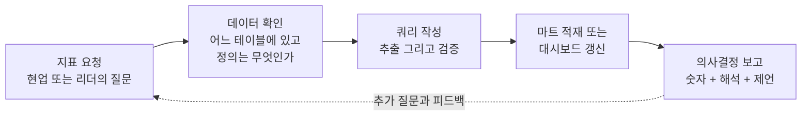
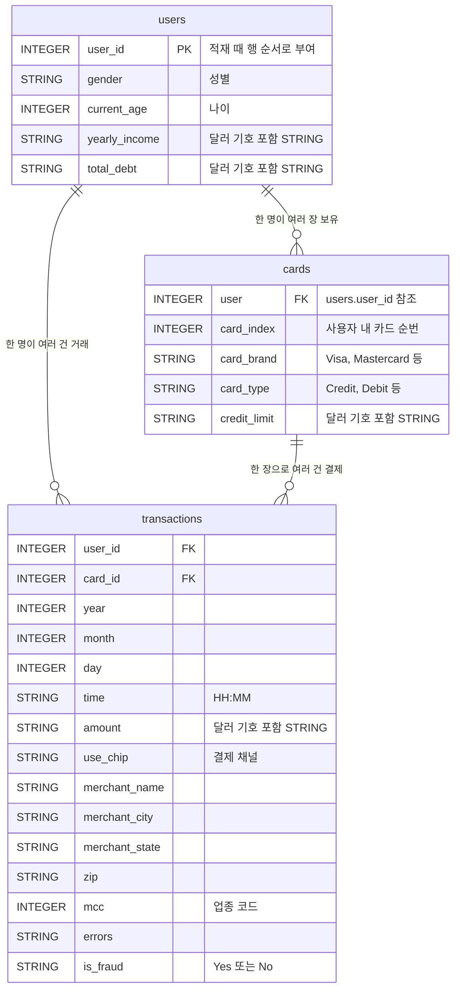
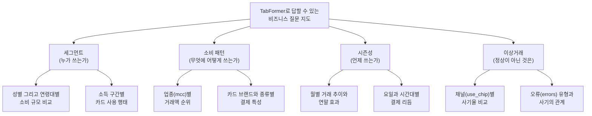

# FinDA 7주차 2일차 — 금융 데이터 분석 직무와 실습 데이터 소개

> 7주차 Day 2 (토, 3시간) 강의안. 금융권 데이터 분석 직무의 실제 모습을 이해하고, 실습 데이터(IBM TabFormer)를 실무 원천 데이터의 축소판으로 읽어낸 뒤, Day 1 기초 집계를 비즈니스 질문으로 한 단계 확장합니다.

---

## 오늘의 큰 그림

어제([Day 1 강의안](day1-lecture.md))는 BigQuery에 데이터를 올리고 간단한 집계까지 실행했습니다. 오늘은 잠시 손을 멈추고 두 가지 질문에 답합니다.

- (1) 이 기술을 배우면 실제로 어떤 일을 하게 되는가? (Session 2-1)
- (2) 우리가 다루는 이 데이터는 정확히 무엇이고, 무엇을 물어볼 수 있는 데이터인가? (Session 2-2)

그리고 마지막 세션에서 어제의 기초 집계를 "비즈니스 질문에 답하는 쿼리"로 확장합니다 (Session 2-3). 내일([Day 3 강의안](day3-lecture.md))의 데이터 마트 실습은 오늘 만든 질문들을 "매번 다시 짜지 않게 만드는 법"입니다.

### 시간표

| 구분 | 내용 | 시간 |
| --- | --- | --- |
| Session 2-1 | 금융 데이터 분석은 무슨 일을 하는가 | 50분 |
| 쉬는 시간 | | 10분 |
| Session 2-2 | 실습 데이터 자세히 알기 (IBM TabFormer) | 60분 |
| 쉬는 시간 | | 10분 |
| Session 2-3 | 실습과 리뷰 — 비즈니스 질문 4개 | 50분 |
| 합계 | | 180분 (3시간) |

---

## Session 2-1. 금융 데이터 분석은 무슨 일을 하는가 (50분)

### 1. 왜 직무 이야기부터 하는가 (5분)

SQL 문법은 검색하면 나옵니다. 검색해도 안 나오는 것은 "어떤 질문을 던져야 하는지"와 "누구를 위해 이 쿼리를 짜는지"입니다. 오늘 세션의 목표는 여러분이 실습 문제를 풀 때 "GROUP BY 연습"이 아니라 "카드사 마케팅팀 분석가의 화요일 오전 업무"로 느끼게 만드는 것입니다.

한 줄 정의부터 시작합니다.

> 금융 데이터 분석가는 "돈의 흐름 기록"을 근거로 회사의 의사결정 질문에 답하는 사람입니다.

### 2. 업권별 데이터 분석 지형 (10분)

같은 "데이터 분석가"라도 업권마다 보는 데이터와 답하는 질문이 다릅니다.

| 업권 | 핵심 데이터 | 대표 분석 질문 | 이번 실습과의 접점 |
| --- | --- | --- | --- |
| 카드사 | 승인 거래 내역, 가맹점 정보, 회원 정보 | 어떤 고객이 어디서 얼마를 쓰는가, 어떤 혜택을 설계할까 | TabFormer가 바로 이 형태 (거래 + 카드 + 회원) |
| 은행 | 수신과 여신 계좌, 이체 내역, 신용 정보 | 연체 위험은 누구에게 있는가, 주거래 고객은 누구인가 | users의 소득과 부채 컬럼이 축소판 |
| 증권사 | 주문과 체결 로그, 잔고, 시세 | 어떤 고객이 이탈하는가, 어떤 상품이 팔리는가 | 대용량 로그 처리 감각 (2,400만 행) |
| 핀테크 | 앱 이벤트 로그, 결제와 송금 내역 | 퍼널 어디서 이탈하는가, 사기 거래를 어떻게 막는가 | is_fraud 라벨, use_chip 채널 구분 |

강조할 것: 업권이 달라도 데이터의 뼈대는 놀랄 만큼 비슷합니다. "누가(고객) 무엇으로(계좌 또는 카드) 언제 어디서 얼마를(거래)"이라는 구조가 반복됩니다. 이 구조를 한 번 제대로 다뤄보면 업권을 옮겨도 통합니다.

### 3. 직무 유형 여섯 가지 (15분)

실제 채용 공고와 조직도에서 자주 보이는 여섯 가지 역할을 봅니다. 한 사람이 여러 역할을 겸하는 경우도 많습니다.

#### (1) BI와 지표 관리

- 하는 일: 회사의 핵심 지표(신규 회원 수, 거래액, 활성 고객 수)를 정의하고, 매일 또는 매주 갱신되는 대시보드로 만들어 운영합니다.
- 대표 질문: "이번 달 카드 이용액이 왜 빠졌는가? 어느 세그먼트에서 빠졌는가?"
- 쓰는 SQL: 날짜별 집계, 전월 대비 비교, 세그먼트별 분해. 오늘 실습 문제 2(월별 추이)가 이 역할의 축소판입니다.

#### (2) 마케팅 타겟팅과 캠페인 분석

- 하는 일: "이 혜택을 받으면 반응할 것 같은 고객" 목록을 조건으로 추출하고, 캠페인 후 반응률과 증분 효과를 측정합니다.
- 대표 질문: "지난 3개월간 온라인 쇼핑 업종에서 월 30만 원 이상 쓴 30대 고객은 몇 명인가?"
- 쓰는 SQL: WHERE 조건 조합, JOIN으로 고객 속성 붙이기, 기간 집계. 오늘 실습 문제 3(성별 소비 비교)이 타겟팅의 첫걸음입니다.

#### (3) CLV와 이탈 분석

- 하는 일: 고객 한 명이 생애 동안 가져다줄 가치(CLV)를 추정하고, 거래가 끊기기 전에 이탈 징후를 찾아냅니다.
- 대표 질문: "마지막 거래 후 90일이 지난 고객은 몇 명이고, 이들의 공통점은 무엇인가?"
- 쓰는 SQL: 고객 단위 집계(첫 거래일, 마지막 거래일, 누적 금액), 기간 비교.

#### (4) 신용 리스크와 심사

- 하는 일: 대출 또는 카드 발급 심사에 쓰이는 변수(소득 대비 부채, 연체 이력)를 만들고 검증합니다. 규제와 감사 대응 때문에 "숫자의 근거"를 가장 엄격하게 따지는 직무입니다.
- 대표 질문: "소득 대비 부채 비율이 높은 고객군의 한도 소진율은 어떻게 다른가?"
- 쓰는 SQL: 파생 변수 계산(CASE WHEN 구간화), 코호트 비교.

#### (5) FDS (이상거래 탐지)

- 하는 일: 사기 거래 패턴을 룰과 모델로 탐지합니다. 실시간 차단 룰과 사후 배치 분석이 함께 갑니다.
- 대표 질문: "오늘 새벽에 해외 온라인 거래가 갑자기 몰린 카드는 없는가?"
- 쓰는 SQL: 채널별 또는 시간대별 사기율 집계, 임계값 튜닝. 오늘 실습 문제 4(채널별 사기율)가 FDS 분석의 출발점입니다.

#### (6) 상품과 서비스 분석

- 하는 일: 새 카드 상품, 앱 기능, 혜택 구조의 성과를 측정하고 개선안을 제안합니다.
- 대표 질문: "새로 출시한 카드의 주 이용 업종이 기획 의도와 일치하는가?"
- 쓰는 SQL: 상품별 그리고 업종별 교차 집계. 오늘 실습 문제 1(업종별 거래액 Top 10)이 이 역할의 기본기입니다.

### 4. 분석가의 하루 — 업무 흐름 한 바퀴 (7분)

여섯 직무 모두 아래 흐름을 돕니다. 도구만 다를 뿐 순서는 같습니다.



예시 시나리오 (수업에서 구두로 풀어주기):

- (1) 화요일 오전, 마케팅팀장이 묻습니다. "지난달 온라인 결제가 줄었다는데 진짜인가요? 어느 고객층에서 줄었나요?"
- (2) 분석가는 먼저 데이터를 확인합니다. 거래 테이블에 채널 구분 컬럼이 있는지, "온라인"의 정의가 무엇인지. (우리 데이터라면 use_chip 컬럼)
- (3) 쿼리를 짜서 월별 그리고 채널별 거래액을 뽑고, 고객 속성을 JOIN해 연령대별로 분해합니다.
- (4) 매달 같은 질문이 나올 것 같으면, 일회성 쿼리가 아니라 마트 테이블 또는 대시보드로 만들어 둡니다. (내일 배울 내용)
- (5) "줄어든 건 사실이지만 특정 프로모션 종료 효과이며, 해당 세그먼트 재유치 캠페인을 제안한다"까지 써야 보고가 끝납니다.

핵심 메시지: 쿼리 작성은 다섯 단계 중 한 단계일 뿐입니다. 그러나 (2)와 (3)이 부실하면 (5)의 보고 전체가 무너집니다. 그래서 오늘 Session 2-2에서 데이터 자체를 한 시간 들여 뜯어봅니다.

### 5. 채용 공고의 "SQL 역량"은 무엇을 뜻하는가 (8분)

금융권 데이터 직무 공고에서 자주 보이는 문구를 실제 업무로 번역하면 다음과 같습니다.

| 공고 문구 | 실제로 요구하는 것 | 이번 주에 배우는 것과의 연결 |
| --- | --- | --- |
| "SQL을 활용한 대용량 데이터 추출 및 가공" | 수천만 행에서 필요한 것만 정확히, 그리고 비용을 의식하며 뽑는 능력 | 2,400만 행 transactions, 처리 바이트 확인 습관 |
| "지표 정의 및 대시보드 구축 경험" | 지표의 분자와 분모를 스스로 정의하고 일관되게 유지하는 능력 | 집계 기준(환불 포함 여부 등)을 명시하는 습관 |
| "현업 부서와 협업하여 비즈니스 문제 해결" | 모호한 질문을 쿼리 가능한 질문으로 바꾸는 능력 | 실습을 비즈니스 질문 형태로 훈련 |
| "데이터 마트 설계 및 운영 경험" | 반복 질문을 재사용 가능한 테이블 구조로 만드는 능력 | Day 3 전체 |
| "쿼리 성능 최적화 경험" | 같은 답을 더 적은 스캔으로 얻는 방법을 아는 것 | 이번 주 내내 처리 바이트 읽기, Day 3에서 심화 |

강조할 것: "SQL 가능"의 기준은 문법 암기가 아니라, (1) 질문을 쿼리로 번역하고 (2) 결과를 검증하고 (3) 결과를 한 문장의 해석으로 되돌리는 왕복 능력입니다. 이번 주 실습 리뷰에서 "해석 한 줄"을 계속 요구하는 이유입니다.

### 6. 학생 토론 (5분)

> **토론.** 여섯 직무(BI와 지표 관리, 마케팅 타겟팅, CLV와 이탈, 신용 리스크, FDS, 상품 분석) 중 지금 가장 끌리는 직무는 무엇입니까? 그 이유를 "내가 좋아하는 종류의 질문"의 관점에서 한 문장으로 말해 봅시다. (예: "왜?를 파고드는 게 좋아서 BI", "사람의 행동 패턴이 궁금해서 마케팅")

진행: 옆 사람과 2분 공유 후, 서너 명 전체 발표. 정답이 없는 토론이며, 9주차 최종 프로젝트 주제 선정의 씨앗이 됩니다.

---

쉬는 시간 (10분)

---

## Session 2-2. 실습 데이터 자세히 알기 — IBM TabFormer (60분)

### 1. 이 데이터는 어디서 왔는가 (8분)

- (1) 출처: IBM이 머신러닝 연구(TabFormer, 표 형태 데이터용 트랜스포머 모델)를 위해 공개한 **시뮬레이션 신용카드 거래 데이터**입니다. Kaggle의 "Credit Card Transactions (ealtman2019)" 데이터셋으로 배포됩니다.
- (2) 규모: 사용자 약 2,000명, 거래 약 2,400만 건, 기간 수십 년 치. 실습용으로는 "충분히 크지만 무료 한도 안"이라는 절묘한 크기입니다.
- (3) 시뮬레이션 데이터라는 한계를 분명히 알고 시작합니다.
    - 실제 사람의 거래가 아니므로 개인정보 이슈가 없고, 마음껏 쿼리해도 됩니다.
    - 대신 분포가 현실보다 매끈합니다. 실제 데이터의 지저분함(중복 적재, 시스템 장애로 인한 결측 구간, 포맷이 다른 과거 데이터)은 상당 부분 빠져 있습니다.
    - 사기 라벨(is_fraud)도 시뮬레이터가 심어 놓은 패턴입니다. 여기서 발견한 사기 패턴이 실제 카드사에서 그대로 통한다고 생각하면 안 됩니다.
- (4) 그럼에도 이 데이터를 쓰는 이유: 고객, 카드, 거래로 정규화된 3테이블 구조가 실제 카드사 데이터 웨어하우스의 뼈대와 같아서, JOIN과 세그먼트 분석과 마트 설계까지 하나의 도메인으로 관통할 수 있기 때문입니다.

### 2. 세 테이블의 역할과 관계 (12분)



역할로 다시 읽기 (내일 배울 용어의 예고편):

- (1) **transactions**는 "일어난 일"의 기록입니다. 한 행 = 카드 결제 한 건. 이런 테이블을 실무에서 팩트(fact) 테이블이라 부릅니다.
- (2) **users**와 **cards**는 "일어난 일을 설명해 주는 맥락"입니다. 누가, 어떤 카드로. 이런 테이블을 디멘전(dimension) 테이블이라 부릅니다.
- (3) 조인 경로는 두 개입니다.
    - transactions.user_id = users.user_id (고객 속성 붙이기)
    - transactions.user_id = cards.user **AND** transactions.card_id = cards.card_index (카드 속성 붙이기, 키가 두 개인 것에 주의)

> ⚠️ **컬럼 구성 캐비앗**: 위 컬럼 목록은 이 강의안 기준이며, 데이터셋 버전과 적재 방식(자동 감지 여부)에 따라 실제 컬럼명이 다를 수 있습니다 (예: 원본 헤더 `Yearly Income - Person`이 `Yearly_Income___Person`으로 적재됨). **반드시 본인 테이블의 Schema 탭에서 실제 컬럼명을 확인**하고 쿼리에 사용하세요. Day 1 적재를 마치지 못했다면 [Day 1 강의안](day1-lecture.md)를 먼저 완료해야 합니다.

> 📷 스크린샷 추가 예정: (BigQuery 콘솔에서 transactions 테이블 Schema 탭을 연 화면, 컬럼명과 타입이 보이도록)

### 3. 컬럼 사전 — 분석가의 눈으로 읽기 (12분)

#### transactions (약 2,400만 행)

| 컬럼 | 타입 | 의미 | 분석가 메모 |
| --- | --- | --- | --- |
| user_id | INTEGER | 거래한 사용자 | users와의 조인 키 |
| card_id | INTEGER | 사용한 카드의 사용자 내 순번 | cards.card_index와 짝 |
| year, month, day | INTEGER | 거래 날짜 (세 컬럼으로 분리) | DATE(year, month, day)로 합성해 사용 |
| time | STRING | 거래 시각 HH:MM | 시간대 분석 시 파싱 필요 |
| amount | STRING | 거래 금액, 예: $54.30 | **달러 기호 포함 문자열.** 집계 전 반드시 정제 |
| use_chip | STRING | 결제 채널 (칩, 스와이프, 온라인) | 채널별 분석과 사기율 비교의 축 |
| merchant_name | STRING | 가맹점 이름 (숫자 형태 식별자) | 실명이 아닌 시뮬레이션 식별자 |
| merchant_city, merchant_state, zip | STRING | 가맹점 위치 | 온라인 거래는 위치가 비어 있음 |
| mcc | INTEGER | 업종 코드 (Merchant Category Code) | 5411은 식료품점 같은 국제 표준 코드. 업종 분석의 핵심 축 |
| errors | STRING | 거래 오류 내역 | 대부분 비어 있음. 여러 오류가 콤마로 이어진 값도 존재 |
| is_fraud | STRING | 사기 여부 "Yes" 또는 "No" | **불리언이 아니라 문자열.** 비교 시 따옴표 필요 |

#### users (약 2,000명)

| 컬럼 (대표) | 타입 | 의미 | 분석가 메모 |
| --- | --- | --- | --- |
| user_id | INTEGER | 사용자 식별자 | **원본 CSV에는 없던 컬럼.** Day 1에서 행 순서(0부터)로 직접 부여해 적재함 |
| gender | STRING | 성별 | 세그먼트 축 |
| current_age | INTEGER | 현재 나이 | 연령대 구간화(CASE WHEN)에 사용 |
| yearly_income (계열) | STRING | 연 소득 | 달러 기호 포함 문자열, 정제 필요 |
| total_debt | STRING | 총 부채 | 달러 기호 포함 문자열, 정제 필요 |

#### cards

| 컬럼 (대표) | 타입 | 의미 | 분석가 메모 |
| --- | --- | --- | --- |
| user | INTEGER | 소유자 (users.user_id) | 컬럼명이 user_id가 아니라 user인 것에 주의 |
| card_index | INTEGER | 사용자 내 카드 순번 | transactions.card_id와 짝 |
| card_brand | STRING | Visa, Mastercard, Amex 등 | 브랜드별 비교 축 |
| card_type | STRING | Credit, Debit 등 | 상품 분석 축 |
| credit_limit | STRING | 카드 한도 | 달러 기호 포함 문자열, 정제 필요 |

### 4. 실제 카드사 데이터와 무엇이 같고 무엇이 없는가 (10분)

| 구분 | TabFormer에 있는 것 | 실제 카드사에는 더 있는 것 |
| --- | --- | --- |
| 거래 | 승인 거래 단위 기록, 금액, 가맹점, 업종 코드 | 승인과 매입(정산)의 분리, 취소와 부분취소 체인, 할부 개월 정보 |
| 고객 | 성별, 나이, 소득, 부채 | 신용 등급, 상품 가입 이력, 상담과 민원 이력, 앱 행동 로그 |
| 카드 | 브랜드, 종류, 한도 | 발급 경로, 부가 혜택 구조, 연회비, 정지와 해지 상태 이력 |
| 사기 | is_fraud 라벨 (건별 확정 라벨) | 신고와 조사 과정의 시차, 라벨이 확정되기까지 수 주가 걸리는 현실 |
| 규모와 형태 | 2,400만 행, 잘 정리된 3테이블 | 수십억 행, 수백 개 테이블, 코드값 사전 없이는 못 읽는 컬럼들 |

두 가지를 기억하세요.

- (1) **구조는 진짜와 같습니다.** "고객, 수단, 거래"의 3층 구조와 MCC 업종 코드는 실무 그대로입니다. 여기서 익힌 조인 경로와 질문 방식은 현업에서 재사용됩니다.
- (2) **디테일은 축소판입니다.** 특히 라벨(is_fraud)이 즉시 그리고 완벽하게 주어지는 것은 시뮬레이션의 특혜입니다. 실무에서는 라벨 자체를 만드는 일이 분석 업무의 절반입니다.

### 5. 데이터 품질 특성 — "실무 원천 데이터도 이렇다" (10분)

Day 1에서 이미 마주친 특성들을 "왜 이렇게 생겼는가"의 관점으로 다시 봅니다. 이것은 이 데이터의 결함이 아니라, **원천 데이터의 보편적인 모습**입니다.

- (1) **amount가 달러 기호 포함 문자열입니다.** 원천 시스템은 사람이 읽기 좋은 형태로 값을 남기는 경우가 많습니다. 분석 전에 숫자로 바꾸는 정제는 분석가의 일상 업무입니다. 함께 실행해 봅시다 (개념 확인용 데모 쿼리, `YOUR_PROJECT`는 본인 프로젝트 ID로 교체).

    ```sql
    -- 데모: 문자열 금액을 숫자로 정제하기 (전과 후 비교)
    SELECT
        t.amount                                             AS raw_amount,
        SAFE_CAST(REPLACE(t.amount, "$", "") AS NUMERIC)     AS clean_amount
    FROM
        `YOUR_PROJECT.tabformer.transactions` AS t
    LIMIT 10;
    ```

    SAFE_CAST를 쓰는 이유: 변환 불가능한 값을 만나면 CAST는 쿼리 전체를 실패시키지만, SAFE_CAST는 그 행만 NULL로 만들고 계속 갑니다. 2,400만 행에서 어떤 값이 숨어 있을지 모를 때의 방어 운전입니다.

- (2) **금액에 음수가 있습니다.** 환불 또는 취소 거래입니다. 함께 확인해 봅시다.

    ```sql
    -- 데모: 음수 금액(환불) 거래가 실제로 존재하는지 확인
    SELECT
        t.amount,
        t.merchant_name,
        DATE(t.year, t.month, t.day) AS tx_date
    FROM
        `YOUR_PROJECT.tabformer.transactions` AS t
    WHERE
        SAFE_CAST(REPLACE(t.amount, "$", "") AS NUMERIC) < 0
    LIMIT 10;
    ```

    분석가의 질문: "총 거래액"을 구할 때 환불을 빼고 볼 것인가 포함할 것인가? 정답은 없고, **지표 정의를 명시하는 것**이 정답입니다. 매출 성과라면 환불을 반영하고, 소비 활동량이라면 절대값 또는 양수만 볼 수도 있습니다. 오늘 실습에서는 "환불 포함(있는 그대로 합산)"을 기본으로 합니다.

- (3) **users에는 원래 조인 키가 없었습니다.** 원본 CSV는 행 순서(0부터)가 곧 사용자 번호라는 암묵적 규칙을 갖고 있었고, Day 1에서 pandas로 user_id를 부여한 뒤 적재했습니다. 이것도 실무의 흔한 풍경입니다. 원천 시스템 담당자에게는 당연한 규칙이 문서화되지 않은 채 전달되고, 분석가가 그 규칙을 놓치면 **조용히 틀린 조인**이 만들어집니다. 에러가 나는 실수보다 에러 없이 틀리는 실수가 무섭습니다.

- (4) **errors와 is_fraud는 문자열입니다.** errors는 대부분 빈 값이고, 가끔 "Bad PIN,Insufficient Balance"처럼 여러 오류가 콤마로 이어져 있습니다. is_fraud는 "Yes" 또는 "No" 문자열이라 `t.is_fraud = "Yes"`처럼 따옴표로 비교해야 합니다. 원천 시스템의 코드값이 불리언 대신 문자열로 오는 일은 흔하며, 값의 종류(도메인)를 먼저 세어 보는 습관이 필요합니다.

    ```sql
    -- 데모: 컬럼에 어떤 값이 몇 건씩 있는지 세어 보기 (값 도메인 확인)
    SELECT
        t.is_fraud,
        COUNT(*) AS cnt
    FROM
        `YOUR_PROJECT.tabformer.transactions` AS t
    GROUP BY
        t.is_fraud;
    ```

### 6. 이 데이터로 답할 수 있는 비즈니스 질문 지도 (8분)

세 테이블을 조합하면 네 방향의 질문에 답할 수 있습니다. 이 지도가 오늘 실습과 Day 3 마트 설계, 그리고 최종 프로젝트 주제의 출발점입니다.



읽는 법: 왼쪽 두 축(세그먼트, 소비 패턴)은 마케팅과 상품 분석의 영역이고, 시즌성은 BI와 지표 관리, 이상거래는 FDS의 영역입니다. Session 2-1에서 본 직무 지형이 그대로 질문 지도가 됩니다. 오늘 실습 4문제는 이 지도에서 하나씩 뽑았습니다.

---

쉬는 시간 (10분)

---

## Session 2-3. 실습과 리뷰 — 비즈니스 질문 4개 (50분)

### 진행 안내 (5분)

- (1) 실습 20분: 아래 4문제를 순서대로 풉니다. 문제마다 힌트가 있으니 막히면 힌트부터 보세요. 4번까지 못 가도 괜찮습니다 (3번까지가 기본 목표, 4번은 도전 문제).
- (2) 짝 리뷰 12분: 옆 사람과 쿼리를 비교합니다 (체크리스트 아래 제공).
- (3) 전체 리뷰 8분: 자주 나오는 실수를 함께 봅니다. 정답 쿼리는 리뷰 시간에 강사 화면으로 공개합니다.
- (4) Day 3 예고 5분.

공통 규칙:

- 테이블은 `YOUR_PROJECT.tabformer.transactions` 형태로 참조하고, `YOUR_PROJECT`는 본인 프로젝트 ID로 교체합니다.
- 금액은 `SAFE_CAST(REPLACE(amount, "$", "") AS NUMERIC)` 패턴으로 정제해 사용합니다 (Session 2-2 데모 참고).
- 쿼리 실행 전 우측 상단의 예상 처리 바이트를 한 번씩 확인하는 습관을 들이세요.

### 실습 문제 (20분)

#### 문제 1. 우리 고객은 어느 업종에서 돈을 가장 많이 쓰는가?

카드사 상품기획팀이 새 카드의 주력 혜택 업종을 정하려 합니다. **전체 기간에서 거래액 합계가 가장 큰 업종(mcc) Top 10**을 뽑아 주세요.

- 기대 결과 형태: mcc, 거래 건수, 거래액 합계 — 거래액 내림차순 10행
- 힌트:
    - (1) 업종 축은 mcc 컬럼 하나로 충분합니다 (GROUP BY 대상).
    - (2) 거래액 합계는 정제된 금액에 SUM을 씌웁니다.
    - (3) 정렬(ORDER BY)과 LIMIT으로 Top 10을 만듭니다.
    - (4) mcc는 숫자 코드라 결과만 보면 업종명을 알 수 없습니다. 결과의 상위 코드 한두 개를 검색해 어떤 업종인지 확인해 보세요 (예: 5411). 코드에 이름을 붙이는 일은 Day 3에서 다룹니다.

#### 문제 2. 연말에는 정말 소비가 늘어날까?

BI팀이 월간 리포트의 "시즌성" 페이지를 만들려 합니다. **2018년의 월별 거래 건수와 거래액 추이**를 뽑고, 어느 달이 가장 크고 작은지 확인해 주세요.

- 기대 결과 형태: month, 거래 건수, 거래액 합계 — 1월부터 12월까지 12행
- 힌트:
    - (1) 연도 필터는 WHERE 절에서 year 컬럼으로 겁니다 (날짜 합성 없이도 가능합니다).
    - (2) month로 GROUP BY 합니다.
    - (3) 결과를 month 순서로 정렬해야 추이로 읽힙니다.
    - (4) 다 풀었다면 스스로에게 물어보세요. 12월이 컸다면 그것은 "선물 시즌" 때문일까요? 어떤 업종이 끌어올렸는지 문제 1과 조합하면 확인할 수 있습니다 (선택 심화).

#### 문제 3. 성별에 따라 소비 규모가 다른가? (JOIN 도전)

마케팅팀이 성별 타겟 캠페인의 근거 자료를 요청했습니다. **성별로 거래 건수, 평균 결제 금액, 거래액 합계**를 비교해 주세요.

- 기대 결과 형태: 성별, 거래 건수, 평균 결제 금액, 거래액 합계 — 성별 수만큼의 행
- 힌트:
    - (1) 성별은 users 테이블에 있으므로 transactions와 JOIN이 필요합니다. 조인 키는 `t.user_id = u.user_id` 하나입니다.
    - (2) users의 성별 컬럼 실제 이름은 본인 테이블의 Schema 탭에서 확인하세요 (적재 방식에 따라 대소문자 등이 다를 수 있습니다).
    - (3) JOIN 뒤에 GROUP BY는 성별 컬럼으로 합니다. 평균은 AVG, 합계는 SUM입니다.
    - (4) 검증 포인트: JOIN 후 전체 거래 건수 합이 약 2,400만에서 크게 벗어나지 않는지 확인하세요. 크게 다르면 조인 키 문제입니다 (Day 1의 user_id 부여를 건너뛰었을 가능성).
    - (5) 시간이 남으면 성별 대신 연령대(current_age를 10세 단위 구간으로)로 바꿔 보세요 (CASE WHEN 활용, 선택 심화).

#### 문제 4. 온라인 거래는 정말 사기가 더 많을까? (도전 문제)

FDS팀 온보딩 첫 과제라고 생각해 봅시다. **결제 채널(use_chip)별 거래 건수, 사기 건수, 사기율(%)**을 구해 어느 채널이 가장 위험한지 확인해 주세요.

- 기대 결과 형태: use_chip, 거래 건수, 사기 건수, 사기율 — 사기율 내림차순
- 힌트:
    - (1) JOIN이 필요 없습니다. transactions만으로 풉니다.
    - (2) 사기 건수는 조건에 맞는 행만 세는 집계가 필요합니다. BigQuery의 `COUNTIF(조건)` 함수가 편리합니다 (`COUNT(*)`는 전체, COUNTIF는 조건 충족분만).
    - (3) is_fraud는 문자열이므로 조건은 `t.is_fraud = "Yes"` 형태입니다.
    - (4) 사기율은 (사기 건수 / 전체 건수) x 100입니다. 백분율 숫자가 아주 작게 나오는 것이 정상입니다 — 사기는 원래 희귀합니다.

### 짝 리뷰 (12분)

옆 사람과 서로의 쿼리를 화면으로 보여주며 아래 체크리스트를 함께 점검합니다. 목적은 정답 맞히기가 아니라 **"같은 질문에 다른 쿼리"를 구경하는 것**입니다.

- (1) 결과 행 수와 최상위 값이 서로 일치하는가? 다르다면 어디서 갈라졌는가? (필터 조건, 정제 방식, 조인 키 순서로 의심)
- (2) 금액 정제를 어디서 했는가? (SELECT에서 매번 반복 또는 다른 방식 — 반복이 번거로웠다면 그 불편함을 기억해 두세요. Day 3에서 해결합니다)
- (3) GROUP BY 축과 SELECT 컬럼이 서로 맞는가? (집계 함수 밖의 컬럼은 모두 GROUP BY에 있어야 합니다)
- (4) 처리 바이트는 서로 비슷한가? SELECT * 를 쓴 쪽이 있다면 얼마나 차이 나는가?
- (5) 마지막으로 서로에게 묻기: "이 결과로 팀장에게 보고한다면 첫 문장은?" — 숫자가 아니라 해석 한 줄을 말해 봅니다.

### 자주 나오는 실수 미리보기 (8분)

리뷰하면서 아래 실수가 없었는지 확인합니다. (구체적 정답 쿼리는 강사 화면으로 공개)

- (1) **달러 정제 누락**: amount를 그대로 SUM하면 문자열이라 타입 오류가 나거나, CAST만 쓰면 쿼리가 통째로 실패할 수 있습니다. 오늘의 1순위 실수입니다.
- (2) **is_fraud를 불리언처럼 비교**: `is_fraud = TRUE`는 동작하지 않습니다. 문자열 "Yes"와 비교해야 합니다.
- (3) **GROUP BY 불일치 오류**: SELECT에 쓴 비집계 컬럼이 GROUP BY에 빠지면 BigQuery가 에러를 냅니다. 에러 메시지를 읽으면 어느 컬럼인지 알려 줍니다.
- (4) **정렬 없는 Top N**: LIMIT만 쓰고 ORDER BY를 빼면 "아무 10행"이 나옵니다. Top 10은 반드시 정렬과 함께입니다.
- (5) **조인 후 건수 검증 생략**: JOIN이 성공적으로 실행됐다는 것과 올바르게 조인됐다는 것은 다릅니다. 조인 전후 행 수 비교는 실무의 기본 검증 절차입니다.
- (6) **SELECT * 습관**: 결과는 같아도 처리 바이트가 커집니다. 필요한 컬럼만 부르는 습관이 비용 감각의 시작입니다.

### Day 3 예고 (5분)

오늘 4문제를 풀면서 전원이 같은 코드를 반복했습니다. `SAFE_CAST(REPLACE(...))` 정제, 날짜 합성, 조인 경로. 매번 다시 쓰는 대신, **미리 정제되고 조인된 분석 전용 테이블을 한 번 만들어 두면** 어떨까요? 그것이 내일 배울 **데이터 마트**입니다. 오늘 짝 리뷰에서 느낀 "반복의 불편함"이 내일 수업의 출발점입니다. 자세한 내용은 [Day 3 강의안](day3-lecture.md)에서 다룹니다.

---

오늘의 핵심 교훈 한 줄: **"쿼리는 다섯 단계 업무의 한 조각이다 — 데이터를 알고, 질문을 번역하고, 숫자를 해석까지 해야 분석이 끝난다."**
