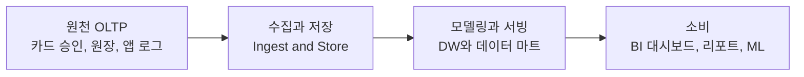
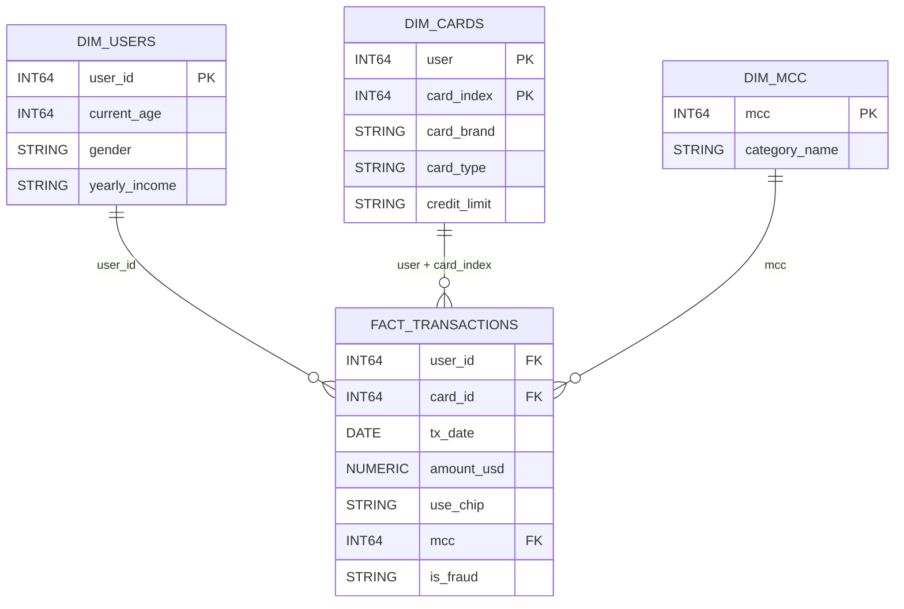
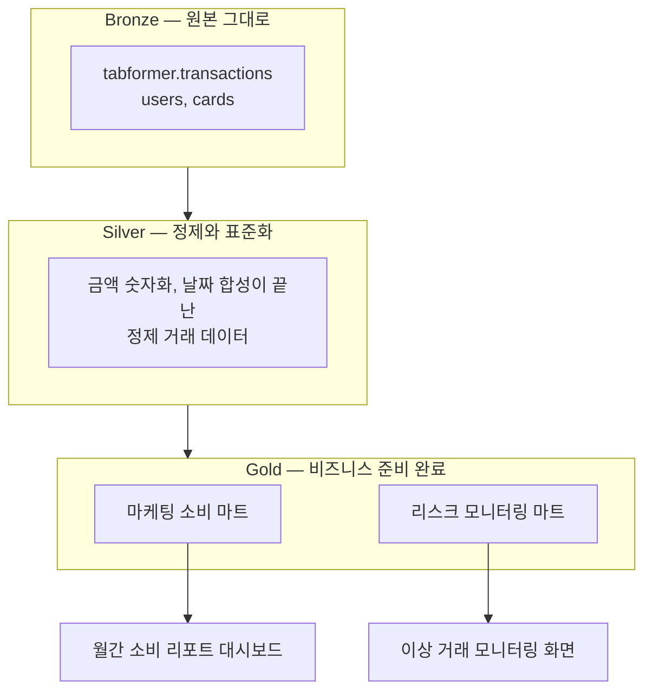
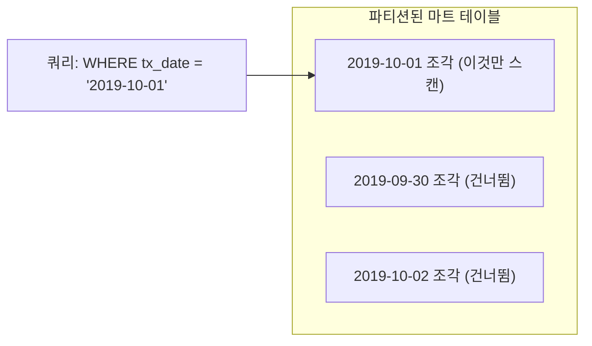
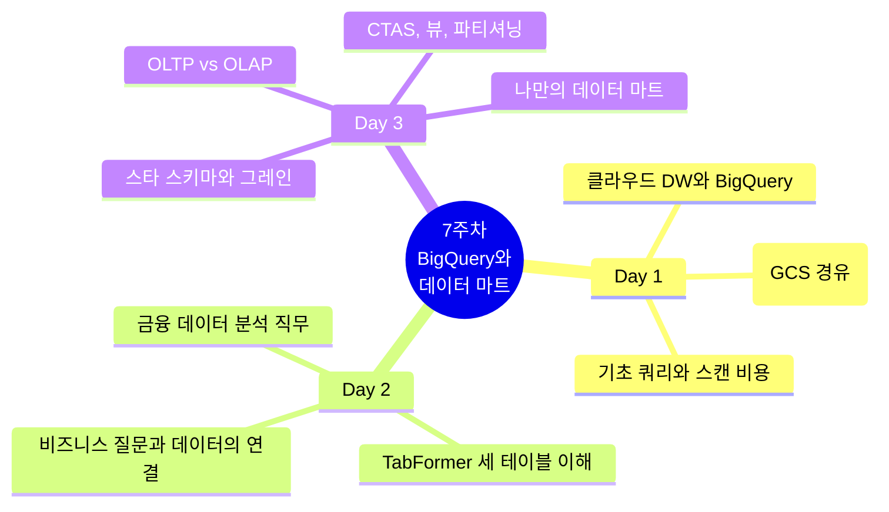

# FinDA 7주차 3일차 — 데이터 마트 설계와 구축

> 7주차 마지막 날(일, 3시간) 강의안. 데이터 모델링 개념부터 BigQuery 위에 실제 데이터 마트를 만드는 실습까지, "쿼리를 잘 짜는 사람"에서 "분석 기반을 설계하는 사람"으로 넘어가는 날입니다.

---

## 오늘의 개요

| 구분 | 시간 | 내용 |
| --- | --- | --- |
| Session 3-1 | 50분 | 데이터 모델링과 데이터 마트 개념 |
| 쉬는 시간 | 5분 | |
| Session 3-2 | 60분 | BigQuery로 데이터 마트 만들기 |
| 쉬는 시간 | 5분 | |
| Session 3-3 | 60분 | 실습(20분), 결과 공유, 일주일 회고, 다음 주 예고 |
| 합계 | 180분 (3시간, 쉬는 시간 포함) | |

### 오늘의 학습 목표

- (1) 원본 테이블 직접 조회의 세 가지 문제(비용, 로직 불일치, 속도)를 설명하고, 데이터 마트가 이를 어떻게 해결하는지 말할 수 있다.
- (2) OLTP와 OLAP, 정규화와 비정규화, 팩트와 디멘전, 그레인 개념으로 테이블 설계를 논의할 수 있다.
- (3) BigQuery에서 CTAS와 뷰로 가공 결과를 저장하고, 파티셔닝으로 스캔 비용을 줄일 수 있다.
- (4) 비즈니스 요구를 받아 그레인을 정의하고, 그 요구에 답하는 마트를 직접 설계하고 구축할 수 있다.

### 오늘 시작 전 확인 사항

- (1) [Day 1 강의안](day1-lecture.md)에서 적재한 `tabformer` 데이터셋(transactions, users, cards)이 본인 프로젝트에 살아 있는지 확인하세요.
- (2) [Day 2 강의안](day2-lecture.md)에서 다룬 세 테이블의 컬럼 의미와 조인 키를 기억해 두세요. 오늘은 그 테이블들을 "재료"로 씁니다.
- (3) 쿼리 편집기 우측 상단의 "이 쿼리를 실행하면 N 처리됨" 표시를 오늘 하루 종일 봅니다. 오늘의 주인공 중 하나입니다.

오늘의 큰 그림 한 줄: 지난 이틀은 "데이터를 올리고 이해하는 날"이었고, 오늘은 **"매일 반복될 분석을 미리 준비해 두는 날"**입니다.

---

## Session 3-1. 데이터 모델링과 데이터 마트 개념 (50분)

### 1-1. 도입: 왜 원본 테이블에 매번 쿼리하면 안 되는가 (8분)

가상의 상황으로 시작합니다.

> 마케팅팀이 매주 월요일마다 묻습니다. "지난주 연령대별 소비 금액 좀 주세요." 여러분은 매주 월요일 아침, 2,400만 행짜리 `transactions`에 같은 쿼리를 다시 돌립니다. 옆자리 동료도 같은 요청을 받아서 자기 방식대로 또 돌립니다. 그런데 두 사람의 숫자가 다릅니다.

이 상황에는 세 가지 문제가 숨어 있습니다.

| 문제 | 설명 | TabFormer에서의 예 |
| --- | --- | --- |
| (1) 반복 스캔 비용 | BigQuery는 스캔한 바이트만큼 과금됩니다. 같은 2.4GB를 매주 다시 읽는 것은 같은 돈을 매주 다시 내는 것입니다. 실무 데이터는 수 TB 단위라 잘못 짠 반복 쿼리 하나가 수백 달러가 되기도 합니다. | 매주 `transactions` 전체를 다시 집계 |
| (2) 로직 불일치 | 정제 로직이 사람마다 다르면 "같은 질문에 다른 숫자"가 나옵니다. 리포트 신뢰가 무너지는 가장 흔한 경로입니다. | A는 `SAFE_CAST(REPLACE(amount, "$", ""))`로 정제하고, B는 환불(음수)을 빼고 집계하면 두 리포트의 합계가 달라짐 |
| (3) 속도 | 2,400만 행 집계는 몇 초에서 수십 초. 대시보드가 열릴 때마다 이 쿼리가 돈다면 아무도 그 대시보드를 열지 않습니다. | 원본 직결 대시보드의 로딩 지연 |

해결의 방향은 하나입니다. **자주 묻는 질문의 답을 미리 계산해서 작은 테이블로 저장해 두는 것.** 그 작은 테이블이 오늘 배울 데이터 마트입니다.

한 가지 관점 전환도 함께 가져갑니다. 데이터 모델링은 "테이블을 만드는 기술"이 아니라 **"비즈니스 질문에 답하는 과정"**입니다. 어떤 질문에 답해야 하는가, 데이터는 어디서 오는가, 누가 어떤 패턴으로 조회하는가 — 이 질문들에 답하다 보면 테이블 구조는 따라 나옵니다.

### 1-2. OLTP vs OLAP: 분석은 운영 DB에서 하지 않는다 (8분)

실무 데이터는 카드 승인 시스템, 계정계 원장 같은 **운영 시스템(OLTP)**에서 태어납니다. 그런데 분석은 그 위에서 직접 하지 않습니다. 이런 흐름을 거칩니다.



| 구분 | OLTP (운영) | OLAP (분석) |
| --- | --- | --- |
| 목적 | 거래를 빠짐없이 기록 | 쌓인 데이터에서 통찰 추출 |
| 대표 작업 | 한 건 INSERT 또는 UPDATE | 수백만 행 GROUP BY |
| 최적화 방향 | 쓰기, 정합성 | 읽기, 집계 속도 |
| 대표 시스템 | MySQL, PostgreSQL, Oracle | BigQuery, Snowflake, Redshift |
| 설계 경향 | 정규화 | 비정규화 |

분석 쿼리를 운영 DB에 직접 날리면 어떻게 될까요? 결제 승인 처리를 하던 DB가 우리의 GROUP BY 때문에 느려집니다. 그래서 분석용 사본을 별도 시스템(클라우드 DW, 우리에게는 BigQuery)으로 옮겨서 분석합니다. 1일차에 CSV를 BigQuery로 "적재"한 것이 사실은 이 파이프라인의 축소판이었습니다.

### 1-3. 정규화 vs 비정규화: 중복은 실수가 아니라 선택이다 (8분)

- (1) **정규화**: 중복을 없애고 테이블을 잘게 나누는 설계. 수정이 쉽고 정합성이 좋아 OLTP에 적합합니다. 대신 분석하려면 조인이 늘어납니다.
- (2) **비정규화(역정규화)**: 분석 쿼리를 단순하게 만들기 위해 **의도적으로 정보를 중복**시키는 설계. 예를 들어 거래 요약 테이블에 `card_brand`나 연령대를 미리 붙여 두면, 매번 users와 cards를 조인하지 않아도 됩니다.

핵심은 "중복 = 나쁨"이 아니라 **"중복 = 트레이드오프"**라는 관점입니다.

| 상황 | 선택 | 이유 |
| --- | --- | --- |
| 거래를 기록하는 운영 시스템 | 정규화 | 고객 주소가 바뀌면 한 곳만 고치면 됨 |
| 매일 조회하는 분석 테이블 | 비정규화 | 조인 없이 바로 집계, 쿼리 단순, 로직 통일 |

TabFormer가 users, cards, transactions 세 테이블로 나뉘어 있는 것이 정규화된 모습이고, 오늘 우리가 만들 마트는 그 반대 방향(분석을 위한 비정규화)으로 가는 작업입니다.

### 1-4. 스타 스키마: 팩트, 디멘전, 그리고 그레인 (12분)

분석용 테이블 설계의 표준 문법이 **차원 모델링(스타 스키마)**입니다.

- (1) **팩트 테이블(Fact)**: 측정값과 이벤트. "얼마를, 언제, 몇 건" — 숫자가 사는 곳입니다.
- (2) **디멘전 테이블(Dimension)**: 설명과 맥락. "누가, 어떤 카드로, 어떤 업종에서" — 팩트를 잘라 보는 기준입니다.
- (3) 팩트를 가운데 두고 디멘전들이 별처럼 둘러싼 모양이라 스타 스키마라고 부릅니다.

우리가 이미 갖고 있는 TabFormer를 스타 스키마의 눈으로 다시 그려 봅시다.



보이시나요? transactions가 팩트, users와 cards와 업종 매핑이 디멘전입니다. 우리는 이미 스타 스키마 위에서 이틀을 보냈습니다. 이름을 몰랐을 뿐입니다.

**그레인(Grain)** — 오늘 가장 중요한 단어입니다.

> 그레인 = "이 테이블의 한 행(one row)은 무엇을 나타내는가"에 대한 답.

- (1) `transactions`의 그레인: 한 행 = 카드 결제 1건
- (2) 잠시 후 만들 마트의 그레인: 한 행 = 어떤 사용자의 어떤 하루
- (3) 실습에서 만들 마트의 그레인: 여러분이 직접 정합니다

팩트 테이블을 설계할 때는 **컬럼보다 그레인을 먼저** 정합니다. 그레인이 정해지면 어떤 컬럼이 들어갈 수 있고 없는지가 자동으로 정리됩니다. 그레인이 흐린 테이블은 반드시 나중에 "이 합계, 뭘 더한 거지?"라는 질문으로 돌아옵니다.

### 1-5. 데이터 웨어하우스, 데이터 마트, 대시보드의 관계 (8분)

용어를 정리합니다. 셋은 경쟁 관계가 아니라 층(layer) 관계입니다.

| 용어 | 무엇인가 | 범위 | 예 |
| --- | --- | --- | --- |
| 데이터 웨어하우스(DW) | 전사의 분석용 데이터를 모아 두는 통합 저장소 | 회사 전체 | BigQuery 프로젝트 전체 |
| 데이터 마트 | DW 안에서 특정 주제나 팀을 위해 미리 가공해 둔 테이블 묶음 | 주제 또는 부서 단위 | 마케팅용 월별 소비 마트 |
| 대시보드 | 마트를 시각화해 소비하는 최종 화면 | 질문 단위 | 월간 소비 리포트 화면 |

실무에서 자주 쓰는 정리 방식이 **메달리온 아키텍처**입니다. 데이터를 가공 단계에 따라 Bronze(원본 그대로), Silver(정제와 표준화), Gold(비즈니스에 바로 쓸 수 있는 상태)로 나눕니다.



여기서 자주 나오는 오해 하나: "메달리온과 스타 스키마 중 뭘 써야 하나요?" — 둘은 서로 다른 문제를 풉니다. 메달리온은 **가공 단계**를 조직하는 방법이고, 차원 모델링(스타 스키마)은 **분석 데이터를 비즈니스 프로세스 중심으로** 조직하는 방법입니다. 보통 Gold 층 안에 스타 스키마 형태의 마트가 놓입니다. 공존하는 관계입니다.

2일차에 본 직무들과 연결하면: 분석가와 마케터는 Gold(마트)의 소비자이고, 데이터 엔지니어와 분석 엔지니어는 Bronze에서 Gold로 가는 길을 만드는 사람입니다. 오늘 여러분은 후자의 일을 직접 해 봅니다.

### 1-6. 토론: 면접 질문으로 생각 넓히기 (6분)

실제 데이터 엔지니어 면접에 나오는 질문 세 개를 던집니다. 정답을 맞히는 것보다, 어떤 되물음을 던지는지가 포인트입니다. 옆 사람과 2분씩 이야기해 보세요.

- (1) **"어제까지 10억 행이던 테이블에 오늘 1천만 행이 추가되었다. 리포트를 갱신하려면 10억 1천만 행을 매번 전부 재처리해야 하는가?"** — 직관적으로 "아니요"라고 답하고 싶다면, 그 "새로 온 것만 처리하기"를 어떻게 구현할지가 다음 세션의 갱신 전략 이야기입니다.
- (2) **"우리 팀도 스타 스키마를 도입해야 할까요?"라는 질문에 시니어는 바로 답하지 않고 되묻는다. 무엇을 되물을까?** — "어떤 분석 질문에 답하려 하는가, 그레인은 무엇인가, 소비자의 쿼리 패턴은 무엇인가." 도구보다 요구사항이 먼저라는 사고방식입니다.
- (3) **"메달리온 아키텍처와 차원 모델링은 경쟁 관계인가?"** — 방금 본 것처럼 아닙니다. 하나는 가공 단계의 조직화, 하나는 비즈니스 프로세스 중심의 조직화. 면접에서 이 구분을 말할 수 있으면 개념을 암기한 사람과 이해한 사람이 갈립니다.

---

## 쉬는 시간 (5분)

---

## Session 3-2. BigQuery로 데이터 마트 만들기 (60분)

이번 세션의 쿼리는 모두 **개념 설명용 데모**입니다. 강사 화면을 따라 함께 실행합니다. `YOUR_PROJECT`는 본인 프로젝트 ID로 바꿔서 실행하세요.

### 2-1. 데이터셋 분리와 네이밍 관례 (8분)

마트를 만들기 전에, 어디에 만들지부터 정합니다. 실무에서는 가공 단계별로 데이터셋(스키마)을 분리하는 관례가 있습니다.

| 데이터셋 | 역할 | 우리 실습에서 |
| --- | --- | --- |
| `raw` 또는 `src` | 원본을 손대지 않고 보관 (Bronze) | `tabformer` (1일차에 만든 것) |
| `stg` (staging) | 정제와 표준화 중간 단계 (Silver) | 오늘은 뷰로 대체 |
| `mart` | 분석용 최종 테이블 (Gold) | `tabformer_mart` (지금 만들 것) |

원칙은 하나입니다. **원본은 읽기 전용으로 두고, 가공물은 별도 공간에.** 원본과 가공물이 한 데이터셋에 섞이면 "이거 지워도 되는 테이블인가?"를 아무도 답할 수 없게 됩니다.

콘솔에서 함께 만듭니다.

- (1) Explorer에서 프로젝트 옆 점 세 개 → "데이터셋 만들기"
- (2) 데이터셋 ID: `tabformer_mart`
- (3) 위치(Location): **`tabformer` 데이터셋과 동일하게** (다르면 교차 참조 쿼리가 실패합니다)

> 📷 스크린샷 추가 예정: (tabformer_mart 데이터셋 만들기 화면, 위치 설정 강조)

테이블 이름에도 관례가 있습니다. 정답은 없지만 팀 안에서 일관되게 씁니다.

- (1) 집계 마트: `daily_user_tx`, `monthly_age_mcc_spend`처럼 그레인이 이름에 드러나게
- (2) 뷰: `v_` 접두어 (예: `v_transactions_clean`)
- (3) 피해야 할 이름: `temp`, `test2`, `final_final` — 3개월 뒤의 나는 남입니다

### 2-2. CTAS: 쿼리 결과를 테이블로 저장하기 (10분)

지금까지는 SELECT 결과를 화면으로만 봤습니다. 그 결과를 테이블로 저장하는 문법이 **CTAS(CREATE TABLE AS SELECT)**입니다.

```sql
CREATE TABLE `YOUR_PROJECT.tabformer_mart.smoke_test` AS
SELECT
    t.user_id,
    COUNT(*) AS tx_cnt
FROM `YOUR_PROJECT.tabformer.transactions` AS t
GROUP BY t.user_id;
```

이 문법의 문제: 같은 문장을 다시 실행하면 "이미 테이블이 있습니다" 오류가 납니다. 그래서 마트 작업에서는 거의 항상 이렇게 씁니다.

```sql
CREATE OR REPLACE TABLE `YOUR_PROJECT.tabformer_mart.smoke_test` AS
SELECT
    t.user_id,
    COUNT(*) AS tx_cnt
FROM `YOUR_PROJECT.tabformer.transactions` AS t
GROUP BY t.user_id;
```

- (1) `CREATE OR REPLACE`는 "있으면 통째로 갈아 끼우고, 없으면 새로 만든다"입니다. 재실행해도 안전하므로(멱등성) 매일 반복 실행하는 마트 갱신의 기본형이 됩니다.
- (2) 대신 REPLACE는 기존 테이블을 **통째로 덮어씁니다.** 원본 데이터셋(`tabformer`)이 아니라 마트 데이터셋에만 쓰는 이유이기도 합니다.

확인했으면 연습용 테이블은 지웁니다.

```sql
DROP TABLE `YOUR_PROJECT.tabformer_mart.smoke_test`;
```

### 2-3. 뷰 vs 테이블: 언제 무엇을 쓰는가 (10분)

마트를 "저장"하는 방법이 테이블만 있는 것은 아닙니다. **뷰(View)**는 쿼리 자체를 이름 붙여 저장하는 것입니다. 데이터는 저장되지 않고, 뷰를 조회할 때마다 원본에 쿼리가 다시 실행됩니다.

1-1에서 본 "로직 불일치" 문제를 뷰로 풀어 봅시다. 금액 정제와 날짜 합성을 **한 곳에만** 정의합니다.

```sql
CREATE OR REPLACE VIEW `YOUR_PROJECT.tabformer_mart.v_transactions_clean` AS
SELECT
    t.user_id,
    t.card_id,
    DATE(t.year, t.month, t.day) AS tx_date,
    t.time AS tx_time,
    SAFE_CAST(REPLACE(t.amount, "$", "") AS NUMERIC) AS amount_usd,
    t.use_chip,
    t.merchant_name,
    t.merchant_city,
    t.merchant_state,
    t.mcc,
    t.errors,
    t.is_fraud
FROM `YOUR_PROJECT.tabformer.transactions` AS t;
```

이제 팀 전원이 `v_transactions_clean`을 조회하면, `$` 제거 로직이 다를 일이 없습니다. 이것이 Silver 층의 역할을 뷰로 대신한 것입니다. 뷰는 일반 테이블과 똑같이 조회할 수 있습니다.

```sql
-- 뷰를 통해 조회하면 정제가 이미 끝난 상태로 보입니다
SELECT
    v.tx_date,
    v.amount_usd,
    v.merchant_city
FROM `YOUR_PROJECT.tabformer_mart.v_transactions_clean` AS v
WHERE v.is_fraud = "Yes"
LIMIT 10;
```

단, 착각하면 안 되는 점: 이 쿼리의 처리 바이트는 원본을 직접 조회할 때와 거의 같습니다. **뷰는 로직을 저장하지, 스캔을 줄여 주지 않습니다.**

| 기준 | 뷰 | 테이블 (CTAS) |
| --- | --- | --- |
| 데이터 저장 | 안 함 (쿼리만 저장) | 함 (결과를 물리적으로 저장) |
| 조회 시 비용 | 매번 원본을 다시 스캔 | 작아진 결과만 스캔 (저렴, 빠름) |
| 최신성 | 항상 원본의 최신 상태 | 마지막 갱신 시점 상태 |
| 갱신 관리 | 필요 없음 | 필요함 (갱신 전략이 곧 다음 주제) |
| 어울리는 곳 | 정제 로직 통일, 가벼운 변환 | 무거운 집계를 반복 조회할 때 |

경험칙: **로직을 통일하고 싶으면 뷰, 스캔 비용과 속도를 줄이고 싶으면 테이블.** 우리 실습 데이터(2.4GB)에서는 차이가 몇 초와 몇 GB 수준이지만, 실무의 수 TB 테이블에서는 이 선택이 월 수백 달러와 대시보드 생사를 가릅니다.

### 2-4. 마트 갱신 전략: 전체 재생성 vs 증분 (8분)

마트 테이블의 숙명은 "내일이면 낡는다"입니다. 거래는 매일 쌓이니까요. 갱신 전략은 크게 두 갈래입니다. 오늘은 개념만 잡습니다.

- (1) **전체 재생성(Full Refresh)**: 매일 `CREATE OR REPLACE TABLE ... AS SELECT ...`를 통째로 다시 실행. 단순하고 안전하지만, 데이터가 커질수록 매일 전체를 다시 스캔하는 비용이 커집니다.
- (2) **증분 갱신(Incremental)**: 새로 들어온 부분만 계산해서 마트에 반영. 1-6 토론의 "1천만 행만 처리하기"가 바로 이것입니다. 대표 전략 네 가지만 이름을 알아 둡니다.

| 전략 | 핵심 아이디어 | 모양 |
| --- | --- | --- |
| 타임스탬프 기반 | 마지막 처리 시각 이후 것만 | `WHERE updated_at > 마지막_처리_시각` |
| ID 기반 | 마지막 처리 ID보다 큰 것만 | `WHERE order_id > 마지막_처리_ID` |
| 파티션 기반 | 영향받은 날짜 파티션만 재계산 | 어제 파티션만 갈아 끼우기 |
| MERGE 기반 | 키가 일치하면 UPDATE, 없으면 INSERT | `MERGE INTO ... USING ...` |

모양만 눈에 담아 둡니다. 오늘 작성하지는 않습니다.

```sql
-- 개념 스케치입니다 (오늘 실행하지 않습니다)
MERGE INTO `...tabformer_mart.daily_user_tx` AS m
USING (어제 하루치만 집계한 쿼리) AS s
    ON m.tx_date = s.tx_date
        AND m.user_id = s.user_id
WHEN MATCHED THEN
    UPDATE SET ...
WHEN NOT MATCHED THEN
    INSERT ...
```

우리 실습 데이터는 더 이상 자라지 않는 고정 데이터라 전체 재생성으로 충분합니다. 다만 면접과 실무에서는 "마트를 한 번 만들기"보다 **"매일 안정적으로 다시 만들기"**가 진짜 문제라는 것을 기억해 두세요. "재실행하면 결과가 중복되지 않는가?"라는 질문에 `CREATE OR REPLACE`가 하나의 답이 됩니다.

### 2-5. 파티셔닝과 클러스터링 기초 (8분)

마트 테이블을 만들 때 한 줄만 추가하면 스캔 비용을 크게 줄일 수 있습니다.

- (1) **파티셔닝**: 테이블을 지정한 컬럼(주로 날짜) 기준으로 물리적으로 쪼개 저장. 쿼리에 날짜 조건이 있으면 해당 조각만 스캔합니다.
- (2) **클러스터링**: 각 파티션 안에서 지정한 컬럼 순서로 데이터를 정렬해 저장. 해당 컬럼 필터와 집계가 더 빨라집니다.



날짜 필터가 대부분인 분석 쿼리의 특성상, **날짜 파티션은 마트 테이블의 기본 옵션**이라고 생각해도 됩니다. 단, 파티션의 효과는 쿼리에 파티션 컬럼 조건(`WHERE tx_date = ...`)을 썼을 때만 나타납니다. 파티션을 걸어 놓고 날짜 조건 없이 조회하면 전체 스캔입니다.

### 2-6. 함께 만들기: 일별 그리고 사용자별 거래 요약 마트 (16분)

배운 것을 전부 모아서 마트 하나를 같이 만듭니다. 코드를 치기 전에 설계 논의부터 합니다. 화면을 잠깐 덮고 다음 세 질문에 답해 보세요.

- (1) **어떤 질문에 답하는 마트인가?** — "특정 날짜의 거래 규모는?", "특정 사용자의 일별 소비 흐름은?", "일별 사기 의심 거래 추이는?" 같은 날짜와 사용자 축의 질문들.
- (2) **그레인은?** — 한 행 = 사용자 1명의 하루. (2,400만 행이 약 수백만 행 수준으로 압축됩니다.)
- (3) **어떤 측정값을 담는가?** — 거래 건수, 거래 금액 합계, 사기 표시 건수 정도면 위 질문에 다 답할 수 있습니다.

> ⚠️ 만들기 전에 본인 `tabformer.transactions`의 **Schema 탭을 한 번 확인**하세요. 데이터셋 버전과 적재 방식에 따라 컬럼 구성이 다를 수 있습니다. 아래 쿼리는 1일차 가이드의 수동 스키마 기준입니다.

```sql
CREATE OR REPLACE TABLE `YOUR_PROJECT.tabformer_mart.daily_user_tx`
PARTITION BY tx_date
CLUSTER BY user_id
AS
SELECT
    DATE(t.year, t.month, t.day) AS tx_date,
    t.user_id,
    COUNT(*) AS tx_cnt,
    SUM(SAFE_CAST(REPLACE(t.amount, "$", "") AS NUMERIC)) AS tx_amount,
    COUNTIF(t.is_fraud = "Yes") AS fraud_cnt
FROM `YOUR_PROJECT.tabformer.transactions` AS t
GROUP BY tx_date, t.user_id;
```

실행 후 확인할 것:

- (1) Explorer에서 `daily_user_tx` 클릭 → "세부정보" 탭에서 파티션 설정과 행 수 확인

> 📷 스크린샷 추가 예정: (daily_user_tx 테이블 세부정보 탭 — 파티션 기준과 클러스터링 기준 표시 부분 강조)

- (2) 같은 비즈니스 질문을 원본과 마트에 각각 던져서 **스캔 바이트를 비교**합니다. 질문: "2019년 10월 1일 하루의 총 거래 건수와 금액은?"

```sql
-- (1) 원본에 직접 묻기
SELECT
    COUNT(*) AS tx_cnt,
    SUM(SAFE_CAST(REPLACE(t.amount, "$", "") AS NUMERIC)) AS tx_amount
FROM `YOUR_PROJECT.tabformer.transactions` AS t
WHERE t.year = 2019
    AND t.month = 10
    AND t.day = 1;

-- (2) 마트에 묻기
SELECT
    SUM(m.tx_cnt) AS tx_cnt,
    SUM(m.tx_amount) AS tx_amount
FROM `YOUR_PROJECT.tabformer_mart.daily_user_tx` AS m
WHERE m.tx_date = DATE '2019-10-01';
```

두 쿼리의 결과 숫자는 같지만, 실행 전 미리보기에 뜨는 처리 바이트가 크게 다릅니다. (1)은 원본에서 필요한 컬럼 전체를 스캔하고, (2)는 파티션 한 조각의 작은 컬럼들만 스캔합니다. **결과가 같은데 비용이 다르다 — 이것이 마트의 존재 이유를 숫자로 보는 순간입니다.**

마지막으로 설계 감각 하나. 이 마트의 그레인은 "사용자의 하루"이므로, 일별 전체 합계나 월별 사용자별 합계는 이 마트를 **다시 집계해서(롤업)** 구할 수 있습니다. `tx_cnt`와 `tx_amount`처럼 더해도 되는 값(가산 측정값)만 담았기 때문입니다. 반대로 "일별 고유 사용자 수" 같은 값은 날짜끼리 더하면 중복 사용자 때문에 틀립니다. 마트에 어떤 측정값을 담을지 정할 때 "이 값은 더해도 되는 값인가?"를 한 번씩 물어보세요.

### 자주 만나는 오류와 해결 (참고용, 실습 중 막히면 여기부터)

| 증상 | 대표 메시지 | 해결 방법 |
| --- | --- | --- |
| 마트 데이터셋에 테이블 생성 실패 | `Not found: Dataset ... tabformer_mart` | 데이터셋을 아직 안 만들었거나 프로젝트 ID 오타. 2-1로 돌아가 확인 |
| 원본과 마트 데이터셋 교차 참조 실패 | `Dataset ... was not found in location ...` | 두 데이터셋의 위치(Location)가 다름. `tabformer_mart`를 지우고 `tabformer`와 같은 위치로 재생성 |
| 금액 합계가 NULL 또는 이상하게 작음 | 오류 없이 결과만 이상함 | `SAFE_CAST`는 변환 실패 시 NULL을 만듦. `REPLACE`로 `$`를 지웠는지, 컬럼명이 맞는지 확인 |
| 존재하지 않는 컬럼 | `Unrecognized name: ...` | 자동 감지 적재로 컬럼명이 다를 수 있음. 해당 테이블의 Schema 탭에서 실제 이름 확인 |
| 같은 CREATE TABLE 재실행 시 실패 | `Already Exists: Table ...` | `CREATE OR REPLACE TABLE`로 변경 |

---

## 쉬는 시간 (5분)

---

## Session 3-3. 실습과 마무리 (60분)

### 3-1. 실습: 마케팅팀의 월간 소비 리포트 마트 (20분)

이제 여러분 차례입니다. 다음 비즈니스 요구를 받았다고 가정합니다.

> **마케팅팀 요청**: "저희가 매달 초에 연령대별로, 그리고 업종별로 카드 소비 리포트를 만들어야 합니다. 매달 같은 질문을 드리게 될 텐데, 그때마다 원본을 다시 뒤지지 않고 바로 답할 수 있게 해 주세요."

**요구사항**

- (1) `tabformer_mart` 데이터셋에 월 단위 소비 요약 마트 테이블을 만드세요.
- (2) 테이블 생성 쿼리 첫 줄에 주석으로 그레인을 선언하세요. 예: `-- 한 행 = ???` (물음표를 여러분의 설계로 채우세요.)
- (3) 마트는 아래 두 질문에 **원본을 다시 스캔하지 않고** 답할 수 있어야 합니다.
- (4) 선택: 파티셔닝 또는 클러스터링을 적용하고, 세부정보 탭에서 적용 결과를 확인하세요.

**마트로 답할 질문 (비즈니스 질문)**

- 질문 1: **2019년 10월, 30대 고객이 가장 많은 금액을 쓴 업종(mcc) Top 5는 어디인가?**
- 질문 2: **월평균 소비 금액이 가장 큰 연령대는 어디인가?**

**기대 결과 형태** (이 모양의 표가 나오면 성공입니다)

| 질문 1 결과 | 질문 2 결과 |
| --- | --- |
| mcc, 소비 금액 — 5행 | 연령대, 월평균 소비 금액 — 연령대 수만큼의 행 |

**힌트**

- (1) 설계 순서는 코드보다 먼저입니다. 두 질문을 모두 답하려면 마트에 어떤 축(시간, 연령대, 업종)이 필요한지부터 종이에 적어 보세요. 그것이 곧 그레인입니다.
- (2) 나이 컬럼은 `users` 테이블에 있습니다. 자동 감지 적재라 컬럼명이 사람마다 다를 수 있으니 **본인 users 테이블의 Schema 탭에서 실제 이름을 확인**하세요 (예: `Current_Age` 형태).
- (3) 연령대 만들기: `FLOOR(나이 / 10) * 10` 패턴을 쓰면 34세가 30으로 묶입니다.
- (4) 이번 주 내내 쓴 스니펫을 재사용하세요: `SAFE_CAST(REPLACE(t.amount, "$", "") AS NUMERIC)`, `DATE(t.year, t.month, t.day)`, 그리고 월 단위로 묶을 때는 `DATE_TRUNC(날짜, MONTH)`.
- (5) 조인 키: `transactions.user_id = users.user_id` (1일차에 pandas로 부여한 바로 그 키입니다).
- (6) 다 만들었으면 질문 1 쿼리의 처리 바이트 미리보기를 확인해 보세요. 원본 2.4GB보다 훨씬 작다면 마트가 제 역할을 하는 것입니다.
- (7) 막히면 2-6에서 함께 만든 `daily_user_tx`의 구조를 참고하세요. 축과 측정값만 다를 뿐 같은 패턴입니다.

먼저 끝난 사람을 위한 도전 과제 (선택): 여러분의 마트로 "질문 3: 2019년 한 해 동안 연령대별 소비 금액이 가장 큰 달은 각각 언제인가?"에도 답할 수 있는지 점검해 보세요. 답할 수 없다면, 그레인을 어떻게 바꿔야 할까요?

### 3-2. 결과 공유와 코드 리뷰 (15분)

3명에서 4명씩 조를 만들어 서로의 마트를 비교합니다. 공유 형식은 세 줄입니다.

- (1) 내 마트의 그레인 한 줄: "한 행 = ..."
- (2) 질문 1의 답과, 그 쿼리의 처리 바이트
- (3) 설계하면서 고민했던 지점 하나

비교 포인트 (조별로 하나씩 이야기해 보세요):

- (1) 그레인이 조원끼리 서로 다를 수 있습니다. 월 단위로 크게 묶은 사람과 잘게 묶은 사람의 트레이드오프는 무엇인가요? (테이블 크기 vs 답할 수 있는 질문의 범위)
- (2) 같은 질문인데 처리 바이트가 서로 다르다면 왜 다른가요? (담은 컬럼 수, 파티셔닝 여부, 그레인 차이)
- (3) 마케팅팀이 다음 달에 "성별로도 잘라 주세요"라고 하면, 여러분의 마트는 몇 줄을 고치면 되나요?

### 3-3. 일주일 회고: 이번 주 배운 것 지도 (15분)

7주차 3일을 지도로 정리합니다.



이번 주의 관점 변화를 한 장으로 정리하면 이렇습니다. 같은 상황에서 주니어와 시니어는 다른 질문을 던집니다.

| 상황 | 주니어의 질문 | 시니어의 질문 |
| --- | --- | --- |
| 새 분석 요청이 왔다 | "어떤 SQL을 짜지?" | "이 질문이 반복될 질문인가, 일회성인가?" |
| 테이블을 만들어야 한다 | "컬럼을 뭐로 하지?" | "그레인이 무엇인가, 누가 어떤 패턴으로 조회하는가?" |
| 새 기술이 보인다 | "이 기술을 써야 하나?" | "요구사항이 무엇인가, 지금 문제를 푸는 데 필요한가?" |

마지막으로 자가 점검입니다. 아래 항목을 **정의 암기가 아니라 자기 말로** 옆 사람에게 설명할 수 있으면 오늘 수업은 성공입니다.

- (1) 원본 테이블에 매번 쿼리하면 안 되는 이유 세 가지
- (2) OLTP와 OLAP의 차이, 그리고 분석을 운영 DB에서 하지 않는 이유
- (3) 비정규화가 "실수"가 아니라 "선택"인 이유
- (4) 그레인의 한 줄 정의와, 그레인을 컬럼보다 먼저 정해야 하는 이유
- (5) 데이터 웨어하우스, 데이터 마트, 대시보드의 관계
- (6) 뷰와 테이블 중 무엇을 언제 쓰는지
- (7) 전체 재생성과 증분 갱신의 차이 (개념 수준)
- (8) 파티셔닝이 스캔 비용을 줄이는 원리와, 효과가 사라지는 경우

### 3-4. 다음 주 예고와 마무리 (10분)

- (1) 오늘 만든 마트는 지우지 말고 그대로 두세요. **다음 주에는 이번 주에 만든 마트와 정제 로직을 발판으로 더 깊은 분석**으로 들어갑니다. 오늘 "미리 준비해 둔 것"이 다음 주에 시간을 벌어 줍니다.
- (2) 과제 안내는 별도 공지로 나갑니다. 오늘 실습 마트를 완성하지 못했다면 과제 전까지 마무리해 두세요.
- (3) 남은 시간은 Q&A입니다. 오늘 개념 중 "내 말로 설명이 안 되는 것"을 지금 물어보세요.

---

오늘의 핵심 교훈 한 줄: **"마트란 자주 받을 질문의 답을 미리 계산해 둔 테이블이고, 그 설계의 첫 질문은 언제나 '한 행이 무엇인가'이다."**
