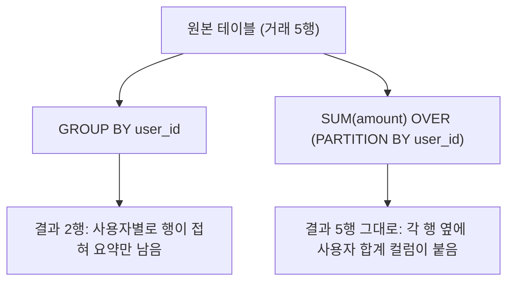

# 강의안: 윈도우 함수와 고객 세그먼트 미니 프로젝트

> 7주차 Day 3 (일) 수업용 강의안. 세션 3-1부터 3-3까지 180분. 윈도우 함수 입문 → 시계열과 행동 패턴 분석 → 미니 프로젝트와 8주차 예고.

---

## 오늘 수업의 전제와 준비물

- (1) Day 1에서 적재한 BigQuery 데이터셋 `tabformer` (`transactions` 약 2,400만 행, `users` 약 2,000명, `cards`)
- (2) Day 2에서 만든 MCC 업종 매핑 룩업 테이블 `mcc_map` (mcc, category 컬럼). 아직 없다면 세션 3-1 시작 전에 강사가 배포하는 생성 스크립트를 먼저 실행하세요.
- (3) 아래 쿼리의 `YOUR_PROJECT`는 본인 GCP 프로젝트 ID로 교체합니다.

### 오늘 계속 쓸 정제 패턴 (Day 2 복습)

`transactions`는 일부러 원본 그대로 적재했기 때문에, 분석 쿼리마다 아래 정제를 먼저 겁니다. 오늘은 이 정제를 `WITH tx AS (...)` 공통 블록으로 만들어 계속 재사용합니다.

```sql
-- 오늘 수업의 공통 정제 블록 (이후 모든 실습 쿼리 맨 앞에 붙습니다)
WITH tx AS (
    SELECT
        t.user_id,
        t.card_id,
        DATE(t.year, t.month, t.day)                          AS tx_date,     -- 세 정수 컬럼을 DATE로 합성
        PARSE_TIME("%H:%M", t.time)                           AS tx_time,     -- "13:05" 문자열을 TIME으로
        SAFE_CAST(REPLACE(t.amount, "$", "") AS NUMERIC)      AS amount,      -- "$54.30" → 54.30
        t.mcc,
        t.merchant_city
    FROM `YOUR_PROJECT.tabformer.transactions` AS t
)
SELECT * FROM tx LIMIT 5;
```

> 컬럼 구성은 데이터셋 버전에 따라 다를 수 있으니, 쿼리가 에러를 내면 먼저 BigQuery 콘솔의 Schema 탭에서 실제 컬럼명을 확인하세요.

> 팁: 2,400만 행 전체에 윈도우 함수를 걸면 실행이 느려질 수 있습니다. 실습 중에는 `WHERE t.year = 2018`처럼 기간을 좁혀 빠르게 돌려보고, 마지막에 조건을 풀어 전체를 확인하는 순서를 권장합니다. 참고로 BigQuery의 처리 바이트는 "읽는 컬럼" 기준이라 WHERE로 행을 줄여도 청구 바이트는 거의 같습니다. 실행 시간만 줄어듭니다. 이 이야기는 8주차 파티셔닝 세션에서 제대로 다룹니다.

---

## Session 3-1. 윈도우 함수 입문 (60분)

### 시간 배분

| 블록 | 시간 |
|---|---|
| 도입: GROUP BY의 한계와 윈도우 함수의 등장 | 15분 |
| OVER()와 PARTITION BY 문법 구조 | 10분 |
| 순위 함수 3종 비교 (ROW_NUMBER, RANK, DENSE_RANK) | 10분 |
| 실습 1: 사용자별 첫 거래와 마지막 거래 | 10분 |
| 실습 2: 업종별 큰손 Top 3 | 12분 |
| 체크포인트 | 3분 |

### 학습 목표

- (1) GROUP BY와 윈도우 함수의 차이를 "행을 접는가, 유지하는가"로 설명할 수 있다
- (2) `OVER (PARTITION BY ... ORDER BY ...)` 구문의 각 부분이 하는 일을 말할 수 있다
- (3) ROW_NUMBER, RANK, DENSE_RANK의 동점 처리 차이를 구분하고 상황에 맞게 고를 수 있다
- (4) "그룹별 Top N" 문제를 인라인 뷰 또는 QUALIFY로 풀 수 있다

### 강의 흐름

#### (1) 도입: GROUP BY로는 안 되는 요청이 온다 (15분)

Day 2에서 우리는 이런 요청을 처리했습니다. "연령대별 총 거래 금액을 뽑아주세요." GROUP BY로 깔끔하게 끝났습니다. 그런데 오늘 아침 팀장이 이렇게 말합니다.

> "각 거래 옆에, 그 사용자의 총 거래 금액도 같이 붙여주세요. 개별 거래가 그 사람 전체 소비에서 얼마나 비중이 큰지 보고 싶어요."

GROUP BY로 시도해 보면 바로 벽에 부딪힙니다. GROUP BY는 **행을 접어서 요약**하기 때문에, 집계가 끝나면 개별 거래 행이 사라집니다. 개별 행과 집계값을 한 화면에 같이 보려면, 집계 결과를 다시 원본에 JOIN하는 우회로가 필요합니다. 이 우회로를 언어 차원에서 지원하는 것이 윈도우 함수입니다.

핵심 프레임 한 문장: **"GROUP BY는 행을 접어서 요약하고, 윈도우 함수는 행을 유지한 채 옆에 계산 결과를 붙인다."**



같은 내용을 미니 표로 확인합니다. 사용자 2명, 거래 5건짜리 장난감 데이터입니다.

원본:

| user_id | tx_date | amount |
|---|---|---|
| 1 | 01-05 | 100 |
| 1 | 01-20 | 200 |
| 2 | 01-03 | 50 |
| 2 | 01-10 | 50 |
| 2 | 01-28 | 400 |

GROUP BY 결과 (행이 접힘, 5행 → 2행):

| user_id | total |
|---|---|
| 1 | 300 |
| 2 | 500 |

윈도우 함수 결과 (행 유지, 5행 그대로 + 컬럼 추가):

| user_id | tx_date | amount | user_total |
|---|---|---|---|
| 1 | 01-05 | 100 | 300 |
| 1 | 01-20 | 200 | 300 |
| 2 | 01-03 | 50 | 500 |
| 2 | 01-10 | 50 | 500 |
| 2 | 01-28 | 400 | 500 |

이제 팀장의 요청은 한 줄이 됩니다. `amount / SUM(amount) OVER (PARTITION BY user_id)` — 개별 거래의 비중.

#### (2) OVER()와 PARTITION BY 문법 구조 (10분)

윈도우 함수의 형태는 항상 같습니다.

```sql
집계또는순위함수(...) OVER (
    PARTITION BY 칸막이컬럼      -- 어떤 단위로 창(window)을 나눌 것인가 (생략 시 전체가 하나의 창)
    ORDER BY 정렬컬럼            -- 창 안에서 행을 어떤 순서로 볼 것인가 (순위, 누적에 필수)
    프레임 절                    -- 창 안에서 다시 몇 행만 볼 것인가 (세션 3-2에서)
)
```

- (1) `OVER ()`: 괄호가 비어 있으면 테이블 전체가 하나의 창입니다. `SUM(amount) OVER ()`는 모든 행 옆에 전체 합계를 붙입니다.
- (2) `PARTITION BY user_id`: GROUP BY의 "그룹"에 해당하는 칸막이입니다. 다만 행을 접지 않고, 계산할 때만 칸막이 안의 행들을 참조합니다.
- (3) `ORDER BY tx_date`: 순위 함수와 누적 계산에서 "몇 번째인가"를 정의합니다.

BigQuery 콘솔에서 다음을 직접 실행해 GROUP BY 버전과 결과 행 수를 비교하게 합니다.

```sql
-- 각 거래 옆에 그 사용자의 총 거래 금액과 비중을 붙이기
WITH tx AS (
    SELECT
        t.user_id,
        DATE(t.year, t.month, t.day)                     AS tx_date,
        SAFE_CAST(REPLACE(t.amount, "$", "") AS NUMERIC) AS amount
    FROM `YOUR_PROJECT.tabformer.transactions` AS t
    WHERE t.year = 2018
)
SELECT
    tx.user_id,
    tx.tx_date,
    tx.amount,
    SUM(tx.amount) OVER (PARTITION BY tx.user_id)                    AS user_total,
    ROUND(tx.amount / SUM(tx.amount) OVER (PARTITION BY tx.user_id) * 100, 2) AS pct_of_user  -- 이 거래의 비중(%)
FROM tx
ORDER BY tx.user_id, tx.tx_date
LIMIT 100;
```

> 📷 스크린샷 추가 예정: 위 쿼리 결과에서 같은 user_id 행들이 동일한 user_total을 공유하는 화면 (행이 접히지 않았음을 강조하는 하이라이트)

#### (3) 순위 함수 3종: 동점을 어떻게 처리하는가 (10분)

ROW_NUMBER, RANK, DENSE_RANK는 전부 "창 안에서 순서를 매기는" 함수이고, 차이는 **동점 처리** 하나뿐입니다. 거래 금액이 500, 400, 400, 300인 네 건이 있다고 합시다.

| amount | ROW_NUMBER | RANK | DENSE_RANK |
|---|---|---|---|
| 500 | 1 | 1 | 1 |
| 400 | 2 | 2 | 2 |
| 400 | 3 | 2 | 2 |
| 300 | 4 | 4 | 3 |

- (1) ROW_NUMBER: 동점이어도 무조건 다른 번호. "정확히 1행만 뽑아야 할 때" (예: 사용자별 첫 거래 1건)
- (2) RANK: 동점은 같은 순위, 다음 순위는 건너뜀 (2, 2, 다음은 4). "올림픽 메달식 순위"
- (3) DENSE_RANK: 동점은 같은 순위, 다음 순위를 건너뛰지 않음 (2, 2, 다음은 3). "Top 3 안에 드는 값을 모두 보고 싶을 때"

기억 장치: **"몇 등까지 보여줄까"는 DENSE_RANK, "딱 한 명만 뽑을까"는 ROW_NUMBER.** RANK는 그 중간이고, 셋을 한 쿼리에 나란히 넣어 결과를 비교하는 것이 가장 빠른 이해법입니다.

```sql
-- 세 순위 함수를 한 쿼리에서 비교 (2018년, 금액 상위 거래 일부)
WITH tx AS (
    SELECT
        t.user_id,
        SAFE_CAST(REPLACE(t.amount, "$", "") AS NUMERIC) AS amount
    FROM `YOUR_PROJECT.tabformer.transactions` AS t
    WHERE t.year = 2018
)
SELECT
    tx.user_id,
    tx.amount,
    ROW_NUMBER() OVER (ORDER BY tx.amount DESC) AS row_num,
    RANK()       OVER (ORDER BY tx.amount DESC) AS rnk,
    DENSE_RANK() OVER (ORDER BY tx.amount DESC) AS dense_rnk
FROM tx
ORDER BY tx.amount DESC
LIMIT 20;
```

### 실습 1: 각 고객의 첫 거래와 마지막 거래는 언제, 어디서였는가 (10분)

**비즈니스 질문**: "고객 온보딩 분석을 하려고 합니다. 사용자별로 생애 첫 거래와 가장 최근 거래를 한 행씩 뽑아주세요. 날짜, 금액, 거래 도시가 필요합니다."

먼저 스스로 생각해 볼 힌트:

- (1) "사용자별로"가 보이면 `PARTITION BY user_id`입니다.
- (2) "첫"과 "마지막"은 정렬 방향만 다른 같은 문제입니다. 오름차순 1등 = 첫 거래, 내림차순 1등 = 마지막 거래.
- (3) 같은 날짜에 거래가 여러 건일 수 있으니 `tx_time`을 보조 정렬 키로 넣어야 "딱 1건"이 보장됩니다. 딱 1건이 필요하면 셋 중 어떤 순위 함수를 써야 할까요?

풀이:

```sql
-- 사용자별 첫 거래와 마지막 거래 추출
WITH tx AS (
    SELECT
        t.user_id,
        DATE(t.year, t.month, t.day)                     AS tx_date,
        PARSE_TIME("%H:%M", t.time)                      AS tx_time,
        SAFE_CAST(REPLACE(t.amount, "$", "") AS NUMERIC) AS amount,
        t.merchant_city
    FROM `YOUR_PROJECT.tabformer.transactions` AS t
),
ranked AS (
    SELECT
        tx.user_id,
        tx.tx_date,
        tx.amount,
        tx.merchant_city,
        ROW_NUMBER() OVER (PARTITION BY tx.user_id ORDER BY tx.tx_date ASC,  tx.tx_time ASC)  AS rn_first,  -- 오름차순 1등 = 첫 거래
        ROW_NUMBER() OVER (PARTITION BY tx.user_id ORDER BY tx.tx_date DESC, tx.tx_time DESC) AS rn_last    -- 내림차순 1등 = 마지막 거래
    FROM tx
)
SELECT
    r.user_id,
    CASE WHEN r.rn_first = 1 THEN "first" ELSE "last" END AS tx_kind,
    r.tx_date,
    r.amount,
    r.merchant_city
FROM ranked AS r
WHERE r.rn_first = 1 OR r.rn_last = 1
ORDER BY r.user_id, r.tx_date;
```

- 심화 메모: 같은 문제를 `FIRST_VALUE()`와 `LAST_VALUE()`로도 풀 수 있습니다. 다만 LAST_VALUE는 세션 3-2에서 배울 프레임 기본값 때문에 함정이 있어, 지금 단계에서는 ROW_NUMBER 방식을 표준으로 삼습니다.
- 이 쿼리는 그대로 **과제 4번 질문(사용자별 첫 거래일과 마지막 거래일)의 앞 절반**입니다. 뒤 절반(평균 거래 간격)은 세션 3-2에서 채웁니다.

### 실습 2: 업종별 큰손 Top 3는 누구인가 (12분)

**비즈니스 질문**: "업종(카테고리)별로 누적 거래 금액이 가장 큰 사용자 Top 3를 뽑아주세요. 업종별 VIP 마케팅 대상 선정에 쓸 겁니다."

힌트:

- (1) 두 단계 문제입니다. 먼저 GROUP BY로 "업종 × 사용자별 누적 금액"을 만들고, 그 위에 순위를 매깁니다. 접기(GROUP BY)와 붙이기(윈도우)는 이렇게 자주 협업합니다.
- (2) "업종별로" Top 3이므로 `PARTITION BY category`입니다.
- (3) 함정 하나: 윈도우 함수는 WHERE 절에 직접 쓸 수 없습니다 (WHERE는 윈도우 계산보다 먼저 실행되기 때문). 순위를 먼저 매긴 가상 테이블을 만들고, 바깥에서 필터해야 합니다.

풀이 (표준 패턴 — 인라인 뷰):

```sql
-- 업종별 누적 거래 금액 Top 3 사용자
WITH tx AS (
    SELECT
        t.user_id,
        t.mcc,
        SAFE_CAST(REPLACE(t.amount, "$", "") AS NUMERIC) AS amount
    FROM `YOUR_PROJECT.tabformer.transactions` AS t
),
user_cat AS (
    -- 1단계: 업종 × 사용자별 누적 금액 (여기서는 행을 접는다)
    SELECT
        m.category,
        tx.user_id,
        SUM(tx.amount) AS total_amount
    FROM tx
    INNER JOIN `YOUR_PROJECT.tabformer.mcc_map` AS m
        ON tx.mcc = m.mcc
    GROUP BY m.category, tx.user_id
)
SELECT
    ranked.category,
    ranked.user_id,
    ranked.total_amount,
    ranked.rank_in_cat
FROM (
    -- 2단계: 접힌 결과 위에 업종별 순위를 붙인다
    SELECT
        uc.category,
        uc.user_id,
        uc.total_amount,
        DENSE_RANK() OVER (PARTITION BY uc.category ORDER BY uc.total_amount DESC) AS rank_in_cat
    FROM user_cat AS uc
) AS ranked
WHERE ranked.rank_in_cat <= 3
ORDER BY ranked.category, ranked.rank_in_cat;
```

BigQuery 전용 지름길 — QUALIFY:

```sql
-- 같은 결과를 QUALIFY로 (BigQuery 등 일부 DBMS 전용 문법)
-- 위 쿼리의 tx, user_cat CTE 선언(WITH 절)을 그대로 둔 채 마지막 SELECT만 이렇게 교체합니다
SELECT
    uc.category,
    uc.user_id,
    uc.total_amount
FROM user_cat AS uc
WHERE TRUE    -- BigQuery는 QUALIFY 사용 시 WHERE, GROUP BY, HAVING 중 하나를 요구하므로 형식상 추가
QUALIFY DENSE_RANK() OVER (PARTITION BY uc.category ORDER BY uc.total_amount DESC) <= 3
ORDER BY uc.category, uc.total_amount DESC;
```

- QUALIFY는 "윈도우 함수 결과에 거는 WHERE"입니다. 편하지만 표준 SQL이 아니므로, 다른 DB에서도 통하는 인라인 뷰 패턴을 먼저 몸에 익히고 QUALIFY는 지름길로 씁니다.
- `mcc_map`이 아직 없다면 `m.category` 대신 `tx.mcc`로 묶어도 실습 목적은 달성됩니다.

### 체크포인트 (3분)

- (1) "GROUP BY와 윈도우 함수의 차이를 결과 행 수 관점에서 한 문장으로 말해보세요."
- (2) "사용자별 최고 금액 거래를 정확히 1건씩 뽑아야 한다면 세 순위 함수 중 무엇을 쓰고, 왜인가요?"
- (3) "윈도우 함수를 WHERE에 못 쓰는 이유는 무엇이고, 대신 어떤 두 가지 방법이 있나요?"

---

## Session 3-2. 시계열과 행동 패턴 분석 (60분)

### 시간 배분

| 블록 | 시간 |
|---|---|
| 누적합과 이동평균, 프레임 절 (ROWS BETWEEN) | 20분 |
| LAG와 LEAD: 직전 거래 참조 | 10분 |
| 실습 3: 사용자별 평균 거래 간격 | 12분 |
| 실습 4: 휴면 사용자 추출 | 13분 |
| 과제와의 연결 정리 | 5분 |

### 학습 목표

- (1) `SUM OVER`와 `AVG OVER`에 ORDER BY와 프레임 절을 붙여 누적합과 이동평균을 계산할 수 있다
- (2) `ROWS BETWEEN`이 창 안에서 "몇 행을 보는지"를 지정하는 절임을 설명할 수 있다
- (3) LAG와 LEAD로 직전 행과 다음 행을 참조해 간격과 변화량을 계산할 수 있다
- (4) "기준 시점"을 명시적으로 정의해 휴면 고객을 추출할 수 있다

### 강의 흐름

#### (1) 누적합: ORDER BY가 붙으면 창이 "지금까지"로 줄어든다 (10분)

세션 3-1에서 `SUM(...) OVER (PARTITION BY ...)`는 칸막이 전체의 합이었습니다. 여기에 ORDER BY를 추가하면 의미가 바뀝니다. **"칸막이 안에서, 정렬 순서상 처음부터 현재 행까지"의 합**, 즉 누적합이 됩니다.

```sql
-- 2018년 월별 거래 금액과 누적 금액
WITH monthly AS (
    SELECT
        DATE(t.year, t.month, 1)                                     AS month_start,
        SUM(SAFE_CAST(REPLACE(t.amount, "$", "") AS NUMERIC))        AS monthly_amount
    FROM `YOUR_PROJECT.tabformer.transactions` AS t
    WHERE t.year = 2018
    GROUP BY month_start
)
SELECT
    m.month_start,
    m.monthly_amount,
    SUM(m.monthly_amount) OVER (ORDER BY m.month_start) AS cum_amount  -- 1월부터 이번 달까지 누적
FROM monthly AS m
ORDER BY m.month_start;
```

왜 ORDER BY 하나로 "전체 합"이 "누적 합"이 될까요? 사실 ORDER BY가 붙는 순간 보이지 않는 기본 프레임이 함께 붙기 때문입니다: "처음부터 현재 행까지". 이 "몇 행을 볼지"를 직접 지정하는 절이 프레임 절입니다.

#### (2) 프레임 절 ROWS BETWEEN: 창 안의 창 (10분)

```sql
AVG(x) OVER (
    ORDER BY 날짜
    ROWS BETWEEN 2 PRECEDING AND CURRENT ROW   -- 앞의 2행 + 현재 행 = 3행짜리 굴러가는 창
)
```

3월 행을 계산할 때 어떤 행들이 보이는지 표로 확인합니다 (3개월 이동평균).

| month | amount | 3월 행이 계산에 쓰는 행 | ma_3m (3월 기준) |
|---|---|---|---|
| 1월 | 100 | ← 포함 (2 PRECEDING) | |
| 2월 | 200 | ← 포함 (1 PRECEDING) | |
| **3월** | **300** | ← 포함 (CURRENT ROW) | **(100+200+300)/3 = 200** |
| 4월 | 400 | 안 보임 | |

- (1) `ROWS BETWEEN UNBOUNDED PRECEDING AND CURRENT ROW`: 처음부터 지금까지 → 누적. ORDER BY만 쓰면 사실상 이것이 기본값입니다.
- (2) `ROWS BETWEEN 2 PRECEDING AND CURRENT ROW`: 최근 3행 → 이동평균.
- (3) 함정 예고: ORDER BY만 있을 때의 진짜 기본값은 ROWS가 아니라 RANGE 기반이라, 정렬 키에 동점이 있으면 동점 행들이 한꺼번에 합산되어 계단식 결과가 나옵니다. 의도가 "행 단위"라면 ROWS를 명시하는 습관을 들이세요.

```sql
-- 월별 거래 금액의 3개월 이동평균
SELECT
    m.month_start,
    m.monthly_amount,
    AVG(m.monthly_amount) OVER (
        ORDER BY m.month_start
        ROWS BETWEEN 2 PRECEDING AND CURRENT ROW
    ) AS ma_3m
FROM monthly AS m   -- 위 (1)의 monthly CTE 재사용
ORDER BY m.month_start;
```

> 8주차 복선: 8주차 Day 1의 수정주가 계산에서 이 프레임 절이 주인공이 됩니다. "미래에서 과거로" 거꾸로 누적하는 창(ORDER BY date DESC + 프레임)을 만나게 되니, 오늘 ROWS BETWEEN의 감각을 확실히 잡아두세요.

#### (3) LAG와 LEAD: 옆 행을 훔쳐보는 함수 (10분)

- `LAG(컬럼) OVER (PARTITION BY ... ORDER BY ...)`: 정렬 순서상 **직전 행**의 값을 현재 행으로 가져옵니다.
- `LEAD(컬럼) OVER (...)`: 반대로 **다음 행**의 값을 가져옵니다.
- 각 칸막이의 첫 행은 직전 행이 없으므로 LAG 결과가 NULL입니다. 이 NULL은 버그가 아니라 "첫 거래"라는 정보입니다.

고객 행동 분석에서 LAG가 만드는 대표 파생 지표 두 가지:

```sql
-- 거래 시퀀스: 직전 거래와의 날짜 간격, 금액 변화
WITH tx AS (
    SELECT
        t.user_id,
        DATE(t.year, t.month, t.day)                     AS tx_date,
        PARSE_TIME("%H:%M", t.time)                      AS tx_time,
        SAFE_CAST(REPLACE(t.amount, "$", "") AS NUMERIC) AS amount
    FROM `YOUR_PROJECT.tabformer.transactions` AS t
),
seq AS (
    SELECT
        tx.user_id,
        tx.tx_date,
        tx.amount,
        LAG(tx.tx_date) OVER (PARTITION BY tx.user_id ORDER BY tx.tx_date, tx.tx_time) AS prev_date,
        LAG(tx.amount)  OVER (PARTITION BY tx.user_id ORDER BY tx.tx_date, tx.tx_time) AS prev_amount
    FROM tx
)
SELECT
    s.user_id,
    s.tx_date,
    s.amount,
    DATE_DIFF(s.tx_date, s.prev_date, DAY) AS gap_days,      -- 직전 거래로부터 며칠 만인가 (첫 거래는 NULL)
    s.amount - s.prev_amount               AS amount_diff    -- 직전 거래 대비 금액 변화
FROM seq AS s
ORDER BY s.user_id, s.tx_date
LIMIT 100;
```

> 📷 스크린샷 추가 예정: 한 사용자의 거래 시퀀스에서 첫 행의 gap_days가 NULL로 나오는 결과 화면 (NULL = 첫 거래라는 해석 강조)

### 실습 3: 우리 고객은 평균 며칠에 한 번 카드를 긁는가 (12분)

**비즈니스 질문**: "고객별 거래 빈도를 지표화하려고 합니다. 사용자별 평균 거래 간격(일 단위)을 구하고, 간격이 가장 긴 사용자 20명을 보여주세요."

힌트:

- (1) 위 `seq` 블록의 `gap_days`를 사용자별로 AVG하면 됩니다. 첫 거래(NULL)는 AVG가 알아서 제외합니다.
- (2) 검산 트릭: 평균 간격은 사실 `(마지막 거래일 - 첫 거래일) / (거래 건수 - 1)`과 같아야 합니다. 윈도우 없이 GROUP BY만으로 같은 값을 구해 서로 맞는지 확인해 보세요. 좋은 디버깅 습관입니다.
- (3) 거래가 1건뿐인 사용자는 간격 자체가 정의되지 않습니다. 0으로 나누기를 어떻게 피할까요?

풀이:

```sql
-- 사용자별 평균 거래 간격 (LAG 방식 + 검산용 산식 병기)
WITH tx AS (
    SELECT
        t.user_id,
        DATE(t.year, t.month, t.day) AS tx_date,
        PARSE_TIME("%H:%M", t.time)  AS tx_time
    FROM `YOUR_PROJECT.tabformer.transactions` AS t
),
seq AS (
    SELECT
        tx.user_id,
        tx.tx_date,
        LAG(tx.tx_date) OVER (PARTITION BY tx.user_id ORDER BY tx.tx_date, tx.tx_time) AS prev_date
    FROM tx
)
SELECT
    s.user_id,
    COUNT(*)                                                       AS n_tx,
    ROUND(AVG(DATE_DIFF(s.tx_date, s.prev_date, DAY)), 2)          AS avg_gap_days,       -- LAG 방식
    ROUND(
        DATE_DIFF(MAX(s.tx_date), MIN(s.tx_date), DAY)
        / NULLIF(COUNT(*) - 1, 0)                                  -- 거래 1건 사용자는 NULL 처리 (0으로 나누기 방지)
    , 2)                                                           AS avg_gap_days_check  -- 검산 방식
FROM seq AS s
GROUP BY s.user_id
ORDER BY avg_gap_days DESC
LIMIT 20;
```

- 두 컬럼이 일치하면 쿼리를 믿어도 됩니다. 다르다면 정렬 키 누락(같은 날 여러 거래)이나 중복 행을 의심하세요.
- 이 쿼리가 **과제 4번 질문의 뒤 절반**입니다. 실습 1의 첫/마지막 거래와 합치면 과제 4번이 완성됩니다.

### 실습 4: 떠나간 고객 찾기 — 휴면 사용자 추출 (13분)

**비즈니스 질문**: "마지막 거래 이후 1년간 거래가 없는 사용자를 '휴면'으로 정의합니다. 휴면 사용자 명단과, 이들이 마지막으로 거래한 날로부터 며칠이 지났는지 뽑아주세요."

힌트:

- (1) 첫 번째 함정은 "기준 시점"입니다. `CURRENT_DATE`를 쓰면 될까요? 안 됩니다. 이 데이터는 시뮬레이션이라 거래가 과거 어느 시점에서 끝나므로, 오늘 날짜 기준으로는 전원이 휴면으로 나옵니다. 기준 시점은 **데이터셋 안의 마지막 거래일**이어야 합니다.
- (2) 필요한 재료는 두 가지입니다. 사용자별 마지막 거래일 (GROUP BY MAX), 그리고 전체 마지막 거래일 (기준 시점).
- (3) "1년간 거래가 없다" = "기준 시점 - 마지막 거래일 >= 365일"로 번역합니다.

풀이:

```sql
-- 휴면 사용자: 데이터 기준 시점으로부터 1년 이상 거래가 없는 사용자
WITH tx AS (
    SELECT
        t.user_id,
        DATE(t.year, t.month, t.day) AS tx_date
    FROM `YOUR_PROJECT.tabformer.transactions` AS t
),
last_tx AS (
    SELECT
        tx.user_id,
        MAX(tx.tx_date) AS last_date            -- 사용자별 마지막 거래일
    FROM tx
    GROUP BY tx.user_id
),
anchor AS (
    SELECT MAX(tx.tx_date) AS data_end_date     -- 데이터셋 전체의 마지막 거래일 = 기준 시점
    FROM tx
)
SELECT
    l.user_id,
    l.last_date,
    a.data_end_date,
    DATE_DIFF(a.data_end_date, l.last_date, DAY) AS days_since_last
FROM last_tx AS l
CROSS JOIN anchor AS a                          -- anchor는 1행이라 CROSS JOIN이 안전한 상황
WHERE DATE_DIFF(a.data_end_date, l.last_date, DAY) >= 365
ORDER BY days_since_last DESC;
```

- 같은 결과를 `MAX(tx_date) OVER ()` (빈 OVER = 전체 창)로 anchor CTE 없이 만들 수도 있습니다. 세션 3-1의 "OVER ()는 전체가 하나의 창" 개념의 재등장입니다.
- 확장 토론: 여기서 `users` 테이블을 JOIN해 휴면 사용자의 연령과 소득 분포를 보면 어떤 이야기가 나올까요? 그것이 바로 **과제 5번 질문**입니다 (과제는 기준이 180일이라는 점만 다릅니다).

### 과제와의 연결 정리 (5분)

오늘 배운 도구가 이번 주 과제(비즈니스 질문 6개)의 어디에 꽂히는지 지도를 그려줍니다.

| 과제 질문 | 오늘의 도구 |
|---|---|
| 2번. 연령대 × 성별 카테고리 Top 3 | 실습 2의 DENSE_RANK + 인라인 뷰(또는 QUALIFY) 패턴 그대로 |
| 4번. 사용자별 첫/마지막 거래일과 평균 거래 간격 | 실습 1 (ROW_NUMBER) + 실습 3 (LAG + DATE_DIFF) |
| 5번. 180일 이상 무거래 휴면 위험 사용자 | 실습 4에서 365를 180으로 바꾸고 users JOIN 추가 |

**과제 4번과 5번은 오늘 윈도우 함수가 없으면 사실상 풀 수 없는 문제**입니다. 오늘 실습 쿼리를 저장해 두고 과제의 출발점으로 삼으세요.

---

## Session 3-3. 미니 프로젝트와 8주차 예고 (60분)

### 시간 배분

| 블록 | 시간 |
|---|---|
| 미니 프로젝트: 요구사항 안내 + 작업 | 40분 (안내 5분 + 작업 35분) |
| 공유와 피드백 | 15분 |
| 8주차 예고와 회고 질문 | 5분 |

### 학습 목표

- (1) 3일간 배운 JOIN, 집계, 윈도우 함수를 조합해 하나의 리포트 쿼리 세트를 완성한다
- (2) 요구사항 명세를 읽고 필요한 SQL 패턴을 스스로 선택한다
- (3) 내 결과물을 최종 프로젝트 관점에서 재해석한다

### 미니 프로젝트: 고객 세그먼트별 소비 리포트 (40분)

#### 상황 설정

여러분은 카드사 BI팀 분석가입니다. 마케팅팀이 다음 분기 캠페인 기획을 위해 "고객 세그먼트별 소비 리포트"를 요청했습니다. 아래 명세대로 쿼리 세트를 완성해 결과 표 4개를 만드세요.

#### 요구사항 명세

세그먼트 정의:

- (1) 세그먼트 = 연령대(10세 단위) × 성별. 라벨은 `"20대/Female"` 형태로 CONCAT하여 `segment` 컬럼 하나로 만듭니다.
- (2) 연령은 `users.current_age`, 성별은 `users.gender`를 사용합니다. NULL 또는 빈 값은 `"기타"`로 묶습니다.

산출 지표 (리포트 4개, 출력 컬럼명 고정):

| 리포트 | 내용 | 출력 컬럼 |
|---|---|---|
| R1 | 세그먼트별 규모와 소비력 | segment, n_users, total_amount, amount_per_user |
| R2 | 세그먼트별 Top 3 업종 | segment, category, seg_cat_amount, rank_in_seg (rank_in_seg <= 3만) |
| R3 | 세그먼트별 평균 거래 간격 | segment, avg_gap_days |
| R4 | 세그먼트별 휴면 위험 비율 | segment, n_dormant, dormant_ratio (기준: 마지막 거래 후 365일) |

- 출력 컬럼명을 명세와 똑같이 맞추세요. 컬럼명이 곧 채점 기준이고, 실무에서도 리포트 스펙 준수가 신뢰의 기본입니다.
- R2는 실습 2, R3은 실습 3, R4는 실습 4의 패턴을 세그먼트 단위로 바꾼 것입니다. 백지에서 시작하지 말고 오늘 쿼리를 변형하세요.

#### 스타터 쿼리 골격

아래 골격의 `-- TODO` 부분을 채우면 됩니다. 공통 블록(tx, seg)은 완성본으로 제공하니 R1부터 시작하세요.

```sql
-- ============================================================
-- 미니 프로젝트: 고객 세그먼트별 소비 리포트
-- 공통 블록 (완성본 제공) + R1~R4 (TODO)
-- ============================================================
WITH tx AS (
    -- 거래 정제 (제공)
    SELECT
        t.user_id,
        DATE(t.year, t.month, t.day)                     AS tx_date,
        PARSE_TIME("%H:%M", t.time)                      AS tx_time,
        SAFE_CAST(REPLACE(t.amount, "$", "") AS NUMERIC) AS amount,
        t.mcc
    FROM `YOUR_PROJECT.tabformer.transactions` AS t
),
seg AS (
    -- 세그먼트 라벨 (제공): 연령대 10세 단위 × 성별
    SELECT
        u.user_id,
        CONCAT(
            CAST(CAST(FLOOR(u.current_age / 10) * 10 AS INT64) AS STRING), "대/",
            CASE
                WHEN u.gender IS NULL OR LENGTH(u.gender) < 1 THEN "기타"
                ELSE u.gender
            END
        ) AS segment
    FROM `YOUR_PROJECT.tabformer.users` AS u
),

-- ---------- R1. 세그먼트별 규모와 소비력 ----------
r1 AS (
    SELECT
        s.segment,
        -- TODO (1): 세그먼트별 사용자 수 (힌트: COUNT(DISTINCT ...))
        -- TODO (2): 총 거래 금액 total_amount
        -- TODO (3): 인당 평균 거래 금액 amount_per_user = 총액 / 사용자 수
        0 AS n_users, 0 AS total_amount, 0 AS amount_per_user   -- 자리 표시, 지우고 채우세요
    FROM tx
    INNER JOIN seg AS s
        ON tx.user_id = s.user_id
    GROUP BY s.segment
),

-- ---------- R2. 세그먼트별 Top 3 업종 ----------
r2 AS (
    -- TODO (4): 세그먼트 × 업종별 금액 집계 후 DENSE_RANK
    -- 힌트: 실습 2의 user_cat → 순위 패턴에서 PARTITION BY만 segment로
    -- 힌트: mcc_map JOIN 필요, 필터는 인라인 뷰 또는 QUALIFY
    SELECT 1 AS dummy   -- 지우고 채우세요
),

-- ---------- R3. 세그먼트별 평균 거래 간격 ----------
r3 AS (
    -- TODO (5): 실습 3의 LAG 패턴으로 사용자별 gap을 만든 뒤,
    --           사용자 단위가 아니라 세그먼트 단위로 AVG
    SELECT 1 AS dummy   -- 지우고 채우세요
),

-- ---------- R4. 세그먼트별 휴면 위험 비율 ----------
r4 AS (
    -- TODO (6): 실습 4의 last_tx + anchor 패턴으로 사용자별 휴면 여부(365일)를 만들고,
    --           세그먼트별 휴면 사용자 수 n_dormant와 비율 dormant_ratio 계산
    -- 힌트: 비율 = 휴면 수 / 세그먼트 사용자 수, ROUND(..., 3)
    SELECT 1 AS dummy   -- 지우고 채우세요
)

-- 제출 시에는 R1~R4를 각각 SELECT하여 결과 4개를 캡처합니다
SELECT * FROM r1 ORDER BY total_amount DESC;
```

작업 규칙:

- (1) 35분 안에 R1과 R2까지는 반드시, R3과 R4는 도전 과제입니다 (미완이어도 공유 가능).
- (2) 막히면 오늘 실습 1~4의 완성 쿼리를 열어 놓고 변형하세요. 복붙 후 수정이 실무의 기본기입니다.
- (3) 완성한 사람은 보너스 질문: "R1에서 amount_per_user가 가장 높은 세그먼트와 R4에서 dormant_ratio가 가장 높은 세그먼트가 같은가요, 다른가요? 다르다면 마케팅팀에 어떤 제안을 하겠습니까?"

> 📷 스크린샷 추가 예정: R1과 R2 모범 결과 표 (강사 사전 실행 캡처, 수강생 자기 검증용)

### 공유와 피드백 (15분)

진행 방식:

- (1) 지원자 또는 지명으로 2~3명이 화면을 공유하고, 리포트 하나씩 쿼리와 결과를 3분 내로 설명합니다.
- (2) 발표자가 아닌 사람은 아래 피드백 체크리스트 관점으로 한 가지씩 코멘트합니다.

피드백 체크리스트:

- (1) 출력 컬럼명이 명세와 일치하는가
- (2) NULL과 빈 값 세그먼트("기타")가 결과에서 어떻게 나타나는가, 버려지지 않았는가
- (3) Top 3에서 동점 처리를 어떤 순위 함수로 했고 그 선택이 적절한가
- (4) 정렬이 보장되어 리포트로서 읽기 좋은가
- (5) 같은 결과를 더 짧게 쓸 방법이 있는가 (예: 인라인 뷰 대신 QUALIFY)

### 8주차 예고와 회고 질문 (5분)

8주차 예고 (2분):

- 이번 주 데이터는 사실 꽤 깨끗한 편이었습니다. 8주차에는 **일부러 지저분한 원천 데이터**를 만납니다.
- (1) 주가 데이터의 액면분할 — 삼성전자가 하루 만에 -98% 폭락한 것처럼 보이는 차트를 SQL로 고칩니다 (오늘 배운 프레임 절이 핵심 무기).
- (2) 송금 로그에서 의심 거래를 잡는 FDS 룰 — LAG와 LEAD가 다시 등장합니다.
- (3) 그리고 수억 행짜리 공개 데이터로 BigQuery의 진짜 힘과 비용을 체험합니다. 이번 주에 이미 BigQuery 위에서 작업했으니 진입 장벽은 없습니다.

회고 질문 (3분) — 각자 노트에 한 줄씩 적고 마칩니다:

> **"오늘 만든 세그먼트 리포트를 어떻게 발전시키면 최종 프로젝트가 될까?"**

- (1) 이 세그먼트 정의에 카드 정보(cards)나 소득, FICO 점수를 더하면 어떤 질문이 가능해질까?
- (2) 8주차에 배울 이상거래 탐지를 세그먼트와 결합하면? (예: "특정 세그먼트에서만 나타나는 의심 거래 패턴")
- (3) 이 리포트를 받는 사람이 마케팅팀이 아니라 리스크팀이라면 지표 4개 중 무엇을 바꾸겠는가?

적은 내용은 버리지 말고 보관하세요. 9주차 최종 프로젝트 주제 선정 때 그대로 씨앗이 됩니다.

---

## 과제 리마인드 (수업 종료 전 공지)

- 이번 주 과제는 비즈니스 질문 6개에 SQL로 답하고 리포트(2~3페이지)를 작성하는 것입니다. 예상 소요 6~8시간.
- 오늘 실습 쿼리 4개와 미니 프로젝트 골격이 과제 2번, 4번, 5번의 출발점입니다. 수업 쿼리를 저장했는지 지금 확인하세요.
- 제출물과 평가 기준은 과제 안내문(별도 배포)을 참고하세요.

---

오늘의 핵심 교훈 한 줄: **"GROUP BY는 행을 접고, 윈도우 함수는 행을 살린 채 옆에 답을 붙인다."**
