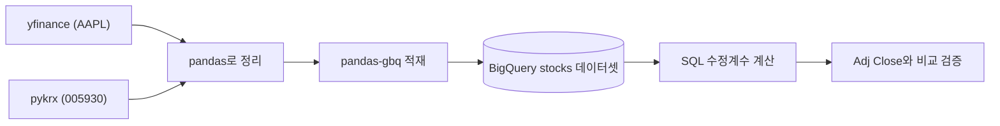
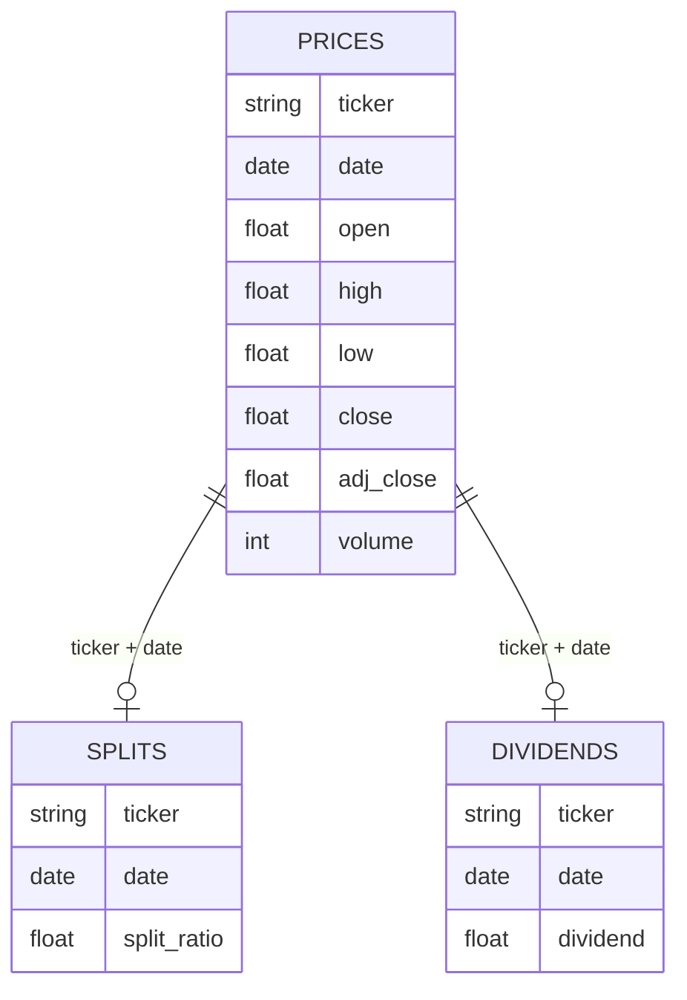

# 8주차 Day 1 강의안: 주식 데이터와 수정주가 계산

> 8주차 Day 1 (금 19:00-22:00) 수업용 강의안. 세션 1-1부터 1-3까지 170분 (세션 사이 휴식 별도).

---

## 오늘의 큰 그림

7주차에는 이미 테이블 형태로 정리된 카드 거래 데이터를 SQL로 분석했습니다. 8주차는 한 걸음 앞으로 갑니다. **분석하기 전의 원천 데이터**를 직접 수집하고, 그 데이터가 왜 그대로는 못 쓰는 상태인지 확인하고, SQL로 분석 가능한 형태로 가공합니다. 오늘의 소재는 주가 데이터이고, 오늘의 최종 결과물은 **SQL로 직접 계산한 수정주가**입니다.



| 세션 | 시간 | 내용 |
|---|---|---|
| 1-1 | 40분 | 도입: 지난주 데이터는 너무 깨끗했다 |
| 1-2 | 60분 | 원천 주가 데이터 수집과 BigQuery 적재 |
| 1-3 | 70분 | 수정계수 SQL 계산과 검증 |

> **사전 준비물 (수강생 공지 사항)**
> - (1) 7주차에 쓰던 GCP 프로젝트 (BigQuery 콘솔 접속 가능 상태)
> - (2) Google Colab 사용 가능한 브라우저 환경
> - (3) 사전 배포된 워크시트 `FinDA_8주차_1일차_사전배포_수정계수_워크시트_v0.1` 풀어 오기 (30-40분 소요, Session 1-3 이해에 직결됨)

---

## Session 1-1. 도입: 지난주 데이터는 너무 깨끗했다 (40분)

### 학습 목표

- (1) 실무 원천 데이터가 "정제된 실습 데이터"와 어떻게 다른지 유형별로 설명할 수 있다
- (2) 액면분할이 왜 시계열 분석을 망가뜨리는지, 삼성전자 사례로 설명할 수 있다
- (3) 수정주가가 무엇이고 왜 필요한지 한 문장으로 정의할 수 있다

### 강의 흐름

**(1) 7주차 회고: 우리가 쓴 데이터는 사실 온실 속 데이터였다 (10분)**

7주차 TabFormer 실습을 돌아봅시다. 우리는 `amount`의 달러 기호를 떼고, `year`, `month`, `day`를 DATE로 합성하고, users 테이블에 `user_id`를 부여하는 정제를 했습니다. 꽤 지저분해 보였지만, 사실 TabFormer는 실무 기준으로는 아주 얌전한 데이터였습니다.

- 스키마 문서가 존재했고, 행 수가 예고된 대로 나왔습니다
- 시뮬레이션 데이터라 결측과 오류의 패턴이 규칙적이었습니다
- 무엇보다 **데이터가 한번 적재되면 과거가 바뀌지 않았습니다**

실무 원천 데이터, 특히 금융 시장 데이터는 마지막 성질이 깨집니다. 오늘 그 대표 사례를 만납니다.

**(2) 실무 원천 데이터의 모습 (10분)**

원천 주가 데이터에서 흔히 만나는 문제를 유형화하면 다음과 같습니다.

| 유형 | 예시 | 오늘 다루는가 |
|---|---|---|
| 기업 행위 (corporate action) | 액면분할, 액면병합, 배당, 유상증자 | **분할을 집중적으로** |
| 결측 | 휴장일, 거래정지 기간에는 행 자체가 없음 | 삼성전자 매매정지에서 관찰 |
| 중복 | 수집 스크립트 재실행으로 같은 날짜가 두 번 적재 | 적재 시 주의점으로 언급 |
| 단위와 표기 불일치 | 원 vs 달러, 주 vs 천 주, 타임존 | 수집 코드에서 처리 |
| 소급 수정 | 데이터 제공자가 과거 값을 나중에 고침 | 검증 세션에서 언급 |

핵심 메시지: 이 중 가장 위험한 것이 기업 행위입니다. 결측이나 중복은 눈에 띄지만, **분할은 "멀쩡해 보이는 숫자"를 남기기 때문**입니다. 값이 NULL이면 에러라도 나지만, 265만 원이 5만 3천 원이 된 것은 쿼리가 아무 불평 없이 계산해 줍니다.

**(3) 시연: 하루 만에 -98% 폭락한 삼성전자? (15분)**

삼성전자(005930)는 2018년 5월 4일에 50:1 액면분할을 했습니다. 분할 직전 거래일 종가는 약 265만 원, 분할 후 첫 거래일 시초가는 약 5만 3천 원입니다. 주식 1주가 50주가 되었을 뿐 주주의 재산 가치는 그대로인데, 가격 숫자만 50분의 1이 되었습니다.

강사 시연 시나리오 (수강생은 Session 1-2에서 적재 후 직접 재현합니다):

```sql
-- 시연: 원주가 그대로 일간 수익률을 계산하면?
-- YOUR_PROJECT는 본인 프로젝트 ID로 교체
SELECT
    p.date,
    p.close,
    ROUND((p.close / LAG(p.close) OVER (ORDER BY p.date) - 1) * 100, 2) AS daily_return_pct
FROM `YOUR_PROJECT.stocks.prices` AS p
WHERE p.ticker = '005930'
    AND p.date BETWEEN '2018-04-20' AND '2018-05-15'
ORDER BY p.date;
```

결과에서 2018-05-04 행의 `daily_return_pct`가 약 **-98**로 나옵니다. 실제로 삼성전자가 하루에 98% 폭락했을까요? 당연히 아닙니다. 하지만 이 숫자를 그대로 믿으면 다음이 전부 무너집니다.

- 일간 수익률 분포: -98%라는 극단값 하나가 평균과 변동성을 지배
- 이동평균과 추세 지표: 분할 시점에 절벽이 생겨 골든크로스나 데드크로스 오판
- 백테스트: "5월 4일에 전량 손절" 같은 엉터리 매매 신호
- 머신러닝 피처: 가격 기반 피처 전체 오염

> 📷 스크린샷 추가 예정: 삼성전자 2018년 원주가(raw close) 차트 — 5월 4일의 수직 절벽이 보이는 화면 (강사가 시연 후 캡처)

또 하나 관찰 포인트: 2018년 4월 30일부터 5월 3일까지는 분할 절차로 **매매정지** 기간이라 데이터에 행 자체가 없습니다. 결측이 "값이 비어 있음"이 아니라 "행이 없음"의 형태로 나타나는 실무 사례입니다.

그래서 필요한 것이 **수정주가(adjusted price)**입니다. 한 문장 정의: **과거 가격을 "지금의 주식 단위" 기준으로 환산해, 시계열 전체가 연속적으로 비교 가능하도록 보정한 가격**입니다. 분할 전 265만 원을 50으로 나눠 5만 3천 원 스케일로 맞추면 절벽이 사라집니다.

**(4) 8주차 결과물 미리보기 (5분)**

- Day 1 (오늘): 수집부터 적재, 수정주가 SQL 계산까지 — 작은 ETL 파이프라인 하나를 완주
- Day 2 (토): PaySim 데이터로 FDS(이상거래 탐지) 전처리 룰을 SQL로 구현
- Day 3 (일): BigQuery 공개 데이터(비트코인 거래)로 수백 GB급 대용량 처리와 비용 감각
- 과제: Part A 수정주가, Part B FDS 룰, Part C BigQuery 실습 (예상 소요 8-10시간, 7주차보다 무거우니 일정 관리 필요)

### 토론 포인트 (5분 내외, 시간 조절용)

- (1) 분할 말고도 "숫자는 멀쩡한데 의미가 바뀌는" 금융 데이터 사례가 있을까요? (힌트: 리디노미네이션, 통화 단위 변경, 지수 산출 방식 변경)
- (2) 수정주가로 과거를 다시 쓰면, 반대로 잃는 정보는 없을까요? (힌트: 당시 실제 호가 단위, 액면가 기반 지표 — 그래서 raw와 adjusted를 둘 다 보관합니다)

---

## Session 1-2. 원천 주가 데이터 수집과 BigQuery 적재 (60분)

### 학습 목표

- (1) Colab에서 yfinance와 pykrx로 일별 OHLCV, 분할, 배당 데이터를 수집할 수 있다
- (2) 시세와 이벤트를 별도 테이블로 분리하는 이유를 설명할 수 있다
- (3) pandas-gbq로 DataFrame을 BigQuery에 적재하고 적재 결과를 검증할 수 있다

### 세션 시작 전 습관 하나 (5분)

8주차 내내 지킬 습관입니다. **쿼리를 실행하기 전에 편집기 우측 상단의 "이 쿼리를 실행하면 N 처리됨" 미리보기를 확인하세요.** 오늘 만들 stocks 데이터셋은 수백 KB라 무료 한도(월 1TB)에 전혀 부담이 없지만, Day 3에는 수백 GB짜리 공개 데이터를 다루므로 지금부터 몸에 붙여야 합니다. GCP 예산 알림과 쿼리 한도 설정 시연은 Day 3 도입부에서 전원이 함께 합니다.

### 강의 흐름

**(1) Colab 준비와 라이브러리 설치 (10분)**

Google Colab 새 노트북을 열고 설치합니다.

```python
# 라이브러리 설치 (Colab 셀에서 실행)
!pip install yfinance pykrx pandas-gbq --quiet
```

- yfinance: Yahoo Finance에서 미국 등 글로벌 시세를 수집
- pykrx: KRX(한국거래소) 시세를 수집
- pandas-gbq: pandas DataFrame을 BigQuery로 적재

BigQuery 인증도 미리 해 둡니다. Colab에서는 두 줄이면 됩니다.

```python
# BigQuery 인증 (팝업에서 본인 Google 계정 선택)
from google.colab import auth
auth.authenticate_user()
```

> 📷 스크린샷 추가 예정: Colab 인증 팝업 화면과 인증 완료 상태

그리고 BigQuery 콘솔에서 **데이터셋 `stocks`를 미리 만들어 둡니다** (7주차에 `tabformer` 만들던 것과 같은 절차). 위치는 7주차 데이터셋과 동일하게 맞추세요.

**(2) yfinance로 AAPL 수집 — auto_adjust 함정 (15분)**

AAPL은 2020년 8월 31일에 4:1 분할을 했습니다 (약 500달러 → 약 125달러). 2020년 한 해를 수집합니다.

```python
import yfinance as yf

aapl = yf.Ticker("AAPL")

# auto_adjust=False가 오늘의 핵심 옵션입니다.
# 기본값 True면 Close가 "이미 수정된 값"으로 내려와 raw Close를 잃습니다.
# 우리는 raw를 받아 SQL로 직접 수정하는 것이 목적이므로 반드시 False.
df_aapl = aapl.history(start="2020-01-01", end="2021-01-01",  # end 날짜는 미포함
                       auto_adjust=False)
df_aapl.head()
```

결과 컬럼: `Open`, `High`, `Low`, `Close`, `Adj Close`, `Volume`, `Dividends`, `Stock Splits`. 여기서 `Close`는 당시 실제 가격(raw), `Adj Close`는 Yahoo가 계산해 둔 수정 종가입니다. 우리는 raw로 직접 계산한 뒤 이 `Adj Close`를 **채점 기준이 아닌 비교 참값**으로 씁니다.

> **미리 말해 두는 정상 범위**: Session 1-3에서 우리가 계산한 수정주가는 yfinance `Adj Close`와 **딱 맞지 않는 것이 정상**입니다. yfinance는 분할에 더해 배당까지 반영하고, 수집 구간 밖(오늘까지)의 이벤트를 기준으로 계산하기 때문입니다. "안 맞으니 틀렸다"가 아니라 "왜 얼마나 다른가"를 설명하는 것이 오늘의 목표입니다.

분할과 배당 이벤트도 따로 받습니다.

```python
splits_aapl = aapl.splits        # 분할 이벤트 (날짜 index, 값은 분할 비율)
div_aapl = aapl.dividends        # 배당 이벤트

splits_aapl[splits_aapl.index.year == 2020]   # 2020-08-31에 4.0이 보이면 정상
```

**(3) pykrx로 삼성전자 수집 — adjusted 함정 (10분)**

같은 함정이 pykrx에도 있습니다.

```python
from pykrx import stock

# adjusted=False가 핵심입니다. 기본값 True면 이미 수정주가가 내려옵니다.
df_krx = stock.get_market_ohlcv("20180101", "20181231", "005930",
                                adjusted=False)   # raw 원주가
df_krx.head()

# 비교 참값용으로 수정주가 버전도 따로 받아 둡니다
df_krx_adj = stock.get_market_ohlcv("20180101", "20181231", "005930")  # adjusted=True 기본
```

pykrx 결과는 컬럼명이 한국어(시가, 고가, 저가, 종가, 거래량)입니다. 적재 전에 영문으로 바꿉니다. 라이브러리 버전에 따라 컬럼 구성이 다를 수 있으니 (등락률이 추가되는 버전이 있음) `df_krx.columns`로 실제 컬럼을 먼저 확인하세요.

pykrx는 분할 이벤트 테이블을 직접 주지 않으므로, 삼성전자 분할은 우리가 아는 사실(2018-05-04, 50:1)을 직접 한 행으로 만듭니다. 원천이 이벤트를 안 주면 도메인 지식으로 보강하는 것 역시 실무 전처리의 일부입니다.

**(4) 세 테이블로 정리하고 적재 (15분)**

적재 전에 스키마를 결정합니다. 시세와 이벤트를 **한 테이블에 섞지 않고 세 테이블로 분리**합니다.



분리하는 이유 (수업에서 강조):

- (1) **grain(행의 단위)이 다릅니다.** prices는 매 거래일 1행이지만, splits는 몇 년에 1행, dividends는 분기에 1행 수준입니다. 한 테이블에 합치면 대부분의 행에서 이벤트 컬럼이 NULL인 낭비 구조가 됩니다.
- (2) **재적재 단위가 다릅니다.** 시세는 매일 추가되지만 이벤트는 드물게 갱신됩니다. 분리하면 각자 교체할 수 있습니다.
- (3) 7주차의 users, cards, transactions 3-테이블과 같은 정규화 원리입니다. 필요할 때 JOIN으로 붙이면 됩니다.

정리와 적재 코드입니다.

```python
import pandas as pd
import pandas_gbq

PROJECT_ID = "YOUR_PROJECT"   # 본인 프로젝트 ID로 교체


def tidy_yf(df, ticker):
    # yfinance 결과를 공통 스키마로 정리
    out = df.reset_index()
    # 인덱스가 타임존(뉴욕)을 갖고 있어 제거 후 날짜만 추출
    out["date"] = out["Date"].dt.tz_localize(None).dt.date
    out = out.rename(columns={
        "Open": "open", "High": "high", "Low": "low",
        "Close": "close", "Adj Close": "adj_close", "Volume": "volume",
    })
    out["ticker"] = ticker
    return out[["ticker", "date", "open", "high", "low", "close", "adj_close", "volume"]]


def tidy_krx(df_raw, df_adj, ticker):
    # pykrx 원주가에 수정 종가(비교 참값)를 merge로 붙여 공통 스키마로 정리
    out = df_raw.reset_index().rename(columns={
        "날짜": "date", "시가": "open", "고가": "high",
        "저가": "low", "종가": "close", "거래량": "volume",
    })
    adj = df_adj.reset_index().rename(columns={"날짜": "date", "종가": "adj_close"})
    out = out.merge(adj[["date", "adj_close"]], on="date", how="left")
    out["date"] = out["date"].dt.date
    out["ticker"] = ticker
    return out[["ticker", "date", "open", "high", "low", "close", "adj_close", "volume"]]


prices_df = pd.concat([
    tidy_yf(df_aapl, "AAPL"),
    tidy_krx(df_krx, df_krx_adj, "005930"),
], ignore_index=True)

# 분할 테이블: AAPL은 yfinance에서, 005930은 도메인 지식으로 직접 구성
sp = splits_aapl.reset_index()
sp.columns = ["date", "split_ratio"]
sp["date"] = sp["date"].dt.tz_localize(None).dt.date
sp["ticker"] = "AAPL"
sp = sp[(sp["date"] >= pd.Timestamp("2020-01-01").date())
        & (sp["date"] <= pd.Timestamp("2020-12-31").date())]

sp_krx = pd.DataFrame([
    {"ticker": "005930", "date": pd.Timestamp("2018-05-04").date(), "split_ratio": 50.0},
])
splits_df = pd.concat([sp[["ticker", "date", "split_ratio"]], sp_krx], ignore_index=True)

# 배당 테이블 (AAPL만, 005930 배당은 이번 실습 범위 밖)
dv = div_aapl.reset_index()
dv.columns = ["date", "dividend"]
dv["date"] = dv["date"].dt.tz_localize(None).dt.date
dv["ticker"] = "AAPL"
dividends_df = dv[(dv["date"] >= pd.Timestamp("2020-01-01").date())
                  & (dv["date"] <= pd.Timestamp("2020-12-31").date())]
dividends_df = dividends_df[["ticker", "date", "dividend"]]

# BigQuery 적재 -- date 컬럼만 DATE 타입으로 지정, 나머지는 자동 추론
for df, table in [(prices_df, "stocks.prices"),
                  (splits_df, "stocks.splits"),
                  (dividends_df, "stocks.dividends")]:
    pandas_gbq.to_gbq(df, table, project_id=PROJECT_ID,
                      if_exists="replace",
                      table_schema=[{"name": "date", "type": "DATE"}])
    print(f"{table} 적재 완료: {len(df)}행")
```

- `if_exists="replace"`는 재실행 시 테이블을 통째로 교체합니다. 수집 스크립트를 여러 번 돌려도 **중복 행이 쌓이지 않게 하는** 가장 단순한 장치입니다 (`append`로 두 번 돌리면 같은 날짜가 두 번 들어갑니다 — Session 1-1에서 말한 중복 유형이 바로 이렇게 생깁니다).
- 적재 후 BigQuery 콘솔 Explorer에서 `stocks` 아래 테이블 3개를 확인하고, **Schema 탭에서 실제 컬럼명과 타입을 확인**하세요. 라이브러리 버전에 따라 자동 추론 결과가 다를 수 있으므로, 이후 쿼리가 안 맞으면 항상 Schema 탭이 기준입니다.

> 📷 스크린샷 추가 예정: BigQuery Explorer에서 stocks 데이터셋 아래 prices, splits, dividends 세 테이블과 prices의 Schema 탭

적재 검증 쿼리:

```sql
-- 행 수와 날짜 범위 확인
SELECT
    p.ticker,
    COUNT(*) AS n_rows,
    MIN(p.date) AS first_date,
    MAX(p.date) AS last_date
FROM `YOUR_PROJECT.stocks.prices` AS p
GROUP BY p.ticker;

-- 중복 적재 검증: 이 쿼리 결과가 0행이어야 정상
SELECT
    p.ticker,
    p.date,
    COUNT(*) AS n
FROM `YOUR_PROJECT.stocks.prices` AS p
GROUP BY p.ticker, p.date
HAVING COUNT(*) > 1;
```

**(5) raw Close와 Adj Close 겹쳐 그리기 (10분)**

적재 전 DataFrame으로 바로 그려 격차를 눈으로 확인합니다.

```python
import matplotlib.pyplot as plt

fig, axes = plt.subplots(1, 2, figsize=(13, 4))

# AAPL: 2020-08-31 분할 지점에서 두 선이 갈라짐
df_plot = prices_df[prices_df["ticker"] == "AAPL"].sort_values("date")
axes[0].plot(df_plot["date"], df_plot["close"], label="Raw Close")
axes[0].plot(df_plot["date"], df_plot["adj_close"], label="Adj Close")
axes[0].set_title("AAPL 2020: Raw vs Adj")
axes[0].legend()

# 005930: 격차가 50배라 로그 축이 아니면 한 화면에 안 보임
df_plot = prices_df[prices_df["ticker"] == "005930"].sort_values("date")
axes[1].plot(df_plot["date"], df_plot["close"], label="Raw Close")
axes[1].plot(df_plot["date"], df_plot["adj_close"], label="Adj Close")
axes[1].set_yscale("log")   # 로그 축이 아니면 분할 후 구간이 바닥에 붙어 보임
axes[1].set_title("005930 2018: Raw vs Adj (log scale)")
axes[1].legend()

plt.show()
```

- 차트 제목과 범례는 영문으로 두었습니다. Colab 기본 환경에는 한글 폰트가 없어 한글이 깨지기 때문입니다 (폰트 설치로 해결 가능하지만 오늘 주제가 아니므로 넘어갑니다).
- 관찰 포인트: 분할 이전 구간에서 raw와 adj가 벌어져 있고, 분할 이후 구간에서는 거의 붙어 있습니다. **"수정은 과거를 고치는 작업"**이라는 것이 이 그림 한 장의 요지이고, Session 1-3에서 이것을 SQL로 재현합니다.

> 📷 스크린샷 추가 예정: AAPL과 005930의 raw vs adj 겹쳐 그린 차트 (위 코드 실행 결과)

### 체크포인트

- (1) prices에 두 종목이 적재되었고 중복 검증 쿼리가 0행인가
- (2) splits에 AAPL 2020-08-31 (4.0)과 005930 2018-05-04 (50.0) 두 행이 있는가
- (3) `auto_adjust=False`와 `adjusted=False`를 왜 썼는지 옆 사람에게 설명할 수 있는가

---

## Session 1-3. 수정계수 SQL 계산 (70분)

### 학습 목표

- (1) 수정계수의 정의("그 날짜 이후 모든 분할 비율의 곱")를 손 계산으로 유도할 수 있다
- (2) SQL에 곱셈 누적 집계가 없는 문제를 LN과 EXP로 우회하는 원리를 설명할 수 있다
- (3) 윈도우 프레임(ORDER BY DESC, 1 PRECEDING)이 수정계수 정의와 어떻게 대응되는지 설명할 수 있다
- (4) 계산 결과를 외부 참값과 비교하고 차이의 원인을 설명할 수 있다

> 사전 워크시트를 풀어 온 것을 전제로 진행합니다. 워크시트의 5행짜리 장난감 예제를 못 푼 수강생은 (1)과 (2) 단계에서 함께 따라오면 됩니다.

### 강의 흐름

**(1) 수정계수 정의와 장난감 예제 (15분)**

정의부터 확정합니다.

- **어떤 날짜 d의 수정계수 = d보다 이후에 발생한 모든 분할 비율의 곱**
- **수정 종가 = 종가 / 수정계수**

왜 "이후"인가: 분할은 미래의 사건이 과거의 표시 단위를 바꾸는 일입니다. 2018년 4월의 265만 원을 지금 기준으로 읽으려면, 그 이후에 일어난 50:1 분할을 소급 적용해 50으로 나눠야 합니다. 분할이 여러 번이면 그 이후의 비율을 전부 곱해서 나눕니다. 즉 **누적 곱셈의 방향이 미래에서 과거로** 흐릅니다.

삼성전자 분할 전후를 4행으로 줄인 장난감 예제로 손 계산합니다 (날짜는 실제 거래일 기준, 중간 매매정지 기간 생략).

| date | close | 이후의 분할 | 수정계수 | adj_close |
|---|---|---|---|---|
| 2018-04-26 | 2,600,000 | 5/4의 50:1 | 50 | 52,000 |
| 2018-04-27 | 2,650,000 | 5/4의 50:1 | 50 | 53,000 |
| 2018-05-04 (분할 당일) | 53,000 | 없음 | 1 | 53,000 |
| 2018-05-08 | 52,600 | 없음 | 1 | 52,600 |

주의 깊게 볼 곳은 **분할 당일**입니다. 5월 4일의 53,000원은 이미 분할 후 단위로 거래된 가격입니다. 그래서 **자기 자신의 날짜에 붙은 분할은 수정계수에 곱하지 않습니다.** "d보다 이후"라는 정의의 "이후"가 개구간(strictly after)인 이유이고, 잠시 뒤 SQL에서 `1 PRECEDING`으로 번역됩니다.

**(2) 왜 LN과 EXP인가: SQL에는 곱셈 누적이 없다 (10분)**

수정계수는 누적 곱입니다. 그런데 SQL 집계 함수 목록을 떠올려 보세요. SUM, AVG, COUNT, MIN, MAX는 있어도 **PRODUCT는 없습니다** (BigQuery 포함 대부분의 SQL이 그렇습니다). 누적 합은 `SUM() OVER`로 한 줄인데 누적 곱은 도구가 없는 상황입니다.

우회로는 고등학교 수학의 로그 성질입니다.

- 로그는 곱을 합으로 바꿉니다: LN(a × b) = LN(a) + LN(b)
- 지수는 그것을 되돌립니다: a × b = EXP(LN(a) + LN(b))

따라서 **"factor들의 곱" = EXP(SUM(LN(factor)))** 입니다. 곱셈을 로그 세계로 보내 SUM으로 처리하고 EXP로 복원하는 것입니다. BigQuery에서 자연로그는 `LN()`입니다 (`LOG(x)`도 인자가 하나면 자연로그지만, 의도를 분명히 하기 위해 `LN`을 씁니다).

한 가지 전제 조건: LN은 양수에만 정의됩니다. 분할 비율은 항상 양수이므로 (액면병합도 0.1처럼 양수) 안전합니다.

**(3) 완성 쿼리 빌드업 (15분)**

3단계 CTE로 쌓아 올립니다. 각 단계를 따로 실행해 중간 결과를 확인하면서 진행합니다.

1단계 — 모든 거래일 행에 factor를 붙입니다. 분할일이면 분할 비율, 아니면 1입니다.

```sql
-- 1단계: prices에 splits를 LEFT JOIN해 factor 부여
WITH base AS (
    SELECT
        p.ticker,
        p.date,
        p.close,
        p.adj_close AS ref_adj_close,          -- 비교 참값 (yfinance 또는 pykrx 제공)
        COALESCE(s.split_ratio, 1.0) AS factor  -- 분할일이 아니면 1
    FROM `YOUR_PROJECT.stocks.prices` AS p
    LEFT JOIN `YOUR_PROJECT.stocks.splits` AS s
        ON p.ticker = s.ticker
        AND p.date = s.date
)
SELECT * FROM base
WHERE base.factor != 1.0;   -- 중간 확인: 분할일 2행만 나오면 정상
```

2단계 — 미래에서 과거로 누적 곱을 윈도우로 계산합니다. 여기가 오늘의 심장입니다.

```sql
-- 2단계: 수정계수 = "미래 행들"의 factor 누적 곱
factored AS (
    SELECT
        b.ticker,
        b.date,
        b.close,
        b.ref_adj_close,
        b.factor,
        COALESCE(
            EXP(SUM(LN(b.factor)) OVER (
                PARTITION BY b.ticker           -- 종목별로 따로 누적
                ORDER BY b.date DESC            -- 미래 -> 과거 방향으로 정렬
                ROWS BETWEEN UNBOUNDED PRECEDING AND 1 PRECEDING
            )),                                 -- 자기 자신은 제외 (1 PRECEDING)
            1.0                                 -- 최신 날짜는 윈도우가 비어 NULL -> 1로 처리
        ) AS adj_factor
    FROM base AS b
)
```

한 줄씩 정의와 대응시킵니다.

- `ORDER BY b.date DESC`: 최신 날짜가 앞에 오도록 뒤집습니다. 이 정렬에서 "PRECEDING(앞의 행들)"은 곧 **미래 날짜들**입니다.
- `ROWS BETWEEN UNBOUNDED PRECEDING AND 1 PRECEDING`: 앞의 모든 행부터 바로 앞 행까지, 즉 **자기 자신을 뺀 미래 전체**입니다. 분할 당일 가격은 이미 분할 후 단위이므로 자기 factor를 곱하면 이중 수정이 됩니다 — 장난감 예제의 5월 4일 행이 바로 이 경우였습니다.
- `COALESCE(..., 1.0)`: 가장 최신 날짜는 미래 행이 하나도 없어 윈도우가 비고, `SUM`이 NULL을 돌려줍니다. 정의상 "이후 분할이 없으면 계수 1"이므로 1로 채웁니다.
- `PARTITION BY b.ticker`: AAPL의 분할이 삼성전자 과거에 곱해지는 사고를 막습니다.

3단계 — 나누기만 남았습니다.

```sql
-- 3단계: 수정 종가 산출 (전체 완성 쿼리)
WITH base AS (
    SELECT
        p.ticker,
        p.date,
        p.close,
        p.adj_close AS ref_adj_close,
        COALESCE(s.split_ratio, 1.0) AS factor
    FROM `YOUR_PROJECT.stocks.prices` AS p
    LEFT JOIN `YOUR_PROJECT.stocks.splits` AS s
        ON p.ticker = s.ticker
        AND p.date = s.date
),
factored AS (
    SELECT
        b.ticker,
        b.date,
        b.close,
        b.ref_adj_close,
        b.factor,
        COALESCE(
            EXP(SUM(LN(b.factor)) OVER (
                PARTITION BY b.ticker
                ORDER BY b.date DESC
                ROWS BETWEEN UNBOUNDED PRECEDING AND 1 PRECEDING
            )),
            1.0
        ) AS adj_factor
    FROM base AS b
)
SELECT
    f.ticker,
    f.date,
    f.close,
    ROUND(f.adj_factor, 4) AS adj_factor,
    ROUND(f.close / f.adj_factor, 4) AS my_adj_close,
    ROUND(f.ref_adj_close, 4) AS ref_adj_close
FROM factored AS f
ORDER BY f.ticker, f.date;
```

실행 후 눈으로 확인할 곳: 005930의 2018-04-27 행에서 `adj_factor`가 50, `my_adj_close`가 53,000이면 장난감 예제의 손 계산과 일치합니다.

**(4) 대안: 재귀 CTE 방식 간단 비교 (10분)**

같은 문제를 재귀 CTE로도 풀 수 있습니다. "최신 행의 계수는 1, 한 행 과거로 갈 때마다 직전(더 미래) 행의 factor를 곱한다"는 정의를 직역하는 방식입니다. 구조만 봅니다 (전체 실행은 선택 과제).

```sql
-- 재귀 CTE 스케치: 정의의 직역
WITH RECURSIVE ordered AS (
    SELECT
        b.ticker, b.date, b.close, b.factor,
        ROW_NUMBER() OVER (PARTITION BY b.ticker ORDER BY b.date DESC) AS rn
    FROM base AS b
),
acc AS (
    -- 출발점: 최신 행의 수정계수는 1
    SELECT o.ticker, o.date, o.close, o.factor, o.rn, 1.0 AS adj_factor
    FROM ordered AS o
    WHERE o.rn = 1
    UNION ALL
    -- 반복: 한 행 과거로 가며 "직전 행의 계수 x 직전 행의 factor"
    SELECT o.ticker, o.date, o.close, o.factor, o.rn,
        a.adj_factor * a.factor AS adj_factor
    FROM acc AS a
    JOIN ordered AS o
        ON o.ticker = a.ticker
        AND o.rn = a.rn + 1
)
SELECT * FROM acc ORDER BY ticker, date;
```

| 비교 항목 | LN/EXP 윈도우 방식 | 재귀 CTE 방식 |
|---|---|---|
| 정의와의 거리 | 로그 우회가 한 겹 끼어 있음 | 정의를 그대로 직역 (읽기는 이 쪽이 직관적) |
| 문법 부담 | 윈도우 프레임 문법 | WITH RECURSIVE 자체가 낯설고 길다 |
| 성능 | 파티션당 정렬 한 번, 대용량에 강함 | 행 수만큼 반복 JOIN, 수천 행을 넘어가면 급격히 불리 |
| 이식성 | 거의 모든 현대 SQL에서 동작 | 지원과 반복 한도가 DBMS마다 다름 |

결론: **원리 이해는 재귀가 돕고, 실무 코드는 윈도우로 씁니다.** 이 강의와 과제도 윈도우 방식을 표준으로 합니다.

**(5) 실습: 두 종목 수정주가 검증 (20분)**

실습을 비즈니스 질문으로 던집니다.

> **질문 1. 액면분할 착시를 걷어내면, 삼성전자는 2018년 한 해 동안 실제로 몇 % 움직였는가?** (raw close로 계산하면 -98% 근처의 엉터리 값이 나옵니다)
>
> **질문 2. 우리가 계산한 수정주가는 제공자(yfinance, pykrx)의 수정 종가와 최대 몇 % 어긋나며, 그 차이는 어느 종목에서 왜 발생하는가?**

힌트를 먼저 스스로 시도해 보게 합니다 (5분).

- 질문 1: 완성 쿼리를 CTE로 감싸고, 연초와 연말의 `my_adj_close`를 뽑아 비율을 구하면 됩니다. `ARRAY_AGG(... ORDER BY ... LIMIT 1)` 패턴이 편합니다.
- 질문 2: `my_adj_close`와 `ref_adj_close`의 차이를 %로 구해 큰 순으로 정렬해 보세요.

풀이 — 질문 1:

```sql
-- 연간 수익률: (연말 수정 종가 / 연초 수정 종가 - 1)
-- adj 는 위 3단계 완성 쿼리의 factored까지를 그대로 재사용
WITH base AS ( ... ),        -- 완성 쿼리와 동일
factored AS ( ... ),         -- 완성 쿼리와 동일
adj AS (
    SELECT
        f.ticker,
        f.date,
        f.close / f.adj_factor AS my_adj_close
    FROM factored AS f
)
SELECT
    a.ticker,
    ROUND(
        (ARRAY_AGG(a.my_adj_close ORDER BY a.date DESC LIMIT 1)[OFFSET(0)]
            / ARRAY_AGG(a.my_adj_close ORDER BY a.date ASC LIMIT 1)[OFFSET(0)] - 1) * 100,
        2
    ) AS yearly_return_pct
FROM adj AS a
GROUP BY a.ticker;
```

005930이 대략 -20%대 (2018년은 실제로 하락장이었습니다), AAPL이 대략 +80%대로 나오면 정상 범위입니다. -98% 같은 값이 보이면 수정계수가 적용되지 않은 것입니다.

풀이 — 질문 2:

```sql
-- 참값과의 괴리 상위 10일
WITH base AS ( ... ),
factored AS ( ... )
SELECT
    f.ticker,
    f.date,
    ROUND(f.close / f.adj_factor, 4) AS my_adj_close,
    ROUND(f.ref_adj_close, 4) AS ref_adj_close,
    ROUND(SAFE_DIVIDE(f.close / f.adj_factor - f.ref_adj_close, f.ref_adj_close) * 100, 3)
        AS diff_pct
FROM factored AS f
ORDER BY ABS(SAFE_DIVIDE(f.close / f.adj_factor - f.ref_adj_close, f.ref_adj_close)) DESC
LIMIT 10;
```

예상되는 결과와 해석 (디버깅 가이드):

| 증상 | 원인 | 판단 |
|---|---|---|
| 005930이 참값과 거의 완전히 일치 (0.1% 미만) | pykrx 수정주가는 분할 등 자본 변동만 반영하고 현금배당은 반영하지 않음 — 우리 계산과 같은 정의 | 정상 |
| AAPL이 참값보다 일관되게 몇 % 높음 | yfinance `Adj Close`는 **배당까지** 반영하고, **수집 구간 밖(오늘까지)의 이벤트를 기준**으로 소급 계산함. 우리는 분할만, 구간 안 이벤트만 반영 | **정상 — 오늘의 핵심 메시지** |
| 특정 하루만 크게 어긋남 | 제공자의 소급 수정 또는 수집 시점 차이. 해당 날짜의 raw close를 다른 소스와 대조 | 조사 필요 |
| 분할일 전후로 계단이 두 번 생김 | `1 PRECEDING`을 `CURRENT ROW`로 잘못 써서 이중 수정 | 프레임 수정 |
| 전 구간이 NULL | `COALESCE` 누락 또는 `LN`에 0이 들어감 (factor JOIN 실패로 0이 들어온 경우) | 1단계 중간 결과부터 재확인 |

다시 강조합니다. **AAPL이 yfinance Adj Close와 안 맞는 것은 실패가 아니라 정의 차이입니다.** 과제 리포트에서도 "일치했다"가 아니라 "무엇 때문에 얼마나 다른지"를 쓰는 것이 채점 포인트입니다.

### 체크포인트

- (1) 005930의 2018-04-27 수정 종가가 53,000으로 나오는가
- (2) `1 PRECEDING`을 `CURRENT ROW`로 바꾸면 어느 날짜의 값이 어떻게 잘못되는지 말할 수 있는가
- (3) AAPL의 참값 괴리를 "배당"과 "기준 시점" 두 단어로 설명할 수 있는가

### 마무리와 다음 시간 예고 (수업 마지막 5분)

오늘 우리는 수집(yfinance, pykrx) → 적재(pandas-gbq) → 가공(수정계수 SQL) → 검증(참값 비교)이라는 작은 파이프라인을 완주했습니다. 내일(Day 2)은 같은 "원천을 의심하는" 태도를 이상거래 탐지(FDS)에 적용합니다. PaySim 데이터를 미리 받아 둘 필요는 없고, 적재는 수업에서 7주차 GCS 경유 방식 그대로 함께 합니다.

---

오늘의 핵심 교훈 한 줄: **"분할은 가격을 바꾸지 않는다, 단위를 바꾼다 — 그래서 수정은 미래에서 과거로 곱해 내려간다."**
