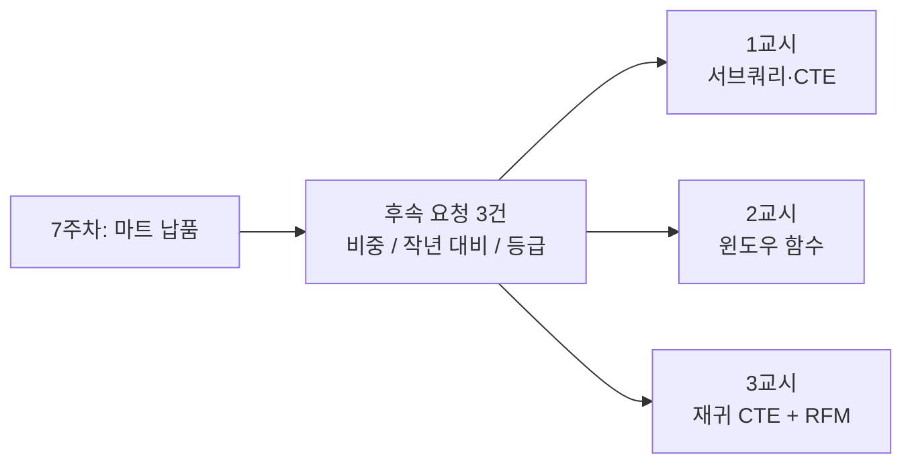

# FinDA 8주차 1일차 — 비즈니스 질문을 SQL로: 고급 쿼리 패턴

> 8주차 첫날(3시간) 강의안. 서브쿼리·CTE·윈도우 함수·재귀 CTE를 "문법"이 아니라 "루프를 집합으로 바꾸는 사고방식"으로 배우고, 마케팅팀의 실제 후속 요청 세 가지에 직접 답하는 날입니다. 오늘 배우는 것들은 내일(시계열·리스크·FDS 분석)과 모레(재무분석)의 부품이 됩니다.

---

## 오늘의 개요

| 구분 | 시간 | 내용 |
| --- | --- | --- |
| Session 1-1 | 50분 | 서브쿼리와 CTE — 집합적 사고, 실습(17분) |
| 쉬는 시간 | 10분 | |
| Session 1-2 | 50분 | 윈도우 함수 심화 — 순위·비중·시계열, 실습(15분) |
| 쉬는 시간 | 10분 | |
| Session 1-3 | 50분 | 재귀 CTE + 종합 실습 RFM(23분) |
| 쉬는 시간 | 10분 | |
| 합계 | 180분 (3시간) | |

### 오늘의 학습 목표

- (1) 루프로 풀고 싶어지는 문제를 집합 연산(서브쿼리, CTE, 윈도우 함수)으로 바꿔 쓸 수 있다.
- (2) 서브쿼리 3형태(스칼라, 인라인 뷰, 상관)를 구분하고, anti-join 두 문형(NOT EXISTS, LEFT JOIN … IS NULL)을 쓸 수 있다.
- (3) CTE를 단계 분리·산출물 이름·그레인 주석과 함께 "설계"할 수 있다.
- (4) OVER의 3요소(PARTITION BY, ORDER BY, FRAME)로 비중, Top-N(QUALIFY), 작년 대비(LAG), 누적·이동 집계를 구현할 수 있다.
- (5) 재귀 CTE의 구조(앵커, 재귀부, 종료 조건)를 이해하고, 언제 쓰고 언제 쓰지 않을지 판단할 수 있다.
- (6) RFM 고객 등급화를 다단계 CTE 파이프라인으로 완성할 수 있다.

### 오늘 시작 전 확인 사항

- (1) 7주차 산출물이 살아 있는지 확인하세요: `tabformer` 3테이블(transactions, users, cards), 과제로 만든 **`tabformer.silver_transactions`**(정제·파티션·클러스터가 끝난 Silver 테이블)와 `tabformer_mart`. "지우지 마세요"라고 했던 그것들을 오늘부터 본격적으로 씁니다. 오늘 실습은 거의 전부 `silver_transactions` 위에서 돕니다 — 없거나 지웠다면 아래 한 문장으로 다시 만드세요.
- (2) 수요일에 배포한 **윈도우 프레임 손풀기 워크시트**를 안 풀었다면 지금이라도 STEP 1(손계산)만 채우고 오세요. 2교시가 훨씬 편해집니다.
- (3) 쿼리 실행 전 우측 상단 "이 쿼리를 실행하면 N 처리됨" 미리보기 확인 — 7주차부터의 습관, 이번 주도 계속입니다.
- (4) **읽기는 강사 프로젝트, 쓰기는 본인 프로젝트.** 자료의 쿼리는 강사 프로젝트(`finda-week7-505502`) 기준입니다. 본인 적재본이 있으면 그것을 써도 됩니다.
- (5) **오늘의 시계는 2020년 초에 맞춰져 있습니다.** TabFormer 거래는 2020년 초에 끝납니다. 그래서 오늘 "최근"과 "작년"은 달력이 아니라 **데이터의 시계** 기준입니다. 이 약속은 사흘 내내 유지됩니다.

```sql
-- 7주차 과제 산출물입니다. 없거나 지웠다면 이 한 문장으로 다시 만드세요.
-- (자료는 강사 프로젝트 기준. 만들 때는 프로젝트 ID를 본인 것으로 바꾸세요.)
-- 한 행 = 결제 1건 (금액과 날짜를 정제한 버전)
CREATE OR REPLACE TABLE `finda-week7-505502.tabformer.silver_transactions`
PARTITION BY DATE_TRUNC(tx_date, MONTH)
CLUSTER BY mcc, user_id
AS
SELECT
    DATE(t.year, t.month, t.day)                                        AS tx_date,
    SAFE.PARSE_TIME("%H:%M", t.time)                                    AS tx_time,
    t.user_id,
    t.card_id,
    SAFE_CAST(REPLACE(REPLACE(t.amount, "$", ""), ",", "") AS NUMERIC)  AS amount_usd,
    t.use_chip,
    t.merchant_name,
    t.merchant_city,
    t.merchant_state,
    t.zip,
    t.mcc,
    t.errors,
    t.is_fraud
FROM `finda-week7-505502.tabformer.transactions` AS t;
```

> 이 테이블의 두 가지 성질을 오늘부터 사흘 내내 씁니다. **(1) `tx_time`은 문자열이 아니라 TIME 타입**입니다 — 원본의 `'13:22'` 문자열을 과제에서 `SAFE.PARSE_TIME`으로 이미 변환해 두었습니다. **(2) 월 파티션 + `mcc`·`user_id` 클러스터**가 걸려 있어, 날짜·업종·사용자로 좁히는 쿼리는 원본보다 훨씬 쌉니다 — 오늘 실습의 처리 바이트가 작게 나오는 이유이고, 7주차에 파티션을 건 보람이기도 합니다.

오늘의 큰 그림 한 줄: 7주차가 "데이터를 올리고, 이해하고, 기반을 지은" 주였다면, 오늘은 **"그 기반 위에서 어려운 질문에 답하는 날"**입니다.

---

## Session 1-1. 서브쿼리와 CTE — 집합적 사고 (50분)

### 1-1. 도입: 마케팅팀에서 후속 요청이 도착했습니다 (5분)

지금은 2020년 초. 7주차 과제로 납품한 월간 소비 마트를 마케팅팀이 잘 쓰고 있답니다. 그런데 후속 요청이 도착했습니다.

| 요청 | 원문 | SQL로 번역하면 |
| --- | --- | --- |
| 요청 1 | "업종별 소비가 그 달 전체의 몇 %인지 **비중**도 나란히 보고 싶어요" | 집계 결과 위에 창을 얹는 문제 (2교시) |
| 요청 2 | "연령대별로 **작년 같은 달 대비** 증감률이 필요해요" | 떨어져 있는 행을 옆으로 당겨오는 문제 (2교시) |
| 요청 3 | "**우수 고객 등급**을 나눠 주세요. 캠페인 대상을 정하게요" | 여러 단계를 쌓아 올리는 문제 (3교시) |

세 요청의 공통점: **GROUP BY만으로는 답이 안 나옵니다.** GROUP BY는 행을 "접어서" 요약하는데, 마케팅팀은 "행을 유지한 채 나란히" 보고 싶어 합니다. 오늘 하루가 이 간극을 메우는 날입니다.



### 1-2. 절차형 vs 집합: 루프를 버리면 SQL이 보인다 (5분)

파이썬으로 3주를 보낸 여러분의 손은 이렇게 움직이고 싶어 합니다.

> "고객마다 반복해서: 거래를 조회하고 → 계산하고 → 결과를 저장한다."

절차형 사고입니다. 익숙하지만, 2,400만 행이면 2,400만 번의 왕복이고, BigQuery 같은 분석 엔진에서는 느리고 비싼 길입니다.

| | 절차형 (한 번에 한 행) | 집합 (한 번에 전체) |
| --- | --- | --- |
| 사고방식 | "각 행에 대해 반복하라" | "전체 집합에 이 연산을 **선언**하라" |
| 반복의 주체 | 내가 쓴 루프 | 엔진이 알아서 병렬 처리 |
| 도구 | 커서, for문 | 서브쿼리, CTE, 윈도우 함수 |

핵심 질문 하나를 던져 봅니다. **"고객별로 직전 거래와 비교하고 싶다 — 루프 없이 어떻게?"** 이 질문이 바로 윈도우 함수가 존재하는 이유입니다. 루프를 짜고 싶어지는 문제마다, SQL은 집합의 답을 이미 준비해 두었습니다. 오늘은 그 목록을 채우는 날입니다.

### 1-3. 서브쿼리 3형태 — 어디에 넣느냐가 정체성 (10분)

서브쿼리는 "쿼리 안의 쿼리"인데, **어느 절에 넣느냐**에 따라 성격이 완전히 다릅니다.

- (1) **스칼라 서브쿼리**: 값 하나를 돌려줍니다. SELECT 절과 WHERE 절에서 값처럼 쓰입니다.
- (2) **인라인 뷰**: FROM 절 안의 임시 테이블입니다. "집계 결과를 다시 집계"할 때 씁니다. 이름이 없다는 것이 약점 — 잠시 뒤 CTE로 승격됩니다.
- (3) **상관 서브쿼리**: 바깥 쿼리의 행을 참조합니다. "이 고객에게 ~가 존재하는가" 같은 질문에 EXISTS와 짝을 이룹니다.

스칼라 서브쿼리의 대표 예 — "평균보다 많이 쓴 달은 언제인가?"

```sql
WITH monthly AS (    -- 한 행 = 월
    SELECT
        DATE_TRUNC(DATE(t.year, t.month, t.day), MONTH) AS ym,
        SUM(SAFE_CAST(REPLACE(t.amount, '$', '') AS NUMERIC)) AS spend
    FROM `finda-week7-505502.tabformer.transactions` AS t
    GROUP BY ym
)
SELECT m.ym, m.spend
FROM monthly AS m
WHERE m.spend > (SELECT AVG(x.spend) FROM monthly AS x)    -- 스칼라: 값 하나
ORDER BY m.ym
```

읽는 법: `monthly`를 두 번 참조하지만 정의는 한 번입니다. 인라인 뷰로 짰다면 같은 집계를 두 군데 복사했을 것이고, 읽는 사람도 두 번 해석해야 했을 겁니다.

상관 서브쿼리는 "바깥 행마다 평가된다"가 기본 그림입니다. 2,400만 행 테이블 바깥에 무심코 걸면 비용이 튈 수 있으니, 실행 전 미리보기 바이트 확인을 잊지 마세요.

### 1-4. 없는 것을 찾는 두 가지 문장: anti-join (5분)

"거래가 **없는** 카드를 찾아라" — 조인은 있는 것을 붙이는 도구인데, 없는 것은 어떻게 찾을까요? 두 가지 표준 문형이 있습니다.

```sql
-- 문형 1: NOT EXISTS — 뜻이 문장에 드러난다
SELECT c.user, c.card_index
FROM `finda-week7-505502.tabformer.cards` AS c
WHERE NOT EXISTS (
    SELECT 1
    FROM `finda-week7-505502.tabformer.transactions` AS t
    WHERE t.user_id = c.user
      AND t.card_id = c.card_index
)
```

```sql
-- 문형 2: LEFT JOIN … IS NULL — 조인 후 "짝이 없던 행"만 남긴다
SELECT c.user, c.card_index
FROM `finda-week7-505502.tabformer.cards` AS c
LEFT JOIN `finda-week7-505502.tabformer.transactions` AS t
    ON  t.user_id = c.user
    AND t.card_id = c.card_index
WHERE t.user_id IS NULL
```

BigQuery에서는 둘 다 잘 동작합니다. 선택 기준은 성능이 아니라 **가독성** — "존재하지 않는다"를 말하고 싶으면 NOT EXISTS가 문장에 더 가깝습니다.

7주차 최다 오답 복습: cards의 키 이름은 `user`입니다(`user_id`가 아님). 카드 한 장의 특정은 `(user, card_index)` **복합 키**이고, 둘 다 0부터 시작합니다.

### 1-5. CTE는 "문법"이 아니라 "설계"다 (5분)

WITH 절 자체는 이미 씁니다. 오늘부터는 **설계 규칙**을 얹습니다.

- (1) **한 단계 = 한 가지 일.** 정제, 집계, 판정을 한 덩어리에 섞지 않습니다.
- (2) **이름은 중간 산출물로.** `monthly_spend`처럼 "무엇이 만들어졌는지"가 이름이 되게 합니다.
- (3) **그레인 주석.** 각 CTE 첫 줄에 `-- 한 행 = 사용자 × 월`을 선언합니다. 7주차 마트 설계 원칙 그대로입니다.
- (4) **체이닝.** 아래 CTE는 위 CTE를 재료로 삼아, 위에서 아래로 읽히게 합니다.

```sql
WITH clean AS (      -- 한 행 = 거래 1건 (금액 정제)
    ...
), monthly AS (      -- 한 행 = 사용자 × 월 (clean을 재료로)
    ...
), ranked AS (       -- 한 행 = 사용자 × 월 + 순위 (monthly를 재료로)
    ...
)
SELECT * FROM ranked
```

리뷰어가 좋은 쿼리를 읽는 순서는 "CTE 이름만 위에서 아래로"입니다. 이름과 그레인 주석만 훑어도 로직이 보이면 좋은 설계입니다. **오늘 실습부터 그레인 주석을 채점 포인트로 봅니다.**

### 1-6. 실습: 마케팅팀 리포트, 세 문제 (17분)

모든 문제는 표준 스니펫(금액 정제, 날짜 조립, SAFE_DIVIDE)을 그대로 씁니다. 순서 규칙: **비즈니스 질문 → 그레인 결정 → SQL.** "한 행이 무엇인가"를 먼저 적으세요.

**문제 1 (워밍업).** 월별 활성 사용자 수와 사용자당 평균 거래 건수는?

- 기대 결과 형태: `ym, active_users, tx_cnt, tx_per_user` — 월 수만큼의 행
- 힌트: COUNT(DISTINCT ...)와 COUNT(*), 그리고 둘의 비율(SAFE_DIVIDE)

**문제 2 (본문제).** 채널(`use_chip`)별 사용자 수, 거래액, 사기율, 사용자당 거래액은? 마케팅팀이 "온라인 채널에 캠페인 예산을 더 태워도 되는지" 판단하려 합니다.

- 기대 결과 형태: `channel, users, spend_usd, fraud_rate, spend_per_user` — 3행 (채널 3종)
- 힌트: 7주차 Day 2의 4번 문제(채널별 사기율)에 열 두 개를 추가하는 문제입니다. `COUNTIF(t.is_fraud = 'Yes')`.

**문제 3 (도전).** 발급만 되고 **한 번도 긁히지 않은 카드**는 몇 장인가? 카드 운영팀이 휴면 카드 정리를 검토 중입니다.

- 기대 결과 형태: 숫자 1개 (그리고 여유가 되면 카드 목록)
- 힌트: anti-join. 복합 키 `(user, card_index)` ↔ `(user_id, card_id)`.

### 1-7. 정리와 복선 (3분)

- (1) 서브쿼리 3형태 — 스칼라(값), 인라인 뷰(테이블), 상관(바깥 행 참조)
- (2) 없는 것 찾기 — NOT EXISTS ↔ LEFT JOIN … IS NULL
- (3) CTE는 설계 — 단계 분리, 산출물 이름, 그레인 주석, 체이닝

복선 하나. 방금 실습에서 나온 **채널별 사기율, 전체로는 약 0.12%** — 이 작은 숫자를 기억해 두세요. 내일 3교시 사기 탐지(FDS)에서 "정확도 99.9% 모델의 함정"과 함께 돌아옵니다.

---

## Session 1-2. 윈도우 함수 심화 — 순위·비중·시계열 (50분)

### 2-1. OVER의 3요소: 행을 접지 않고 옆에 쓴다 (5분)

GROUP BY와 윈도우 함수의 차이를 숫자로 기억합시다. **GROUP BY: 1,000행 → 12행. OVER: 1,000행 → 1,000행 + 열 하나.** "행을 유지한 채 집계값을 옆에 쓴다" — 이것이 윈도우 함수의 전부이고, 마케팅팀의 "나란히 보고 싶다"가 정확히 이 요구입니다.

OVER 괄호 안은 세 부품으로 구성됩니다.

```sql
SUM(v.amount_usd) OVER (PARTITION BY v.user_id      -- (1) 창을 나눈다
                        ORDER BY v.tx_date          -- (2) 창 안에서 줄 세운다
                        ROWS BETWEEN 6 PRECEDING    -- (3) 줄에서 범위를 자른다
                             AND CURRENT ROW)
```

- (1) PARTITION BY: 창을 나눕니다. 생략하면 전체가 하나의 창.
- (2) ORDER BY: 창 안에서 줄을 세웁니다. 순위·오프셋·누적의 전제.
- (3) FRAME: 줄에서 계산 범위를 자릅니다. 생략 시 기본값이 있다는 것이 함정 (워크시트에서 다뤘습니다).

### 2-2. 비중: SUM() OVER (PARTITION BY 월) (5분)

마케팅팀 요청 1번의 답입니다. 분자(업종별 합)는 GROUP BY가 만들고, 분모(월 전체 합)는 그 결과 위에 창을 열어 얻습니다.

```sql
WITH monthly_mcc AS (    -- 한 행 = 월 × 업종
    SELECT
        DATE_TRUNC(v.tx_date, MONTH) AS ym,
        v.mcc,
        SUM(v.amount_usd) AS spend
    FROM `finda-week7-505502.tabformer.silver_transactions` AS v
    GROUP BY ym, v.mcc
)
SELECT
    m.ym, m.mcc, m.spend,
    SAFE_DIVIDE(m.spend, SUM(m.spend) OVER (PARTITION BY m.ym)) AS month_share
FROM monthly_mcc AS m
ORDER BY m.ym, month_share DESC
```

이 패턴의 이름은 ratio-to-total(전체 대비 비중)입니다. 실무 리포트의 단골 중의 단골입니다.

### 2-3. 순위 4종과 QUALIFY (7분)

"Top 5 뽑아 주세요"라는 요청에서 동점이 있으면 함수마다 답이 다릅니다. 소비액이 100, 100, 90일 때:

| 함수 | 동점 처리 | 결과 | 주 용도 |
| --- | --- | --- | --- |
| ROW_NUMBER() | 동점 없이 강제로 한 줄 세우기 | 1, 2, 3 | 중복 제거, 표본 추출 |
| RANK() | 동점 같은 등수, 다음은 건너뜀 | 1, 1, 3 | 성적표식 순위 |
| DENSE_RANK() | 동점 같은 등수, 촘촘하게 | 1, 1, 2 | 등급 나누기 |
| NTILE(n) | 전체를 n등분한 버킷 번호 | 1~n | RFM 점수화 (3교시) |

ROW_NUMBER는 동점 하나를 버리고, RANK는 Top 5가 6개가 될 수도 있습니다. **어느 것이 비즈니스가 원한 답인지 먼저 물어보는 것**이 분석가의 일입니다.

그리고 BigQuery의 관용구 하나 — **QUALIFY는 "윈도우의 HAVING"**입니다. WHERE는 행을, HAVING은 그룹을, QUALIFY는 윈도우 결과를 거릅니다.

```sql
-- 업종별 소비 상위 3개 도시 — 감싸는 CTE 없이 한 문장
SELECT c.mcc, c.merchant_city, c.spend
FROM city_spend AS c
QUALIFY RANK() OVER (PARTITION BY c.mcc ORDER BY c.spend DESC) <= 3
```

CTE로 감싸서 `WHERE rk <= 3`을 거는 방식은 "다른 DB 이식용"으로만 기억해 두세요. 현대 웨어하우스(BigQuery, Snowflake 등) 공통 관용구라 실무 코드 리딩과 면접에 반드시 나옵니다.

### 2-4. LAG/LEAD 심화: 작년 같은 달 대비 (5분)

마케팅팀 요청 2번. 7주차에 LAG/LEAD 5문제를 풀었으니 개념은 복습만 하고, 오늘은 **오프셋의 함정**을 짚습니다.

```sql
WITH m AS (    -- 한 행 = 연령대 × 월
    SELECT u.age_group, m.ym, SUM(m.spend) AS spend
    FROM mart AS m ...
    GROUP BY age_group, ym
)
SELECT
    m.age_group, m.ym, m.spend,
    LAG(m.spend, 12) OVER (PARTITION BY m.age_group ORDER BY m.ym) AS spend_last_yr,
    SAFE_DIVIDE(m.spend,
                LAG(m.spend, 12) OVER (PARTITION BY m.age_group
                                       ORDER BY m.ym)) - 1 AS yoy
FROM m
```

함정: **LAG(…, 12)는 "12행 전"이지 "12개월 전"이 아닙니다.** 중간에 빈 월이 있으면 조용히 어긋납니다. 견고한 해법은 (1) 빈 월을 채우거나(3교시 날짜 스파인) (2) 월 키를 직접 계산해 셀프조인하는 것입니다.

### 2-5. 프레임: ROWS와 RANGE는 다른 자를 쓴다 (7분)

`ORDER BY tx_date`로 누적합을 구하는데 **같은 날 거래가 두 건**이면 어떻게 될까요? 칠판 예제:

| tx_date | 금액 | ROWS 누적 | RANGE 누적 |
| --- | --- | --- | --- |
| 1월 1일 | 10 | 10 | 10 |
| 1월 2일 | 20 | 30 | **60** |
| 1월 2일 | 30 | 60 | **60** |
| 1월 3일 | 40 | 100 | 100 |

- (1) **ROWS는 행 개수의 자**입니다. 물리적으로 몇 행 앞뒤인지로 창을 자릅니다.
- (2) **RANGE는 ORDER BY 값의 자**입니다. 동점(같은 날짜)은 전체가 한 묶음 — 1월 2일 두 행의 누적이 똑같이 60이 되는 이유입니다.

"같은 시각까지 포함해 최근 1시간" 같은 시간 윈도우 룰에서는 RANGE가 의미상 맞는 자입니다 — 내일 FDS의 velocity 룰에서 실전으로 씁니다.

참고로 FIRST_VALUE/LAST_VALUE라는 함수도 있습니다(창의 첫 값·끝 값). 오늘은 존재만 알아 두세요.

### 2-6. 최다 혼동: 집계 위에 창을 얹는 순서 (3분)

`SUM(SUM(spend)) OVER ()` — 문법상 유효하지만 읽는 사람이 두 번 멈칫합니다. 순서 규칙 하나만 기억하세요. **"창은 GROUP BY가 끝난 뒤의 세상에서 열린다."** 집계 CTE를 먼저 만들고 그 위에 윈도우를 얹으면(2-2의 패턴) 머리가 꼬일 일이 없습니다. 오늘 실습과 3교시 RFM 전부 이 패턴입니다.

### 2-7. 실습: 마케팅팀 요청 1·2번에 답하기 (15분)

1단계는 언제나 그레인 확인입니다. 마트의 한 행이 문제의 그레인과 다르면, 먼저 재집계 CTE로 맞추세요.

**문제 1.** 월별 업종 소비액 + 그 달 전체 대비 비중 + 업종 내 소비 상위 3개 도시.

- 기대 결과 형태: (a) `ym, mcc, spend, month_share` (b) `mcc, merchant_city, spend` — 업종별 3행씩
- 힌트: SUM() OVER (PARTITION BY ym), QUALIFY RANK(). 온라인 거래(`merchant_city = 'ONLINE'`)는 도시 순위에서 제외할지 스스로 결정하고, 결정을 주석으로 남기세요.

**문제 2.** 연령대별로 2019년 각 월의 작년 같은 달 대비 소비 증감률.

- 기대 결과 형태: `age_group, ym, spend, spend_last_yr, yoy` — 연령대 × 2019년 12개월
- 힌트: 재집계 CTE(한 행 = 연령대 × 월) → LAG(…, 12). 2018년 데이터가 창에 있어야 2019년 1월의 작년 대비가 나옵니다 — WHERE를 어디에 두는지가 이 문제의 핵심입니다.

### 2-8. 정리와 복선 (3분)

- (1) OVER 3요소 — PARTITION(창), ORDER(줄), FRAME(범위)
- (2) QUALIFY — 윈도우의 HAVING, Top-N 관용구
- (3) ROWS vs RANGE — 행 개수의 자 vs 값의 자
- (4) 집계 위의 창 — 창은 GROUP BY가 끝난 세상에서 열린다

나눠드리는 문제지 하나 — **"7일 이동평균, 두 가지 풀이"** 스켈레톤(윈도우 풀이 vs 셀프조인 풀이). 오늘은 풀지 않습니다. 내일 1교시 시계열 분석(볼린저 밴드·이상 탐지)의 재료입니다.

---

## Session 1-3. 재귀 CTE + 종합 실습 (50분)

### 3-1. 워밍업: 직전 거래에서 며칠 만인가 (4분)

2교시 LAG 복습 겸, 잠시 뒤 쓸 부품을 만들어 둡니다.

```sql
SELECT
    v.user_id, v.tx_date,
    DATE_DIFF(v.tx_date,
              LAG(v.tx_date) OVER (PARTITION BY v.user_id ORDER BY v.tx_date),
              DAY) AS days_since_prev    -- 첫 거래는 NULL
FROM `finda-week7-505502.tabformer.silver_transactions` AS v
```

이 "경과일"이 곧 RFM의 R(Recency)이 됩니다. 고급 SQL의 부품은 재사용됩니다 — 같은 LAG가 내일은 "연속 거래의 지역 점프 탐지"로 다시 나옵니다.

### 3-2. 재귀 CTE: 행이 행을 낳는 문법 (13분)

지금까지의 모든 윈도우 연산은 "이미 있는 행" 위를 창이 지나가는 것이었습니다. 재귀 CTE는 다릅니다 — **행이 행을 낳습니다.**

```sql
WITH RECURSIVE seq AS (
    SELECT 1 AS n              -- (1) 앵커: 시작 행
    UNION ALL
    SELECT s.n + 1             -- (2) 재귀부: 직전 결과를 참조
    FROM seq AS s
    WHERE s.n < 10             -- (3) 종료 조건: 거짓이 되면 멈춤
)
SELECT * FROM seq              -- 1~10, 열 행
```

MySQL 8.0에도 있는 표준 문법이고, 계층(조직도)·경로·연속 행 생성 문제의 정석입니다. 나눠드린 **짝풀이 워크시트의 장난감 조직도**(인라인 데이터, 과금 0)로 5분 손풀기부터 합니다.

실전 용례 — **날짜 스파인**. "거래가 없는 날도 행이 있어야" 이동평균 같은 시계열 계산이 안 깨집니다.

```sql
-- 재귀로 (원리): 2019년 1년 치, 365행
WITH RECURSIVE dates AS (
    SELECT DATE '2019-01-01' AS d
    UNION ALL
    SELECT DATE_ADD(dt.d, INTERVAL 1 DAY)
    FROM dates AS dt
    WHERE dt.d < DATE '2019-12-31'
)
SELECT dt.d FROM dates AS dt
```

이걸 2년 치로 늘려 직접 실행해 보면 — **재귀 반복 한도(약 500회)에 막힙니다.** 한도에 부딪히는 것까지가 오늘의 수업입니다. 그래서 BigQuery의 실무 관용구는 배열 함수 한 줄입니다.

```sql
-- 실무 관용구: GENERATE_DATE_ARRAY
SELECT d
FROM UNNEST(GENERATE_DATE_ARRAY('2019-01-01', '2019-12-31')) AS d
```

언제 재귀인가 — 판단 기준은 하나입니다. **"행이 행을 낳는가?"**

| 윈도우로 충분한 것 (행 수 불변) | 재귀가 필요한 것 (행이 행을 낳음) |
| --- | --- |
| 누적합, 이동평균, 순위, 직전 비교 | 조직도·추천 체인 같은 계층 탐색 |
| 이미 있는 행 위를 창이 지나감 | 날짜 스파인 등 없는 행 만들기 |
| 2교시에 배운 전부 | 경로 누적 (A → B → C) |

면접 답변용 한 줄: "반복의 깊이를 미리 알 수 없으면 재귀, 알 수 있으면 윈도우나 조인으로 풉니다."

### 3-3. RFM: 개념과 파이프라인 (7분)

마케팅팀 요청 3번 — 고객 등급화의 표준 프레임이 RFM입니다.

- (1) **R(Recency)**: 기준일 − 마지막 거래일. 최근일수록 살아있는 고객.
- (2) **F(Frequency)**: 기간 내 거래 건수. 습관의 강도.
- (3) **M(Monetary)**: 기간 내 거래 금액 합. 기여의 크기.

시작하기 전에 가장 중요한 결정 — **분석 기준일.** 기준일에 CURRENT_DATE()를 쓰면 전원이 "6년 전 이탈 고객"이 됩니다. 이 데이터의 시계는 2020년에 멈춰 있으니까요. **기준일 = 데이터 최대 거래일**을 CTE로 고정하는 것이 파이프라인의 1단계입니다. 시점 없는 분석은 분석이 아닙니다.

파이프라인은 CTE 다섯 단입니다. 오늘 배운 전부가 들어갑니다.

- (1) 기준일 고정 — `MAX(tx_date)` 한 행
- (2) 사용자별 R·F·M — MAX, COUNT, SUM (F·M은 최근 2년, 2018~2019만)
- (3) 점수화 — NTILE(5)로 각 지표를 5분위 점수로
- (4) 등급 매핑 — CASE로 점수 조합에 이름 붙이기 (Champions, At Risk, …)
- (5) 프로파일 — 등급별 인원, 소비, 주력 업종

### 3-4. 실습: "Champions는 누구이고, 어디에 쓰는가" (23분)

- **출력 1**: 등급별 사용자 수와 전체 대비 비중 — `grade, users, share`
- **출력 2**: Champions 등급의 주력 업종 Top 3 — `mcc, spend` 3행
- **체크**: 각 CTE에 그레인 주석, 기준일 CTE 포함 여부 (설계 채점 포인트)

이 문제의 단골 오답 — **NTILE의 방향.** R은 "작을수록 좋은" 지표입니다. 점수 5점이 최고가 되도록 ORDER BY 방향을 스스로 결정하세요. 방향이 뒤집히면 Champions와 이탈 고객이 뒤바뀝니다.

일찍 끝나면: 등급별 평균 FICO 점수를 붙여 보세요(users 조인). 내일 리스크 분석의 예고편입니다.

### 3-5. 마무리: 코호트 브리지와 과제 예고 (3분)

과제 Part A는 **코호트 잔존율**입니다. RFM의 R이 "마지막 거래가 언제였나"라는 스냅숏 한 장이라면, 코호트 잔존율은 "첫 거래 후 매달 살아있었나"라는 **시간축 필름**입니다. 3단 스켈레톤(첫 거래월 → 경과월 → 코호트×경과월 집계)이 과제 안내문에 포함됩니다.

내일 예고: 오늘 만든 무기로 금융 데이터 분석 3종 — 시계열(볼린저 밴드), 리스크(FICO·DTI), 사기탐지(FDS, 그 0.12%).

---

## 자주 만나는 오류와 해결 (참고용, 실습 중 막히면 여기부터)

| 증상 | 원인 | 해결 |
| --- | --- | --- |
| anti-join 결과가 0행 | 정상일 수 있음 (합성 데이터라 모든 카드에 거래가 있는 경우) | 변형 문제("2019년에 거래가 없던 카드")로 전환 |
| 조인 후 행이 크게 늘어남 | `(user, card_index)` 복합 키에서 card_index 누락 | ON 절에 두 키 모두 명시 |
| LAG 결과가 전부 NULL | PARTITION 안에 행이 1개뿐이거나 ORDER BY 누락 | 그레인 확인 (재집계 CTE 먼저) |
| yoy가 이상하게 큼/작음 | LAG(…, 12)가 빈 월 때문에 어긋남 | 월 스파인 조인 또는 월 키 셀프조인 |
| QUALIFY 문법 오류 | SELECT에 윈도우 함수 없이 QUALIFY만 쓴 경우 등 | QUALIFY 절 안에 OVER를 직접 쓰는 형태로 |
| 재귀 CTE가 에러로 멈춤 | 반복 한도 초과 (스파인을 너무 길게) | 기간을 1년 이하로, 실전은 GENERATE_DATE_ARRAY |
| NTILE 점수가 반대 | ORDER BY 방향 (R은 DESC로 세워야 최근=5점) | 지표의 "좋은 방향"을 먼저 적고 방향 결정 |
| 처리 바이트가 GB 단위 | 원본 직접 조회 | 마트/뷰 사용, 연도 필터, 필요한 컬럼만 |

---

## 다음 시간 예고

- (1) 내일(2일차)은 **SQL로 하는 금융 데이터 분석** — 시계열(이동평균·볼린저 밴드·이상 탐지), 리스크(FICO·DTI·집중도), 사기탐지(FDS 룰과 성적표)입니다. 오늘의 윈도우 함수가 전부 재등장합니다.
- (2) 나눠드린 "7일 이동평균 두 가지 풀이" 문제지를 내일 1교시에 폅니다.
- (3) 과제 안내는 별도 공지로 나갑니다 (Part A: 코호트 잔존율).

---

오늘의 핵심 교훈 한 줄: **"행을 접지 말고 옆에 쓰고, 루프를 버리고 집합으로 선언하라 — 좋은 쿼리는 문법이 아니라 설계에서 나온다."**
