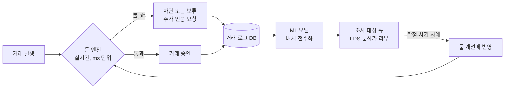
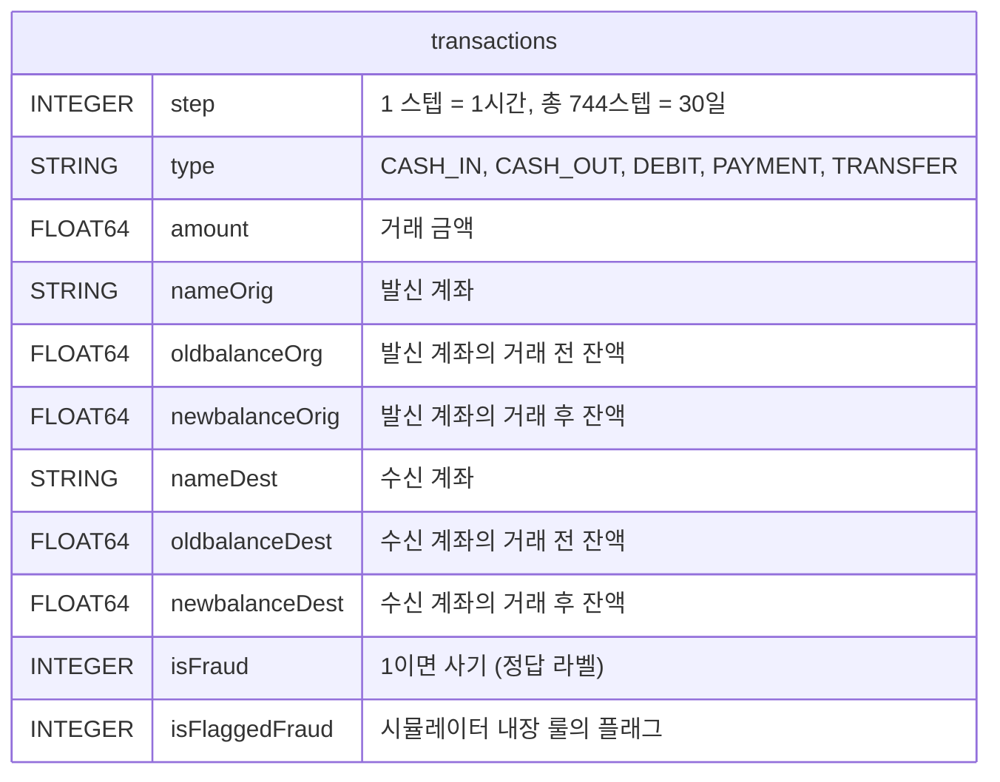
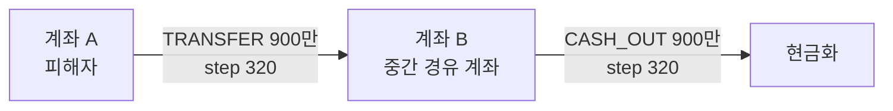

# 8주차 Day 2 강의안: FDS 전처리 — 의심 거래 SQL 패턴

> 8주차 Day 2 (토, 3시간) 수업용 강의안. Session 2-1부터 2-3까지 180분. PaySim 데이터로 rule-based FDS 룰 4개를 SQL로 구현하고 precision과 recall로 평가합니다.

---

## 0. 오늘 수업의 큰 그림

| 세션 | 시간 | 주제 |
| --- | --- | --- |
| Session 2-1 | 50분 | FDS 도메인 이해와 PaySim 소개 |
| Session 2-2 | 60분 | 룰 1군: 잔액 일관성 그리고 시간 윈도우 다중 거래 |
| Session 2-3 | 70분 | 룰 2군: 자금 흐름 패턴 (LAG/LEAD, self-join) |

사전 준비물:

- (1) 7주차에 만든 GCP 프로젝트와 BigQuery 접근 권한
- (2) PaySim 데이터가 BigQuery 데이터셋 `paysim`에 적재된 상태 (적재 절차는 Session 2-1 참고 — 사전 과제로 완료하고 오는 것을 권장)

**중요**: 오늘 작성하는 룰 4개는 8주차 과제 Part B와 직결됩니다. 수업 중 작성한 쿼리를 반드시 저장해 두세요. 과제에서는 오늘의 룰 3개에 본인이 설계한 자유 룰 1개를 더해 제출하게 됩니다.

---

## Session 2-1. FDS 도메인 이해와 PaySim 소개 (50분)

| 구간 | 시간 | 내용 |
| --- | --- | --- |
| (1) | 10분 | 도입: 오늘 만들 룰은 "잘 안 맞는 게 정상" |
| (2) | 15분 | FDS 실무 구조: 룰 엔진 + ML의 2단 구조 |
| (3) | 15분 | PaySim 스키마와 시뮬레이션 한계 |
| (4) | 10분 | 적재 확인과 워밍업: "어떤 거래가 수상할까?" |

**학습 목표**

- (1) 실무 FDS가 rule-based 실시간 차단과 ML 배치 점수화의 2단 구조로 돌아가는 이유를 설명할 수 있다
- (2) PaySim 스키마와 시뮬레이션 데이터의 한계를 이해하고, 탐지 룰의 가설을 스스로 세울 수 있다

### (1) 도입: 오늘 만들 룰은 "잘 안 맞는 게 정상"입니다 (10분)

수업을 시작하기 전에, 오늘 하루의 기대치를 먼저 맞추고 갑니다. 이 메시지를 세션 처음에 반드시 전달하세요.

> **오늘 여러분이 만드는 룰은 100건을 잡아서 진짜 사기가 5건이어도 정상입니다.**
> 룰 기반 탐지는 원래 precision이 낮습니다. PaySim의 사기 비율은 약 0.13%로, 636만 건 중 진짜 사기는 8천 건 남짓입니다. 이렇게 극단적으로 치우친 데이터에서는 아무리 그럴듯한 룰을 짜도 오탐(false positive)이 진짜 사기보다 훨씬 많이 걸립니다.
> 실무도 똑같습니다. 룰 엔진의 역할은 "확실한 것만 정확히 잡기"가 아니라 "수상한 것을 넓게 건져 올리기"이고, 건져 올린 것을 정밀하게 걸러내는 일은 뒤에 있는 ML 모델과 FDS 분석가가 맡습니다. 그래서 룰의 precision이 낮게 나오는 것은 여러분이 못해서가 아니라 이 구조가 원래 그렇게 설계된 것입니다.

이 기대치를 깔아 두지 않으면, 실습에서 confusion matrix를 처음 뽑아 본 순간 "내 룰이 쓰레기인가?"라는 좌절이 옵니다. 반대로 기대치를 깔아 두면 같은 결과가 "그래서 ML이 뒤따르는구나"라는 이해로 바뀝니다.

### (2) FDS 실무 구조: 룰 엔진과 ML의 2단 구조 (15분)

카드사와 송금사의 FDS(Fraud Detection System)는 크게 두 단으로 굴러갑니다.



- (1) **1단: 룰 엔진 (실시간)**. 거래 승인 요청이 들어오면 수십에서 수백 ms 안에 승인 여부를 돌려줘야 합니다. 이 짧은 시간 안에 평가할 수 있는 것은 "1시간 내 5회 이상 거래", "평소 한도의 10배 금액" 같은 명시적인 룰입니다. 룰에 걸리면 즉시 차단하거나, 문자 인증 같은 추가 확인을 요구합니다.
- (2) **2단: ML 모델 (배치 또는 준실시간)**. 실시간 관문을 통과한 거래도 로그로 쌓인 뒤 ML 모델이 다시 점수를 매깁니다. 점수가 높은 거래는 조사 대상 큐로 넘어가 FDS 분석가가 리뷰하고, 확정된 사기 사례는 다시 새 룰과 모델 학습 데이터로 되돌아갑니다. 이 순환 고리가 FDS의 심장입니다.

**"왜 룰 기반이 아직도 죽지 않았나"** — ML이 이렇게 발전했는데 왜 1단은 여전히 룰일까요? 세 가지 이유가 있습니다.

- (1) **설명 가능성**: 고객의 거래를 차단하면 "왜 막았는지"를 고객과 금융 당국에 설명해야 합니다. "1시간 내 5회 송금 룰에 걸렸습니다"는 한 문장으로 설명되지만, "모델 점수가 0.97이었습니다"는 설명이 아닙니다.
- (2) **금융 규제**: 금융권은 모델 리스크 관리와 자금세탁방지(AML) 규제를 받습니다. 의심거래보고(STR) 같은 의무는 "어떤 기준으로 의심했는가"를 문서화할 수 있어야 하고, 감사 가능한 룰이 그 기준 역할을 합니다.
- (3) **Latency**: 승인 응답 시간은 계약으로 묶인 성능 요건입니다. 룰 평가는 실행 시간이 짧고 예측 가능하지만, 복잡한 모델 추론은 그렇지 않습니다. 그래서 무거운 모델은 실시간 경로 밖(배치)으로 밀려납니다.

오늘 우리가 SQL로 하는 일이 바로 이 1단, 룰 엔진의 룰을 설계하고 데이터로 검증하는 일입니다. 그리고 이것은 9주차 이후 ML을 배울 때 feature engineering의 뿌리가 됩니다 — 좋은 룰은 그대로 좋은 피처가 됩니다.

### (3) PaySim: 스키마와 시뮬레이션 한계 (15분)

PaySim은 아프리카 모바일 머니 서비스의 실제 거래 로그를 바탕으로 만든 시뮬레이션 데이터입니다 (Kaggle: `ntnu-testimon/paysim1`). 계좌 간 송금과 입출금이 시간 순으로 기록되어 있고, 각 거래에 사기 여부 라벨(`isFraud`)이 붙어 있습니다.



테이블은 이 하나뿐입니다(약 636만 행). 7주차의 3-테이블 JOIN 구조와 달리, 오늘의 난이도는 테이블 구조가 아니라 **행과 행 사이의 관계**(같은 계좌의 이전 거래, 돈을 받은 계좌의 다음 행동)에서 나옵니다.

수업에서 짚어야 할 스키마 함정 네 가지:

- (1) **`oldbalanceOrg`는 오타가 아닙니다.** 발신 쪽 잔액 컬럼만 `Orig`가 아니라 `Org`로 적혀 있습니다 (`newbalanceOrig`는 `Orig`). 원본 데이터의 표기가 원래 이렇습니다. 쿼리에서 컬럼명을 틀리는 1순위 원인이니 칠판에 크게 적어 두세요.
- (2) **계좌 이름의 접두어**: `C`로 시작하면 고객(customer), `M`으로 시작하면 가맹점(merchant)입니다. 가맹점 계좌는 잔액 컬럼이 기록되지 않아 0으로 남습니다 — 잔액 룰을 짤 때 오탐의 원인이 됩니다.
- (3) **사기는 `TRANSFER`와 `CASH_OUT`에만 존재합니다.** PaySim의 사기 시나리오는 "계정을 탈취해 다른 계좌로 이체(TRANSFER)한 뒤 현금화(CASH_OUT)"로 고정되어 있습니다. 이 사실이 오늘 룰 2군(자금 흐름 패턴)의 근거가 됩니다.
- (4) **`isFlaggedFraud`는 정답이 아니라 시뮬레이터가 내장한 순진한 룰**(단일 거래 20만 초과 이체 시도)의 결과입니다. Session 2-2 마지막에 우리 룰과 비교해 봅니다.

**시뮬레이션 데이터의 한계** — 오늘 결과를 실제 카드사 데이터로 일반화하면 안 되는 이유:

- (1) 모바일 머니 도메인이라 카드 승인 거래와 구조가 다릅니다 (가맹점, MCC, 승인/취소 개념이 없음)
- (2) 사기 패턴이 한 가지 시나리오(탈취 후 이체와 현금화)로 단순합니다 — 실제 사기는 훨씬 다양하고 계속 진화합니다
- (3) 발신 계좌 대부분이 한 달 동안 몇 번 등장하지 않아, 실제 데이터보다 "동일 계좌 반복 거래" 패턴이 약합니다 (Session 2-2에서 직접 확인)
- (4) 시간 해상도가 1시간(step)이라 "1분 내" 같은 정밀한 시간 룰은 근사로만 구현됩니다

### (4) 적재 확인과 워밍업 (10분)

**적재 요약**: PaySim CSV는 약 470MB라 BigQuery 콘솔 직접 업로드 한도를 넘습니다. 7주차 Day 1의 거래 파일과 똑같이 **GCS 버킷을 경유**해 적재합니다. 상세 절차(버킷 생성, Cloud Shell, Kaggle API)는 「FinDA_7주차_1일차_BigQuery_데이터적재_가이드」를 그대로 따르고, 달라지는 부분만 요약하면 다음과 같습니다.

```bash
# Cloud Shell에서 실행 (7주차 가이드의 STEP 4와 동일한 흐름)
kaggle datasets download -d ntnu-testimon/paysim1
unzip paysim1.zip -d paysim
# 압축 해제 후 실제 CSV 파일명을 확인하세요 (PS_로 시작하는 긴 이름)
gcloud storage cp paysim/PS_*.csv gs://YOUR_BUCKET/paysim/

bq load --source_format=CSV --skip_leading_rows=1 \
  paysim.transactions \
  "gs://YOUR_BUCKET/paysim/PS_*.csv" \
  step:INTEGER,type:STRING,amount:FLOAT64,nameOrig:STRING,oldbalanceOrg:FLOAT64,newbalanceOrig:FLOAT64,nameDest:STRING,oldbalanceDest:FLOAT64,newbalanceDest:FLOAT64,isFraud:INTEGER,isFlaggedFraud:INTEGER
```

- `YOUR_BUCKET`은 본인 버킷 이름으로, 이후 쿼리의 `YOUR_PROJECT`는 본인 프로젝트 ID로 교체하세요. 데이터셋 `paysim`은 미리 만들어 둡니다 (버킷과 같은 위치로).
- 적재가 끝나면 **Schema 탭에서 실제 컬럼명을 꼭 확인**하세요. 데이터셋 버전에 따라 컬럼 구성이 다를 수 있고, 이후 모든 쿼리는 위 스키마 기준으로 작성되어 있습니다.
- 비용 습관: PaySim은 전체 스캔해도 약 0.5GB 수준이라 무료 한도(월 1TB) 안에서 여유롭지만, 쿼리 실행 전 우측 상단의 **"이 쿼리를 실행하면 N 처리됨" 미리보기를 확인하는 습관**을 오늘도 유지하세요. 내일(Day 3)은 이 숫자가 수백 GB로 뛰는 데이터를 다룹니다.

> 📷 스크린샷 추가 예정: BigQuery 콘솔에서 paysim.transactions 테이블의 Schema 탭 화면 (oldbalanceOrg 표기를 강조 표시)

적재 검증 쿼리:

```sql
-- 행 수와 사기 비율 확인
SELECT
    COUNT(*) AS n_tx,                                          -- 약 636만
    COUNTIF(t.isFraud = 1) AS n_fraud,                         -- 약 8,200
    ROUND(COUNTIF(t.isFraud = 1) / COUNT(*) * 100, 4) AS fraud_pct  -- 약 0.13
FROM `YOUR_PROJECT.paysim.transactions` AS t;
```

**워밍업: "어떤 거래가 수상할까?" (진행 가이드)**

쿼리를 짜기 전에, 학생들이 먼저 가설을 말하게 합니다. 진행 순서:

- (1) 질문을 던집니다: "여러분이 이 송금 서비스의 FDS 담당자라면, 어떤 거래가 수상하다고 보겠습니까? 스키마만 보고 3분간 가설을 적어 보세요."
- (2) 3분 후 돌아가며 발표시키고, 나온 가설을 칠판에 전부 적습니다. 예상 답변: "금액이 큰 거래", "새벽 시간 거래", "잔액을 전부 빼가는 거래", "짧은 시간에 여러 번", "받자마자 바로 보내는 거래" 등.
- (3) 칠판의 가설을 두 묶음으로 분류해 줍니다 — **한 행만 보고 판단 가능한 룰**(금액, 잔액 계산)과 **여러 행을 함께 봐야 하는 룰**(반복, 흐름). 그리고 예고합니다: "앞 묶음이 Session 2-2, 뒷 묶음이 Session 2-3입니다. 여러분이 방금 오늘 커리큘럼을 직접 설계했습니다."
- (4) 채택되지 않은 가설은 버리지 말고 "과제 Part B의 자유 룰 후보"라고 명시해 둡니다.

**체크포인트 (Session 2-1)**

- (1) 룰 엔진과 ML이 각각 무엇을 맡고, 왜 룰이 실시간 단을 지키는지 세 가지 이유를 말할 수 있는가?
- (2) `paysim.transactions` 적재를 마치고 행 수와 사기 비율을 확인했는가?
- (3) 본인의 의심 거래 가설을 최소 1개 적어 두었는가?

---

## Session 2-2. 룰 1군: 잔액 일관성과 시간 윈도우 다중 거래 (60분)

| 구간 | 시간 | 내용 |
| --- | --- | --- |
| (1) | 15분 | 룰 1: 잔액 일관성 위반과 부동소수점 오차 |
| (2) | 15분 | 룰 2: 시간 윈도우 다중 거래, ROWS와 RANGE의 차이 |
| (3) | 25분 | 실습: 두 룰의 성적표 (confusion matrix) |
| (4) | 5분 | 토론: 시뮬레이터 내장 룰과 비교 |

**학습 목표**

- (1) 부동소수점 컬럼의 등호 비교가 왜 위험한지 설명하고, 허용 오차(tolerance) 방식으로 잔액 검증 룰을 작성할 수 있다
- (2) 윈도우 프레임의 ROWS와 RANGE 차이를 이해하고, step 기반 시간 윈도우 룰을 작성할 수 있다
- (3) COUNTIF로 룰의 confusion matrix와 precision, recall을 SQL만으로 산출할 수 있다

### (1) 룰 1 — 잔액 일관성 위반 (15분)

첫 룰은 회계의 기본에서 출발합니다. 돈을 보냈다면 장부가 맞아야 합니다.

> 발신 계좌의 거래 전 잔액 − 송금액 = 거래 후 잔액

이 등식이 깨진 거래, 즉 `oldbalanceOrg - amount != newbalanceOrig`인 거래는 "장부가 안 맞는 거래"입니다. 그런데 이 조건을 그대로 SQL에 옮기면 함정에 빠집니다.

**왜 `!=`가 아니라 `ABS(...) > 0.01`인가**

우리는 잔액과 금액을 `FLOAT64`로 적재했습니다. FLOAT64는 이진 부동소수점이라 0.1 같은 십진 소수를 정확히 저장하지 못합니다. 그래서 수학적으로는 0이어야 할 `oldbalanceOrg - amount - newbalanceOrig`가 0.0000001처럼 아주 작은 찌꺼기 값으로 남을 수 있고, `!=` 비교는 이런 무의미한 찌꺼기까지 전부 "위반"으로 잡아 버립니다. 해법은 등호 비교를 버리고 **허용 오차를 두는 것**입니다. 돈의 최소 단위인 1센트보다 큰 차이만 위반으로 봅니다.

```sql
-- 룰 1 탐색: 장부가 안 맞는 출금 거래
SELECT
    t.step,
    t.type,
    t.amount,
    t.nameOrig,
    t.oldbalanceOrg,
    t.newbalanceOrig,
    ROUND(t.oldbalanceOrg - t.amount - t.newbalanceOrig, 2) AS balance_gap
FROM `YOUR_PROJECT.paysim.transactions` AS t
WHERE t.type IN ('TRANSFER', 'CASH_OUT', 'DEBIT', 'PAYMENT')   -- 출금 방향 거래만
    AND ABS(t.oldbalanceOrg - t.amount - t.newbalanceOrig) > 0.01   -- 1센트 초과 차이만 위반
LIMIT 20;
```

실무 팁으로 한 줄 덧붙이세요: 금액 컬럼을 처음부터 BigQuery의 `NUMERIC` 타입(십진 고정소수점)으로 적재하면 이 문제 자체가 줄어듭니다. 오늘은 일부러 FLOAT64로 받아서 이 함정을 몸으로 겪어 보는 것입니다.

**결과를 보고 놀라지 마세요**: 이 룰의 hit는 수백만 건 수준으로 매우 크게 나올 수 있습니다. PaySim 시뮬레이터는 잔액이 부족한 거래나 가맹점 계좌의 잔액을 0으로 기록해 버리는 경우가 많아, "장부 불일치"의 대부분이 사기가 아니라 시뮬레이터의 기록 방식 때문입니다. 여기서 첫 번째 룰 튜닝이 나옵니다 — "양쪽 잔액이 모두 0으로 기록된 거래는 잔액 정보가 없는 것으로 보고 제외한다":

```sql
    -- 튜닝: 잔액 미기록(양쪽 모두 0) 거래 제외
    AND NOT (t.oldbalanceOrg = 0 AND t.newbalanceOrig = 0)
```

룰은 한 번 짜고 끝이 아니라, hit를 들여다보고 조건을 다듬는 반복 작업이라는 것을 여기서 처음 체감하게 하세요.

### (2) 룰 2 — 시간 윈도우 다중 거래 (15분)

두 번째 룰은 워밍업에서 나온 가설 "짧은 시간에 여러 번 보내면 수상하다"입니다. PaySim의 `step`은 1스텝 = 1시간이므로, "최근 2시간"은 "현재 step과 직전 step"으로 번역됩니다.

핵심 도구는 7주차 Day 3에서 배운 윈도우 함수에 **프레임(frame) 지정**을 더한 형태입니다.

```sql
-- 룰 2 탐색: 같은 발신 계좌가 최근 2시간(현재 스텝과 직전 스텝) 내 3건 이상 거래
WITH windowed AS (
    SELECT
        t.step,
        t.type,
        t.amount,
        t.nameOrig,
        t.isFraud,
        COUNT(*) OVER (
            PARTITION BY t.nameOrig
            ORDER BY t.step
            RANGE BETWEEN 1 PRECEDING AND CURRENT ROW
        ) AS n_tx_2h
    FROM `YOUR_PROJECT.paysim.transactions` AS t
)
SELECT
    w.step,
    w.type,
    w.amount,
    w.nameOrig,
    w.isFraud,
    w.n_tx_2h
FROM windowed AS w
WHERE w.n_tx_2h >= 3
ORDER BY w.n_tx_2h DESC
LIMIT 20;
```

**ROWS와 RANGE의 차이 (칠판 예제)** — 이 구간에서 가장 중요한 개념입니다. 어떤 계좌의 거래가 step 5, 5, 5, 6에 네 건 있다고 합시다. step 6의 행에서:

- `ROWS BETWEEN 2 PRECEDING AND CURRENT ROW`는 **물리적으로 앞의 2행 + 자신 = 3행**을 셉니다. 같은 step 5의 세 건 중 두 건만 들어옵니다.
- `RANGE BETWEEN 1 PRECEDING AND CURRENT ROW`는 **ORDER BY 값 기준으로 step이 [5, 6] 구간에 있는 모든 행 = 4행**을 셉니다. 같은 값(peer)은 전부 함께 들어옵니다.

시간 윈도우 룰의 의미는 "몇 행 앞까지"가 아니라 "몇 시간 안에"이므로, step처럼 동점이 많은 시간 축에서는 **RANGE가 의미에 맞는 선택**입니다. ROWS를 쓰면 같은 시간대 거래가 잘려 나가 룰이 구멍 납니다.

**PaySim 현실 확인** — 이 룰을 돌리기 전에 한 가지를 검증합시다:

```sql
-- 발신 계좌와 수신 계좌는 각각 몇 번씩 등장하는가?
SELECT
    COUNT(*) AS n_tx,
    COUNT(DISTINCT t.nameOrig) AS n_orig_accounts,
    COUNT(DISTINCT t.nameDest) AS n_dest_accounts
FROM `YOUR_PROJECT.paysim.transactions` AS t;
```

발신 계좌 수가 전체 행 수에 육박한다면(즉 대부분의 발신 계좌가 한 달에 한 번만 등장한다면), 이 룰의 hit는 매우 적을 것입니다. 실제로 PaySim은 발신 계좌의 반복성이 약한 것으로 알려져 있습니다 — Session 2-1에서 말한 시뮬레이션 한계 (3)이 바로 이것입니다. 반면 수신 계좌(`nameDest`)는 훨씬 자주 반복됩니다. 그래서 튜닝 토론거리가 하나 나옵니다: "같은 룰을 `PARTITION BY t.nameDest`로 바꿔 **한 계좌로 몰려드는 다중 입금**을 잡으면 어떨까?" — 사기 자금이 모이는 중간 계좌를 노리는, 방향만 바꾼 같은 룰입니다. 과제 자유 룰 후보로 안내하세요.

### (3) 실습: 두 룰의 성적표 만들기 (25분)

이제 비즈니스 질문에 답할 차례입니다.

> **비즈니스 질문 1**: 장부가 안 맞는 거래는 몇 건이고, 그중 진짜 사기는 몇 건인가?
> **비즈니스 질문 2**: 최근 2시간 내 3건 이상 거래한 발신 계좌의 거래는 진짜 사기를 얼마나 담고 있는가?
> 두 질문의 답을 하나의 표 — 룰별 confusion matrix와 precision, recall — 로 만드시오.

풀이 전에 학생들에게 줄 힌트:

- (1) 각 거래 행에 룰별 hit 여부를 0/1 플래그로 붙이면, 이후는 전부 집계 문제가 됩니다
- (2) BigQuery의 `COUNTIF(조건)`은 `SUM(IF(조건, 1, 0))`의 축약입니다 — confusion matrix의 네 칸은 COUNTIF 네 번입니다
- (3) 분모가 0이 될 수 있는 나눗셈은 `SAFE_DIVIDE`로 감싸면 에러 대신 NULL을 돌려줍니다

5분에서 10분 정도 직접 짜게 한 뒤 풀이를 공개합니다.

```sql
-- 실습 풀이: 룰 1과 룰 2의 confusion matrix와 precision, recall
WITH flags AS (
    SELECT
        t.isFraud,
        -- 룰 1: 잔액 일관성 위반 (잔액 미기록 거래 제외 튜닝 포함)
        IF(t.type IN ('TRANSFER', 'CASH_OUT', 'DEBIT', 'PAYMENT')
            AND ABS(t.oldbalanceOrg - t.amount - t.newbalanceOrig) > 0.01
            AND NOT (t.oldbalanceOrg = 0 AND t.newbalanceOrig = 0), 1, 0) AS r1_hit,
        -- 룰 2: 최근 2시간 내 동일 발신 계좌 3건 이상
        IF(COUNT(*) OVER (
            PARTITION BY t.nameOrig
            ORDER BY t.step
            RANGE BETWEEN 1 PRECEDING AND CURRENT ROW
        ) >= 3, 1, 0) AS r2_hit
    FROM `YOUR_PROJECT.paysim.transactions` AS t
),
per_rule AS (
    SELECT 'R1_잔액불일치' AS rule_name, f.r1_hit AS hit, f.isFraud FROM flags AS f
    UNION ALL
    SELECT 'R2_다중거래', f.r2_hit, f.isFraud FROM flags AS f
)
SELECT
    p.rule_name,
    COUNTIF(p.hit = 1) AS hits,                                -- 룰이 잡은 전체 건수
    COUNTIF(p.hit = 1 AND p.isFraud = 1) AS tp,                -- 잡았고 진짜 사기 (true positive)
    COUNTIF(p.hit = 1 AND p.isFraud = 0) AS fp,                -- 잡았지만 정상 (false positive)
    COUNTIF(p.hit = 0 AND p.isFraud = 1) AS fn,                -- 놓친 사기 (false negative)
    ROUND(SAFE_DIVIDE(
        COUNTIF(p.hit = 1 AND p.isFraud = 1),
        COUNTIF(p.hit = 1)), 4) AS precision,                  -- 잡은 것 중 진짜 비율
    ROUND(SAFE_DIVIDE(
        COUNTIF(p.hit = 1 AND p.isFraud = 1),
        COUNTIF(p.isFraud = 1)), 4) AS recall                  -- 전체 사기 중 잡은 비율
FROM per_rule AS p
GROUP BY p.rule_name
ORDER BY p.rule_name;
```

> 📷 스크린샷 추가 예정: 위 쿼리의 실행 결과 표 (R1과 R2의 precision이 한 자릿수 퍼센트로 낮게 나온 화면 — "이게 정상"이라는 캡션과 함께)

결과 해석 가이드 (칠판 정리):

- (1) precision이 0.0x 수준이어도 도입부에서 말했듯 정상입니다. 사기 기저율이 0.13%인 데이터에서 precision 5%는 **무작위 대비 약 40배**를 농축한 것입니다 — lift 관점의 재해석을 꼭 해 주세요.
- (2) precision과 recall은 시소 관계입니다. 룰 1의 튜닝 조건을 빼면 hits와 recall이 오르고 precision은 떨어집니다. 어느 쪽을 택할지는 기술이 아니라 **비즈니스 결정**(차단 오류 비용 대 사기 손실 비용)입니다.
- (3) 룰 2의 hits가 예상보다 적다면 그것도 데이터의 사실입니다 — 룰은 데이터의 실제 분포와 맞춰 봐야만 검증됩니다.

### (4) 토론: 시뮬레이터의 내장 룰과 비교 (5분)

PaySim에는 시뮬레이터가 내장한 룰의 결과인 `isFlaggedFraud`가 이미 들어 있습니다. "단일 거래로 20만을 초과해 이체하려는 시도"라는 극단적으로 좁은 룰입니다.

```sql
-- 내장 룰 isFlaggedFraud의 성적
SELECT
    COUNTIF(t.isFlaggedFraud = 1) AS flagged,
    COUNTIF(t.isFlaggedFraud = 1 AND t.isFraud = 1) AS tp,
    COUNTIF(t.isFraud = 1) AS total_fraud
FROM `YOUR_PROJECT.paysim.transactions` AS t;
```

결과를 보면 flagged가 16건 수준에 불과하고 전부 진짜 사기입니다 — precision 100%. 하지만 전체 사기 8천여 건 중 잡은 것은 0.2% 수준입니다. 토론 질문: "precision 100%짜리 룰인데 왜 이 룰 하나로는 FDS를 만들 수 없는가?" 학생들 입에서 "recall이 사실상 0이라서"가 나오면 이 세션의 목표는 달성된 것입니다.

**체크포인트 (Session 2-2)**

- (1) FLOAT64 잔액 비교에 허용 오차 0.01을 두는 이유를 설명할 수 있는가?
- (2) ROWS와 RANGE 프레임의 차이를 step 동점 예제로 설명할 수 있는가?
- (3) 본인 confusion matrix에서 precision과 recall을 읽고, lift 관점으로 재해석할 수 있는가?

---

## Session 2-3. 룰 2군: 자금 흐름 패턴 (70분)

| 구간 | 시간 | 내용 |
| --- | --- | --- |
| (1) | 15분 | 돈의 흐름을 쫓는다: 계좌 이벤트 스트림과 LAG/LEAD |
| (2) | 15분 | 룰 3: 받은 직후 동일 금액 즉시 재송금 |
| (3) | 15분 | 룰 4: 2홉 체인 self-join, 그리고 윈도우 함수와의 비교 |
| (4) | 15분 | 실습: 룰 4개 종합 confusion matrix와 precision, recall |
| (5) | 10분 | 놓친 사기 거래 토론: "왜 못 잡았나" |

**학습 목표**

- (1) 한 테이블의 행들을 계좌 기준 이벤트 스트림으로 재구성하고, LAG와 LEAD로 인접 거래를 연결할 수 있다
- (2) 자금 세탁형 패턴(수신 직후 재송금, 다단계 체인)을 SQL로 탐지할 수 있다
- (3) self-join과 윈도우 함수의 장단점을 성능(처리 바이트)과 가독성 관점에서 비교해 선택할 수 있다

### (1) 돈의 흐름을 쫓는다: 계좌 이벤트 스트림과 LAG/LEAD (15분)

Session 2-2의 룰들은 거래 한 건 또는 한 계좌의 반복만 봤습니다. 하지만 PaySim의 사기 시나리오를 떠올려 보세요 — 탈취한 계좌에서 **이체(TRANSFER)로 돈을 빼내고, 받은 계좌에서 현금화(CASH_OUT)** 합니다. 즉 사기의 지문은 거래 한 건이 아니라 **돈의 흐름**에 찍혀 있습니다.



이 흐름을 SQL로 쫓으려면 발상의 전환이 하나 필요합니다. 원본 테이블의 한 행은 "거래"지만, 계좌 B의 입장에서 보면 같은 데이터가 "들어옴(IN)"과 "나감(OUT)"이라는 **이벤트의 시간순 나열**입니다. 그래서 거래 테이블을 계좌 기준 이벤트 스트림으로 펼칩니다.

```sql
-- 발상의 전환: 거래 테이블을 "계좌별 입출금 이벤트 스트림"으로 펼치기
-- 한 TRANSFER 거래는 수신 계좌의 IN 이벤트이면서 발신 계좌의 OUT 이벤트다
SELECT t.nameDest AS account, t.step, t.amount, 'IN' AS direction
FROM `YOUR_PROJECT.paysim.transactions` AS t
WHERE t.type = 'TRANSFER'
UNION ALL
SELECT t.nameOrig AS account, t.step, t.amount, 'OUT' AS direction
FROM `YOUR_PROJECT.paysim.transactions` AS t
WHERE t.type IN ('TRANSFER', 'CASH_OUT');
```

이 스트림 위에서 `PARTITION BY account ORDER BY step`으로 정렬하면, 7주차 Day 3에서 배운 `LAG`(직전 행)와 `LEAD`(직후 행)가 곧바로 "직전 이벤트"와 "직후 이벤트"가 됩니다. "받은 직후 보냈는가?"는 "OUT 이벤트의 직전(LAG) 이벤트가 IN인가?"로 번역됩니다.

정렬에 관한 디테일 하나: 같은 step 안에 IN과 OUT이 함께 있으면 순서가 모호해집니다. `ORDER BY step, direction`으로 정렬하면 문자열 순서상 'IN'이 'OUT'보다 앞서므로, **같은 시간대에는 입금이 먼저 일어났다고 가정**하는 셈입니다. 시간 해상도가 1시간뿐인 데이터에서 불가피한 가정이며, 이런 가정은 반드시 주석으로 남기는 것이 실무 습관입니다.

### (2) 룰 3 — 받은 직후 동일 금액 즉시 재송금 (15분)

> **비즈니스 질문 3**: 돈이 들어오자마자 거의 같은 금액이 그대로 빠져나가는 계좌는 누구인가?

이것이 전형적인 **경유 계좌(pass-through) 패턴**입니다. 정상 사용자는 받은 돈을 계좌에 두고 쓰지만, 자금 세탁의 중간 계좌는 돈을 보관하지 않고 즉시 다음 단계로 넘깁니다. 힌트:

- (1) 위의 이벤트 스트림에 LAG를 얹어, 각 OUT 이벤트에 "직전 이벤트의 방향, step, 금액"을 붙이세요
- (2) "직후"는 step 차이 1 이하(약 1시간 이내)로, "동일 금액"은 1% 이내 차이로 정의합니다 — 수수료나 단수 차이를 흡수하는 여유입니다
- (3) 같은 OVER 절을 세 번 쓰게 되면 `WINDOW` 절로 이름을 붙여 재사용할 수 있습니다

```sql
-- 룰 3 탐색: 수신 직후 유사 금액 재송금 (경유 계좌 패턴)
WITH events AS (
    SELECT t.nameDest AS account, t.step, t.amount, 'IN' AS direction
    FROM `YOUR_PROJECT.paysim.transactions` AS t
    WHERE t.type = 'TRANSFER'
    UNION ALL
    SELECT t.nameOrig AS account, t.step, t.amount, 'OUT' AS direction
    FROM `YOUR_PROJECT.paysim.transactions` AS t
    WHERE t.type IN ('TRANSFER', 'CASH_OUT')
),
with_prev AS (
    SELECT
        e.account,
        e.step,
        e.amount,
        e.direction,
        LAG(e.direction) OVER w AS prev_direction,
        LAG(e.step)      OVER w AS prev_step,
        LAG(e.amount)    OVER w AS prev_amount
    FROM events AS e
    WINDOW w AS (PARTITION BY e.account ORDER BY e.step, e.direction)
)
SELECT
    p.account,
    p.prev_step  AS received_step,
    p.prev_amount AS received_amount,
    p.step       AS sent_step,
    p.amount     AS sent_amount
FROM with_prev AS p
WHERE p.direction = 'OUT'
    AND p.prev_direction = 'IN'                          -- 직전 이벤트가 입금
    AND p.step - p.prev_step <= 1                        -- 약 1시간 이내
    AND ABS(p.amount - p.prev_amount) <= p.prev_amount * 0.01   -- 금액 1% 이내 일치
LIMIT 20;
```

한계도 함께 짚으세요: LAG는 **바로 직전 이벤트 하나만** 봅니다. 입금 후 소액 거래가 한 건 끼어들면 이 룰은 놓칩니다. 더 촘촘하게 잡으려면 "최근 N 이벤트를 모두 확인"하거나 self-join이 필요합니다 — 다음 구간의 주제입니다.

### (3) 룰 4 — 2홉 체인 self-join, 그리고 윈도우 함수와의 비교 (15분)

> **비즈니스 질문 4**: 피해자 계좌에서 출발한 돈이 중간 계좌를 거쳐 다음 계좌로 이어지는 2홉(A → B → C) 경로를 찾아라.

룰 3이 "계좌 B 안에서 본 입출금"이라면, 룰 4는 **거래와 거래를 직접 잇습니다**. 첫 거래의 수신자가 두 번째 거래의 발신자인 쌍을 찾는 것이므로, 테이블을 자기 자신과 조인하는 self-join이 자연스러운 표현입니다.

```sql
-- 룰 4 탐색: 2홉 자금 이동 체인 (self-join)
SELECT
    t1.nameOrig AS account_a,      -- 출발 계좌 (피해자 후보)
    t1.nameDest AS account_b,      -- 중간 경유 계좌
    t2.nameDest AS account_c,      -- 최종 도착 계좌 또는 현금화
    t1.step     AS hop1_step,
    t2.step     AS hop2_step,
    t1.amount   AS hop1_amount,
    t2.amount   AS hop2_amount,
    t2.type     AS hop2_type
FROM `YOUR_PROJECT.paysim.transactions` AS t1
INNER JOIN `YOUR_PROJECT.paysim.transactions` AS t2
    ON t1.nameDest = t2.nameOrig                          -- 첫 거래의 수신자 = 두 번째 거래의 발신자
    AND t2.step BETWEEN t1.step AND t1.step + 1           -- 1시간 이내에 이어짐
    AND ABS(t2.amount - t1.amount) <= t1.amount * 0.01    -- 금액 1% 이내 일치
WHERE t1.type = 'TRANSFER'
    AND t2.type IN ('TRANSFER', 'CASH_OUT')
    AND t1.nameOrig != t2.nameDest                        -- A → B → A 왕복은 제외
LIMIT 20;
```

**self-join과 윈도우 함수, 언제 무엇을 쓰나** — 룰 3과 룰 4는 사실 같은 현상을 다른 도구로 본 것입니다. 비교 기준을 정리합니다.

| 기준 | 윈도우 함수 (룰 3 방식) | self-join (룰 4 방식) |
| --- | --- | --- |
| 테이블 스캔 | 1회 스캔 + 정렬/셔플 | 2회 스캔 + 조인 |
| BigQuery 처리 바이트 | 참조 1회 기준으로 계산 | 같은 테이블을 두 번 참조해 대체로 더 큼 |
| 중간 결과 크기 | 행 수 유지 (행마다 값 부착) | 조인 조건이 느슨하면 행 수 폭발 위험 |
| 표현력 | "인접한 이전/다음 이벤트"에 강함 | "임의의 두 행 잇기", N홉 확장에 강함 |
| 가독성 | 프레임 개념에 익숙해야 읽힘 | 조인 조건이 곧 룰 정의라 직관적 |

실행 후 두 쿼리의 상단 **처리 바이트 표시를 나란히 비교**하게 하세요. 결론은 "self-join이 나쁘다"가 아닙니다 — 인접 이벤트만 필요하면 윈도우 함수가 싸고, 체인처럼 **행과 행의 자유로운 연결**이 필요하면 self-join이 맞는 도구입니다. 다만 self-join은 조인 조건(시간 범위, 금액 범위)을 좁게 걸어 중간 결과 폭발을 막는 습관이 필수입니다. 내일(Day 3) 배울 "처리 바이트 = 비용" 감각의 예고편이기도 합니다.

### (4) 실습: 룰 4개 종합 평가 (15분)

> **비즈니스 질문 5**: 오늘 만든 룰 4개를 한 표에 놓고 평가하라. 어떤 룰이 가장 정확하고(precision), 어떤 룰이 가장 많이 잡으며(recall), 네 룰을 모두 합치면(OR 결합) 얼마나 달라지는가?

힌트:

- (1) 룰 3과 룰 4는 이벤트 또는 쌍 단위 결과라서 원본 거래 행에 도로 연결해야 합니다 — 거래마다 임시 ID(`ROW_NUMBER`)를 붙이고 시작하세요
- (2) 룰별 0/1 플래그가 모두 한 행에 모이면, 나머지는 Session 2-2의 집계 패턴 재사용입니다

```sql
-- 실습 풀이: 룰 4개 종합 confusion matrix와 precision, recall
WITH tx AS (
    -- 거래마다 임시 ID 부여 (실행마다 값이 달라질 수 있는 비결정적 ID — 실행마다 값이 달라질 수 있음에 유의)
    SELECT
        ROW_NUMBER() OVER () AS tx_id,
        t.*
    FROM `YOUR_PROJECT.paysim.transactions` AS t
),
base_flags AS (
    -- 룰 1과 룰 2: Session 2-2와 동일한 정의
    SELECT
        x.tx_id,
        x.isFraud,
        IF(x.type IN ('TRANSFER', 'CASH_OUT', 'DEBIT', 'PAYMENT')
            AND ABS(x.oldbalanceOrg - x.amount - x.newbalanceOrig) > 0.01
            AND NOT (x.oldbalanceOrg = 0 AND x.newbalanceOrig = 0), 1, 0) AS r1_hit,
        IF(COUNT(*) OVER (
            PARTITION BY x.nameOrig
            ORDER BY x.step
            RANGE BETWEEN 1 PRECEDING AND CURRENT ROW
        ) >= 3, 1, 0) AS r2_hit
    FROM tx AS x
),
events AS (
    -- 룰 3용 계좌 이벤트 스트림 (tx_id를 함께 실어 나른다)
    SELECT x.tx_id, x.nameDest AS account, x.step, x.amount, 'IN' AS direction
    FROM tx AS x
    WHERE x.type = 'TRANSFER'
    UNION ALL
    SELECT x.tx_id, x.nameOrig AS account, x.step, x.amount, 'OUT' AS direction
    FROM tx AS x
    WHERE x.type IN ('TRANSFER', 'CASH_OUT')
),
r3_tx AS (
    -- 룰 3: 수신 직후 유사 금액 재송금 — 재송금(OUT) 거래를 플래그
    SELECT p.tx_id
    FROM (
        SELECT
            e.tx_id,
            e.direction,
            e.step,
            e.amount,
            LAG(e.direction) OVER w AS prev_direction,
            LAG(e.step)      OVER w AS prev_step,
            LAG(e.amount)    OVER w AS prev_amount
        FROM events AS e
        WINDOW w AS (PARTITION BY e.account ORDER BY e.step, e.direction)
    ) AS p
    WHERE p.direction = 'OUT'
        AND p.prev_direction = 'IN'
        AND p.step - p.prev_step <= 1
        AND ABS(p.amount - p.prev_amount) <= p.prev_amount * 0.01
),
chain_pairs AS (
    -- 룰 4: 2홉 체인 — 체인을 이루는 두 거래를 모두 플래그
    SELECT t1.tx_id AS hop1_id, t2.tx_id AS hop2_id
    FROM tx AS t1
    INNER JOIN tx AS t2
        ON t1.nameDest = t2.nameOrig
        AND t2.step BETWEEN t1.step AND t1.step + 1
        AND ABS(t2.amount - t1.amount) <= t1.amount * 0.01
    WHERE t1.type = 'TRANSFER'
        AND t2.type IN ('TRANSFER', 'CASH_OUT')
        AND t1.nameOrig != t2.nameDest
),
r4_tx AS (
    SELECT c.hop1_id AS tx_id FROM chain_pairs AS c
    UNION DISTINCT
    SELECT c.hop2_id FROM chain_pairs AS c
),
final_flags AS (
    SELECT
        b.tx_id,
        b.isFraud,
        b.r1_hit,
        b.r2_hit,
        IF(r3.tx_id IS NOT NULL, 1, 0) AS r3_hit,
        IF(r4.tx_id IS NOT NULL, 1, 0) AS r4_hit
    FROM base_flags AS b
    LEFT JOIN r3_tx AS r3 ON b.tx_id = r3.tx_id
    LEFT JOIN r4_tx AS r4 ON b.tx_id = r4.tx_id
),
per_rule AS (
    SELECT 'R1_잔액불일치' AS rule_name, f.r1_hit AS hit, f.isFraud FROM final_flags AS f
    UNION ALL
    SELECT 'R2_다중거래', f.r2_hit, f.isFraud FROM final_flags AS f
    UNION ALL
    SELECT 'R3_즉시재송금', f.r3_hit, f.isFraud FROM final_flags AS f
    UNION ALL
    SELECT 'R4_2홉체인', f.r4_hit, f.isFraud FROM final_flags AS f
    UNION ALL
    SELECT 'R9_통합_OR결합',
        IF(f.r1_hit + f.r2_hit + f.r3_hit + f.r4_hit >= 1, 1, 0),
        f.isFraud
    FROM final_flags AS f
)
SELECT
    p.rule_name,
    COUNTIF(p.hit = 1) AS hits,
    COUNTIF(p.hit = 1 AND p.isFraud = 1) AS tp,
    COUNTIF(p.hit = 1 AND p.isFraud = 0) AS fp,
    COUNTIF(p.hit = 0 AND p.isFraud = 1) AS fn,
    ROUND(SAFE_DIVIDE(
        COUNTIF(p.hit = 1 AND p.isFraud = 1),
        COUNTIF(p.hit = 1)), 4) AS precision,
    ROUND(SAFE_DIVIDE(
        COUNTIF(p.hit = 1 AND p.isFraud = 1),
        COUNTIF(p.isFraud = 1)), 4) AS recall
FROM per_rule AS p
GROUP BY p.rule_name
ORDER BY p.rule_name;
```

> 📷 스크린샷 추가 예정: 룰 4개 + 통합 OR결합의 종합 성적표 결과 화면

읽는 법을 함께 정리합니다:

- (1) 통합 OR 결합은 recall이 개별 룰보다 반드시 같거나 높고, precision은 대체로 낮아집니다 — 룰을 넓게 깔수록 그물은 촘촘해지지만 그물에 걸리는 정상 거래도 늘어납니다
- (2) 이 표가 바로 실무 룰 운영 대시보드의 원형입니다. 룰별 hit 추이와 precision을 매일 모니터링하며 룰을 켜고 끄고 임계값을 조정하는 것이 FDS 룰 운영 업무입니다
- (3) 이 표는 과제 Part B의 제출 형식이기도 합니다 — 오늘 쿼리를 저장하세요

### (5) 놓친 사기 거래 토론: "왜 못 잡았나" (10분)

마지막으로 그물 밖으로 빠져나간 물고기를 들여다봅니다.

```sql
-- 놓친 사기: isFraud = 1인데 네 룰 어디에도 걸리지 않은 거래 샘플
-- (위 실습 쿼리의 마지막 SELECT를 이 블록으로 교체해 실행합니다)
SELECT
    x.step,
    x.type,
    x.amount,
    x.nameOrig,
    x.oldbalanceOrg,
    x.newbalanceOrig,
    x.nameDest,
    x.oldbalanceDest,
    x.newbalanceDest
FROM final_flags AS f
INNER JOIN tx AS x ON f.tx_id = x.tx_id
WHERE f.isFraud = 1
    AND f.r1_hit + f.r2_hit + f.r3_hit + f.r4_hit = 0
ORDER BY RAND()
LIMIT 20;
```

**토론 진행 가이드** — 샘플 20건을 화면에 띄우고, 다음 순서로 이끕니다.

- (1) 관찰 (3분): "이 거래들의 공통점을 찾아보세요. 금액, 잔액, type, 계좌 이름에서 눈에 띄는 것은?" — 학생들이 자주 발견하는 것: 사기 거래는 `amount`가 `oldbalanceOrg`와 정확히 같은, 즉 **계좌를 통째로 비우는 전액 이체**가 많다는 점.
- (2) 원인 분류 (4분): 놓친 이유를 세 갈래로 칠판에 정리합니다.
    - 룰의 사각지대: 우리 룰이 애초에 보지 않는 패턴 (예: 전액 이체 여부는 어느 룰에도 없음)
    - 임계값 문제: 룰은 맞는데 조건이 좁음 (예: 재송금이 2시간 뒤라 step 차이 1을 초과)
    - 데이터의 한계: PaySim 시뮬레이터가 사기 체인의 계좌 이름을 항상 일관되게 이어 주지는 않아, 흐름 룰(R3, R4)이 구조적으로 잡을 수 없는 건이 존재 — 이건 우리 잘못이 아니라 시뮬레이션 한계
- (3) 수렴 (3분): "그래서 다음 행동은?"으로 마무리합니다. 새 룰 추가(전액 이체 룰이 유력한 후보), 임계값 완화, 또는 "룰로는 여기까지, 나머지는 ML로"라는 판단 — 세 가지 모두 실무에서 실제로 내리는 결정이며, 첫 번째가 바로 **과제 Part B의 자유 룰**로 이어집니다.

**체크포인트 (Session 2-3)**

- (1) 거래 테이블을 계좌 이벤트 스트림으로 펼치는 UNION ALL 패턴을 설명할 수 있는가?
- (2) 윈도우 함수와 self-join 중 무엇을 쓸지 판단하는 기준을 두 가지 이상 말할 수 있는가?
- (3) 놓친 사기에서 출발해 새 룰 가설 1개를 만들었는가? (이것이 과제 자유 룰의 초안입니다)

---

## 마무리: 과제 Part B 연결과 Day 3 예고

**오늘 → 과제 Part B**: 8주차 과제 Part B는 오늘 수업의 직접 연장입니다. (1) 잔액 일관성 위반, (2) 1시간 내 동일 발신 계좌 3건 이상, (3) 수신 직후 동일 금액 재송금, (4) 본인 자유 룰 — 이렇게 룰 4개의 SQL과 룰별 hit 건수, precision과 recall 표를 제출합니다. (1)부터 (3)까지는 오늘 쿼리를 다듬으면 되고, (4)는 방금 토론에서 만든 가설이 초안입니다. 수업 쿼리를 저장했다면 과제의 절반은 끝난 셈입니다.

**Day 3 예고**: 오늘 self-join의 처리 바이트를 보며 "같은 테이블을 두 번 읽으면 비용도 두 배"라는 감각을 얻었습니다. 내일은 이 감각을 수백 GB짜리 공개 데이터(`bigquery-public-data.crypto_bitcoin`)에서 본격적으로 다룹니다 — 파티션 조건 한 줄이 처리 바이트를 어떻게 바꾸는지, 그리고 7주차와 8주차의 결과물을 9주차 최종 프로젝트로 엮는 방법까지 이야기합니다.

---

오늘의 핵심 교훈 한 줄: **"룰은 사기를 다 잡는 그물이 아니라, ML과 분석가에게 넘길 '수상한 것'을 건져 올리는 첫 번째 그물이다."**
