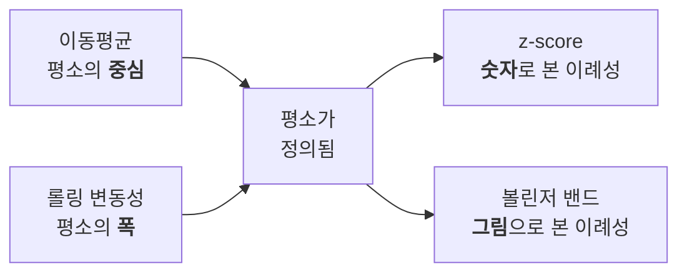
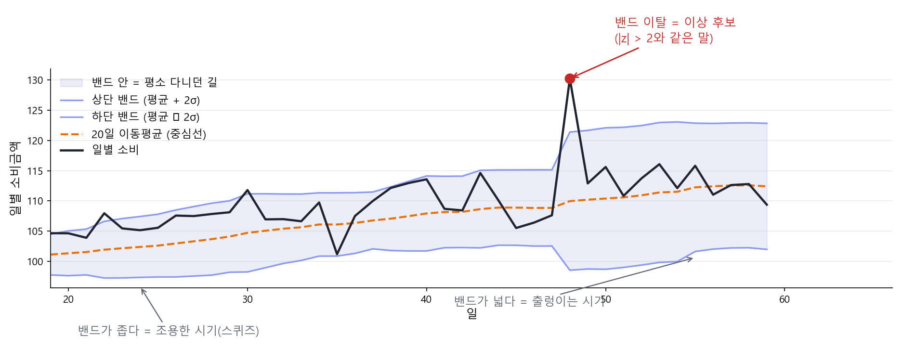
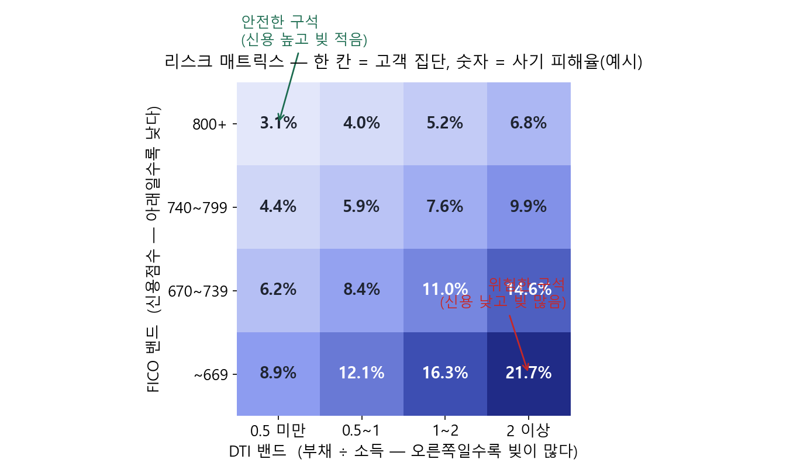

# FinDA 8주차 2일차 — SQL로 하는 금융 데이터 분석: 시계열 · 리스크 · 사기탐지

> 8주차 둘째 날(3시간) 강의안. 어제 배운 고급 SQL을 금융 도메인의 3대 분석 — 시계열 분석, 리스크 분석, 사기 탐지(FDS) — 에 실전 적용하는 날입니다. 파이썬 라이브러리 없이 SQL 윈도우 함수만으로 기술적 지표·리스크 지표·탐지 룰을 구현합니다. 취업 포트폴리오에서 "SQL만으로 여기까지"를 보여줄 수 있는 하루입니다.

---

## 오늘의 개요

| 구분 | 시간 | 내용 |
| --- | --- | --- |
| Session 2-1 | 50분 | 시계열 분석 — 이동평균·변동성·볼린저 밴드, 실습(17분) |
| 쉬는 시간 | 10분 | |
| Session 2-2 | 50분 | 리스크 분석 — FICO·DTI·한도 소진율·집중도, 실습(20분) |
| 쉬는 시간 | 10분 | |
| Session 2-3 | 50분 | 사기 탐지(FDS) — 룰 설계와 성적표, 실습(14분) |
| 쉬는 시간 | 10분 | |
| 합계 | 180분 (3시간) | |

### 오늘의 학습 목표

- (1) 불규칙한 거래 기록을 날짜 스파인으로 균일한 시계열로 만들 수 있다.
- (2) 이동평균, 롤링 변동성, z-score, 볼린저 밴드를 윈도우 함수로 구현하고 이상 시점을 탐지할 수 있다.
- (3) DTI, 한도 소진율, FICO 밴드 같은 신용 리스크 지표를 SQL로 산출할 수 있다.
- (4) 분위수(PERCENTILE_CONT, APPROX_QUANTILES)로 꼬리 리스크의 직관을 설명할 수 있다.
- (5) FDS 룰 3종(고액 이상치, velocity, 지역 점프)을 구현하고, confusion matrix와 precision/recall로 평가할 수 있다.
- (6) 기저율이 낮은 문제에서 "정확도"가 왜 함정인지, lift로 왜 다시 봐야 하는지 설명할 수 있다.

오늘의 큰 그림 한 줄: 어제가 "무기를 만드는 날"이었다면, 오늘은 **"그 무기로 세 팀(시장분석·리스크·FDS)을 도는 날"**입니다.

---

## Session 2-1. 시계열 분석 — Using SQL for Time Series Analysis (50분)

### 1-1. 도입: 금융 시계열 분석의 지도 (6분)

금융 시계열을 다루다 보면 **같은 지표 네 개가 반복해서** 나옵니다. 이름은 거창한데, 안을 열어 보면 전부 어제 배운 윈도우 함수입니다.

| 지표 | 한 줄 정의 | SQL로 옮기면 |
| --- | --- | --- |
| 이동평균 (SMA) | 최근 N개 값의 평균을 **매 시점 다시** 계산 | `AVG() OVER (… ROWS …)` |
| 롤링 변동성 | 최근 N개 값의 **표준편차** | `STDDEV_SAMP() OVER (… ROWS …)` |
| z-score | (오늘 값 − 평균) ÷ 표준편차 | 위 둘의 조합 |
| 볼린저 밴드 | 이동평균 ± 2 × 표준편차 | 위 둘의 조합 |

> 📌 **"퀀트 라이브러리"란?** 파이썬에는 이 계산을 대신해 주는 도구가 많습니다. 기술적 지표를 모아 둔 `TA-Lib`·`pandas-ta`, 시계열 모형의 `statsmodels`·`arch`, 성과·리스크 지표의 `empyrical`·`pyfolio`, 파생상품 가격결정의 `QuantLib` 같은 것들이죠. 예를 들어 볼린저 밴드는 `talib.BBANDS(close, timeperiod=20)` **한 줄**이면 끝납니다.
> 그런데 그 함수 안을 열어 보면 **이동평균과 표준편차를 창(window) 위에서 계산하는 것**이 전부입니다. 그래서 SQL만으로도 똑같이 만들 수 있습니다 — 오늘 우리가 할 일이 바로 그것입니다.

#### 네 지표는 사실 하나의 사슬입니다

따로따로 외울 것이 아닙니다. 앞의 둘이 "평소"를 정의하고, 뒤의 둘이 그 "평소"에서 얼마나 벗어났는지를 말합니다.



그래서 **z-score와 볼린저 밴드는 같은 것의 두 얼굴**입니다. 밴드를 벗어났다는 말과 |z| > 2라는 말은 같은 뜻입니다 (같은 창·같은 σ를 썼다면).

#### 수식으로, 그리고 파이썬으로

같은 지표를 세 가지 언어(수식, 파이썬, SQL)로 나란히 보면 정체가 분명해집니다. 외울 필요는 없고, "셋이 같은 것"임을 확인하고 지나가면 됩니다.

| 지표 | 수식 (창 = 20) | 파이썬에서는 |
| --- | --- | --- |
| 이동평균 | SMA(t) = ( x(t) + x(t-1) + … + x(t-19) ) / 20 | `s.rolling(20).mean()` 또는 `talib.SMA(x, 20)` |
| 롤링 변동성 | σ(t) = √( Σ(x - m)² / (n-1) ),  m = 창의 평균 | `s.rolling(20).std()` 또는 `talib.STDDEV(x, 20)` |
| z-score | z(t) = ( x(t) - m(t) ) / σ(t) | `(s - s.rolling(20).mean()) / s.rolling(20).std()` |
| 볼린저 밴드 | 상단 = SMA(t) + 2σ(t), 하단 = SMA(t) - 2σ(t) | `talib.BBANDS(x, timeperiod=20)` |

- (1) pandas의 `rolling(20)`이 곧 SQL의 `ROWS BETWEEN 19 PRECEDING AND CURRENT ROW`입니다 — **이름만 다른 같은 창**입니다.
- (2) `rolling().std()`는 표본표준편차(ddof=1)라 SQL의 `STDDEV_SAMP`와 **정확히 같은 값**이 나옵니다. 파이썬으로 검산할 때 유용합니다.

#### 이 지표들은 금융 어디에서 쓰이나

| 지표 | 주로 쓰이는 분야 | 대표 사례 |
| --- | --- | --- |
| 이동평균 | 기술적 분석, 추세추종 전략 | 주식 차트의 20일선·60일선, 골든크로스 |
| 롤링 변동성 | 리스크 관리, 옵션 가격결정 | VIX(시장이 예상하는 변동성을 지수화), VaR 계산의 입력값 |
| z-score | 이상 탐지, 페어 트레이딩 | 카드 FDS 룰, 두 종목 가격차가 벌어졌을 때의 진입 신호 |
| 볼린저 밴드 | 기술적 분석, 변동성 국면 판단 | 밴드가 좁아지는 "스퀴즈" → 곧 큰 움직임이 온다는 신호로 읽음 |

우리는 오늘 이것을 **주가가 아니라 카드 소비 시계열**에 적용합니다. 도구는 같고, 질문만 다릅니다.

오늘 1교시의 목표: 카드 소비 시계열에서 **"이상하게 튄 날"**을 SQL로 찾아내고, 그날 무슨 일이 있었는지 해석하는 것.

### 1-2. 시계열의 전제: 균일한 간격 만들기 (6분)

거래 기록은 시계열이 아닙니다 — 거래가 없는 날은 **행 자체가 없기** 때문입니다. 7일 이동평균 창에 6월 1일~7일이 들어가야 하는데 6월 3일 행이 없다면, 창은 조용히 "있는 행 7개"를 집어 갑니다. 어제 배운 날짜 스파인이 여기서 실전 투입됩니다.

```sql
WITH spine AS (      -- 한 행 = 날짜 (거래가 없어도 존재)
    SELECT d
    FROM UNNEST(GENERATE_DATE_ARRAY('2018-01-01', '2019-12-31')) AS d
), daily AS (        -- 한 행 = 거래가 있던 날
    SELECT v.tx_date, SUM(v.amount_usd) AS spend
    FROM `finda-week7-505502.tabformer.silver_transactions` AS v
    WHERE v.tx_date BETWEEN DATE '2018-01-01' AND DATE '2019-12-31'
    GROUP BY v.tx_date
), filled AS (       -- 한 행 = 날짜 (거래 없는 날은 0)  ← 오늘 1교시 내내 쓸 이름
    SELECT
        s.d,
        COALESCE(dl.spend, 0) AS spend
    FROM spine AS s
    LEFT JOIN daily AS dl
        ON s.d = dl.tx_date
)
SELECT * FROM filled ORDER BY d
```

패턴 이름으로 기억하세요: **스파인 LEFT JOIN + COALESCE.** 시계열 분석의 관문 의식입니다.

#### 이제 뷰로 만들어 둡니다 (오늘 계속 씁니다)

CTE는 **그 쿼리 안에서만** 살아 있습니다. 새 탭을 열고 `FROM filled`이라고만 쓰면 "그런 이름 모른다"는 오류가 납니다.
앞으로 나올 이동평균·z-score·볼린저 밴드가 **전부 이 결과를 재료로 쓰므로**, 7주차에 배운 **뷰**로 한 번만 만들어 둡니다.

```sql
-- 본인 프로젝트에 만드세요. 오늘 1교시 내내 이 뷰를 씁니다.
CREATE OR REPLACE VIEW `본인프로젝트.tabformer.v_daily_spend` AS
WITH spine AS (
    SELECT d
    FROM UNNEST(GENERATE_DATE_ARRAY('2018-01-01', '2019-12-31')) AS d
), daily AS (
    SELECT v.tx_date, SUM(v.amount_usd) AS spend
    FROM `finda-week7-505502.tabformer.silver_transactions` AS v
    WHERE v.tx_date BETWEEN DATE '2018-01-01' AND DATE '2019-12-31'
    GROUP BY v.tx_date
)
SELECT
    s.d,
    COALESCE(dl.spend, 0) AS spend
FROM spine AS s
LEFT JOIN daily AS dl
    ON s.d = dl.tx_date;
```

만들었으면 확인부터 합니다.

```sql
SELECT COUNT(*) AS day_cnt          -- 730이어야 정상 (2018~2019년 = 730일)
FROM `본인프로젝트.tabformer.v_daily_spend`;
```

> 💡 이것이 7주차 Day 3에서 배운 **"로직을 한 곳에만 정의한다"** 의 실전 투입입니다. 앞으로 나오는 쿼리는 전부 `FROM `본인프로젝트.tabformer.v_daily_spend``으로 시작하니, 스파인과 COALESCE를 다시 쓸 일이 없습니다.

### 1-3. 이동평균: 어제 문제지의 답 (5분)

어제 배포한 "7일 이동평균 두 가지 풀이"를 폅니다.

- (1) **윈도우 풀이**: `AVG(spend) OVER (ORDER BY d ROWS BETWEEN 6 PRECEDING AND CURRENT ROW)` — 선언 한 줄.
- (2) **셀프조인 풀이**: 날짜 간 비등가 조인(`b.d BETWEEN a.d - 6 AND a.d`) 후 GROUP BY — 윈도우 함수가 없던 시절의 문형.

같은 답이 나옵니다. 오늘은 윈도우 풀이로 갑니다 — 짧고, 읽기 쉽고, 창을 바꾸기 쉽기 때문입니다. 셀프조인 문형은 "윈도우로 안 되는 문제"(예: 롤링 COUNT DISTINCT)에서 다시 소환되니 버리지는 마세요.

이동평균의 의미도 한 줄로: **노이즈를 지우고 추세를 남기는 필터.** 창이 길수록 매끈해지고 둔해집니다. 7일 창은 "요일 효과"를 지우는 고전적 선택입니다.

### 1-4. 롤링 변동성과 z-score: "평소"를 숫자로 정의하기 (7분)

"이상하게 튀었다"를 판정하려면 "평소"가 숫자여야 합니다. 평소 = 최근 30일의 평균과 표준편차.

```sql
-- 한 행 = 날짜 + 최근 30일 통계 (자기 자신 제외에 주목)
SELECT
    t.d, t.spend,
    AVG(t.spend) OVER w AS ma_30,
    STDDEV_SAMP(t.spend) OVER w AS sd_30,
    SAFE_DIVIDE(t.spend - AVG(t.spend) OVER w,
                STDDEV_SAMP(t.spend) OVER w) AS z_score
FROM `본인프로젝트.tabformer.v_daily_spend` AS t
WINDOW w AS (ORDER BY t.d ROWS BETWEEN 30 PRECEDING AND 1 PRECEDING)
```

##### `PRECEDING`이 무슨 뜻인가

`PRECEDING`은 **지금 행보다 "앞"(과거 쪽)** 을 가리키는 말입니다. 프레임을 쓸 때 나오는 표현은 넷뿐입니다.

| 표현 | 뜻 |
| --- | --- |
| `CURRENT ROW` | 지금 행 |
| `n PRECEDING` | 지금 행보다 **n행 앞** (과거) |
| `n FOLLOWING` | 지금 행보다 **n행 뒤** (미래) |
| `UNBOUNDED PRECEDING` | 맨 처음부터 |

`ROWS BETWEEN A AND B`는 **"A부터 B까지를 창으로 삼는다"** 는 뜻입니다. 그래서 끝을 어디로 두느냐가 오늘 포함 여부를 결정합니다.

| 프레임 | 창에 들어가는 것 | 오늘 |
| --- | --- | --- |
| `BETWEEN 6 PRECEDING AND CURRENT ROW` | 6행 앞 ~ 지금 = **7행** | 포함 |
| `BETWEEN 30 PRECEDING AND 1 PRECEDING` | 30행 앞 ~ 1행 앞 = **30행** | **제외** |

- (1) `WINDOW` 절: 같은 창 정의를 세 번 반복하지 않는 이름 붙이기 문법입니다.
- (2) 위 쿼리가 끝을 `CURRENT ROW`가 아니라 **`1 PRECEDING`**으로 둔 것은 **오늘을 창에서 빼기 위해서**입니다. 오늘 값이 창에 들어가면 큰 이상치가 자기 평균을 끌어올려 스스로를 "정상"으로 만들어 버립니다. 차트로 그릴 지표(볼린저 밴드)는 당일을 포함하고, 탐지용 기준선은 당일을 뺍니다.
- (3) z-score 해석: "평소 분포에서 몇 표준편차 떨어졌나". |z| > 2면 드문 날, |z| > 3이면 매우 드문 날.

> ⚠️ **용어 하나 짚고 갑니다 — 금융에서 "변동성"은 보통 수익률의 표준편차입니다.** 주가 변동성이라고 하면 가격 자체가 아니라 **일별 수익률**(어제 대비 몇 % 움직였나)의 표준편차를 뜻합니다. 오늘 우리는 소비 **금액**의 표준편차를 쓰고 있으니 엄밀히는 결이 다릅니다. 금액 규모가 커지면 표준편차도 같이 커지기 때문에, 규모가 다른 두 시계열을 비교하려면 수익률로 바꿔야 합니다. 다만 오늘의 목적은 "같은 시계열 안에서 튄 날 찾기"라 금액 그대로도 충분합니다. **금융 배경이 있는 분이 이 차이를 눈치챘다면 정확히 본 것입니다.**

- (4) |z| > 3이 이론(약 0.3%)보다 훨씬 자주 나오는 것도 정상입니다. 금융 데이터는 꼬리가 두껍습니다(fat tail) — 2교시 "꼬리 리스크"에서 다시 만납니다.

### 1-5. 볼린저 밴드: 지표 하나를 완성하기 (6분)

볼린저 밴드는 이동평균 ± 2 × 표준편차의 띠입니다. 주가 차트에서 본 그 지표를, 우리는 카드 소비에 적용합니다.

```sql
SELECT
    t.d, t.spend,
    AVG(t.spend) OVER w AS ma_20,
    AVG(t.spend) OVER w + 2 * STDDEV_SAMP(t.spend) OVER w AS upper_band,
    AVG(t.spend) OVER w - 2 * STDDEV_SAMP(t.spend) OVER w AS lower_band
FROM `본인프로젝트.tabformer.v_daily_spend` AS t
WINDOW w AS (ORDER BY t.d ROWS BETWEEN 19 PRECEDING AND CURRENT ROW)
```

그림으로 보면 훨씬 직관적입니다.



그림 읽는 법 — **"가격이 다니는 도로"**라고 생각하면 가장 쉽습니다.

- (1) **중심선**(주황 점선) = 최근 20일 평균 — 도로의 중앙선
- (2) **상단·하단 밴드** = 평균 ± 2σ — 도로의 양쪽 경계
- (3) **밴드의 폭이 곧 변동성**입니다 — 좁아지면 조용한 시기(스퀴즈), 넓어지면 출렁이는 시기
- (4) **밴드 밖으로 나간 날**(빨간 점) = 평소 다니던 길을 벗어난 날 — 잠시 뒤 실습에서 찾을 대상입니다

"SQL 다섯 줄로 기술적 지표 하나"가 완성됐습니다. 면접에서 "SQL로 뭘 해 봤나"라는 질문에 "볼린저 밴드로 이상 소비일 탐지"라고 답하면 대화가 달라집니다.

그리고 도입에서 말한 **"z-score와 볼린저 밴드는 같은 것의 두 얼굴"**을 여기서 확인합니다. 밴드는 `평균 ± 2σ`이므로, 밴드를 벗어났다는 것은 곧 `|오늘 − 평균| > 2σ`, 즉 **|z| > 2**와 같은 말입니다. 하나는 그림으로, 하나는 숫자로 같은 사실을 말할 뿐입니다.

> 📌 **단, 우리 자료의 두 쿼리는 창 설정이 다릅니다.** 1-4의 z-score는 30일·당일 제외, 여기 볼린저는 20일·당일 포함입니다. 개념은 같지만 숫자는 일치하지 않습니다 — 탐지용 기준선과 차트용 지표의 목적이 다르기 때문입니다.

### 1-6. 실습: 이상하게 튄 날 찾기 (17분)

아래를 통째로 복사해 콘솔에 붙여 넣으세요. **STEP 1·2는 완성된 쿼리**입니다 — 그대로 실행하며 결과를 읽고, **STEP 3의 빈칸(`____`) 4곳**만 채우면 됩니다.

```sql
/*Week8 Day2*/
--실습1. "이상하게 튄 날은 언제인가?"
--사용 테이블: `본인프로젝트.tabformer.v_daily_spend`
--            (1-2에서 만든 뷰. 한 행 = 날짜, 거래 없는 날 = 0. 2018~2019년 730행)
--가이드: STEP1·2는 완성 쿼리입니다. 실행하며 읽기만 하세요. 여러분이 채우는 것은 STEP3의 빈칸 4곳.

--STEP1) 날짜별 20일 이동평균(ma_20)을 옆에 붙입니다 (한 행 = 날짜) — 그대로 실행해 보세요
SELECT
    t.d, t.spend,
    AVG(t.spend) OVER (ORDER BY t.d ROWS BETWEEN 19 PRECEDING AND CURRENT ROW) AS ma_20
FROM `본인프로젝트.tabformer.v_daily_spend` AS t
ORDER BY t.d;

--STEP2) 상단/하단 밴드를 붙입니다 — 같은 창을 세 번 쓰므로 WINDOW 절로 창에 이름(w)을 붙였습니다
--       마지막 컬럼 n_days(창에 실제로 든 행 수)는 STEP3에서 씁니다
SELECT
    t.d, t.spend,
    AVG(t.spend) OVER w AS ma_20,
    AVG(t.spend) OVER w + 2 * STDDEV_SAMP(t.spend) OVER w AS upper_band,
    AVG(t.spend) OVER w - 2 * STDDEV_SAMP(t.spend) OVER w AS lower_band,
    COUNT(t.spend) OVER w AS n_days
FROM `본인프로젝트.tabformer.v_daily_spend` AS t
WINDOW w AS (ORDER BY t.d ROWS BETWEEN 19 PRECEDING AND CURRENT ROW);

--STEP3) 2019년에 밴드를 벗어난 날짜만 남기세요 (위/아래 방향 표시까지)
--구조는 잡아 두었습니다. ____ 4곳만 채우면 완성.
WITH banded AS (
    --빈칸1: STEP2의 SELECT문을 통째로 여기에 붙여 넣으세요 (끝의 세미콜론은 빼고)
    ____
)
SELECT
    b.d, b.spend, b.ma_20, b.upper_band, b.lower_band,
    --빈칸2: IF(조건, '위', '아래') — spend가 upper_band보다 크면 '위'
    ____ AS direction
FROM banded AS b
WHERE b.d >= DATE '____'          --빈칸3: 2019년 1월 1일부터만
  AND b.n_days = ____             --빈칸4: 완성 창만 (창에 몇 행이 다 찼을 때?)
  AND (b.spend > b.upper_band OR b.spend < b.lower_band)   -- 밴드 이탈 조건 (이미 채워둠)
ORDER BY b.d;
--참고: 윈도우 결과는 WHERE로 못 거릅니다. 그래서 WITH로 감싸 "다 계산된 결과"를 바깥에서
--      비교하는 구조입니다 — 어제 QUALIFY를 배운 이유와 같은 이유.
--검증: 이탈일이 며칠이든 정상입니다. 0개면 ±2σ를 ±1.5σ로 좁혀 다시 보세요
--정답: 2019년 이탈일 수 __일 (수업에서 공개)

--STEP4) 해석: 이탈일들이 언제 몰려 있나요? (연말? 특정 이벤트?)
--해석(주석 두 줄):
--
--
```

**여유가 되면.** 월별 총소비의 작년 동월 대비 증감률(YoY)이 가장 큰 달을 찾아 보세요 — 어제 실습 3(연령대 YoY)에서 연령대만 빼면 됩니다.

### 1-7. 정리 (3분)

- (1) 시계열의 관문: 스파인 LEFT JOIN + COALESCE
- (2) 평소의 정의: 롤링 평균·표준편차 (탐지용은 당일 제외)
- (3) z-score와 볼린저 밴드 — 윈도우 함수 조합만으로 완성

복선: 오늘은 "**날** 단위로 튄 것"을 찾았습니다. "**거래 한 건** 단위로 튄 것"은 3교시 FDS에서 잡습니다 — 같은 z-score가 다시 나옵니다.

---

## Session 2-2. 리스크 분석 — 고객·집중·꼬리 (50분)

### 2-1. 리스크의 3층위 (4분)

카드사 리스크팀의 질문은 세 층으로 나뉩니다.

| 층위 | 질문 | 오늘의 도구 |
| --- | --- | --- |
| (1) 고객 신용 리스크 | "이 고객은 갚을 수 있는 사람인가" | FICO, DTI, 한도 소진율 |
| (2) 집중 리스크 | "소비(익스포저)가 한 곳에 쏠려 있진 않은가" | HHI (허핀달 지수) |
| (3) 꼬리 리스크 | "최악의 달에는 무슨 일이 벌어지는가" | 분위수 (P95, P99) |

`users` 테이블에 신용 분석 재료가 이미 있습니다 — `fico_score`, `total_debt`, `yearly_income_person`. 7주차에 "이미 숫자라 정제 불필요"라고 했던 그 컬럼들이 오늘의 주인공입니다.

### 2-2. 신용 지표 구현: DTI, 한도 소진율, FICO 밴드 (10분)

**DTI(Debt-to-Income)** — 소득 대비 부채. 갚을 능력의 가장 고전적인 대리 지표입니다.

```sql
SELECT
    u.user_id,
    u.fico_score,
    SAFE_DIVIDE(u.total_debt, u.yearly_income_person) AS dti
FROM `finda-week7-505502.tabformer.users` AS u
```

DTI를 조금 더 깊이 봅니다.

| | DTI (Debt-to-Income) |
| --- | --- |
| 정의 | 버는 것 대비 빚이 몇 배인가 — 갚을 능력의 가장 고전적인 대리 지표 |
| 수식 | DTI = 총부채 ÷ 연소득 = `total_debt / yearly_income_person` |
| 파이썬 | `df["dti"] = df["total_debt"] / df["yearly_income_person"]` |
| 금융에서 쓰는 곳 | 대출 심사(승인·한도 산정의 기본 입력), 신용평가 모형의 피처, 부실 조기경보 |
| 한국에서는 | 규제 지표로는 DSR(연 원리금 상환액 ÷ 연소득)을 씁니다 — DTI의 사촌 격 |
| 우리 실습 밴드 | 0.5 미만 여유 · 0.5~1 · 1~2 · 2 이상 주의 (2-5 매트릭스의 축) |

**FICO 밴드** — 미국 신용점수의 관례적 구간을 CASE로 옮깁니다. 구간화는 리스크 리포트의 기본 문법입니다.

```sql
CASE
    WHEN u.fico_score >= 800 THEN '(1) 800+ Exceptional'
    WHEN u.fico_score >= 740 THEN '(2) 740-799 Very Good'
    WHEN u.fico_score >= 670 THEN '(3) 670-739 Good'
    WHEN u.fico_score >= 580 THEN '(4) 580-669 Fair'
    ELSE '(5) ~579 Poor'
END AS fico_band
```

FICO도 조금 더 깊이 봅니다.

| | FICO 점수 |
| --- | --- |
| 정의 | Fair Isaac Corporation(FICO, "파이코")이 만든 미국의 대표 개인 신용점수(300~850). 한국의 NICE·KCB 점수에 해당하는 것 |
| 만드는 재료 | 상환 이력 35% + 부채 수준 30% + 신용 이력 길이 15% + 신규 신용 10% + 신용 믹스 10% (모형 자체는 비공개) |
| 파이썬 (구간화) | `pd.cut(df["fico_score"], bins=[300, 580, 670, 740, 800, 850], labels=["Poor", "Fair", "Good", "Very Good", "Exceptional"])` |
| 금융에서 쓰는 곳 | 금리 차등(risk-based pricing — 점수가 낮을수록 비싼 금리), 카드 발급 심사, 대출 유동화 시 풀 품질 표시 |
| 우리 실습 밴드 | 800+ Exceptional · 740~799 Very Good · 670~739 Good · 580~669 Fair · ~579 Poor |

**한도 소진율(utilization)** — 월 사용액 / 총 한도. 여기에 어제의 그레인 교훈이 그대로 나옵니다. `cards`는 한 행 = 카드 1장이므로, **사용자 그레인으로 합산부터** 해야 조인이 폭발하지 않습니다.

```sql
WITH limits AS (     -- 한 행 = 사용자 (카드 한도 합산)
    SELECT c.user AS user_id, SUM(c.credit_limit) AS total_limit
    FROM `finda-week7-505502.tabformer.cards` AS c
    GROUP BY c.user
), monthly AS (      -- 한 행 = 사용자 × 월
    SELECT
        v.user_id,
        DATE_TRUNC(v.tx_date, MONTH) AS ym,
        SUM(v.amount_usd) AS spend
    FROM `finda-week7-505502.tabformer.silver_transactions` AS v
    WHERE v.tx_date >= DATE '2018-01-01'
    GROUP BY v.user_id, ym
)
SELECT
    m.user_id, m.ym,
    SAFE_DIVIDE(m.spend, l.total_limit) AS utilization
FROM monthly AS m
JOIN limits AS l
    ON m.user_id = l.user_id
```

실무 연결: 소진율이 지속적으로 높은 고객은 "한도 증액 영업 대상"이면서 동시에 "부실 조기경보 대상"이기도 합니다. 같은 숫자를 마케팅과 리스크가 반대로 읽는 것 — 지표는 중립이고 해석이 정책입니다.

### 2-3. 꼬리를 보는 법: 분위수 (7분)

평균은 꼬리를 숨깁니다. 리스크는 꼬리에 삽니다. "고객별 **월 소비의 P95**"는 "평소 상한선"의 훌륭한 대리 지표입니다 — 이번 달이 그걸 넘겼다면 무슨 일이 있는 겁니다.

```sql
-- 한 행 = 사용자 (BigQuery에서 PERCENTILE_CONT는 윈도우 함수라는 점에 주의)
WITH monthly AS (    -- 한 행 = 사용자 × 월 (2-2의 그 CTE와 동일)
    SELECT
        v.user_id,
        DATE_TRUNC(v.tx_date, MONTH) AS ym,
        SUM(v.amount_usd) AS spend
    FROM `finda-week7-505502.tabformer.silver_transactions` AS v
    WHERE v.tx_date >= DATE '2018-01-01'
    GROUP BY v.user_id, ym
)
SELECT DISTINCT
    m.user_id,
    PERCENTILE_CONT(m.spend, 0.5) OVER (PARTITION BY m.user_id) AS p50_spend,
    PERCENTILE_CONT(m.spend, 0.95) OVER (PARTITION BY m.user_id) AS p95_spend
FROM monthly AS m
```

- (1) MySQL 경험자 함정: BigQuery의 PERCENTILE_CONT는 집계 함수가 아니라 **윈도우 함수**입니다. GROUP BY와 함께 쓸 수 없어 DISTINCT로 그레인을 정리하는 문형이 관례입니다.
- (2) 대량 데이터에서는 `APPROX_QUANTILES(spend, 100)[OFFSET(95)]`가 훨씬 쌉니다. 단, **근사치**입니다 — 대시보드 탐색에는 좋지만 **정산·규제 보고에는 금지.** 어디에 정확이 필요하고 어디에 근사가 허용되는지 구분하는 것도 직업 윤리입니다.
- (3) 이 P95의 사고방식이 금융공학의 VaR(Value at Risk)로 이어집니다 — "95% 신뢰수준에서 최대 손실". 오늘은 개념의 입구만 밟습니다.

### 2-4. 집중 리스크: HHI (6분)

"소비가 한 업종에 쏠린 고객"과 "고루 쓰는 고객"은 리스크 프로파일이 다릅니다. 집중도의 표준 지표가 **HHI(허핀달-허쉬만 지수)** — 점유율 제곱의 합입니다.

```sql
WITH by_mcc AS (       -- 한 행 = 사용자 × 업종
    SELECT v.user_id, v.mcc, SUM(v.amount_usd) AS spend
    FROM `finda-week7-505502.tabformer.silver_transactions` AS v
    WHERE v.tx_date >= DATE '2018-01-01'
    GROUP BY v.user_id, v.mcc
), share AS (          -- 한 행 = 사용자 × 업종 + 점유율 (집계 위의 창!)
    SELECT
        b.user_id, b.mcc,
        SAFE_DIVIDE(b.spend, SUM(b.spend) OVER (PARTITION BY b.user_id)) AS mcc_share
    FROM by_mcc AS b
)
SELECT
    s.user_id,
    SUM(s.mcc_share * s.mcc_share) AS hhi    -- 1에 가까울수록 집중
FROM share AS s
GROUP BY s.user_id
```

어제의 두 패턴(ratio-to-total, 집계 위의 창)이 그대로 재등장한 것을 눈치챘다면, 오늘 수업은 성공입니다.

HHI를 조금 더 깊이 봅니다.

| | HHI (허핀달-허쉬만 지수) |
| --- | --- |
| 정의 | "한 곳에 얼마나 쏠렸는가"를 0~1 사이 숫자 하나로 |
| 수식 | HHI = Σ (s)², s = 각 항목의 점유율. 전부 한 곳이면 1, n곳에 균등하면 1/n |
| 손계산 예시 | 4개 업종에 25%씩 → 0.25² × 4 = **0.25** / 한 업종 100% → **1.0** / 70·10·10·10% → 0.49 + 0.03 = **0.52** |
| 파이썬 | `df.groupby("user_id")["share"].apply(lambda s: (s ** 2).sum())` |
| 금융에서 쓰는 곳 | 포트폴리오 집중 리스크(한 종목·한 산업 쏠림 측정), 은행 여신 포트폴리오의 산업 집중도 관리, 규제기관의 시장 집중도 심사(합병 심사 기준) |
| 우리 실습 | 사용자별 업종 소비 집중도 — "한 업종에 올인한 고객"과 "고루 쓰는 고객"의 구분 |

### 2-5. 실습: 리스크 매트릭스 (20분)

리스크팀 요청: "고객을 FICO 밴드 × DTI 밴드의 격자에 놓고, 각 칸이 얼마나 위험한지 한 장으로 보여 주세요."

완성하면 이런 그림의 재료가 됩니다.



그림 읽는 법:

- (1) **한 칸 = 고객 집단**입니다 (FICO 밴드 하나 × DTI 밴드 하나에 속하는 사람들).
- (2) 색이 진할수록(숫자가 클수록) 그 집단의 **사기 피해율**이 높습니다.
- (3) 오른쪽 아래로 갈수록 위험 — 신용은 낮고 빚은 많은 구석입니다.
- (4) 모양이 어제 본 confusion matrix와 닮았지만 **다른 물건**입니다. 그건 "예측 vs 실제"의 2×2였고, 이건 **고객 특성 두 축**의 격자입니다.

아래를 복사해 STEP 순서대로 완성하세요.

```sql
/*Week8 Day2*/
--실습2. "어느 고객 집단이 가장 위험한가?" (리스크 매트릭스)
--사용 테이블: `finda-week7-505502.tabformer.silver_transactions` (거래)
--            `finda-week7-505502.tabformer.users` (fico_score, total_debt, yearly_income_person)
--            `finda-week7-505502.tabformer.cards` (credit_limit)
--가이드: 사용자 단위로 먼저 만들고(profile), 그다음 격자로 올립니다(matrix). 2-2의 코드가 뼈대.

--STEP1) 사용자별 카드 한도 합계는? (한 행 = 사용자)
--힌트: cards의 키 이름은 user 입니다 (user_id 아님!)
--쿼리:


--STEP2) 사용자×월 소비금액과 사기 거래 건수는? (한 행 = 사용자 × 월, 2018년 이후)
--힌트: DATE_TRUNC(tx_date, MONTH) + SUM + COUNTIF(is_fraud = 'Yes')
--쿼리:


--STEP3) 사용자별 프로필을 만들면? (한 행 = 사용자)
--      컬럼: fico_band, dti_band, 평균 소진율, 사기 경험 여부
--힌트1: CASE 구간화 2개 (FICO는 2-2의 5구간, DTI는 0.5 미만/0.5~1/1~2/2 이상)
--힌트2: 소진율 = 월 소비 ÷ 한도 합계를 AVG로, 사기 경험 = MAX(월 사기 건수) > 0
--쿼리:


--STEP4) 밴드 × 밴드 격자로 올리면? (한 행 = fico_band × dti_band)
--      컬럼: users, avg_utilization, fraud_victim_rate
--검증: users를 전부 더하면 전체 사용자 수(약 2,000명)와 같아야 합니다
--쿼리:


--STEP5) 해석: 어느 칸이 가장 위험합니까? 리스크팀이 취할 조치를 한 줄 제안하세요
--해석:
--
```

### 2-6. 정리 (3분)

- (1) 신용 지표는 이미 있는 컬럼의 조합 — DTI, 소진율, FICO 밴드
- (2) 그레인 먼저 합산 — cards는 카드 그레인, 분석은 사용자 그레인
- (3) 꼬리는 분위수로 — 근사치의 허용 범위는 직업 윤리의 문제
- (4) 집중도는 HHI — 어제 패턴(비중, 집계 위의 창)의 재조립

복선: 고객 **단위**의 리스크를 평가했습니다. 이제 거래 **한 건 한 건**으로 내려갑니다.

---

## Session 2-3. 사기 탐지(FDS) — 룰 설계와 성적표 (50분)

### 3-1. FDS의 구조와 기대치 설정 (6분)

**FDS(Fraud Detection System, 이상거래탐지시스템)**란 — 결제나 이체가 일어나는 **그 순간**, 이 거래가 본인의 정상 거래인지 판별해 통과·보류·차단을 결정하는 시스템입니다. 카드 승인 문자가 오기 전 수십 ms 사이에 이미 한 번 심사를 통과한 것입니다.

사기의 모양은 업권마다 다르지만, **탐지의 발상은 같습니다** — "평소와 다른 것을 찾는다."

| 업권 | 대표 사기 패턴 | 탐지 단서 |
| --- | --- | --- |
| 카드 | 도난·복제 카드로 짧은 시간 몰아 긁기, 해외·온라인 무단 결제 | velocity, 지역 점프, 평소 금액 이탈 — **오늘 우리가 만드는 것** |
| 은행(이체) | 보이스피싱 이체, 대포통장 경유 자금 세탁 | 신규 수취 계좌로 큰 금액, 심야 이체, 여러 계좌 분산 송금 |
| 보험 | 허위·과다 청구, 병원·브로커 조직 공모 | 청구 패턴 반복, 청구 관계망(같은 병원·같은 설계사) |
| 간편결제 | 계정 탈취(ATO) 후 잔액·포인트 빼가기 | 새 기기 로그인 직후 결제, 배송지·연락처 급변 |

오늘 만드는 룰 3종은 카드 열의 단서들입니다. 같은 발상이 업권만 바꿔 재사용됩니다.

실무 FDS는 2단 구조입니다.


ML 시대에도 룰이 살아남는 세 가지 이유: **설명 가능성**(왜 막았는지 답할 수 있어야 함), **규제**(금융당국 보고), **응답 속도**(승인은 수십 ms 안에 결정).

시작 전 기대치 설정 — **룰은 잘 안 맞는 게 정상입니다.** 어제 기억해 둔 숫자, 사기율 0.12%가 오늘의 적입니다. 1,000건 중 999건이 정상인 세상에서는 "전부 정상"이라고 찍어도 정확도 99.88%입니다. 그래서 오늘의 성적표에는 정확도가 없습니다 — precision과 recall만 있습니다.

### 3-2. 룰 1: 개인별 고액 이상치 — z-score의 귀환 (6분)

"이 사람치고는 너무 큰 결제" — 1교시의 z-score를 날짜가 아니라 **사용자별 거래 금액**에 적용합니다.

```sql
WITH stats AS (      -- 한 행 = 사용자 (평소 금액 분포)
    SELECT
        v.user_id,
        AVG(v.amount_usd) AS mu,
        STDDEV_SAMP(v.amount_usd) AS sigma
    FROM `finda-week7-505502.tabformer.silver_transactions` AS v
    WHERE v.tx_date >= DATE '2018-01-01'
    GROUP BY v.user_id
)
SELECT
    v.user_id, v.tx_date, v.amount_usd, v.is_fraud,
    SAFE_DIVIDE(v.amount_usd - s.mu, s.sigma) AS z,
    SAFE_DIVIDE(v.amount_usd - s.mu, s.sigma) > 3 AS flag_r1
FROM `finda-week7-505502.tabformer.silver_transactions` AS v
JOIN stats AS s
    ON v.user_id = s.user_id
WHERE v.tx_date >= DATE '2018-01-01'
```

임계값 3은 정답이 아니라 **다이얼**입니다. 낮추면 많이 잡고 많이 틀리고(recall↑ precision↓), 높이면 적게 잡고 적게 틀립니다. 이 시소가 오늘의 마지막 논점입니다.

### 3-3. 룰 2: velocity — 같은 카드, 짧은 시간, 여러 건 (8분)

도난 카드의 고전적 패턴은 "짧은 시간에 몰아 긁기"입니다. "최근 1시간 내 N건"을 세려면 **시간 윈도우**가 필요합니다 — 어제 ROWS vs RANGE에서 "시간에는 RANGE가 맞는 자"라고 했던 그 지점입니다.

먼저 시각을 숫자로 만듭니다. 원본 `time`은 `'13:22'` 같은 문자열이었지만(7주차 함정), 과제에서 `SAFE.PARSE_TIME`으로 이미 **TIME 타입**으로 바꿔 두었으니 날짜와 붙이기만 하면 됩니다. 정제를 미리 해 둔 사람이 나중에 편해지는 순간입니다.

```sql
WITH tx AS (         -- 한 행 = 거래 1건 + 초 단위 타임스탬프
    SELECT
        v.user_id, v.card_id, v.tx_date, v.amount_usd, v.is_fraud,
        UNIX_SECONDS(TIMESTAMP(DATETIME(v.tx_date, v.tx_time))) AS ts_sec
    FROM `finda-week7-505502.tabformer.silver_transactions` AS v
    WHERE v.tx_date >= DATE '2018-01-01'
      AND v.tx_time IS NOT NULL      -- SAFE.PARSE_TIME이 NULL로 남긴 행은 제외
)
SELECT
    t.*,
    COUNT(*) OVER (PARTITION BY t.user_id, t.card_id
                   ORDER BY t.ts_sec
                   RANGE BETWEEN 3600 PRECEDING AND CURRENT ROW) AS cnt_1h
FROM tx AS t
```

- (1) RANGE의 ORDER BY는 숫자여야 하므로 UNIX_SECONDS로 변환했습니다.
- (2) `RANGE BETWEEN 3600 PRECEDING` = "지금 이 거래 시각부터 3,600초 전까지". 같은 시각의 거래도 함께 잡힙니다 — ROWS였다면 놓쳤을 것.
- (3) 플래그: `cnt_1h >= 4` (1시간 내 4건 이상). 이 임계값도 다이얼입니다.

### 3-4. 룰 3: 지역 점프 — LAG의 귀환 (5분)

"10분 전 뉴욕, 지금 캘리포니아"는 물리적으로 불가능합니다. 직전 거래와 비교 — 어제 워밍업의 LAG 그대로입니다.

```sql
WITH tx AS (         -- 룰 2의 tx에 merchant_state만 추가한 것
    SELECT
        v.user_id, v.tx_date, v.amount_usd, v.is_fraud, v.merchant_state,
        UNIX_SECONDS(TIMESTAMP(DATETIME(v.tx_date, v.tx_time))) AS ts_sec
    FROM `finda-week7-505502.tabformer.silver_transactions` AS v
    WHERE v.tx_date >= DATE '2018-01-01'
      AND v.tx_time IS NOT NULL
)
SELECT
    t.*,
    LAG(t.merchant_state) OVER w AS prev_state,
    t.ts_sec - LAG(t.ts_sec) OVER w AS gap_sec
FROM tx AS t
WINDOW w AS (PARTITION BY t.user_id ORDER BY t.ts_sec)
-- 플래그: 주가 다르고, 간격이 2시간 미만이고, 둘 다 온라인이 아닐 때
```

주의: 온라인 거래는 `merchant_state`가 빈 값입니다(7주차에 배운 "빈 값도 의미"). 온라인을 빼지 않으면 온라인↔오프라인 전환이 전부 "점프"로 잡혀 룰이 쓰레기가 됩니다. **룰 설계의 절반은 예외 처리입니다.**

보너스 아이디어: `cards.card_on_dark_web = 'true'`인 카드의 거래에 가중 플래그 — 직접 룰을 하나 더 만들어 보고 싶을 때의 출발점입니다.

### 3-5. 성적표: confusion matrix, precision, recall, lift (8분)

룰이 울렸다고 사기인 것도, 안 울렸다고 정상인 것도 아닙니다. 정답 라벨(`is_fraud`)과 교차하면 네 칸이 나옵니다.

| | 실제 사기 | 실제 정상 |
| --- | --- | --- |
| 룰이 울림 | TP (잡았다) | FP (오탐 — 고객 불편) |
| 룰이 조용함 | FN (놓쳤다 — 손실) | TN |

```sql
-- 룰 1(z > 3)을 예로 붙였습니다. 룰 2·3도 flag 열만 바꾸면 성적표 틀은 그대로입니다.
WITH base AS (       -- 한 행 = 거래 1건 (2018년 이후)
    SELECT v.user_id, v.amount_usd, v.is_fraud
    FROM `finda-week7-505502.tabformer.silver_transactions` AS v
    WHERE v.tx_date >= DATE '2018-01-01'
), stats AS (        -- 한 행 = 사용자 (평소 금액 분포)
    SELECT b.user_id, AVG(b.amount_usd) AS mu, STDDEV_SAMP(b.amount_usd) AS sigma
    FROM base AS b
    GROUP BY b.user_id
), flagged AS (      -- 한 행 = 거래 1건 + 룰 1 플래그
    SELECT
        b.is_fraud,
        COALESCE(SAFE_DIVIDE(b.amount_usd - s.mu, s.sigma) > 3, FALSE) AS flag
    FROM base AS b
    JOIN stats AS s
        ON b.user_id = s.user_id
)
SELECT
    COUNTIF(f.flag AND f.is_fraud = 'Yes') AS tp,
    COUNTIF(f.flag AND f.is_fraud = 'No') AS fp,
    COUNTIF(NOT f.flag AND f.is_fraud = 'Yes') AS fn,
    SAFE_DIVIDE(COUNTIF(f.flag AND f.is_fraud = 'Yes'), COUNTIF(f.flag)) AS precision,
    SAFE_DIVIDE(COUNTIF(f.flag AND f.is_fraud = 'Yes'),
                COUNTIF(f.is_fraud = 'Yes')) AS recall
FROM flagged AS f
```

precision 5%가 나왔다고 실망하기 전에 — 기저율이 0.12%입니다. 아무 거래나 찍으면 0.12% 맞는 세상에서 5%를 맞혔다면 **무작위보다 40배**(lift 40) 잘하는 겁니다. 그리고 precision과 recall의 시소에서 어디에 앉을지는 SQL이 아니라 **비즈니스가 정하는 것**입니다 — 오탐의 비용(고객 이탈)과 미탐의 비용(사기 손실)을 저울에 올려서.

### 3-6. 실습: 내 룰의 성적표 (14분)

아래를 복사해 STEP 순서대로 완성하세요. 룰 1(z > 3)과 룰 2(1시간 4건) 중 **하나를 골라** 진행합니다.

```sql
/*Week8 Day2*/
--실습3. "내 룰의 성적표는 몇 점인가?"
--사용 테이블: `finda-week7-505502.tabformer.silver_transactions`
--가이드: 3-2(룰 1) 또는 3-3(룰 2)의 코드가 STEP1의 뼈대입니다. 성적표 틀은 3-5 그대로.

--STEP1) 거래별 flag를 만들면? (한 행 = 거래 1건 + flag, 2018년 이후)
--힌트(룰 1): 사용자별 mu·sigma CTE → z > 3. 거래 1건뿐인 사용자는 sigma가 NULL이니
--           COALESCE(..., FALSE)로 막아야 성적표가 새지 않습니다
--힌트(룰 2): tx_time IS NOT NULL 필터 + UNIX_SECONDS 조립 + RANGE 3600 PRECEDING
--쿼리:


--STEP2) 성적표를 뽑으면? (한 행짜리 결과)
--      컬럼: flagged_cnt, tp, fp, fn, precision, recall
--힌트: COUNTIF 조합. precision의 분모는 COUNTIF(flag), recall의 분모는 COUNTIF(is_fraud = 'Yes')
--쿼리:


--STEP3) 임계값을 한 단계 바꾸면(z > 2.5 또는 3건) 성적이 어느 방향으로 움직입니까?
--기록(한 줄): precision은 __, recall은 __


--STEP4) 내 룰이 놓친 사기(FN)를 3건만 눈으로 보세요. 공통점이 있습니까?
--관찰(한 줄):
--
```

가설은 데이터를 들여다본 사람에게서 나옵니다 — STEP 4의 관찰이 "자기만의 룰"(선택 도전)의 씨앗입니다.

### 3-7. 마무리: 내일 예고 (3분)

> 💡 **더 해보고 싶다면 (선택 도전).** 오늘 만든 룰 말고 **자기만의 룰 하나**를 설계해 보세요. 순서는 이렇습니다 — 가설을 먼저 한 줄로 쓰고("사기는 ~할 것이다"), 구현하고, 오늘 포맷으로 성적표를 뽑고, 수업 룰과 비교합니다.
> 재료: `card_on_dark_web`, `use_chip` 채널, 심야 시간대(`tx_time`), 한도 소진율, 평소 안 쓰던 업종.
> 단 한 가지 규칙 — `is_fraud`나 `errors` 같은 **정답 컬럼을 룰 조건에 쓰지 마세요.** 시험 문제를 답안지 보고 푸는 것이니까요. (성적표 계산에 쓰는 것은 당연히 괜찮습니다.)

- (1) 내일 예고: 사흘째, 시선을 바꿉니다. **"분석할 데이터가 늘 남이 만들어 준 것뿐일까?"** — 내일은 대한민국 전자공시(DART)에서 재무제표를 직접 수집해, 여러분의 BigQuery에 쌓고, 오늘까지의 SQL로 기업을 분석합니다.

---

## 자주 만나는 오류와 해결 (참고용, 실습 중 막히면 여기부터)

| 증상 | 원인 | 해결 |
| --- | --- | --- |
| 스파인 조인 후에도 빈 날이 있음 | LEFT JOIN 방향 반대 (daily가 왼쪽) | spine을 FROM에, daily를 LEFT JOIN에 |
| 이동평균 초반 값이 이상함 | 창이 덜 찼는데 계산됨 (20일 창의 첫 19일) | `COUNT(*) OVER w >= 20` 조건으로 완성 창만 사용 |
| STDDEV가 NULL | 창에 행이 1개 (STDDEV_SAMP는 2행부터) | 완성 창 조건 또는 STDDEV_POP 검토 |
| PERCENTILE_CONT에서 GROUP BY 오류 | BigQuery에서는 윈도우 함수 | PARTITION BY + DISTINCT 문형으로 |
| RANGE 프레임 문법 오류 | ORDER BY가 숫자가 아님 (DATE/TIMESTAMP) | UNIX_SECONDS 등 숫자로 변환 |
| PARSE_TIME 실패 | time에 빈 값 또는 형식 불일치 | SAFE.PARSE_TIME으로 감싸고 NULL 처리 결정 |
| 지역 점프가 수만 건 | 온라인 거래(빈 state) 미제외 | prev/curr 모두 비어 있지 않음 조건 추가 |
| precision이 0 | flag 기준이 너무 넓거나 조인 그레인 폭발 | flag 건수부터 확인, 룰 CTE 그레인 점검 |

---

## 다음 시간 예고

- (1) 내일(3일차)은 **DART → BigQuery 재무분석 파이프라인** — Colab에서 OpenDART API로 재무제표를 수집·정제해 본인 프로젝트에 적재하고, SQL로 재무비율(부채비율·영업이익률·ROE)과 기업 비교까지 갑니다.
- (2) **사전 준비(필수)**: OpenDART API 키 발급 가이드를 오늘 배포합니다. 무료이고 5분 걸립니다 — 내일 수업 전까지 꼭 발급받아 오세요. 본인 GCP 프로젝트 확인 쿼리도 함께 있습니다.

---

오늘의 핵심 교훈 한 줄: **"금융 분석의 화려한 이름들(볼린저 밴드, VaR, FDS) 아래에는 어제 배운 윈도우 함수가 있다 — 도구는 같고, 질문이 다를 뿐이다."**
