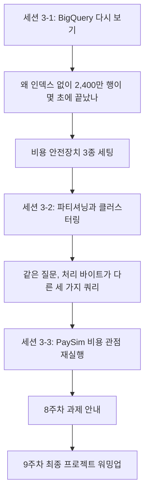
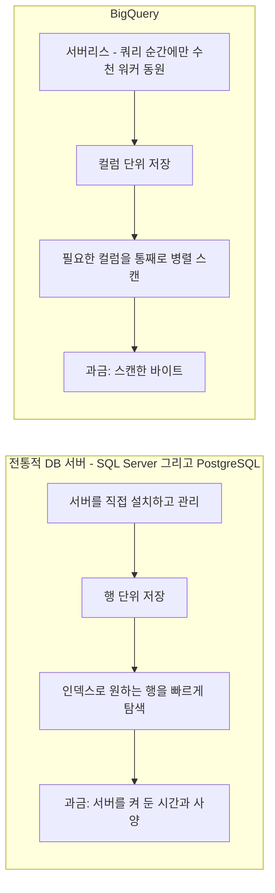
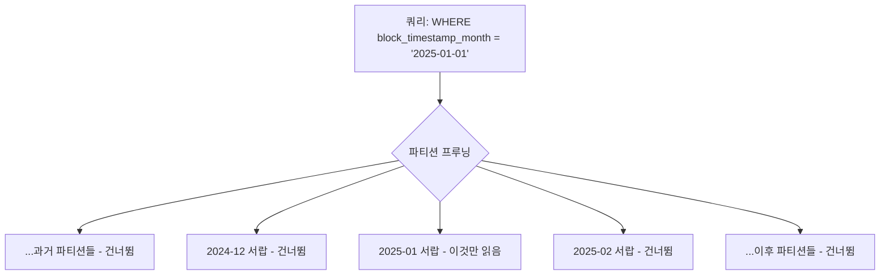
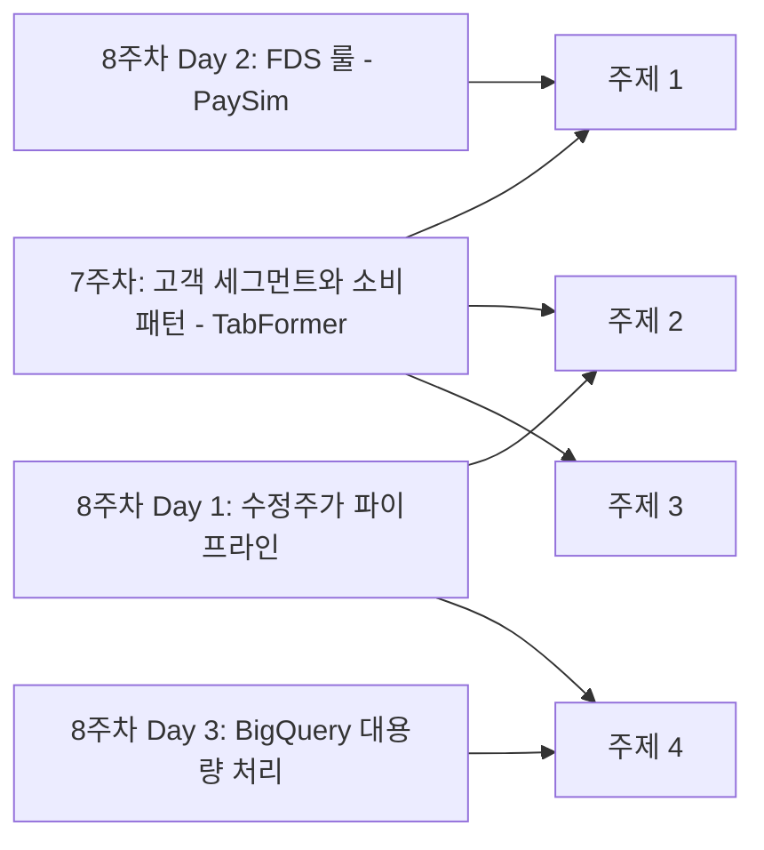

# 강의안: BigQuery 대용량 처리 — 비용을 다스리는 SQL

> 8주차 Day 3 (일) 수업용 강의안. 세션 3-1부터 3-3까지 180분. BigQuery 다시 보기(아키텍처와 비용) → 파티셔닝과 클러스터링 → 종합, 8주차 과제 안내, 9주차 최종 프로젝트 예고.

---

## 오늘 수업의 전제와 준비물

- (1) 7주차부터 사용해 온 본인 GCP 프로젝트 (BigQuery 데이터셋 `tabformer` 적재 완료 상태)
- (2) 8주차 Day 1에서 만든 데이터셋 `stocks` (`prices`, `splits`, `dividends`)
- (3) 8주차 Day 2에서 적재한 데이터셋 `paysim` (약 636만 행 — 세션 3-3에서 재사용)
- (4) 아래 쿼리의 `YOUR_PROJECT`는 본인 GCP 프로젝트 ID로 교체합니다
- (5) 공개 데이터 `bigquery-public-data.crypto_bitcoin`은 별도 적재 없이 바로 조회합니다 (세션 3-1에서 프로젝트 추가 방법 안내)

> ⚠️ **오늘의 최우선 규칙**: 이 수업에서는 "실행하지 말고 미리보기 숫자만 기록하세요"라는 지시가 여러 번 나옵니다. 반드시 지켜 주세요. 오늘 다루는 공개 테이블은 우리가 7-8주차에 쓰던 테이블보다 수백 배에서 수천 배 큽니다.

### 오늘의 큰 그림



---

## Session 3-1. BigQuery 다시 보기 — 2주간 쓴 도구의 원리와 청구서 (60분)

### 시간 배분

| 블록 | 시간 |
|---|---|
| 도입: 여러분은 이미 3주 차 BigQuery 사용자입니다 | 10분 |
| 아키텍처 차이: 서버리스, 컬럼 지향, 처리 바이트 과금 | 15분 |
| 비용 안전장치 3종 세팅 시연 | 15분 |
| bigquery-public-data 둘러보기 | 10분 |
| 실습 1: 가격표 읽기 (dry run 세 개) | 8분 |
| 체크포인트 | 2분 |

### 학습 목표

- (1) 전통적 DB 서버(SQL Server, PostgreSQL)와 BigQuery의 차이를 저장 방식과 과금 방식 중심으로 설명할 수 있다
- (2) "처리 바이트 = 비용"이라는 BigQuery 과금 모델을 이해하고, 쿼리 실행 전에 미리보기 숫자를 확인하는 습관을 갖춘다
- (3) 최대 청구 바이트와 일일 쿼리 할당량이라는 두 가지 안전장치를 본인 프로젝트에 직접 설정할 수 있다
- (4) `bigquery-public-data`에서 공개 데이터셋을 찾아 테이블 세부정보(크기, 행 수, 파티션 설정)를 읽을 수 있다

### 강의 흐름

#### (1) 도입: 여러분은 이미 BigQuery 사용자입니다 (10분)

7주차 Day 1에 우리는 2,400만 행짜리 거래 테이블을 BigQuery에 올렸고, 그 뒤로 3주째 매 수업 BigQuery로 쿼리를 짜고 있습니다. 그런데 이상한 점을 눈치챈 사람이 있을 겁니다. 학생들에게 세 가지 질문을 던지고 시작합니다.

- (1) 2,400만 행에 GROUP BY를 걸었는데 왜 몇 초 만에 끝났을까요? 우리는 인덱스를 단 한 번도 만든 적이 없습니다.
- (2) 서버 사양을 고르거나, DB를 설치하거나, "서버가 죽었다"는 상황을 겪은 적이 있나요? 없습니다.
- (3) 7주차 Day 3에 "WHERE로 행을 줄여도 처리 바이트는 거의 안 줄어든다"는 팁이 있었습니다. 왜 그럴까요?

오늘은 이 세 질문에 답하는 날입니다. 지금까지는 BigQuery를 "쓸 줄 아는" 단계였다면, 오늘부터는 "다스릴 줄 아는" 단계로 넘어갑니다. 다스린다는 것은 구체적으로 두 가지입니다. 원리를 알고(왜 빠른가), 비용을 통제하는 것(왜 얼마가 나가는가)입니다.

#### (2) 아키텍처 차이: 세 가지 키워드 (15분)

전통적 DB 서버와 BigQuery의 차이를 세 가지 키워드로 정리합니다. 각 키워드를 우리가 이미 겪은 경험에 연결합니다.



**키워드 1. 서버리스 (serverless)**

SQL Server나 PostgreSQL을 쓴다면 서버를 한 대 마련해 설치하고, 메모리와 디스크를 산정하고, 죽으면 살려야 합니다. BigQuery는 그 서버가 아예 보이지 않습니다. 쿼리를 실행하는 순간에만 Google 데이터센터의 워커 수천 대가 잠깐 동원되어 병렬로 처리하고 흩어집니다. 우리가 3주간 서버 걱정을 한 번도 안 한 이유입니다. 대신 과금의 축이 다릅니다. 전통적 DB는 "서버를 켜 둔 시간"에 돈을 내지만, BigQuery는 "쿼리가 읽은 데이터 양"에 돈을 냅니다.

**키워드 2. 컬럼 지향 스토리지 (columnar storage)**

전통적 DB는 한 행을 통째로 이어서 저장합니다. "user_id 42번 고객의 거래 한 건을 찾아 갱신"하는 은행 계좌 처리(OLTP)에 유리한 구조이고, 이때 원하는 행을 빨리 찾기 위해 인덱스를 만듭니다. BigQuery는 반대로 컬럼별로 따로 저장합니다. "amount 컬럼 전체의 평균" 같은 분석(OLAP)에서는 어차피 한 컬럼을 처음부터 끝까지 읽어야 하는데, 컬럼이 통째로 모여 있으면 그 컬럼 파일만 읽으면 되기 때문입니다.

BigQuery에 인덱스가 없는 이유가 여기서 나옵니다. 애초에 "필요한 컬럼을 통째로 병렬 스캔한다"가 기본 전제이므로, 행을 콕 찍어 찾는 인덱스가 설 자리가 없습니다. 대신 "스캔할 범위 자체를 줄이는" 다른 장치가 있고, 그게 세션 3-2의 파티셔닝과 클러스터링입니다.

**키워드 3. 처리 바이트 기반 과금**

BigQuery 온디맨드 요금은 쿼리가 스캔한 바이트에 비례합니다 (현재 약 $6.25/TiB 수준, 매월 1TiB 쿼리와 10GB 저장은 무료 — 단가와 무료 한도는 바뀔 수 있으니 요금 문서를 확인하세요). 여기서 7주차의 미스터리가 풀립니다.

- (1) `WHERE`로 행을 줄여도 바이트가 안 줄던 이유: 과금 기준은 "읽은 컬럼의 전체 크기"입니다. WHERE는 읽은 다음에 거르는 것이라 스캔량이 그대로입니다 (파티션 조건이라는 예외가 있고, 그게 오늘의 핵심입니다).
- (2) `LIMIT 10`을 붙여도 바이트가 그대로인 이유: LIMIT은 결과를 자를 뿐, 스캔은 이미 끝난 뒤입니다.
- (3) `SELECT *`가 비싼 이유: 모든 컬럼 파일을 다 읽습니다. 컬럼 지향에서 SELECT *는 "메뉴판 전체 주문"입니다.

그리고 실무 이야기를 하나 얹습니다. 1TiB를 스캔하는 쿼리 한 번은 약 $6, 커피 한 잔 값입니다. 그런데 그 쿼리가 5분마다 자동 갱신되는 대시보드에 물리면 하루 288회, 약 $1,800이 됩니다. **"잘못 짠 쿼리 하나가 실무에서 수백 달러"라는 말은 과장이 아니라, 대부분 이렇게 자동 반복 속에서 벌어집니다.** 그래서 오늘 기르는 습관이 "실행 전에 가격표 읽기"입니다.

#### (3) 비용 안전장치 3종 세팅 시연 (15분)

실습에 들어가기 전에 안전장치부터 겁니다. 강사 화면을 따라 각자 본인 프로젝트에 설정합니다. 여러분은 각자 프로젝트의 소유자이므로 모두 직접 설정할 수 있습니다.

**안전장치 1. 쿼리 단위: 최대 청구 바이트 (Maximum bytes billed)**

- (1) BigQuery 쿼리 편집기 우측 상단 "더보기" → "쿼리 설정" 클릭
- (2) "고급 옵션"을 펼쳐 "청구되는 최대 바이트 수" 입력란 확인
- (3) 예: `10737418240` (10 GiB) 입력 후 저장
- (4) 이 상태에서 10 GiB를 넘게 스캔하는 쿼리를 실행하면, 쿼리가 시작조차 하지 않고 실패합니다. 청구액 0원. 실패가 곧 보호입니다.

> 📷 스크린샷 추가 예정: 쿼리 설정 화면에서 "청구되는 최대 바이트 수" 입력란을 강조한 캡처

**안전장치 2. 프로젝트 단위: 일일 쿼리 할당량 (custom quota)**

- (1) GCP 콘솔 좌측 메뉴 → "IAM 및 관리자" → "할당량 및 시스템 한도"
- (2) 필터에 "BigQuery API" 입력
- (3) "Query usage per day" (프로젝트 전체 일일 한도)와 "Query usage per day per user" (사용자별 일일 한도) 항목 찾기
- (4) 항목 선택 → "할당량 수정" → 한도 입력 (예: 1 TiB — 입력 단위와 최소값은 화면 안내를 따르세요)
- (5) 한도를 넘으면 그날은 쿼리가 막히고, 다음 날 리셋됩니다. "오늘 실습을 망쳐도 무료 한도는 지키는" 마지노선입니다.

> 📷 스크린샷 추가 예정: 할당량 페이지에서 BigQuery API 필터 결과와 "Query usage per day" 항목 캡처 (콘솔 UI 명칭은 업데이트로 바뀔 수 있으므로 촬영 시점 기준으로 확인)

**안전장치 3. 습관: 실행 전 미리보기 확인**

쿼리 편집기에 쿼리를 입력하면, 실행 버튼을 누르기 전에 우측 상단에 "이 쿼리를 실행하면 N MB가 처리됩니다"라는 예상치가 표시됩니다 (내부적으로 dry run이라 부릅니다). 오늘부터 모든 쿼리는 이 숫자를 읽고 나서 실행합니다. 세 안전장치 중 설정이 아니라 습관이라 가장 어렵지만, 실무에서 여러분을 지키는 것은 결국 이 습관입니다.

> 📷 스크린샷 추가 예정: 쿼리 편집기 우측 상단의 처리 바이트 미리보기 표시 (초록 체크 아이콘 포함)

> 참고: 미리보기 숫자는 "상한 추정치"입니다. 클러스터링된 테이블이나 캐시 적중 시 실제 청구 바이트는 이보다 적을 수 있습니다. 실제 청구량은 실행 후 "쿼리 결과" 하단의 "처리된 바이트"에서 확인합니다.

#### (4) bigquery-public-data 둘러보기 (10분)

BigQuery의 큰 매력 중 하나는 Google이 관리하는 수백 개의 공개 데이터셋입니다. 적재 없이 바로 쿼리할 수 있습니다 (저장 비용은 Google 부담, 쿼리 처리 바이트만 우리 부담).

추가 방법:

- (1) Explorer 상단 "+ 추가" → "공개 데이터 세트" → 검색, 또는
- (2) Explorer 검색창에 `bigquery-public-data` 입력 → 프로젝트를 별표(고정)해 두면 이후 계속 보입니다

구경할 만한 데이터셋 (오늘은 첫 번째만 씁니다):

| 데이터셋 | 내용 | 우리와의 접점 |
|---|---|---|
| `crypto_bitcoin` | 비트코인 전체 블록체인 거래 | 오늘의 메인 — 대용량 금융 로그 |
| `crypto_ethereum` | 이더리움 블록체인 | 최종 프로젝트 확장 후보 |
| `iowa_liquor_sales` | 미국 아이오와주 주류 판매 | 공개 데이터 다양성 예시 (도메인은 다름) |

**미니 미션 (5분)**: `crypto_bitcoin` 데이터셋에서 `transactions` 테이블을 찾아 열고, "세부정보(Details)" 탭에서 다음 세 가지를 확인해 채팅창에 답하세요.

- (1) 테이블 전체 크기 (GB 또는 TB 단위)
- (2) 행 수
- (3) 파티션 설정 여부와 파티션 기준 컬럼 (세부정보 탭의 "테이블 정보" 영역에 표시됩니다)

이 테이블은 블록 타임스탬프의 월 기준으로 파티션되어 있는 것으로 알려져 있지만, 공개 테이블은 스키마와 설정이 갱신될 수 있으므로 **항상 세부정보 탭에서 직접 확인하는 것**이 원칙입니다. 7주차부터 강조해 온 "적재 후 Schema 탭 확인" 습관의 공개 데이터 버전입니다.

> 📷 스크린샷 추가 예정: crypto_bitcoin.transactions 세부정보 탭에서 테이블 크기, 행 수, 파티션 정보 영역을 강조한 캡처

#### (5) 실습 1: 가격표 읽기 (8분)

비즈니스 질문에 들어가기 전에, 미리보기 읽기를 몸에 붙이는 준비 운동입니다. 아래 세 쿼리를 편집기에 입력하고, **실행하지 말고** 우측 상단 예상 처리 바이트만 기록하세요.

```sql
-- (a) 전체 컬럼: 절대 실행하지 말 것. 미리보기 숫자만 기록.
SELECT
    *
FROM `bigquery-public-data.crypto_bitcoin.transactions`;

-- (b) 컬럼 하나만: 역시 미리보기만.
SELECT
    t.fee
FROM `bigquery-public-data.crypto_bitcoin.transactions` AS t;

-- (c) 행 수 세기: 이것은 실행해도 됩니다.
SELECT
    COUNT(*) AS n_tx
FROM `bigquery-public-data.crypto_bitcoin.transactions`;
```

기록표:

| 쿼리 | 예상 처리 바이트 | 관찰 |
|---|---|---|
| (a) SELECT * | ______ | 테이블 전체 크기와 비교해 보세요 |
| (b) fee 컬럼만 | ______ | (a) 대비 몇 분의 일인가요? |
| (c) COUNT(*) | ______ | 왜 이 값이 나올까요? |

관찰 포인트 두 가지:

- (1) (a)와 (b)의 격차가 곧 컬럼 지향 스토리지의 증거입니다. 읽는 컬럼 수가 줄면 가격이 그대로 줄어듭니다.
- (2) (c)는 0 B가 나옵니다. 행 수는 테이블 메타데이터에 이미 있어서 데이터를 읽을 필요가 없기 때문입니다. "공짜 쿼리"도 존재합니다.

### 체크포인트 (2분)

- (1) BigQuery에 인덱스가 없는 이유를 한 문장으로 말할 수 있나요?
- (2) LIMIT 10을 붙이면 처리 바이트가 줄어드나요? 왜 그런가요?
- (3) 본인 프로젝트에 최대 청구 바이트와 일일 할당량을 실제로 설정했나요? (설정 안 된 사람은 세션 3-2 시작 전에 반드시 완료)

---

## Session 3-2. 파티셔닝과 클러스터링 — 스캔 범위를 줄이는 기술 (60분)

### 시간 배분

| 블록 | 시간 |
|---|---|
| crypto_bitcoin.transactions 스키마 읽기 | 10분 |
| 파티셔닝 개념과 파티션 프루닝 | 12분 |
| 컬럼 지향 스토리지에서 SELECT *가 비싼 이유 (복습 심화) | 8분 |
| 실습 2: 같은 질문, 세 가지 쿼리 — 처리 바이트 비교 실험 | 22분 |
| 파티션 프루닝이 깨지는 함정 모음 | 5분 |
| 클러스터링 맛보기 | 3분 |

### 학습 목표

- (1) 파티셔닝을 "테이블을 날짜 서랍으로 나눠 보관하는 것"으로, 파티션 프루닝을 "필요한 서랍만 여는 것"으로 설명할 수 있다
- (2) 같은 분석 질문에 대해 파티션 조건과 SELECT 컬럼 선택에 따라 처리 바이트가 어떻게 달라지는지 실측 비교표로 제시할 수 있다
- (3) 파티션 프루닝이 동작하지 않는 대표 패턴(파티션 컬럼을 함수로 감싸기 등)을 피할 수 있다
- (4) 클러스터링이 파티션 내부에서 스캔을 추가로 줄이는 원리를 개념 수준에서 설명할 수 있다

### 강의 흐름

#### (1) crypto_bitcoin.transactions 스키마 읽기 (10분)

세션 3-1 미니 미션에서 세부정보 탭을 봤으니, 이제 Schema 탭을 읽습니다. 주요 컬럼만 추리면 다음과 같습니다 (공개 테이블은 스키마가 갱신될 수 있으니 실제 Schema 탭 기준으로 확인하세요).

| 컬럼 | 타입 | 의미 |
|---|---|---|
| `hash` | STRING | 트랜잭션 고유 해시 |
| `block_timestamp` | TIMESTAMP | 트랜잭션이 담긴 블록의 생성 시각 |
| `block_timestamp_month` | DATE | 위 시각의 "월" (매월 1일 날짜) — **파티션 기준 컬럼** |
| `block_number` | INTEGER | 블록 번호 |
| `input_count`, `output_count` | INTEGER | 입력과 출력 개수 |
| `input_value`, `output_value` | NUMERIC | 입력과 출력 총액 (단위: 사토시, 1 BTC = 1억 사토시) |
| `fee` | NUMERIC | 수수료 (사토시) |
| `is_coinbase` | BOOLEAN | 채굴 보상 트랜잭션 여부 |
| `inputs`, `outputs` | RECORD (REPEATED) | 개별 입력과 출력의 중첩 배열 — **테이블 용량의 대부분** |

도메인 감각 두 가지만 짚습니다.

- (1) 비트코인 트랜잭션은 "계좌 이체"가 아니라 "여러 입력을 모아 여러 출력으로 쪼개는" 구조라, 상세 내역이 `inputs`와 `outputs`라는 중첩 배열에 들어 있습니다. 이 두 컬럼이 무겁기 때문에 SELECT *의 가격이 폭발합니다.
- (2) `block_timestamp`(초 단위 시각)와 `block_timestamp_month`(월 단위 날짜)는 **다른 컬럼**입니다. 파티션 기준은 후자입니다. 이 구분이 오늘 실습의 승부처입니다.

#### (2) 파티셔닝 개념과 파티션 프루닝 (12분)

파티셔닝은 하나의 큰 테이블을 특정 컬럼 값 기준으로 물리적으로 나눠 보관하는 것입니다. 비유하면, 거래 전표를 한 상자에 다 넣는 대신 "월별 서랍"에 나눠 넣는 것입니다.

서랍의 진짜 가치는 찾을 때 나옵니다. WHERE 절에 파티션 컬럼 조건이 있으면, BigQuery는 조건에 맞는 서랍만 열고 나머지는 아예 읽지 않습니다. 이것을 **파티션 프루닝(pruning, 가지치기)**이라 합니다. 세션 3-1에서 "WHERE는 읽은 다음에 거른다"고 했는데, 파티션 컬럼 조건만은 예외적으로 "읽기 전에 거르는" WHERE입니다.



BigQuery 파티션의 종류는 세 가지입니다. 오늘은 (1)만 쓰지만 과제 Part C를 위해 이름은 알아 둡니다.

- (1) 시간 단위 파티션: DATE 또는 TIMESTAMP 컬럼 기준, 일/월/연 단위 (crypto_bitcoin이 이 방식)
- (2) 정수 범위 파티션: 정수 컬럼을 구간으로 나눔 (예: user_id 10만 단위)
- (3) 수집 시간 파티션: 데이터가 적재된 시각 기준 (원본에 날짜 컬럼이 없을 때)

정리하면, BigQuery에서 스캔량(= 비용)을 줄이는 지렛대는 정확히 두 개입니다. **가로로 줄이기(파티션 조건으로 읽을 서랍을 줄인다)** 그리고 **세로로 줄이기(SELECT 컬럼을 줄여 읽을 컬럼 파일을 줄인다)**. 이 두 지렛대를 실습으로 확인합니다.

#### (3) SELECT *가 비싼 이유 — 그림으로 한 번 더 (8분)

세션 3-1에서 숫자로 확인했으니, 이번엔 구조로 이해합니다. 행 저장과 컬럼 저장을 장난감 테이블로 비교합니다.

원본 테이블 (거래 4건):

| tx_id | tx_date | amount | memo |
|---|---|---|---|
| 1 | 01-05 | 100 | 아주 긴 비고 텍스트... |
| 2 | 01-06 | 200 | 아주 긴 비고 텍스트... |
| 3 | 01-07 | 50 | 아주 긴 비고 텍스트... |
| 4 | 01-08 | 400 | 아주 긴 비고 텍스트... |

- (1) **행 저장 (전통적 DB)**: 디스크에 `[1, 01-05, 100, 긴텍스트][2, 01-06, 200, 긴텍스트]...` 순으로 행 단위로 이어 붙임. "amount 평균"만 원해도 행 전체를 읽게 됨.
- (2) **컬럼 저장 (BigQuery)**: `tx_id 파일: [1,2,3,4]`, `tx_date 파일: [01-05,...]`, `amount 파일: [100,200,50,400]`, `memo 파일: [긴텍스트 4개]`처럼 컬럼별 파일로 보관. "amount 평균"은 amount 파일 하나만 읽으면 끝.

이제 SELECT *의 정체가 보입니다. 컬럼 파일을 **전부** 읽으라는 주문입니다. crypto_bitcoin.transactions에서는 용량 대부분을 차지하는 `inputs`와 `outputs` 중첩 배열까지 통째로 읽게 되므로, 필요한 컬럼 서너 개만 읽는 쿼리와는 가격이 수십 배 차이 납니다. 그리고 다시 강조합니다. **LIMIT 10은 스캔이 끝난 뒤 결과를 자르는 것이라 가격을 1원도 깎아 주지 않습니다.**

#### (4) 실습 2: 같은 질문, 세 가지 쿼리 (22분)

**비즈니스 질문**: "2025년 1월 한 달 동안, 비트코인 네트워크의 일별 거래 건수와 평균 수수료는 어떻게 움직였는가?"

먼저 스스로 생각해 볼 힌트:

- (1) 일별 집계이므로 `DATE(block_timestamp)`로 날짜를 만들고 GROUP BY 하면 됩니다. 여기까지는 7주차 실력으로 충분합니다.
- (2) 문제는 비용입니다. "2025년 1월"이라는 조건을 **어느 컬럼에** 걸어야 서랍(파티션)이 닫힐까요?
- (3) 그리고 SELECT에 어떤 컬럼이 필요한가요? 세 개면 충분하지 않나요?

이제 세 가지 버전을 순서대로 시험합니다. **각 버전마다 실행 전에 미리보기 바이트를 먼저 기록**하고, 표시된 버전만 실제 실행합니다.

> ⚠️ 캐시 주의: 같은 쿼리를 두 번 실행하면 두 번째는 캐시가 적중해 "처리된 바이트 0 B"가 나옵니다. 고장이 아니라 24시간 결과 캐시 덕분이며, 캐시 적중은 무료입니다. 비교 실험의 실측값을 얻으려면 "쿼리 설정"에서 "캐시된 결과 사용"을 잠시 해제하거나, 첫 실행의 값을 기록하세요.

**버전 (1). 날짜 조건 없이 전체 기간 집계 — 실행 금지, 미리보기만**

"일단 전체 기간을 다 집계해 놓고 1월만 눈으로 보면 되지"라는 접근입니다. 순진해 보이지만 실무에서 정말 자주 나오는 패턴입니다.

```sql
-- 버전 (1): 날짜 조건 없음. 전체 역사를 스캔한다. 실행하지 말고 미리보기만 기록.
SELECT
    DATE(t.block_timestamp)      AS tx_date,      -- 블록 시각을 날짜로
    COUNT(*)                     AS n_tx,         -- 일별 거래 건수
    ROUND(AVG(t.fee), 0)         AS avg_fee_sat   -- 일별 평균 수수료 (사토시)
FROM `bigquery-public-data.crypto_bitcoin.transactions` AS t
GROUP BY
    tx_date
ORDER BY
    tx_date;
```

**버전 (2). 파티션 컬럼 조건 추가 — 실행 OK**

파티션 컬럼 `block_timestamp_month`에 조건을 걸어 2025년 1월 서랍만 엽니다. 값은 그 달의 1일 날짜입니다.

```sql
-- 버전 (2): 파티션 조건 추가. 2025-01 서랍만 읽는다. 미리보기 기록 후 실행.
SELECT
    DATE(t.block_timestamp)      AS tx_date,
    COUNT(*)                     AS n_tx,
    ROUND(AVG(t.fee), 0)         AS avg_fee_sat
FROM `bigquery-public-data.crypto_bitcoin.transactions` AS t
WHERE
    t.block_timestamp_month = "2025-01-01"        -- 파티션 프루닝 발동 지점
GROUP BY
    tx_date
ORDER BY
    tx_date;
```

**버전 (3). 같은 파티션 조건이지만 SELECT * — 실행 금지, 미리보기만**

이번엔 반대 방향의 실험입니다. 파티션 조건은 그대로 두고 SELECT만 *로 바꿔 봅니다. "한 달치인데 뭐 얼마나 하겠어"라는 생각을 시험하는 버전입니다.

```sql
-- 버전 (3): 파티션은 한 달로 좁혔지만 모든 컬럼을 읽는다. 실행하지 말고 미리보기만.
SELECT
    *
FROM `bigquery-public-data.crypto_bitcoin.transactions` AS t
WHERE
    t.block_timestamp_month = "2025-01-01";
```

**학생 기록용 비교표** (각자 채워서 채팅창 또는 공유 시트에 제출):

| 버전 | 날짜 조건 | SELECT 컬럼 | 예상 처리 바이트 (미리보기) | 실행 여부 | 실제 처리 바이트 | 실행 시간 |
|---|---|---|---|---|---|---|
| (1) | 없음 | 필요한 2개 (timestamp, fee) | ______ | 실행 금지 | — | — |
| (2) | 파티션 컬럼 = 2025-01-01 | 필요한 2개 | ______ | 실행 | ______ | ______ |
| (3) | 파티션 컬럼 = 2025-01-01 | * (전체) | ______ | 실행 금지 | — | — |

**해석 토론 (5분)**: 표를 채운 뒤 세 가지를 함께 정리합니다.

- (1) (1) 대비 (2)의 감소율은 몇 %인가요? 이것이 "가로로 줄이기"(파티션 프루닝)의 크기입니다.
- (2) (2) 대비 (3)은 몇 배인가요? 파티션이 같아도 컬럼 선택("세로로 줄이기")이 이만큼을 좌우합니다.
- (3) 만약 이 분석이 매일 아침 자동으로 도는 리포트라면, (1)번 방식과 (2)번 방식의 한 달 요금 차이는 얼마일까요? (미리보기 바이트 × $6.25/TiB × 30회로 어림계산)

> 📷 스크린샷 추가 예정: 버전 (2) 실행 후 "쿼리 결과" 하단의 "처리된 바이트" 표시 부분

#### (5) 파티션 프루닝이 깨지는 함정 모음 (5분)

파티션 조건을 걸었다고 생각했는데 미리보기 바이트가 안 줄어드는 경우가 있습니다. 대표 함정 세 가지입니다. 공통 원칙은 하나입니다. **파티션 컬럼은 함수로 감싸지 말고, 생으로, 상수와 비교하라.**

```sql
-- 함정 (1): 파티션 컬럼을 함수로 감쌌다 → 프루닝이 깨질 수 있음
WHERE EXTRACT(YEAR FROM t.block_timestamp_month) = 2025
-- 고치기: 생 컬럼을 상수 범위와 비교
WHERE t.block_timestamp_month BETWEEN "2025-01-01" AND "2025-12-01"

-- 함정 (2): 파티션 컬럼이 아닌 닮은꼴 컬럼에 조건을 걸었다 → 프루닝 자체가 없음
WHERE DATE(t.block_timestamp) BETWEEN "2025-01-01" AND "2025-01-31"
-- block_timestamp는 파티션 컬럼이 아닙니다. 결과는 같아도 전체 서랍을 다 엽니다.
-- 고치기: 파티션 컬럼 조건을 함께 건다 (정밀 필터는 그대로 둬도 됨)
WHERE t.block_timestamp_month = "2025-01-01"
    AND DATE(t.block_timestamp) BETWEEN "2025-01-01" AND "2025-01-31"

-- 함정 (3): 파티션 컬럼을 서브쿼리 결과와 비교 → 상수가 아니라 프루닝이 안 될 수 있음
WHERE t.block_timestamp_month = (SELECT MAX(m) FROM ...)
-- 고치기: 서브쿼리 결과를 먼저 확인해 상수로 박아 넣거나, 스크립트 변수로 분리
```

확인 방법은 언제나 같습니다. WHERE를 고친 뒤 미리보기 바이트가 뚝 떨어지는지 보면 됩니다. 미리보기가 곧 프루닝 성공 여부의 리트머스지입니다.

#### (6) 클러스터링 맛보기 (3분)

파티셔닝이 "서랍 나누기"라면, 클러스터링은 **서랍 안에서 전표를 특정 컬럼 순서로 정렬해 꽂아 두는 것**입니다. 예를 들어 월 파티션 + 지갑 주소 클러스터링이면, 특정 주소를 찾는 쿼리는 서랍 안에서도 해당 주소 근처 블록만 읽고 나머지는 건너뜁니다.

수업에서는 개념까지만 다루고, 두 가지만 기억합니다.

- (1) 클러스터링 절감분은 미리보기에 반영되지 않는 경우가 많습니다. 미리보기는 상한이고, 실제 청구 바이트는 실행 후에 확인해야 합니다.
- (2) 과제 Part C에서 본인 테이블에 파티션 또는 클러스터링을 직접 적용해 전후 처리 바이트를 비교합니다. 오늘 배운 비교표 형식을 그대로 재사용하면 됩니다.

### 토론 포인트 (세션 마무리)

7주차 Day 1에 우리는 `tabformer.transactions`를 아무 설정 없이 적재했고, "인덱스나 파티셔닝을 어떻게 잡을지"를 토론 주제로 남겨 뒀습니다. 이제 답할 수 있습니다.

- (1) 우리 거래 테이블을 다시 만든다면 무엇으로 파티션하겠습니까? (힌트: year, month, day 세 정수 컬럼을 DATE 컬럼으로 합성해 적재했다면 시간 단위 파티션이 가능했습니다)
- (2) 클러스터링 컬럼으로는 무엇이 좋을까요? 우리가 7주차에 자주 쓴 WHERE와 JOIN 조건을 떠올려 보세요. (user_id? mcc?)
- (3) 반대로, 2,400만 행(약 2.4GB) 규모에서 파티셔닝의 실익은 얼마나 될까요? "모든 테이블을 무조건 파티션하라"가 정답이 아닌 이유를 이야기해 봅시다.

---

## Session 3-3. 종합, 과제 안내, 9주차 예고 (60분)

### 시간 배분

| 블록 | 시간 |
|---|---|
| PaySim을 비용 관점에서 다시 보기 (룰 재실행 데모 + APPROX_COUNT_DISTINCT) | 15분 |
| 8주차 과제 상세 안내 | 20분 |
| 9주차 최종 프로젝트 워밍업 | 15분 |
| Q&A | 10분 |

### 학습 목표

- (1) 어제 만든 FDS 룰 쿼리를 처리 바이트 관점에서 다시 읽고, 작은 테이블과 큰 테이블에서 같은 습관이 어떻게 다른 결과를 낳는지 설명할 수 있다
- (2) `APPROX_COUNT_DISTINCT`의 정확도와 비용 트레이드오프를 이해하고 쓸 자리와 쓰면 안 되는 자리를 구분할 수 있다
- (3) 8주차 과제의 Part A, B, C 요구사항과 채점 기준, "정상 판단 기준"을 정확히 파악한다
- (4) 7-8주차 결과물을 조합한 최종 프로젝트 방향을 최소 하나 스스로 그려 본다

### 강의 흐름

#### (1) PaySim을 비용 관점에서 다시 보기 (15분)

어제(Day 2) 우리는 `paysim` 데이터셋(약 636만 행)에서 FDS 룰 4개를 만들었습니다. 어제는 룰의 논리(precision, recall)에 집중했다면, 오늘은 같은 쿼리를 **가격표를 읽으며** 다시 실행합니다. 룰 1(잔액 일관성 위반)을 재실행하는 데모입니다.

> 아래 테이블 이름은 Day 2 기준 `paysim.transactions`입니다. 본인이 다른 이름으로 적재했다면 그 이름으로 교체하세요.

```sql
-- Day 2 룰 1 재실행: 잔액 일관성 위반 탐지 + 룰 성능 요약
-- 실행 전에 미리보기 바이트를 먼저 확인할 것
SELECT
    COUNT(*)                                            AS n_hit,          -- 룰에 걸린 건수
    COUNTIF(t.isFraud = 1)                              AS n_hit_fraud,    -- 그중 진짜 사기
    ROUND(COUNTIF(t.isFraud = 1) / COUNT(*) * 100, 2)   AS precision_pct   -- 룰의 정밀도
FROM `YOUR_PROJECT.paysim.transactions` AS t
WHERE
    t.type IN ("TRANSFER", "CASH_OUT")                                  -- 사기가 존재하는 두 유형
    AND ABS(t.oldbalanceOrg - t.amount - t.newbalanceOrig) > 0.01;      -- 부동소수점 오차 허용
```

미리보기를 보면 수백 MB 수준입니다. 여기서 짚을 메시지가 두 개입니다.

- (1) **PaySim은 BigQuery 기준으로 "작은" 테이블입니다.** 636만 행, 원본 CSV 약 470MB. 이 규모에서는 SELECT *를 남발해도 청구서가 아프지 않습니다. 그래서 나쁜 습관이 걸러지지 않은 채 굳습니다. 문제는 같은 습관을 들고 crypto_bitcoin(수백 배 이상)이나 실무 로그(그 이상)로 넘어가는 순간입니다. 습관은 작은 데이터에서 만들어 큰 데이터에서 써먹는 것입니다.
- (2) 어제의 결론 재확인: precision이 낮게 나온 룰이 있어도 정상입니다. 룰 기반 FDS는 원래 넓게 잡고(높은 recall 지향), 정밀한 판별은 뒤따르는 ML과 심사 인력이 맡습니다. 과제 Part B에서도 낮은 precision 자체는 감점 요인이 아니며, **그 숫자를 어떻게 해석했는지**가 평가 대상입니다.

이어서 대용량 집계의 실무 도구 하나를 소개합니다. "CASH_OUT 거래의 수취 계좌는 몇 개나 될까?"라는 질문으로 정확 집계와 근사 집계를 나란히 실행합니다.

```sql
-- 정확한 COUNT(DISTINCT) vs 근사 APPROX_COUNT_DISTINCT 비교
SELECT
    COUNT(DISTINCT t.nameDest)          AS n_dest_exact,    -- 정확하지만 비싼 방식
    APPROX_COUNT_DISTINCT(t.nameDest)   AS n_dest_approx    -- 근사치, 훨씬 가벼움
FROM `YOUR_PROJECT.paysim.transactions` AS t
WHERE
    t.type = "CASH_OUT";
```

두 값을 비교하면 보통 1% 안팎의 오차가 보입니다. 원리는 HyperLogLog++라는 확률적 알고리즘인데, 핵심은 원리보다 트레이드오프입니다.

- (1) 정확한 COUNT(DISTINCT)는 모든 고유값을 워커들이 주고받으며 맞춰 봐야 해서, 수십억 행 규모에서는 매우 느리고 무겁습니다.
- (2) APPROX_COUNT_DISTINCT는 작은 요약 정보만 주고받아 빠르고 싸지만, 근사치입니다.
- (3) 쓸 자리: 대시보드의 DAU, 모니터링 지표, 탐색적 분석처럼 "대략 몇 개"면 충분한 곳. 쓰면 안 되는 자리: 정산, 회계, 규제 보고처럼 1건이 문제 되는 곳. **금융 데이터 분석가에게 이 구분은 문법 지식이 아니라 직업 윤리에 가깝습니다.**

#### (2) 8주차 과제 상세 안내 (20분)

과제 안내문(별도 배포 문서)을 화면에 띄우고 함께 훑습니다. 아래는 진행 순서 가이드입니다.

**(a) 전체 구조 훑기 (5분)** — 과제는 세 Part로 구성되며, 각 Part는 독립적으로 수행할 수 있습니다. 한 Part에서 막히면 붙잡고 있지 말고 다음 Part를 먼저 끝내세요.

| Part | 내용 | 배점 | 이번 주 수업과의 연결 |
|---|---|---|---|
| A. 수정주가 계산 | 한국 1종목 + 미국 1종목 수집과 적재, SQL 누적 수정계수, yfinance Adj Close와 비교 | 40% (평가 기준 35% + 리포트 반영) | Day 1 |
| B. FDS 룰 구현 | PaySim에 룰 4개 (잔액 일관성, 1시간 3건, 즉시 재송금, 자유 룰), precision/recall 표 | 40% (평가 기준 35% + 리포트 반영) | Day 2 |
| C. BigQuery 실습 | crypto_bitcoin 분석 1개, 처리 바이트와 실행 시간 캡처, 최적화 전후 비교 | 20% | Day 3 (오늘) |

제출물: Jupyter Notebook (Part A와 B 통합), BigQuery 콘솔 스크린샷 (Part C), 리포트 (Markdown, 3-4페이지). 평가 기준: Part A 35%, Part B 35%, Part C 20%, 리포트 품질 10%.

**(b) Part별 "정상 판단 기준" 안내 (8분)** — 채점 이전에, 스스로 "내 결과가 정상인가"를 판단할 기준입니다.

- (1) **Part A**: 본인이 계산한 수정주가가 yfinance의 Adj Close와 **완전히 일치하지 않는 것이 정상**입니다. Adj Close는 배당까지 반영하고, 우리는 분할만 반영했기 때문입니다. 분할일 전후로 큰 단차가 사라졌고, 차이가 배당 규모 수준으로 작고 체계적이면 성공입니다. "왜 다른가"를 리포트에 쓴 사람이 "똑같이 맞춘" 사람보다 높은 점수를 받습니다.
- (2) **Part B**: 룰의 precision이 한 자리 수 %로 나와도 **정상**입니다 (전체 사기 비율이 0.13%인 데이터입니다). 100건을 잡아 5건이 진짜여도, 무작위 대비 수십 배 농축이면 룰로서 의미가 있습니다. hit 수가 0이거나 전체 행 수와 같다면 그때가 룰 조건을 의심할 시점입니다.
- (3) **Part C**: 최적화 전후 처리 바이트가 **눈에 띄게 감소**했다면 성공입니다. 오늘 실습 2의 비교표 형식을 그대로 쓰세요. 미리보기 캡처와 실행 후 "처리된 바이트" 캡처를 둘 다 남기면 리포트가 탄탄해집니다.

**(c) 일정과 분량 안내 (4분)** — 예상 소요 8-10시간으로, 7주차 과제(6-8시간)보다 무겁습니다. 주중에 몰아서 하지 말고 Part 단위로 쪼개서 진행하세요 (예: 월요일 A, 수요일 B, 금요일 C). 제출 기한과 제출 방법은 과제 안내문 기준을 따릅니다.

**(d) 표절 관련 안내 (3분)** — 이 데이터셋들은 공개 데이터라 GitHub에 유사 코드가 많습니다. Part B의 "본인 자유 룰"은 여러분의 가설이 담기는 창작 항목이며, 채점에서 가장 눈여겨보는 부분입니다. 남의 룰을 가져오면 반드시 티가 납니다 (가설 설명과 코드가 따로 놀기 때문입니다).

#### (3) 9주차 최종 프로젝트 워밍업 (15분)

다음 주부터 최종 프로젝트가 시작됩니다. 지난 2주의 결과물은 각각 완결된 실습이지만, **엮으면 포트폴리오가 됩니다.** 예시 주제 4개를 지도로 보여 줍니다.



- (1) **주제 1. 고객 세그먼트별 이상거래 패턴 탐지**: 7주차의 세그먼트 정의(연령 × 성별 × 소득)에 8주차 FDS 룰을 결합해, "어떤 세그먼트에서 어떤 유형의 의심 거래가 농축되는가"를 분석. 룰 threshold를 세그먼트별로 다르게 잡는 데까지 가면 수작입니다.
- (2) **주제 2. 수정주가 기반 포트폴리오 분석과 소비 행동의 결합**: 수정주가 파이프라인으로 종목 수익률을 계산하고, "카드 소비 여력이 큰 세그먼트가 투자 여력도 큰가" 같은 질문으로 7주차 소득과 소비 데이터와 연결.
- (3) **주제 3. 휴면 고객 조기 경보 리포트 파이프라인**: 7주차의 휴면 정의(180일 무거래)를 발전시켜, 거래 간격 추세로 "휴면으로 가는 중"인 고객을 조기 식별하는 정기 리포트 쿼리 세트 설계. 처리 바이트를 아끼는 파티션 설계까지 포함하면 오늘 수업이 그대로 재료가 됩니다.
- (4) **주제 4. 비트코인 온체인 활동 지표 대시보드**: crypto_bitcoin에서 일별 거래량, 수수료, 활성 주소 수(APPROX_COUNT_DISTINCT 활용) 지표를 뽑고, 수정주가 파이프라인으로 만든 관련 종목(예: 거래소, 채굴 기업) 주가와 나란히 비교. 비용 최적화된 쿼리 설계 자체가 평가 포인트가 됩니다.

**미니 회고 (개인 3분 + 공유 5분)**: 다음 두 질문에 각자 답을 적고, 지원자 2-3명이 공유합니다.

- (1) 7-8주차에 만든 쿼리 중 최종 프로젝트에 재사용하고 싶은 것 하나는 무엇입니까?
- (2) 위 예시 4개 중 끌리는 방향 하나를 고르고, 거기에 본인만의 질문을 한 문장 얹는다면 무엇입니까?

이 답은 다음 주 팀 구성과 주제 선정의 출발점이 되니 버리지 말고 메모해 두세요.

#### (4) Q&A (10분)

자유 질의응답. 자주 나오는 질문과 답의 골자 (강사용 메모):

- (1) "무료 크레딧이 얼마 안 남았는데 과제를 할 수 있나요?" → 과제 Part C는 파티션 조건을 지키면 개인당 수 GB 수준입니다. 월 1TiB 무료 쿼리 한도 안에 충분히 들어옵니다. 오늘 설정한 안전장치 두 개가 있으면 사고가 나도 무료 한도 안에서 멈춥니다.
- (2) "실습 2의 버전 (1)을 실수로 실행했어요" → 필요한 컬럼 2개만 읽는 쿼리라 수십 GB 수준이며, 무료 한도(1TiB)의 일부입니다. SELECT * 전체 스캔이 아니었다면 괜찮습니다. 이런 상황을 위해 최대 청구 바이트를 설정한 것입니다.
- (3) "회사 들어가면 BigQuery만 쓰나요?" → 아닙니다. 계정계와 거래 처리는 여전히 전통적 RDBMS(행 저장, OLTP)가 담당하고, 분석용 웨어하우스(BigQuery, Snowflake, Redshift 등)가 병존합니다. 오늘 배운 것은 BigQuery 사용법이 아니라 "분석용 DB는 왜 다르게 생겼는가"이며, 이 원리는 어느 웨어하우스에서든 통합니다.
- (4) "파티션 조건을 걸었는지 매번 기억할 자신이 없어요" → 그래서 습관을 문법보다 먼저 가르쳤습니다. 실행 버튼 옆 미리보기 숫자를 읽는 것만 몸에 붙이면, 조건을 빼먹은 날 숫자가 먼저 비명을 지릅니다.

---

## 오늘 배운 것 요약

- (1) BigQuery가 인덱스 없이 빠른 이유: 서버리스 병렬 처리와 컬럼 지향 스토리지
- (2) 비용의 단위는 처리 바이트이며, WHERE와 LIMIT은 (파티션 조건을 빼면) 비용을 줄이지 않는다
- (3) 비용을 줄이는 두 지렛대: 파티션 조건(가로)과 SELECT 컬럼 최소화(세로)
- (4) 파티션 컬럼은 함수로 감싸지 말고 생으로 상수와 비교해야 프루닝이 동작한다
- (5) 안전장치: 최대 청구 바이트, 일일 할당량, 그리고 실행 전 미리보기 확인 습관
- (6) APPROX_COUNT_DISTINCT: 대략이면 충분한 지표에는 근사를, 정산과 보고에는 정확을

---

오늘의 핵심 교훈 한 줄: **"BigQuery의 실력은 쿼리를 빨리 짜는 손이 아니라, 실행 버튼을 누르기 전에 가격표를 읽는 눈이다."**
