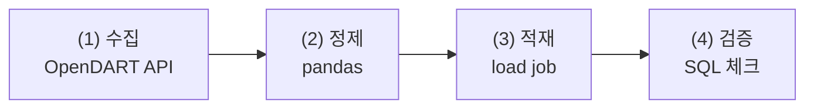
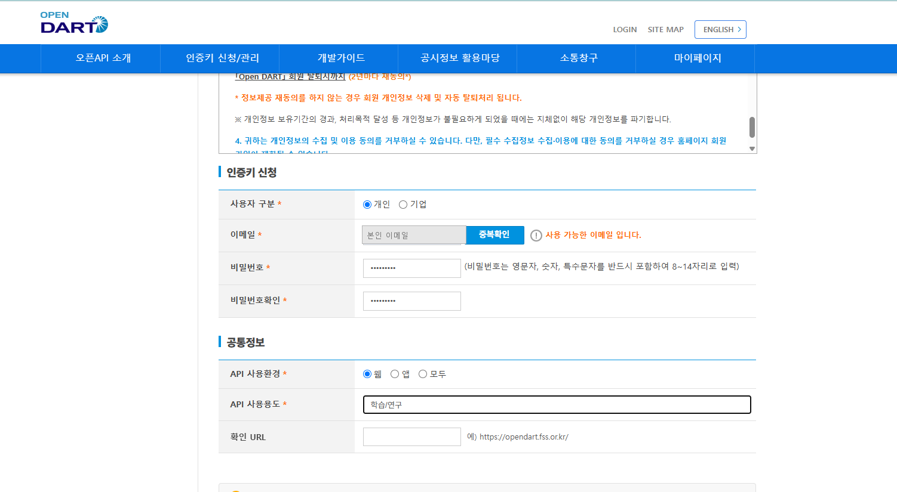
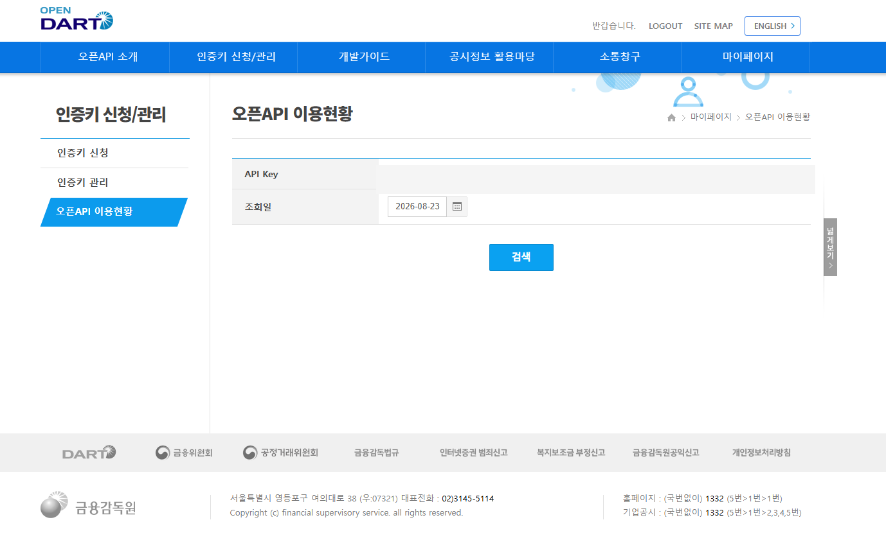
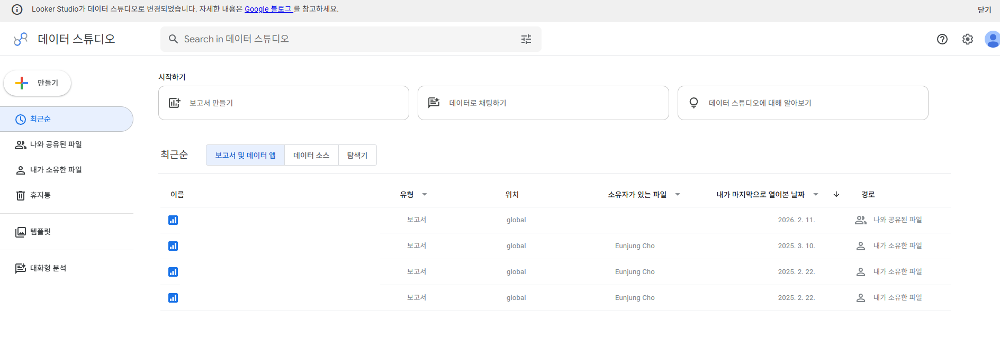
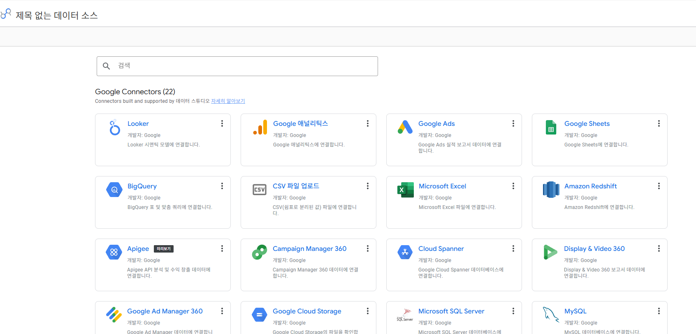
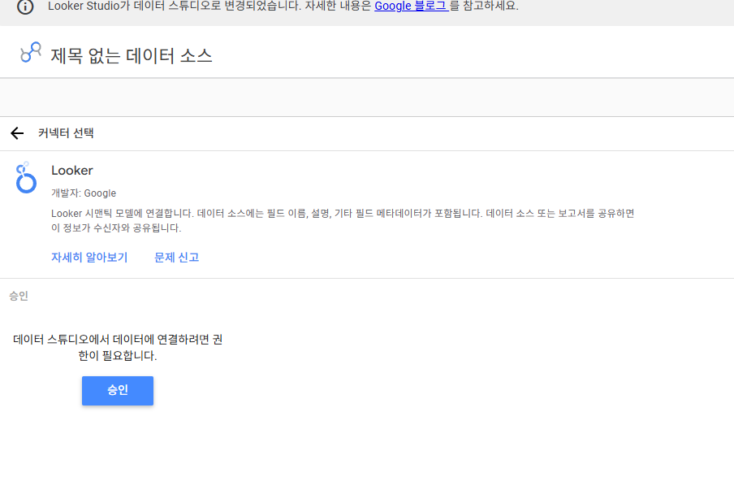
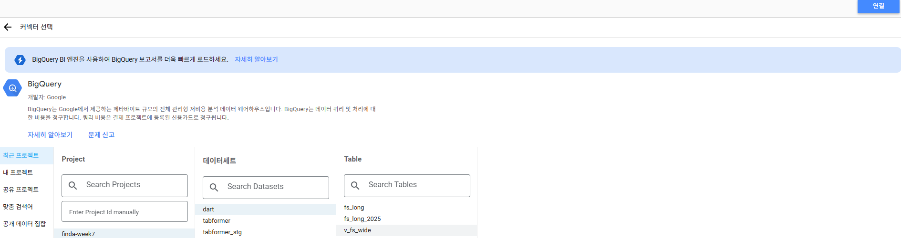

# FinDA 8주차 3일차 — 데이터는 저절로 쌓이지 않는다: DART → BigQuery 재무분석 파이프라인

> 8주차 마지막 날(3시간) 강의안. Colab에서 OpenDART API로 기업 재무제표를 직접 수집·정제해 본인 BigQuery 프로젝트에 배치 적재하고, 재무제표를 읽는 법을 익힌 뒤 이틀간 배운 SQL로 3개년 재무분석까지 완주하는 날입니다. "남이 만든 데이터를 조회하는 사람"에서 "필요한 데이터를 직접 확보해 쌓고, 읽는 사람"으로 넘어갑니다. 전 과정 과금 0원입니다.

---

## 오늘의 개요

| 구분 | 시간 | 내용 |
| --- | --- | --- |
| Session 3-1 | 50분 | OpenDART 이해와 사전 준비 → 수집·정제·적재 |
| 쉬는 시간 | 10분 | |
| Session 3-2 | 50분 | 재무제표 읽는 법 → SQL로 확인 (검증·피벗·재무비율·YoY) |
| 쉬는 시간 | 10분 | |
| Session 3-3 | 50분 | 배치 자동화(GitHub Actions)와 Looker Studio 대시보드, 회고 |
| 쉬는 시간 | 10분 | |
| 합계 | 180분 (3시간) | |

### 오늘의 학습 목표

- (1) 배치 파이프라인의 4단계(수집→정제→적재→검증)를 설명하고 직접 구현할 수 있다.
- (2) load job과 스트리밍 insert의 비용 차이를 알고, "왜 배치인가"를 아키텍처 관점에서 설명할 수 있다.
- (3) 멱등성 2패턴(전체 재적재 replace, 하이워터마크 append)을 구분해 쓸 수 있다.
- (4) OpenDART API로 기업 재무제표를 수집하고, long format 그레인으로 정제·적재할 수 있다.
- (5) **손익계산서·재무상태표·현금흐름표를 연결해 회사의 3개년 흐름을 문장으로 설명할 수 있다.**
- (6) 조건부 집계로 long→wide 피벗을 만들고, 재무비율(부채비율·영업이익률·ROE)을 SQL로 산출할 수 있다.
- (7) LAG로 연도별 성장률을, QUALIFY로 기업 간 비교 랭킹을 만들 수 있다.
- (8) 파이프라인을 GitHub Actions cron으로 주 1회 자동 실행되게 만들고, Looker Studio로 기업 비교 대시보드를 만들 수 있다.

### 오늘 시작 전 확인 사항 (사전 준비 안 된 분은 손!)

- (1) **OpenDART API 키** — 사전 안내대로 발급받아 오셨어야 합니다. 못 받았으면 1-5에서 같이 신청하고(5분), 승인 전까지는 플랜 B(사전 배포 JSON 파일)로 실습합니다.
- (2) **본인 GCP 프로젝트** — 확인 쿼리 1줄이 돌아가는 상태여야 합니다. 문제가 있으면 강사 프로젝트의 `student_N` 데이터셋을 임시로 씁니다.
- (3) Colab 접속 확인. 오늘은 하루 종일 Colab과 BigQuery 콘솔을 오갑니다.
- (4) 오늘 만드는 데이터셋의 위치는 **asia-northeast3(서울)로 통일**합니다 — 7주차 데이터와 같은 리전이어야 나중에 조인할 수 있습니다.

오늘의 큰 그림 한 줄: 실무 데이터 분석가의 하루 절반은 "필요한 데이터를 확보하는 일"입니다. 오늘 그 절반을 배웁니다.

---

## Session 3-1. OpenDART 이해와 수집·정제·적재 (50분)

### 1-1. 도입: 분석가는 데이터를 기다리지 않는다 (3분)

이번 주 내내 우리는 강사가 올려 둔 TabFormer를 썼습니다. 그런데 회사에서는 이런 일이 매일 생깁니다.

> "경쟁사 재무 상태를 우리 대시보드에 넣고 싶은데요." — 사내 DW에는 그런 데이터가 없습니다. 누군가 **밖에서 가져와서, 쌓아야** 합니다.

오늘 그 "누군가"가 됩니다. 재료는 대한민국에서 가장 신뢰할 수 있는 공짜 데이터 — **전자공시시스템(DART)**의 기업 재무제표입니다.

### 1-2. 파이프라인 4단계와 배치 vs 스트리밍 (6분)



데이터를 BigQuery에 넣는 길은 크게 둘입니다.

| | 배치 (load job) | 스트리밍 insert |
| --- | --- | --- |
| 방식 | 파일·DataFrame을 **한 번에** 적재 | 행 단위로 실시간 밀어넣기 |
| 비용 | **무료** | **유료** (GB당 과금) |
| 지연 | 분 단위 | 초 단위 |
| 우리의 선택 | ✅ | ❌ (샌드박스에서는 아예 불가) |

"학생 과금 금지"라는 우리 원칙이 여기서 **아키텍처를 결정**합니다 — 재무제표는 1년에 네 번 나오는 데이터라 실시간이 필요 없고, 그러면 무료인 load job이 정답입니다. 비용 제약이 설계를 이끄는 것, 실무에서도 똑같습니다.

그리고 2일차 FDS에서 본 절차형 vs 집합의 구도가 적재에도 있습니다 — **행 단위 insert를 루프로 돌리는 것은 절차형의 죄악**입니다(느리고, 유료이고, 쿼터를 갉아먹습니다). 모아서 한 번에, 배치로.

### 1-3. 멱등성: 같은 배치를 두 번 돌려도 안전한가 (5분)

배치는 실패하고, 재실행됩니다. 그때 데이터가 두 배가 되면 안 됩니다. **멱등성(같은 작업을 몇 번 해도 결과가 같음)**을 확보하는 두 패턴:

- (1) **전체 재적재(replace)**: 테이블을 지우고 다시 만든다. 단순하고 확실. 데이터가 작을 때의 정답. → 오늘 1-8에서 사용.
- (2) **하이워터마크 append**: "어디까지 쌓았나"(예: 마지막 연도)를 조회하고, 그 **이후만** 수집해 덧붙인다. 데이터가 클 때의 정답. → 데이터가 커질 때의 확장으로 3-1에서 소개.

실무에는 세 번째 패턴(MERGE upsert)이 있지만 샌드박스에서는 DML 제약이 있어 다루지 않습니다 — "실무에선 MERGE가 추가된다" 한 줄만 기억하세요. 그리고 하이워터마크 append는 부분 실패 후 재실행 시 중복이 생길 수 있는 준-멱등 패턴입니다. 그래서 **4단계(검증)가 파이프라인의 장식이 아니라 필수**입니다.

### 1-4. OpenDART 해부 (7분)

OpenDART(opendart.fss.or.kr)는 금융감독원 전자공시의 공식 API입니다. DART 자체는 상장사가 **법으로 정해진 공시 의무**를 이행하는 창구이고, 그 의무 덕분에 우리가 재무제표를 공짜로, 표준화된 형태로 받아올 수 있습니다. **규제가 곧 데이터 소스입니다.**

- (1) **인증**: API 키 1개. 무료, 일 20,000건 한도 — 수업 용도로는 무한에 가깝습니다.
- (2) **기업 식별**: 종목코드가 아니라 DART 고유의 `corp_code`(8자리)를 씁니다. 전체 목록은 `corpCode.xml`(zip)로 한 번에 내려받습니다. 여기에는 상장사뿐 아니라 **공시 의무가 있는 모든 법인 10만 개 이상**이 들어 있고, 상장사는 그중 `stock_code`가 붙은 2,600곳 남짓입니다.
- (3) **재무제표 API 2종**:

| API | 용도 | 우리의 선택 |
| --- | --- | --- |
| `fnlttSinglAcntAll` | **단일회사 전체 재무제표** — 한 회사의 모든 계정과목 | ✅ 주 교재 (long format 교육 가치) |
| `fnlttMultiAcnt` | 다중회사 주요계정 — 여러 회사의 핵심 계정만 | 기업 비교 시 보조 |

- (4) **파라미터 상식**: `bsns_year`(사업연도), `reprt_code`(11011 사업보고서, 11012 반기, 11013 1분기, 11014 3분기), `fs_div`(CFS 연결 / OFS 별도).
- (5) **응답의 모양**: 재무제표가 "표"가 아니라 **"행들"**로 옵니다 — 한 행 = 계정과목 하나. `account_nm`(계정명), `thstrm_amount`(당기 금액), `sj_div`(BS 재무상태표 / IS 손익계산서 / CF 현금흐름표)….

이 long format이 오늘의 스키마 설계 그 자체입니다.

### 1-5. 사전 준비: API 키 발급과 GCP 점검 (4분) { #prep }

> 원래 수업 전에 마쳐 오는 부분입니다. 이미 하신 분은 확인만 하고 넘어가고, 못 하신 분은 지금 신청하세요 — 승인까지 시간이 걸릴 수 있어 **플랜 B와 병행**합니다.

**준비 1. OpenDART API 키 발급 (5분, 무료)**

- (1) https://opendart.fss.or.kr 접속 → 우측 상단 **"인증키 신청/관리"**
- (2) 회원가입 (이메일 인증)
- (3) 로그인 후 **인증키 신청** — 사용 목적은 "학습/연구"로 간단히 적으면 됩니다
- (4) 발급된 키(영문+숫자 40자)를 메일 또는 마이페이지에서 확인

인증키 신청 화면은 이렇게 생겼습니다 — 이메일은 본인 것을 넣고, 사용자 구분 **개인** / API 사용환경 **웹** / API 사용용도 **학습/연구**로 채우면 됩니다 (확인 URL은 비워도 됩니다).



**발급 확인 테스트**: 브라우저 주소창에 아래를 붙여넣고(키 부분만 교체) 실행하세요.

```
https://opendart.fss.or.kr/api/company.json?crtfc_key=본인키&corp_code=00126380
```

`"status":"000"`과 함께 삼성전자 정보가 보이면 성공입니다. `"010"` 또는 `"011"`이면 키가 아직 활성화되지 않은 것 — 몇 분 뒤 다시 시도하세요.

발급된 키와 일별 호출량은 **마이페이지 → 오픈API 이용현황**에서 언제든 확인할 수 있습니다.



키는 **비밀번호처럼** 다룹니다. 노트북(Colab)을 공유할 때 키가 박힌 채로 공유하지 않기 — 1-7에서 안전한 보관 패턴을 씁니다.

**준비 2. GCP 프로젝트 점검 (3분)**

오늘은 7주차처럼 강사 데이터를 "읽기만" 하는 게 아니라 **본인 프로젝트에 테이블을 만듭니다.** 프로젝트가 살아 있는지 확인하세요.

- (1) https://console.cloud.google.com/bigquery 접속
- (2) 상단 프로젝트 선택기에서 **본인 프로젝트**(7주차 첫날 만든 것)를 선택
- (3) 쿼리 편집기에서 `SELECT 1 AS ok` 실행 → `ok = 1`이 나오면 통과

프로젝트가 없거나 오류가 나면 손을 드세요 — 강사 프로젝트의 `student_N` 데이터셋을 임시로 배정합니다.

> 📷 스크린샷 추가 예정: (프로젝트 선택기와 확인 쿼리 결과 화면)

### 1-6. 스키마 설계: 그레인 선언 (4분)

7주차 마트 원칙 — 설계의 첫 질문은 "한 행이 무엇인가". 오늘의 답:

> **한 행 = 기업 × 사업연도 × 재무제표구분(fs_div) × 재무제표종류(sj_div) × 계정과목**

이 그레인이면 (1) 어떤 계정이 와도 스키마 변경 없이 쌓이고 (2) 여러 기업·여러 연도를 같은 테이블에 append할 수 있고 (3) 분석 시점에 원하는 모양으로 피벗하면 됩니다. **"넓은 표로 저장하고 싶은 유혹을 참고, 길게 쌓아서 나중에 피벗한다"** — 웨어하우스 설계의 기본기입니다.

### 1-7. 실습: 키 등록과 내 기업 찾기 (8분)

Colab에서 순서대로:

```python
# (1) 키 등록과 corpCode 내려받기
import getpass
import io
import os
import zipfile
import xml.etree.ElementTree as ET

import pandas as pd
import requests

# 키를 노트북에 적어 두지 않는다 — 실행하면 입력창이 뜬다
API_KEY = os.environ.get("DART_API_KEY") or getpass.getpass("DART API 키를 붙여넣으세요: ")

res = requests.get(
    "https://opendart.fss.or.kr/api/corpCode.xml",
    params={"crtfc_key": API_KEY},
    timeout=30,
)
zf = zipfile.ZipFile(io.BytesIO(res.content))
tree = ET.parse(zf.open("CORPCODE.xml"))

rows = [
    {
        "corp_code": el.findtext("corp_code"),
        "corp_name": el.findtext("corp_name"),
        "stock_code": (el.findtext("stock_code") or "").strip(),
    }
    for el in tree.iter("list")
]
corp = pd.DataFrame(rows)
print(len(corp))                  # 10만 개 이상 (비상장 포함)
```

```python
# (2) 상장사만 남기고, 분석할 기업 찾기
listed = corp[corp["stock_code"] != ""]
print(f"상장사 {len(listed)}개 / 전체 {len(corp)}개")

# 이름은 비슷한 게 많아서(삼성전자서비스 등) 종목코드로 찾는 편이 안전하다
TARGET_STOCKS = ["005930", "000660"]        # 삼성전자, SK하이닉스
targets = listed[listed["stock_code"].isin(TARGET_STOCKS)].reset_index(drop=True)
targets
```

- `print(len(corp))`의 10만 개는 **상장사 수가 아닙니다** — DART에 공시 의무가 있는 전체 법인 수이고, 상장사는 `stock_code`가 붙은 2,600곳 남짓입니다.
- 미션: 본인이 분석하고 싶은 **상장사 1곳**의 종목코드를 `TARGET_STOCKS`에 추가하세요.
- 키가 아직 없는 분: 강사가 배포한 `corpcode_sample.csv`와 `fs_sample.json`으로 같은 흐름을 재현합니다.

### 1-8. 실습: 수집 → 정제 → 적재 (13분)

**(1) 수집** — 대상 기업 × 최근 5년 사업보고서를 한 번에 받습니다.

```python
LATEST_YEAR = 2025                                  # 사업보고서가 나온 가장 최근 사업연도
YEARS = range(LATEST_YEAR - 4, LATEST_YEAR + 1)     # 최근 5년

def fetch_fs(corp_code, year, reprt_code="11011", fs_div="CFS"):
    """한 기업의 한 해 재무제표. 아직 공시 전이면 None을 돌려준다."""
    res = requests.get(
        "https://opendart.fss.or.kr/api/fnlttSinglAcntAll.json",
        params={
            "crtfc_key": API_KEY,
            "corp_code": corp_code,
            "bsns_year": str(year),
            "reprt_code": reprt_code,      # 11011 사업보고서
            "fs_div": fs_div,              # CFS 연결
        },
        timeout=30,
    )
    data = res.json()
    if data["status"] == "013":            # 조회된 데이터 없음 = 아직 공시 전
        return None
    if data["status"] != "000":
        raise RuntimeError(f"{corp_code} {year}: {data['status']} {data['message']}")
    return pd.DataFrame(data["list"])

raw_parts = []
for row in targets.itertuples():
    for year in YEARS:
        raw = fetch_fs(row.corp_code, year)
        if raw is None:
            print(f"건너뜀  {row.corp_name} {year} (아직 공시 전)")
            continue
        raw["corp_name"] = row.corp_name    # 응답에 없는 값은 우리가 채운다
        raw["fs_div"] = "CFS"
        raw_parts.append(raw)
        print(f"수집    {row.corp_name} {year}: {len(raw)}행")

raw_all = pd.concat(raw_parts, ignore_index=True)
```

status 코드 상식: `000` 성공, `010`/`011` 키 문제, `013` 데이터 없음, `020` 한도 초과. **`013`을 예외가 아니라 정상 흐름으로 처리한 것**에 주목하세요 — "아직 안 나온 분기"는 오류가 아니라 배치가 매번 만나는 평범한 상황입니다.

화면에 뜬 것을 관찰하세요 — `thstrm_amount`가 `"258,935,494,000,000"` 같은 **콤마 붙은 문자열**입니다. 7주차 첫날 `$318.35`를 만났을 때와 같은 상황입니다. **어느 원천이든 금액은 문자열로 온다** — 이제는 놀랍지 않죠.

**(2) 정제** — 콤마 금액과 컬럼 다이어트.

```python
def clean_amount(s: pd.Series) -> pd.Series:
    """콤마 제거 후 숫자로. 실패하면 NaN (SAFE_CAST의 pandas 버전)."""
    return pd.to_numeric(s.astype(str).str.replace(",", "", regex=False), errors="coerce")

fs = raw_all[[
    "corp_code", "corp_name", "bsns_year", "reprt_code", "fs_div",
    "sj_div", "sj_nm", "account_id", "account_nm", "ord",
    "thstrm_amount",
]].copy()
fs["amount_krw"] = clean_amount(fs["thstrm_amount"]).astype("Int64")   # 원 단위 정수
fs["bsns_year"] = fs["bsns_year"].astype(int)
fs["ord"] = pd.to_numeric(fs["ord"], errors="coerce").astype("Int64")

fs = fs.drop(columns=["thstrm_amount"])
fs.info()
```

- (1) `errors="coerce"`는 pandas의 SAFE_CAST입니다 — 못 바꾸는 값은 NaN으로. 어디서 NaN이 생겼는지 `fs[fs["amount_krw"].isna()]`로 꼭 봐야 합니다 (일부 주석성 계정은 금액이 비어 있는 것이 정상).
- (2) `Int64`(대문자 I)는 **NULL을 담을 수 있는 정수형**입니다. 금액을 실수로 저장하면 BigQuery에서 FLOAT64가 되므로, 원 단위 정수는 정수로 싣습니다.
- (3) `account_id`(표준계정 ID)를 버리지 않고 남긴 이유: `account_nm`(한글 계정명)은 기업·연도마다 표기가 흔들릴 수 있어, 정밀 분석에는 ID가 더 안정적입니다. 오늘은 이름으로 가되 ID를 보험으로 싣습니다.

**(3) 적재** — pandas-gbq load job.

```python
from pandas_gbq import to_gbq

MY_PROJECT = "본인-프로젝트-ID"

to_gbq(
    fs,
    destination_table="dart.fs_long",
    project_id=MY_PROJECT,
    if_exists="replace",          # 멱등 패턴 (1): 전체 재적재
    location="asia-northeast3",   # 7주차 데이터와 같은 리전
)
print(f"적재 완료: {len(fs)}행")
```

콘솔에서 확인 — `dart.fs_long` 테이블의 Schema 탭과 미리보기. **적재 후 콘솔 확인은 습관입니다.** (`to_gbq`는 내부적으로 load job을 씁니다 — 무료 경로인 이유.)

마지막으로 노트북을 위에서 아래로 **한 번 더 실행**하세요. 행 수가 그대로면(2배가 아니면) replace 멱등성이 확인된 것입니다. "재실행해도 안전한가"는 배치의 첫 번째 인터뷰 질문입니다.

다음 세션 예고: 쌓았습니다. 그런데 **무엇을 봐야 하는지** 모르면 쌓은 의미가 없습니다.

---

## Session 3-2. 재무제표 읽는 법과 SQL 확인 (50분)

### 2-1. 재무제표 읽는 법: 네 개의 표와 읽는 순서 (15분)

오늘의 목표는 회계사가 되는 게 아니라 **"이 회사가 최근 3년간 어떻게 돈을 벌었고, 재무적으로 좋아지고 있는가"를 데이터로 말하는 것**입니다. 그 정도는 표 세 개와 사업 내용 하나면 충분합니다.

| 재무제표 | 한마디로 | 알고 싶은 것 | `sj_div` |
| --- | --- | --- | --- |
| 손익계산서 | 올해 장사 잘했나 | 매출, 영업이익, 순이익 | `IS` |
| 재무상태표 | 지금 가진 것과 빚은 | 자산, 부채, 자본 | `BS` |
| 현금흐름표 | 실제 현금은 움직였나 | 영업·투자·재무 현금흐름 | `CF` |
| 사업부문 정보 | 그래서 뭘 팔아서 벌었나 | 부문별 매출·영업이익 | **API에 없음** |

읽는 순서는 이렇습니다. 위에서 아래로 한 번만 훑으면 회사의 3년이 대략 보입니다.

- (1) **뭘 하는 회사인가** → 사업의 내용 / 사업부문
- (2) **얼마나 팔았나** → 매출액
- (3) **그래서 얼마나 벌었나** → 영업이익 → 영업이익률 → 당기순이익
- (4) **무엇으로 벌었나** → 사업부문별 매출·영업이익
- (5) **재무적으로 튼튼한가** → 자산·부채·자본 → 부채비율
- (6) **실제 현금도 들어오나** → 영업활동현금흐름
- (7) **3년간 좋아지고 있나** → YoY와 추세

#### 손익계산서 — 3개년 분석의 출발점

| | 2023 | 2024 | 2025 |
| --- | ---: | ---: | ---: |
| 매출액 | 100조 | 120조 | 150조 |
| 영업이익 | 10조 | 15조 | 24조 |
| 당기순이익 | 8조 | 12조 | 19조 |

이 표만 봐도 **"매출도 늘고 있고, 이익은 매출보다 더 빠르게 늘고 있다"**는 첫 판단이 섭니다. 세 숫자는 이렇게 이어집니다 — **매출액**(얼마나 팔았나) → **영업이익**(본업으로 얼마나 남겼나) → **당기순이익**(이자·세금까지 치르고 최종으로 얼마 남았나).

여기에 **영업이익률 = 영업이익 ÷ 매출액**을 항상 세트로 보세요. 24조 ÷ 150조 = 16%, 즉 "100원어치 팔아서 본업으로 16원 남겼다"입니다. 매출액·영업이익·영업이익률 셋을 묶는 것이 3개년 분석의 기본기입니다.

#### 재무상태표 — 한 시점의 재산 상태

손익계산서가 1년 동안의 성적이라면, 재무상태표는 특정 시점의 스냅숏입니다. 구조는 하나만 기억하면 됩니다.

> **자산 = 부채 + 자본**

처음에는 전부 볼 필요 없습니다. **현금및현금성자산**(현금을 얼마나 쥐고 있나), **부채총계**(빚이 늘고 있나), **자본총계**(자기자본이 쌓이고 있나) 셋이면 됩니다. 여기서 나오는 유명한 지표가 **부채비율 = 부채총계 ÷ 자본총계 × 100**입니다. 다만 "몇 % 넘으면 위험"처럼 절대 기준으로 읽으면 안 됩니다 — **동종 업계와 비교할 때만 의미**가 생깁니다.

#### 현금흐름표 — 가장 많이 건너뛰지만 가장 정직한 표

이익이 났다고 현금이 들어온 것은 아닙니다. 세 줄만 보면 됩니다.

| 현금흐름 | 의미 |
| --- | --- |
| 영업활동현금흐름 | 본업으로 현금을 벌었나 |
| 투자활동현금흐름 | 공장·설비·투자에 돈을 썼나 |
| 재무활동현금흐름 | 빌리고, 갚고, 배당했나 |

특히 **영업활동현금흐름을 영업이익과 나란히** 놓아 보세요.

| | 2023 | 2024 | 2025 |
| --- | ---: | ---: | ---: |
| 영업이익 | 10조 | 15조 | 20조 |
| 영업활동현금흐름 | 11조 | 5조 | -2조 |

이런 모양이 나오면 질문이 생깁니다 — **"이익은 계속 느는데 왜 실제 현금은 안 들어오지?"** 매출채권이나 재고자산이 급증했는지 확인할 이유가 생기는 겁니다. 좋은 분석은 답을 내는 게 아니라 **다음 질문을 만듭니다.**

#### 3개년 분석에 필요한 지표는 10개면 충분

| 영역 | 지표 | 보는 이유 |
| --- | --- | --- |
| 성장 | 매출액 | 회사 규모가 커지는가 |
| 수익성 | 영업이익 | 본업으로 버는가 |
| 수익성 | 영업이익률 | 얼마나 효율적으로 버는가 |
| 수익성 | 당기순이익 | 최종적으로 얼마 남았나 |
| 안정성 | 자산총계 | 전체 규모 |
| 안정성 | 부채총계 | 부담이 늘고 있나 |
| 안정성 | 자본총계 | 자기자본이 쌓이나 |
| 안정성 | 부채비율 | 부채 부담 수준 |
| 현금 | 영업활동현금흐름 | 실제로 현금이 들어오나 |
| 사업구조 | 사업부문별 매출·영업이익 | 도대체 무엇으로 버나 |

앞의 아홉 개는 **1교시에 쌓은 `fs_long`에서 SQL로 전부 나옵니다.** 열 번째만 나오지 않습니다.

> **사업부문 정보가 API에 없는 이유**: `fnlttSinglAcntAll`은 재무제표 본표만 돌려줍니다. 부문별 매출·영업이익은 사업보고서 본문의 "사업의 내용"과 주석에 있어서, DART 웹(dart.fss.or.kr)에서 사람이 읽어야 합니다. 오늘 숫자 분석은 나머지 아홉 개로 하고, 부문별 표는 과제에서 DART 웹으로 직접 확인합니다 — **무엇이 자동화되고 무엇이 안 되는지 구분하는 것도 파이프라인 설계의 일부**입니다.

부문별 정보가 왜 중요한지는 예를 보면 바로 옵니다.

| 사업 | 매출 | 영업이익 |
| --- | ---: | ---: |
| 반도체 | 100조 | 20조 |
| 모바일 | 120조 | 12조 |
| 디스플레이 | 30조 | 5조 |
| 기타 | 20조 | 1조 |

"270조 매출 회사"라는 한 줄보다 **"매출은 모바일이 크지만 이익은 반도체가 끌고 있다"**가 훨씬 중요한 사실입니다. 이게 "이 회사가 무엇으로 돈을 버는가"에 대한 답입니다.

#### 숫자보다 변화

마지막이자 가장 중요한 원칙입니다. "2025년 매출 300조"라는 사실 하나보다,

> 2023년 260조 → 2024년 280조 **(+7.7%)** → 2025년 300조 **(+7.1%)**

이 흐름이 훨씬 많은 것을 말합니다. 그래서 오늘 SQL의 종착점이 **LAG로 뽑는 YoY**입니다. 1일차에 배운 윈도우 함수가 2-5에서 여기에 쓰입니다.

### 2-2. 검증: 쿼리 4종 세트 (8분)

읽는 법을 알았으니 이제 쿼리로 확인합니다. 그런데 그 전에, **쌓은 것이 믿을 만한지부터** 봅니다. 파이프라인의 4단계이자 오늘 이후 여러분의 모든 적재에 따라붙어야 하는 4종입니다.

```sql
-- (1) 행 수: 기대 범위인가 (전체 재무제표는 보통 수백 행 × 기업 × 연도)
SELECT COUNT(*) AS row_cnt
FROM `본인프로젝트.dart.fs_long`;

-- (2) 그레인 중복: 한 행이 정말 한 행인가
SELECT
    f.corp_code, f.bsns_year, f.fs_div, f.sj_div, f.account_id, f.account_nm,
    COUNT(*) AS dup_cnt
FROM `본인프로젝트.dart.fs_long` AS f
GROUP BY f.corp_code, f.bsns_year, f.fs_div, f.sj_div, f.account_id, f.account_nm
HAVING COUNT(*) > 1;

-- (3) 핵심 계정 존재: 분석에 쓸 계정이 실제로 있는가
SELECT DISTINCT f.sj_div, f.account_nm
FROM `본인프로젝트.dart.fs_long` AS f
WHERE f.account_nm LIKE '%매출%'
   OR f.account_nm LIKE '%영업이익%'
   OR f.account_nm LIKE '%총계%'
   OR f.account_nm LIKE '%현금흐름%'
ORDER BY f.sj_div, f.account_nm;

-- (4) NULL 비율: 정제에서 새는 곳은 없는가
SELECT
    COUNTIF(f.amount_krw IS NULL) AS null_cnt,
    SAFE_DIVIDE(COUNTIF(f.amount_krw IS NULL), COUNT(*)) AS null_rate
FROM `본인프로젝트.dart.fs_long` AS f;
```

**(3)번을 특히 잘 보세요.** 다음 절의 피벗에서 쓸 계정명이 실제로 어떻게 적혀 있는지 확인하는 쿼리입니다. `매출액`인지 `수익(매출액)`인지, `영업활동현금흐름`인지 `영업활동으로인한현금흐름`인지가 여기서 드러납니다. **원천의 표기를 확인하지 않고 쓴 CASE 문은 조용히 NULL을 만듭니다.**

### 2-3. 피벗: long을 wide로 (8분)

분석 질문은 wide를 원합니다("매출, 영업이익, 부채, 현금흐름을 한 행에"). 조건부 집계가 피벗의 표준 문형입니다 — **피벗은 함수가 아니라 패턴입니다.**

```sql
WITH wide AS (    -- 한 행 = 기업 × 사업연도
    SELECT
        f.corp_name,
        f.bsns_year,
        -- 재무상태표 (BS)
        MAX(CASE WHEN f.account_nm = '자산총계' THEN f.amount_krw END) AS assets,
        MAX(CASE WHEN f.account_nm = '부채총계' THEN f.amount_krw END) AS liabilities,
        MAX(CASE WHEN f.account_nm = '자본총계' THEN f.amount_krw END) AS equity,
        MAX(CASE WHEN f.account_nm = '현금및현금성자산' THEN f.amount_krw END) AS cash,
        MAX(CASE WHEN f.account_nm = '재고자산' THEN f.amount_krw END) AS inventory,
        MAX(CASE WHEN f.account_nm = '매출채권' THEN f.amount_krw END) AS receivables,
        -- 손익계산서 (IS)
        MAX(CASE WHEN f.account_nm = '매출액' THEN f.amount_krw END) AS revenue,
        MAX(CASE WHEN f.account_nm = '영업이익' THEN f.amount_krw END) AS op_income,
        MAX(CASE WHEN f.account_nm = '당기순이익' THEN f.amount_krw END) AS net_income,
        -- 현금흐름표 (CF)
        MAX(CASE WHEN f.account_nm LIKE '영업활동%현금흐름'
                 THEN f.amount_krw END) AS operating_cf
    FROM `본인프로젝트.dart.fs_long` AS f
    WHERE f.fs_div = 'CFS'
      AND f.sj_div IN ('BS', 'IS', 'CF')
    GROUP BY f.corp_name, f.bsns_year
)
SELECT * FROM wide
ORDER BY corp_name, bsns_year
```

계정명이 기업에 따라 `매출액`이 아니라 `수익(매출액)`으로 오기도 하고, 영업활동현금흐름은 표기가 갈려서 `LIKE`로 받았습니다. **피벗 결과에 NULL이 보이면 2-2의 검증 쿼리 (3)으로 실제 계정명을 확인하고 CASE를 보정하세요** — 원천 데이터의 표기 흔들림에 대응하는 것까지가 수집가의 일입니다.

### 2-4. 재무비율과 3개년 스토리 (9분)

| 비율 | 정의 | 묻는 것 |
| --- | --- | --- |
| 부채비율 | 부채총계 / 자본총계 | 빚에 얼마나 기대고 있나 |
| 영업이익률 | 영업이익 / 매출액 | 본업으로 얼마나 남기나 |
| ROE | 당기순이익 / 자본총계 | 주주 돈으로 얼마나 벌었나 |

```sql
SELECT
    w.corp_name, w.bsns_year,
    SAFE_DIVIDE(w.liabilities, w.equity)     AS debt_ratio,
    SAFE_DIVIDE(w.op_income, w.revenue)      AS op_margin,
    SAFE_DIVIDE(w.net_income, w.equity)      AS roe,
    SAFE_DIVIDE(w.operating_cf, w.op_income) AS cf_to_profit  -- 이익이 현금으로 돌아오나
FROM wide AS w
ORDER BY w.corp_name, w.bsns_year
```

전부 SAFE_DIVIDE입니다 — 자본잠식 기업(equity ≤ 0)이 실제로 존재하는 세계라서, 0 나누기 방어는 재무 데이터에서 장식이 아닙니다. 마지막 `cf_to_profit`이 2-1에서 본 "이익 대비 현금" 질문을 한 컬럼으로 만든 것입니다. 1 근처면 건강하고, 계속 낮아지면 매출채권·재고를 확인할 신호입니다.

**결과를 이런 표로 정리하면 스토리가 만들어집니다.**

| 지표 | 2023 | 2024 | 2025 | 3년 흐름 |
| --- | ---: | ---: | ---: | --- |
| 매출 | 260조 | 280조 | 300조 | ↗ |
| 영업이익 | 15조 | 25조 | 35조 | ↗↗ |
| 영업이익률 | 5.8% | 8.9% | 11.7% | 개선 |
| 순이익 | 12조 | 20조 | 28조 | ↗ |
| 부채 | 100조 | 105조 | 110조 | 소폭 증가 |
| 부채비율 | 35% | 34% | 33% | 개선 |
| 영업현금흐름 | 30조 | 38조 | 45조 | ↗ |

그러면 이런 문장이 자연스럽게 나옵니다.

> "최근 3년간 매출이 꾸준히 성장했고, 영업이익은 매출보다 빠르게 증가해 영업이익률이 5.8%에서 11.7%까지 개선됐다. 부채는 소폭 늘었지만 자본이 더 늘어 부채비율은 오히려 하락했으며, 영업현금흐름도 함께 증가해 수익성과 현금창출력이 같이 좋아지고 있다."

**이 문단을 쓰는 것이 재무제표 분석의 최종 결과물입니다.** 숫자를 뽑는 것이 아니라, 숫자로 문장을 만드는 것. 여러분이 만든 `fs_long` 하나면 여기까지 옵니다.

> **제조업이라면 한 단계 더**: 삼성전자 같은 제조업은 **재고자산·매출채권·설비투자(CAPEX)**를 추가로 봅니다. `매출 ↓ + 재고 ↑`면 "안 팔려서 재고가 쌓이나?", `CAPEX ↑`면 "공장에 대규모 투자를 하나?"라는 질문이 생깁니다. 재고자산과 매출채권은 2-3 피벗에 이미 넣어 뒀고, CAPEX는 현금흐름표의 `유형자산의 취득` 항목으로 근사할 수 있습니다. **숫자를 보는 목적은 외우는 게 아니라 다음 질문을 만드는 것입니다.**

### 2-5. YoY와 기업 비교: 변화를 보는 쿼리 (10분)

2-1에서 "숫자보다 변화"라고 했습니다. 그 원칙을 쿼리로 만듭니다 — 1일차의 LAG가 재무 데이터 위에서 돌아옵니다.

```sql
SELECT
    w.corp_name, w.bsns_year, w.revenue,
    SAFE_DIVIDE(w.revenue,
                LAG(w.revenue) OVER (PARTITION BY w.corp_name
                                     ORDER BY w.bsns_year)) - 1 AS revenue_yoy,
    SAFE_DIVIDE(w.op_income,
                LAG(w.op_income) OVER (PARTITION BY w.corp_name
                                       ORDER BY w.bsns_year)) - 1 AS op_income_yoy
FROM wide AS w
ORDER BY w.corp_name, w.bsns_year
```

그리고 기업 간 비교 — 1일차의 QUALIFY까지 재등장하면서 사흘의 도구가 한 쿼리에 모입니다.

```sql
-- "가장 최근 연도에 영업이익률이 가장 높은 기업은?"
SELECT
    w.corp_name, w.bsns_year,
    SAFE_DIVIDE(w.op_income, w.revenue) AS op_margin
FROM wide AS w
QUALIFY RANK() OVER (PARTITION BY w.bsns_year
                     ORDER BY SAFE_DIVIDE(w.op_income, w.revenue) DESC) <= 3
ORDER BY w.bsns_year DESC, op_margin DESC
```

미션: 두 기업의 3개년 흐름을 2-4의 스토리 문단 형식으로 각각 한 문단씩 써 보세요. **"어느 쪽이 더 좋은 회사인가"가 아니라 "어느 쪽이 좋아지고 있는가"**를 쓰는 것이 핵심입니다.

2교시 정리 — (1) 표 세 개가 답하는 질문이 다르다. (2) 피벗은 함수가 아니라 조건부 집계 패턴이다. (3) 계정명 표기는 흔들리니 CASE 전에 실제 값을 확인한다. (4) 분석의 결과물은 숫자가 아니라 **문장**이다.

다음 세션 예고: 지금까지는 **여러분이 손으로 돌린** 파이프라인입니다. 이제 그것을 **매주 알아서 돌게** 만들고, 결과를 **남에게 보여줄 화면**으로 만듭니다.

---

## Session 3-3. 배치 자동화와 Looker Studio 대시보드 (50분)

### 3-1. 주 1회 자동 실행: GitHub Actions cron (19분)

지금 파이프라인의 문제는 **여러분이 직접 실행 버튼을 눌러야 한다**는 것입니다. 재무제표는 분기마다 새로 올라오는데, 그때마다 노트북을 열어 돌릴 수는 없습니다. 배치의 마지막 조각은 **스케줄러**입니다.

#### Colab은 왜 안 되나

Colab은 브라우저 세션에 묶인 대화형 환경입니다. 탭을 닫으면 런타임이 죽고, 유휴 90분·최대 12시간 제한이 있으며, **예약 실행 기능 자체가 없습니다.** Colab은 "사람이 보면서 돌리는 곳"이고 배치는 "사람 없이 도는 곳"이라 용도가 다릅니다.

무료로 쓸 수 있는 선택지를 비교하면 이렇습니다.

| 도구 | 비용 | 결제 계정 | 걸림돌 |
| --- | --- | --- | --- |
| **GitHub Actions cron** | 퍼블릭 레포 무제한 무료 | 불필요 | 60일간 커밋 없으면 스케줄 자동 중지 |
| Cloud Run Jobs + Cloud Scheduler | 무료 티어 내 0원 | **필수**(카드 등록) | 실무에 가장 가깝지만 설정 부담 |
| 로컬 PC + 작업 스케줄러 | 무료 | 불필요 | PC가 켜져 있어야 함 |
| BigQuery 예약 쿼리 | 무료 | 불필요 | **외부 API 호출 불가** (적재 후 집계 전용) |

오늘은 **GitHub Actions**를 씁니다. 결제 계정 없이 완전 무료이고, 파일 하나 추가하는 게 설정의 전부이기 때문입니다.

#### "새 분기가 왔다"를 어떻게 아는가

알림을 받는 게 아니라 **물어봅니다.** 아직 제출되지 않은 보고서를 요청하면 DART가 status `013`을 돌려주니, 그때는 건너뛰고 다음을 확인하면 됩니다. 1-8에서 이미 이 구조로 짜 뒀습니다 — 그 코드가 그대로 배치가 됩니다.

```python
for reprt_code in ["11013", "11012", "11014", "11011"]:   # 1분기, 반기, 3분기, 사업보고서
    raw = fetch_fs(corp_code, year, reprt_code)
    if raw is None:        # status 013 = 아직 공시 전
        continue
    ...
```

보고서 제출 기한이 분기말 후 45일(분기·반기), 사업연도말 후 90일(사업보고서)이라 **매일 돌릴 이유가 없습니다.** 주 1회로 충분합니다.

#### 워크플로 파일 한 장

레포지토리에 `.github/workflows/dart-batch.yml`을 추가하면 끝입니다.

```yaml
name: DART to BigQuery batch

on:
  schedule:
    # 매주 월요일 한국시간 08:00 (cron은 UTC 기준이라 일요일 23:00)
    - cron: "0 23 * * 0"
  workflow_dispatch:        # Actions 탭에서 수동 실행용

jobs:
  load:
    runs-on: ubuntu-latest
    steps:
      - uses: actions/checkout@v4
      - uses: actions/setup-python@v5
        with:
          python-version: "3.12"
      - run: pip install -r pipeline/requirements.txt
      - run: python pipeline/load_dart.py
        env:
          DART_API_KEY: ${{ secrets.DART_API_KEY }}
          GCP_SA_KEY: ${{ secrets.GCP_SA_KEY }}
          GCP_PROJECT: 본인-프로젝트-ID
```

읽는 법은 네 줄입니다.

- (1) `schedule.cron` — 언제 돌릴지. **UTC 기준**이라 한국시간에서 9시간을 빼야 합니다.
- (2) `workflow_dispatch` — 이게 있어야 Actions 탭에서 **수동 실행 버튼**이 생깁니다. 첫 실행은 스케줄을 기다리지 말고 여기서 눌러 확인하세요.
- (3) `steps` — 우분투 한 대를 빌려서 파이썬 깔고 스크립트 한 번 돌리는 게 전부입니다.
- (4) `secrets.*` — **키를 코드에 절대 넣지 않는 방법.** 1-7에서 `getpass`를 쓴 것과 같은 원칙이 자동화 환경으로 옮겨온 것입니다.

#### 자격증명 설정 (시연 → 과제)

배치는 사람 계정이 아니라 **서비스 계정**으로 BigQuery에 붙습니다. 사람이 없는 시간에 도는 프로그램이니 당연합니다.

- (1) GCP 콘솔 → IAM 및 관리자 → 서비스 계정 → 만들기
- (2) 역할 두 개: **BigQuery 데이터 편집자**(테이블 쓰기) + **BigQuery 작업 사용자**(로드 잡 실행)
- (3) 키 탭 → 새 키 만들기 → **JSON** 다운로드
- (4) GitHub 레포 → Settings → Secrets and variables → Actions → `DART_API_KEY`와 `GCP_SA_KEY`(JSON 전체) 등록

수업에서는 **강사 화면으로 (1)~(4)를 시연**합니다. 본인 레포 설정은 과제로 하세요 — 여기서 각자 계정 문제를 풀기 시작하면 3교시가 통째로 날아갑니다.

#### 자동화의 함정 세 가지

- (1) **빈 결과로 replace 하지 않기.** DART 장애로 수집이 0건인데 그대로 `replace`하면 멀쩡한 테이블이 빈 테이블로 덮입니다. "수집 0건이면 적재를 중단한다"는 가드가 필요합니다.
- (2) **샌드박스 60일 만료.** BigQuery 샌드박스는 테이블이 60일 후 자동 삭제됩니다. 분기마다 쌓아 올리는 파이프라인에는 치명적이라, 계속 굴리려면 결제 계정 연결을 검토해야 합니다(무료 티어 안이라 실제 청구액은 0원).
- (3) **60일 무커밋 시 스케줄 중지.** GitHub Actions는 레포에 60일간 커밋이 없으면 예약 실행을 자동으로 멈춥니다(메일로 미리 알려줍니다).

데이터가 더 커지면 매번 전부 다시 받는 대신 **하이워터마크 append**(멱등 패턴 2)로 바꿉니다 — "어디까지 쌓았나"를 조회하고 그 이후만 붙이는 방식입니다. 다만 부분 실패 시 중복이 생길 수 있는 준-멱등 패턴이라, **append 파이프라인일수록 2-2의 검증 쿼리가 필수**입니다.

### 3-2. 실습: Looker Studio 대시보드 (18분)

쌓았고, 읽었습니다. 마지막은 **남에게 보여주는 일**입니다. 분석 결과가 여러분 노트북 안에만 있으면 조직에서는 없는 것과 같습니다.

Looker Studio(현재 서비스명은 **데이터 스튜디오**로 변경)는 무료이고 BigQuery에 바로 붙습니다.

#### (1) 대시보드용 뷰 만들기 (3분)

`fs_long`은 long format이라 차트로 바로 그리기 불편합니다. **2-3의 피벗 쿼리를 뷰로 저장**해서 붙이면 훨씬 쉽습니다.

```sql
CREATE OR REPLACE VIEW `본인프로젝트.dart.v_fs_wide` AS
SELECT
    f.corp_name,
    f.bsns_year,
    MAX(CASE WHEN f.account_nm = '자산총계' THEN f.amount_krw END) AS assets,
    MAX(CASE WHEN f.account_nm = '부채총계' THEN f.amount_krw END) AS liabilities,
    MAX(CASE WHEN f.account_nm = '자본총계' THEN f.amount_krw END) AS equity,
    MAX(CASE WHEN f.account_nm = '매출액' THEN f.amount_krw END) AS revenue,
    MAX(CASE WHEN f.account_nm = '영업이익' THEN f.amount_krw END) AS op_income,
    MAX(CASE WHEN f.account_nm = '당기순이익' THEN f.amount_krw END) AS net_income
FROM `본인프로젝트.dart.fs_long` AS f
WHERE f.fs_div = 'CFS' AND f.sj_div IN ('BS', 'IS')
GROUP BY f.corp_name, f.bsns_year
```

**뷰는 저장 비용이 0원**입니다 — 쿼리 텍스트만 저장되고, 조회할 때마다 원본을 읽습니다. 7주차에 만든 `v_transactions_clean`과 같은 원리입니다.

#### (2) 데이터 스튜디오에서 BigQuery 연결 (4분)

https://lookerstudio.google.com 에 접속합니다. 상단에 "Looker Studio가 **데이터 스튜디오**로 변경되었습니다"라는 안내가 뜨죠 — 이름만 바뀌었고 화면과 기능은 같습니다. 자료나 검색에서 두 이름이 섞여 나오니 같은 도구라고 알아 두세요.

홈 화면에서 좌측 상단 **만들기 → 데이터 소스**를 누릅니다.



커넥터 목록이 나옵니다. Google Connectors에서 **BigQuery**를 선택하세요.



커넥터를 처음 쓰면 권한 **승인** 화면이 나옵니다 — 본인 구글 계정으로 승인하면 됩니다 (한 번만).



승인 후 프로젝트 탐색기에서 **본인 프로젝트 → `dart` → `v_fs_wide`**를 차례로 선택하고 우측 상단 **연결**을 누릅니다.



필드 목록이 뜨면 우측 상단 **보고서 만들기**를 눌러 보고서에 추가합니다 — 표가 하나 생기면 연결 성공입니다.

#### (3) 차트 네 개로 3개년 비교 (11분)

삼성전자와 SK하이닉스를 나란히 놓습니다. 각 차트에서 **기간 측정기준은 `bsns_year`, 색상 분류는 `corp_name`**으로 두는 게 공통 패턴입니다.

| # | 차트 | 설정 | 답하는 질문 |
| --- | --- | --- | --- |
| 1 | 스코어카드 3개 | 최신 연도 `revenue`, `op_income`, 부채비율 | 지금 규모는? |
| 2 | 세로 막대 | 측정기준 `bsns_year`, 분류 `corp_name`, 측정항목 `revenue` | 매출이 크는가 |
| 3 | 시계열(선) | 측정항목 = 계산된 필드 `op_income / revenue` | 수익성이 개선되는가 |
| 4 | 세로 막대 | 측정항목 = 계산된 필드 `liabilities / equity` | 재무가 안정적인가 |

계산된 필드 만드는 법: 차트의 측정항목에서 **필드 추가 → 계산된 필드** → 수식에 `SUM(op_income) / SUM(revenue)`를 넣고 형식을 백분율로. **SQL에서 하던 SAFE_DIVIDE를 UI에서 하는 것**뿐입니다.

마지막으로 **기간 컨트롤과 `corp_name` 드롭다운 필터**를 상단에 올리면, 보는 사람이 직접 기업을 바꿔 볼 수 있는 대시보드가 완성됩니다.

> **오늘 배운 순서 그대로가 대시보드입니다.** 차트 2는 "얼마나 팔았나", 차트 3은 "그래서 얼마나 벌었나", 차트 4는 "재무적으로 튼튼한가" — 2-1에서 익힌 읽는 순서를 화면에 옮긴 것뿐입니다. **좋은 대시보드는 예쁜 화면이 아니라 질문의 순서**입니다.

미션: 두 기업 중 **"최근 3년간 더 좋아지고 있는 쪽"**을 대시보드 한 장으로 설명해 보세요. 옆 사람에게 30초 안에 설명이 되면 성공입니다.

### 3-3. 8주차 회고와 다음 주 예고 (13분)

사흘을 한 줄로 잇습니다.

- (1) Day 1: **깊게 물었다** — 서브쿼리·CTE·윈도우·재귀, RFM.
- (2) Day 2: **도메인으로 분석했다** — 시계열·리스크·FDS.
- (3) Day 3: **쌓고, 읽고, 자동화하고, 보여줬다** — DART → BigQuery → 재무비율 → 배치 → 대시보드.

오늘 여러분이 만든 것은 실습 과제가 아니라 **데이터 제품 한 벌**입니다. 수집기, 적재 파이프라인, 분석 쿼리, 자동 스케줄러, 대시보드 — 실무 데이터 팀이 하는 일의 축소판이 전부 들어 있습니다.

미니 회고 (5분, 한 사람씩): "이번 주 배운 것 중 취업 포트폴리오에 넣고 싶은 것 하나"를 말해 봅시다.

9주차(최종 프로젝트) 예고 — 주제 후보에 오늘이 추가됩니다: (1) 고객 세그먼트 × FDS 룰 대시보드 (2) **DART 재무 × 카드 소비 결합 분석** (3) 휴면 고객 조기경보 (4) 자유 주제. 8주차 과제는 **오늘 만든 이 파이프라인의 확장**입니다 — 안내는 별도 공지로 나갑니다.

---

## 자주 만나는 오류와 해결 (참고용, 실습 중 막히면 여기부터)

| 증상 | 원인 | 해결 |
| --- | --- | --- |
| status "010"/"011" | API 키 오타, 미승인 키 | 키 재확인, 메일 승인 확인. 급하면 플랜 B JSON |
| status "013" (데이터 없음) | 연도·보고서 코드 조합에 공시가 없음 | 최근 연도 + 11011부터. 신생 기업은 연도 좁힘 |
| status "020" | 일 한도 초과 (루프 폭주) | 오늘은 재발급 불가 — 플랜 B로 전환, 루프에 sleep |
| `data["list"]` KeyError | status가 000이 아닌데 list 접근 | status 체크를 코드에 먼저 (가드 패턴) |
| to_gbq 권한 오류 | 프로젝트 ID 오타, 인증 계정 다름 | `auth.authenticate_user()` 재실행, 프로젝트 ID 확인 |
| 적재는 됐는데 조인 불가/리전 오류 | 데이터셋 위치가 US 등 다른 리전 | location="asia-northeast3" 명시, 데이터셋 재생성 |
| 피벗 결과가 NULL 투성이 | 계정명 표기 차이 (매출액 vs 수익(매출액)) | 검증 쿼리 (3)으로 실제 계정명 확인 후 CASE 보정 |
| append 후 행 수 2배 | 같은 연도 중복 append | 그레인 중복 검증 → 해당 연도 삭제 후 재적재 (replace로 리셋이 가장 단순) |
| amount_krw 전부 NaN | thstrm_amount 컬럼명 오타, str 아닌 타입에 .str | raw.columns 확인, astype(str) 후 정제 |

---

오늘의 핵심 교훈 한 줄: **"파이프라인의 완성은 적재가 아니라 검증이다 — 재실행해도 안전하고, 틀리면 스스로 알아차리는 배치가 좋은 배치다."**
