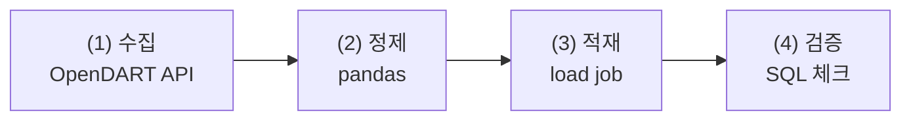

# FinDA 8주차 3일차 — 데이터는 저절로 쌓이지 않는다: DART → BigQuery 재무분석 파이프라인

> 8주차 마지막 날(3시간) 강의안. Colab에서 OpenDART API로 기업 재무제표를 직접 수집·정제해 본인 BigQuery 프로젝트에 배치 적재하고, 이틀간 배운 SQL로 재무비율 분석까지 완주하는 날입니다. "남이 만든 데이터를 조회하는 사람"에서 "필요한 데이터를 직접 확보해 쌓는 사람"으로 넘어갑니다. 전 과정 과금 0원입니다.

---

## 오늘의 개요

| 구분 | 시간 | 내용 |
| --- | --- | --- |
| Session 3-1 | 50분 | 배치 파이프라인 설계 + OpenDART 이해, 실습(13분) |
| 쉬는 시간 | 10분 | |
| Session 3-2 | 50분 | 실습 — 수집·정제·적재 (Colab → BigQuery) |
| 쉬는 시간 | 10분 | |
| Session 3-3 | 50분 | 실습 — SQL 재무분석 + 증분 적재, 8주차 회고 |
| 쉬는 시간 | 10분 | |
| 합계 | 180분 (3시간) | |

### 오늘의 학습 목표

- (1) 배치 파이프라인의 4단계(수집→정제→적재→검증)를 설명하고 직접 구현할 수 있다.
- (2) load job과 스트리밍 insert의 비용 차이를 알고, "왜 배치인가"를 아키텍처 관점에서 설명할 수 있다.
- (3) 멱등성 2패턴(전체 재적재 replace, 하이워터마크 append)을 구분해 쓸 수 있다.
- (4) OpenDART API로 기업 재무제표를 수집하고, long format 그레인으로 정제·적재할 수 있다.
- (5) 조건부 집계로 long→wide 피벗을 만들고, 재무비율(부채비율·영업이익률·ROE)을 SQL로 산출할 수 있다.
- (6) LAG로 연도별 성장률을, QUALIFY로 기업 간 비교 랭킹을 만들 수 있다.

### 오늘 시작 전 확인 사항 (사전 준비 안 된 분은 손!)

- (1) **OpenDART API 키** — 그제 배포한 가이드로 발급받아 오셨어야 합니다. 못 받았으면 지금 바로 신청하고(5분), 승인 전까지는 플랜 B(사전 배포 JSON 파일)로 실습합니다.
- (2) **본인 GCP 프로젝트** — 확인 쿼리 1줄이 돌아가는 상태여야 합니다. 문제가 있으면 강사 프로젝트의 `student_N` 데이터셋을 임시로 씁니다.
- (3) Colab 접속 확인. 오늘은 하루 종일 Colab과 BigQuery 콘솔을 오갑니다.
- (4) 오늘 만드는 데이터셋의 위치는 **asia-northeast3(서울)로 통일**합니다 — 7주차 데이터와 같은 리전이어야 나중에 조인할 수 있습니다.

오늘의 큰 그림 한 줄: 실무 데이터 분석가의 하루 절반은 "필요한 데이터를 확보하는 일"입니다. 오늘 그 절반을 배웁니다.

---

## Session 3-1. 배치 파이프라인 설계 + OpenDART 이해 (50분)

### 1-1. 도입: 분석가는 데이터를 기다리지 않는다 (4분)

이번 주 내내 우리는 강사가 올려 둔 TabFormer를 썼습니다. 그런데 회사에서는 이런 일이 매일 생깁니다.

> "경쟁사 재무 상태를 우리 대시보드에 넣고 싶은데요." — 사내 DW에는 그런 데이터가 없습니다. 누군가 **밖에서 가져와서, 쌓아야** 합니다.

오늘 그 "누군가"가 됩니다. 재료는 대한민국에서 가장 신뢰할 수 있는 공짜 데이터 — **전자공시시스템(DART)**의 기업 재무제표입니다.

### 1-2. 파이프라인 4단계와 배치 vs 스트리밍 (8분)



데이터를 BigQuery에 넣는 길은 크게 둘입니다.

| | 배치 (load job) | 스트리밍 insert |
| --- | --- | --- |
| 방식 | 파일·DataFrame을 **한 번에** 적재 | 행 단위로 실시간 밀어넣기 |
| 비용 | **무료** | **유료** (GB당 과금) |
| 지연 | 분 단위 | 초 단위 |
| 우리의 선택 | ✅ | ❌ (샌드박스에서는 아예 불가) |

"학생 과금 금지"라는 우리 원칙이 여기서 **아키텍처를 결정**합니다 — 재무제표는 1년에 네 번 나오는 데이터라 실시간이 필요 없고, 그러면 무료인 load job이 정답입니다. 비용 제약이 설계를 이끄는 것, 실무에서도 똑같습니다.

그리고 2일차 FDS에서 본 절차형 vs 집합의 구도가 적재에도 있습니다 — **행 단위 insert를 루프로 돌리는 것은 절차형의 죄악**입니다(느리고, 유료이고, 쿼터를 갉아먹습니다). 모아서 한 번에, 배치로.

### 1-3. 멱등성: 같은 배치를 두 번 돌려도 안전한가 (7분)

배치는 실패하고, 재실행됩니다. 그때 데이터가 두 배가 되면 안 됩니다. **멱등성(같은 작업을 몇 번 해도 결과가 같음)**을 확보하는 두 패턴:

- (1) **전체 재적재(replace)**: 테이블을 지우고 다시 만든다. 단순하고 확실. 데이터가 작을 때의 정답. → 오늘 3-2에서 사용.
- (2) **하이워터마크 append**: "어디까지 쌓았나"(예: 마지막 연도)를 조회하고, 그 **이후만** 수집해 덧붙인다. 데이터가 클 때의 정답. → 오늘 3-3에서 사용.

실무에는 세 번째 패턴(MERGE upsert)이 있지만 샌드박스에서는 DML 제약이 있어 다루지 않습니다 — "실무에선 MERGE가 추가된다" 한 줄만 기억하세요. 그리고 하이워터마크 append는 부분 실패 후 재실행 시 중복이 생길 수 있는 준-멱등 패턴입니다. 그래서 **4단계(검증)가 파이프라인의 장식이 아니라 필수**입니다.

### 1-4. OpenDART 해부 (10분)

OpenDART(opendart.fss.or.kr)는 금융감독원 전자공시의 공식 API입니다.

- (1) **인증**: API 키 1개. 무료, 일 20,000건 한도 — 수업 용도로는 무한에 가깝습니다.
- (2) **기업 식별**: 종목코드가 아니라 DART 고유의 `corp_code`(8자리)를 씁니다. 전체 목록은 `corpCode.xml`(zip)로 한 번에 내려받습니다.
- (3) **재무제표 API 2종**:

| API | 용도 | 우리의 선택 |
| --- | --- | --- |
| `fnlttSinglAcntAll` | **단일회사 전체 재무제표** — 한 회사의 모든 계정과목 | ✅ 주 교재 (long format 교육 가치) |
| `fnlttMultiAcnt` | 다중회사 주요계정 — 여러 회사의 핵심 계정만 | 기업 비교 시 보조 |

- (4) **파라미터 상식**: `bsns_year`(사업연도), `reprt_code`(11011 사업보고서, 11012 반기, 11013 1분기, 11014 3분기), `fs_div`(CFS 연결 / OFS 별도).
- (5) **응답의 모양**: 재무제표가 "표"가 아니라 **"행들"**로 옵니다 — 한 행 = 계정과목 하나. `account_nm`(계정명), `thstrm_amount`(당기 금액), `sj_div`(BS 재무상태표 / IS 손익계산서)….

이 long format이 오늘의 스키마 설계 그 자체입니다.

### 1-5. 스키마 설계: 그레인 선언 (4분)

7주차 마트 원칙 — 설계의 첫 질문은 "한 행이 무엇인가". 오늘의 답:

> **한 행 = 기업 × 사업연도 × 재무제표구분(fs_div) × 재무제표종류(sj_div) × 계정과목**

이 그레인이면 (1) 어떤 계정이 와도 스키마 변경 없이 쌓이고 (2) 여러 기업·여러 연도를 같은 테이블에 append할 수 있고 (3) 분석 시점에 원하는 모양으로 피벗하면 됩니다. **"넓은 표로 저장하고 싶은 유혹을 참고, 길게 쌓아서 나중에 피벗한다"** — 웨어하우스 설계의 기본기입니다.

### 1-6. 실습: 키 확인 + 내 기업 찾기 (13분)

Colab에서 순서대로:

```python
# (1) 키 등록과 corpCode 내려받기
import io
import zipfile
import xml.etree.ElementTree as ET

import pandas as pd
import requests

API_KEY = "발급받은 키"          # 절대 노트북에 남긴 채 공유하지 말 것

res = requests.get(
    "https://opendart.fss.or.kr/api/corpCode.xml",
    params={"crtfc_key": API_KEY},
    timeout=30,
)
zf = zipfile.ZipFile(io.BytesIO(res.content))
tree = ET.parse(zf.open("CORPCODE.xml"))

rows = [
    {
        "corp_code": el.findtext("corp_code"),
        "corp_name": el.findtext("corp_name"),
        "stock_code": (el.findtext("stock_code") or "").strip(),
    }
    for el in tree.iter("list")
]
corp = pd.DataFrame(rows)
print(len(corp))                  # 10만 개 이상 (비상장 포함)
```

```python
# (2) 상장사만 남기고, 분석할 기업 찾기
listed = corp[corp["stock_code"] != ""]
listed[listed["corp_name"].str.contains("삼성전자")]
```

- 미션: 본인이 분석하고 싶은 **상장사 1곳**의 `corp_code`를 찾아 적어 두세요. 내일 과제(Part C)에서 2~3곳으로 늘립니다.
- 키가 아직 없는 분: 강사가 배포한 `corpcode_sample.csv`와 `fs_sample.json`으로 같은 실습을 합니다.

### 1-7. 정리 (4분)

- (1) 파이프라인 4단계 — 수집, 정제, 적재, 검증. 검증은 장식이 아니다.
- (2) load job은 무료, 스트리밍은 유료 — 비용 제약이 아키텍처를 정한다.
- (3) 재무제표는 "표"가 아니라 "행들"로 온다 — long format 그레인 선언.

다음 세션 예고: 진짜 재무제표를 받아서, 익숙한 함정(금액이 문자열!)을 지나, 여러분의 BigQuery에 쌓습니다.

---

## Session 3-2. 실습 — 수집·정제·적재 (50분)

### 2-1. 수집: 삼성전자 사업보고서 재무제표 (13분)

```python
# 삼성전자 2023 사업보고서, 연결 재무제표 전체
res = requests.get(
    "https://opendart.fss.or.kr/api/fnlttSinglAcntAll.json",
    params={
        "crtfc_key": API_KEY,
        "corp_code": "00126380",      # 삼성전자
        "bsns_year": "2023",
        "reprt_code": "11011",        # 사업보고서
        "fs_div": "CFS",              # 연결
    },
    timeout=30,
)
data = res.json()
print(data["status"], data["message"])   # "000"이면 성공
raw = pd.DataFrame(data["list"])
raw[["sj_div", "account_nm", "thstrm_amount"]].head(10)
```

status 코드 상식: `000` 성공, `010`/`011` 키 문제, `013` 데이터 없음(연도·보고서 코드 확인), `020` 한도 초과.

화면에 뜬 것을 관찰하세요 — `thstrm_amount`가 `"258,935,494,000,000"` 같은 **콤마 붙은 문자열**입니다. 7주차 첫날 `$318.35`를 만났을 때와 같은 상황입니다. **어느 원천이든 금액은 문자열로 온다** — 이제는 놀랍지 않죠.

### 2-2. 정제: 콤마 금액과 컬럼 다이어트 (13분)

```python
def clean_amount(s: pd.Series) -> pd.Series:
    """콤마 제거 후 숫자로. 실패하면 NaN (SAFE_CAST의 pandas 버전)."""
    return pd.to_numeric(s.str.replace(",", "", regex=False), errors="coerce")

fs = raw[[
    "corp_code", "bsns_year", "reprt_code", "fs_div",
    "sj_div", "sj_nm", "account_id", "account_nm", "ord",
    "thstrm_amount",
]].copy()
fs["corp_name"] = "삼성전자"
fs["amount_krw"] = clean_amount(fs["thstrm_amount"])
fs["bsns_year"] = fs["bsns_year"].astype(int)
fs["ord"] = pd.to_numeric(fs["ord"], errors="coerce")

fs = fs.drop(columns=["thstrm_amount"])
fs.info()
```

- (1) `errors="coerce"`는 pandas의 SAFE_CAST입니다 — 못 바꾸는 값은 NaN으로. 어디서 NaN이 생겼는지 `fs[fs["amount_krw"].isna()]`로 꼭 봐야 합니다 (일부 주석성 계정은 금액이 비어 있는 것이 정상).
- (2) `account_id`(표준계정 ID)를 버리지 않고 남긴 이유: `account_nm`(한글 계정명)은 기업·연도마다 표기가 흔들릴 수 있어, 정밀 분석에는 ID가 더 안정적입니다. 오늘은 이름으로 가되 ID를 보험으로 싣습니다.

### 2-3. 적재: pandas-gbq load job (12분)

```python
from pandas_gbq import to_gbq

MY_PROJECT = "본인-프로젝트-ID"

to_gbq(
    fs,
    destination_table="dart.fs_long",
    project_id=MY_PROJECT,
    if_exists="replace",          # 멱등 패턴 (1): 전체 재적재
    location="asia-northeast3",   # 7주차 데이터와 같은 리전
)
```

콘솔에서 확인 — `dart.fs_long` 테이블의 Schema 탭과 미리보기. **적재 후 콘솔 확인은 습관입니다.** (`to_gbq`는 내부적으로 load job을 씁니다 — 무료 경로인 이유.)

### 2-4. 검증: 쿼리 4종 세트 (9분)

파이프라인의 마지막 단계. 이 4종은 오늘 이후 여러분의 모든 적재에 따라붙어야 합니다.

```sql
-- (1) 행 수: 기대 범위인가 (전체 재무제표는 보통 수백 행)
SELECT COUNT(*) AS row_cnt
FROM `본인프로젝트.dart.fs_long`;

-- (2) 그레인 중복: 한 행이 정말 한 행인가
SELECT
    f.corp_code, f.bsns_year, f.fs_div, f.sj_div, f.account_id, f.account_nm,
    COUNT(*) AS dup_cnt
FROM `본인프로젝트.dart.fs_long` AS f
GROUP BY f.corp_code, f.bsns_year, f.fs_div, f.sj_div, f.account_id, f.account_nm
HAVING COUNT(*) > 1;

-- (3) 핵심 계정 존재: 분석에 쓸 계정이 실제로 있는가
SELECT f.account_nm, f.amount_krw
FROM `본인프로젝트.dart.fs_long` AS f
WHERE f.account_nm IN ('자산총계', '부채총계', '자본총계', '영업이익', '당기순이익');

-- (4) NULL 비율: 정제에서 새는 곳은 없는가
SELECT
    COUNTIF(f.amount_krw IS NULL) AS null_cnt,
    SAFE_DIVIDE(COUNTIF(f.amount_krw IS NULL), COUNT(*)) AS null_rate
FROM `본인프로젝트.dart.fs_long` AS f;
```

### 2-5. 멱등성 확인과 정리 (3분)

노트북을 위에서 아래로 **한 번 더 실행**하세요. 행 수가 그대로면(2배가 아니면) replace 멱등성이 확인된 것입니다. "재실행해도 안전한가"는 배치의 첫 번째 인터뷰 질문입니다.

다음 세션 예고: 쌓았으니 이제 씁니다 — "삼성전자는 작년보다 잘 벌었는가?"

---

## Session 3-3. 실습 — SQL 재무분석 + 증분 적재 + 회고 (50분)

### 3-1. 피벗: long을 wide로 (8분)

분석 질문은 wide를 원합니다("자산, 부채, 매출을 한 행에"). 조건부 집계가 피벗의 표준 문형입니다 — **피벗은 함수가 아니라 패턴입니다.**

```sql
WITH wide AS (    -- 한 행 = 기업 × 사업연도
    SELECT
        f.corp_name,
        f.bsns_year,
        MAX(CASE WHEN f.account_nm = '자산총계' THEN f.amount_krw END) AS assets,
        MAX(CASE WHEN f.account_nm = '부채총계' THEN f.amount_krw END) AS liabilities,
        MAX(CASE WHEN f.account_nm = '자본총계' THEN f.amount_krw END) AS equity,
        MAX(CASE WHEN f.account_nm = '매출액' THEN f.amount_krw END) AS revenue,
        MAX(CASE WHEN f.account_nm = '영업이익' THEN f.amount_krw END) AS op_income,
        MAX(CASE WHEN f.account_nm = '당기순이익' THEN f.amount_krw END) AS net_income
    FROM `본인프로젝트.dart.fs_long` AS f
    WHERE f.fs_div = 'CFS'
      AND f.sj_div IN ('BS', 'IS')
    GROUP BY f.corp_name, f.bsns_year
)
SELECT * FROM wide
```

주의: 계정명이 기업에 따라 `매출액`이 아니라 `수익(매출액)`으로 오기도 합니다. 피벗 결과에 NULL이 있으면 (2-4)의 검증 쿼리 (3)으로 실제 계정명을 확인하고 CASE를 보정하세요 — **원천 데이터의 표기 흔들림에 대응하는 것까지가 수집가의 일**입니다.

### 3-2. 재무비율: 세 가지 질문 (8분)

| 비율 | 정의 | 묻는 것 |
| --- | --- | --- |
| 부채비율 | 부채총계 / 자본총계 | 빚에 얼마나 기대고 있나 |
| 영업이익률 | 영업이익 / 매출액 | 본업으로 얼마나 남기나 |
| ROE | 당기순이익 / 자본총계 | 주주 돈으로 얼마나 벌었나 |

```sql
SELECT
    w.corp_name, w.bsns_year,
    SAFE_DIVIDE(w.liabilities, w.equity) AS debt_ratio,
    SAFE_DIVIDE(w.op_income, w.revenue) AS op_margin,
    SAFE_DIVIDE(w.net_income, w.equity) AS roe
FROM wide AS w
ORDER BY w.corp_name, w.bsns_year
```

전부 SAFE_DIVIDE — 자본잠식 기업(equity ≤ 0)이 실제로 존재하는 세계라서, 0 나누기 방어는 재무 데이터에서 장식이 아닙니다.

### 3-3. 증분 적재와 성장률: 하이워터마크 append (13분)

"작년 대비"를 물으려면 여러 연도가 필요합니다. 멱등 패턴 (2)를 실전 투입합니다.

```python
# Colab — (1) 하이워터마크 조회
from google.cloud import bigquery

client = bigquery.Client(project=MY_PROJECT)
hwm = list(client.query(
    "SELECT MAX(bsns_year) AS y FROM `본인프로젝트.dart.fs_long`"
).result())[0].y
print("현재까지:", hwm)

# (2) 그 이전 연도들을 수집해 append (2020~hwm-1)
for year in range(2020, hwm):
    fs_year = fetch_and_clean(corp_code="00126380", year=year)   # 2교시 코드의 함수화
    to_gbq(fs_year, "dart.fs_long", project_id=MY_PROJECT,
           if_exists="append", location="asia-northeast3")
```

append 후에는 **반드시 검증 쿼리 (2)(그레인 중복)를 다시** 돌립니다 — 같은 연도를 두 번 append하는 사고는 하이워터마크 로직의 단골 버그이고, 그걸 잡는 것이 검증 단계의 존재 이유입니다.

이제 성장률 — 1일차의 LAG가 재무 데이터 위에서 돌아옵니다.

```sql
SELECT
    w.corp_name, w.bsns_year, w.revenue,
    SAFE_DIVIDE(w.revenue,
                LAG(w.revenue) OVER (PARTITION BY w.corp_name
                                     ORDER BY w.bsns_year)) - 1 AS revenue_yoy,
    SAFE_DIVIDE(w.op_income,
                LAG(w.op_income) OVER (PARTITION BY w.corp_name
                                       ORDER BY w.bsns_year)) - 1 AS op_income_yoy
FROM wide AS w
```

### 3-4. 기업 비교: 두 번째 기업을 쌓고 랭킹 (8분)

1교시에 찾아 둔 "내 기업"의 corp_code로 같은 파이프라인을 돌려 append하세요 (corp_code 파라미터만 바꾸면 됩니다 — 그레인 설계 덕분에 스키마 변경이 없습니다).

```sql
-- "가장 최근 연도에 영업이익률이 가장 높은 기업은?"
SELECT
    w.corp_name, w.bsns_year,
    SAFE_DIVIDE(w.op_income, w.revenue) AS op_margin
FROM wide AS w
QUALIFY RANK() OVER (PARTITION BY w.bsns_year
                     ORDER BY SAFE_DIVIDE(w.op_income, w.revenue) DESC) <= 3
ORDER BY w.bsns_year DESC, op_margin DESC
```

1일차의 QUALIFY까지 재등장 — 사흘의 도구가 한 쿼리에 모입니다.

### 3-5. 8주차 회고와 다음 주 예고 (13분)

사흘을 한 줄로 잇습니다.

- (1) Day 1: **깊게 물었다** — 서브쿼리·CTE·윈도우·재귀, RFM.
- (2) Day 2: **도메인으로 분석했다** — 시계열·리스크·FDS.
- (3) Day 3: **직접 수집해 쌓았다** — DART → BigQuery → 재무비율.

미니 회고 (5분, 한 사람씩): "이번 주 배운 것 중 취업 포트폴리오에 넣고 싶은 것 하나"를 말해 봅시다.

9주차(최종 프로젝트) 예고 — 주제 후보에 오늘이 추가됩니다: (1) 고객 세그먼트 × FDS 룰 대시보드 (2) **DART 재무 × 카드 소비 결합 분석** (3) 휴면 고객 조기경보 (4) 자유 주제. 과제 안내는 별도 공지로 나갑니다 (Part C가 오늘 파이프라인의 확장입니다).

---

## 자주 만나는 오류와 해결 (참고용, 실습 중 막히면 여기부터)

| 증상 | 원인 | 해결 |
| --- | --- | --- |
| status "010"/"011" | API 키 오타, 미승인 키 | 키 재확인, 메일 승인 확인. 급하면 플랜 B JSON |
| status "013" (데이터 없음) | 연도·보고서 코드 조합에 공시가 없음 | 최근 연도 + 11011부터. 신생 기업은 연도 좁힘 |
| status "020" | 일 한도 초과 (루프 폭주) | 오늘은 재발급 불가 — 플랜 B로 전환, 루프에 sleep |
| `data["list"]` KeyError | status가 000이 아닌데 list 접근 | status 체크를 코드에 먼저 (가드 패턴) |
| to_gbq 권한 오류 | 프로젝트 ID 오타, 인증 계정 다름 | `auth.authenticate_user()` 재실행, 프로젝트 ID 확인 |
| 적재는 됐는데 조인 불가/리전 오류 | 데이터셋 위치가 US 등 다른 리전 | location="asia-northeast3" 명시, 데이터셋 재생성 |
| 피벗 결과가 NULL 투성이 | 계정명 표기 차이 (매출액 vs 수익(매출액)) | 검증 쿼리 (3)으로 실제 계정명 확인 후 CASE 보정 |
| append 후 행 수 2배 | 같은 연도 중복 append | 그레인 중복 검증 → 해당 연도 삭제 후 재적재 (replace로 리셋이 가장 단순) |
| amount_krw 전부 NaN | thstrm_amount 컬럼명 오타, str 아닌 타입에 .str | raw.columns 확인, astype(str) 후 정제 |

---

오늘의 핵심 교훈 한 줄: **"파이프라인의 완성은 적재가 아니라 검증이다 — 재실행해도 안전하고, 틀리면 스스로 알아차리는 배치가 좋은 배치다."**
